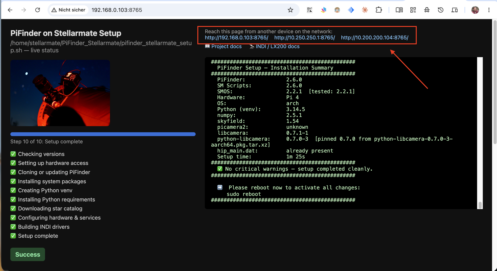
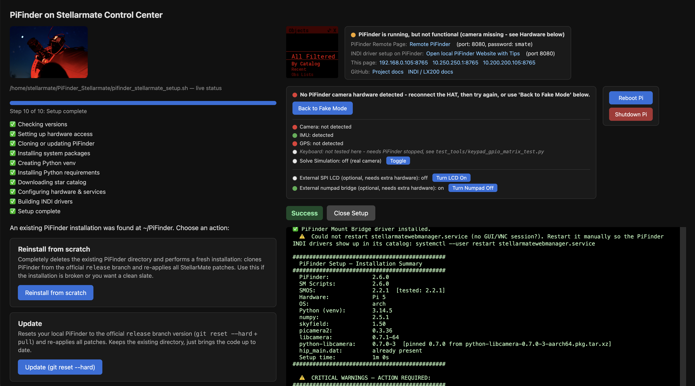

# PiFinder on Stellarmate

*[Deutsche Version](README_de.md)*


This project provides a set of scripts to seamlessly install, patch, and integrate the [PiFinder](https://www.pifinder.io/) software into a [Stellarmate](https://www.stellarmate.com/) environment. It automates the entire setup process, ensuring that PiFinder works correctly alongside Stellarmate's existing services.

The primary goal is to allow users to leverage the powerful plate-solving and object-finding capabilities of PiFinder on a device that is also running Stellarmate for astrophotography, EAA, and full equipment control.

> ### ⚠️ **Disclaimer**
>
> * This is a community project and is not officially affiliated with PiFinder or Stellarmate.
> * Use these scripts at your own risk. The author is not responsible for any damage to your hardware or software.
> * This process has been tested with the PiFinder version specified in `version.txt`.

> ### ✅ **Current Version — v1.0.0**
>
> * Built and verified for **PiFinder software 2.6.0** on **StellarMate OS 2.2.1** (Arch Linux).
> * **Raspberry Pi 4**: Fully supported — camera ✅, plate solve ✅, IMU ✅, GPS ✅. Tested under real night sky (2026-07-12).
> * **Raspberry Pi 5**: Partially supported — GPS ✅, Web UI ✅. OLED display not yet working (SPI driver issue under investigation). Camera requires 15-pin FFC CSI adapter cable.
> * **INDI integration**: standalone LX200 driver + optional real-mount coupling ("Mount Bridge"), verified end-to-end against a real Skywatcher EQ5/OnStepX mount — see [Readme_PiFinder_LX200.md](Readme_PiFinder_LX200.md) and [CHANGELOG.md](CHANGELOG.md).

---

## Quick Start

**1. Browser install (recommended)**

```bash
git clone https://github.com/apos/PiFinder_Stellarmate.git
cd PiFinder_Stellarmate
bash gui_installer/launch_setup_gui.sh
```

Then open the page in a browser — on the Pi itself, or from any other device on the same network
(no desktop session on the Pi required). See [Setup GUI](#setup-gui-optional) for details.

<table>
<tr>
<td align="center">
<a href="docs/images/readme/Setup_via_remote_browser.png"></a><br>
<sub>The Setup GUI opened remotely, from another device on the network</sub>
</td>
</tr>
</table>

**2. Terminal install**

```bash
git clone https://github.com/apos/PiFinder_Stellarmate.git
cd PiFinder_Stellarmate
./pifinder_stellarmate_setup.sh
```

Full details: [Installation](#installation).

---

## Key Features & Changes

This setup modifies the stock PiFinder installation to better integrate with Stellarmate:

*   **Automated Installation:** A single script handles downloading the correct PiFinder version, creating a Python virtual environment, installing dependencies, and applying all necessary patches.
*   **INDI Integration for KStars/Ekos & SkySafari:** A standalone `PiFinder LX200` INDI driver reports PiFinder's solved position and forwards GoTo requests as push-to targets. An optional `PiFinder Mount Bridge` driver can couple that position to any real INDI mount driver (verify/alert, auto-correct on drift, or full event-driven GoTo-forwarding). Built directly against system `libindi` — no INDI source checkout, no full INDI build. Built and installed automatically by the main setup script — see [Readme_PiFinder_LX200.md](Readme_PiFinder_LX200.md) for the technical reference and illustrated setup instructions (Web Manager profile, INDI Control Panel, KStars/Ekos, SkySafari).
*   **Stellarmate GPS Integration:** PiFinder is configured to use Stellarmate/KStars as its GPS source, removing the need for a separate GPS module on the PiFinder.
*   **Network Management Disabled:** All network configuration options (WiFi Mode, AP/Client switching) have been removed from the PiFinder's OLED menu and Web Interface. This prevents conflicts, as Stellarmate is responsible for all network management.
*   **Robust Patching:** Changes are applied using `diff` patches, making the process more reliable and easier to maintain than manual file edits.
*   **Compatibility:** The scripts are designed for Raspberry Pi 4 and Pi 5 running Stellarmate OS (Arch Linux). Pi 4 is fully tested and stable. Pi 5 support is in active development (GPS ✅, camera adapter cable required).
*   **Comprehensive IP Address Display:** The web interface and the device's OLED status screen now show all available non-localhost IP addresses, providing better network visibility.
*   **Dynamic User:** The web interface authentication is patched to use the current system user (e.g., `stellarmate`) instead of a hardcoded default.

## Hardware Requirements

### Raspberry Pi 4 *(works for basic tasks)*

| Component | Requirement |
|---|---|
| RAM | ≥ 4 GB (absolute minimum — 2 GB not possible) |
| Storage | USB 3.0 NVMe HAT (**mandatory** — SD card is not sufficient) |
| Power | Power HAT ≥ 5 A (**mandatory** — USB power is not enough) |

### Raspberry Pi 5 *(recommended)*

| Component | Requirement |
|---|---|
| RAM | > 4 GB (≥ 8 GB recommended) |
| Storage | NVMe HAT with PCIe (**mandatory** — SD card is not sufficient) |
| Power | Power HAT ≥ 5 A (**mandatory** — USB-C PD 5 A may work) |

> **Note on Camera (Pi 5):** The Pi 5 uses a **15-pin FFC CSI connector**, while Pi 4 uses 22-pin. A cable adapter is required to connect the PiFinder camera module to a Pi 5.

---

## Installation

The setup process is designed to be straightforward. It will guide you through a fresh installation or updating an existing one.

### Prerequisites

*   A Raspberry Pi 4 or Pi 5 with PiFinder hardware (hat, screen, camera, etc.).
*   Stellarmate OS 2.1.1 (Arch Linux) installed and running.
*   Basic familiarity with the Linux command line.

### Setup Steps

1.  **Enable Hardware Interfaces:**
    SPI and I2C are enabled automatically by the setup script via `/boot/config.txt`. No manual step required on Stellarmate OS (Arch Linux). `raspi-config` is not available on this platform.

2.  **Clone the Repository:**
    Open a terminal on your Stellarmate device and clone this repository:
    ```bash
    git clone https://github.com/apos/PiFinder_Stellarmate.git
    cd PiFinder_Stellarmate
    ```

3.  **Run the Setup Script:**
    Execute the main setup script. It will detect if a PiFinder installation exists and give you options.
    ```bash
    ./pifinder_stellarmate_setup.sh
    ```

    *   **If no PiFinder is found:** The script will clone the official PiFinder repository and apply all the necessary patches.
    *   **If PiFinder is found:** You will be prompted to either:
        *   **1. Reinstall from scratch:** This will completely delete the existing PiFinder directory and perform a fresh installation.
        *   **2. Update:** This will reset your local PiFinder to the official `release` branch version and re-apply all patches.

4.  **Python Virtual Environment (First Run Only):**
    The first time you run the script on a fresh system, it will stop after creating a Python virtual environment (`.venv`). You must activate it manually and re-run the script to complete the installation of dependencies. The script will provide the exact commands to run, which will look like this:
    ```bash
    source /home/stellarmate/PiFinder/python/.venv/bin/activate
    ./pifinder_stellarmate_setup.sh
    ```
    After this, the installation will complete, the PiFinder services will be started, and the
    PiFinder LX200 + Mount Bridge INDI drivers will be built and installed automatically — see
    [Using the INDI Driver](#using-the-indi-driver) below for what that gives you and how to set
    up the Web Manager profile.

### Setup GUI (optional)

If you'd rather not watch raw terminal output, `gui_installer/` provides a small local web page
that runs the same setup script with a live, auto-scrolling status view in your browser — including
automatically handling the "activate the venv and rerun" step and the reinstall/update choice via
buttons, so nothing needs to be typed at a prompt. Run it with:
```bash
bash gui_installer/launch_setup_gui.sh
```
or copy/symlink `PiFinder Setup.desktop` into `~/Desktop/` for a clickable icon. It's
the same installer underneath — useful mainly if you're repeating installs/reinstalls often (e.g.
while testing).

The launcher is idempotent and always prints where things stand — running it again while the
server is already up just reports that instead of starting a second one:
```
$ bash gui_installer/launch_setup_gui.sh
Starte Setup-GUI-Webserver...
Webserver gestartet.
   Setup-GUI erreichbar unter:
     http://192.168.0.105:8765/
     http://10.250.250.1:8765/
   Zum Beenden: gui_installer/launch_setup_gui.sh --shutdown-webserver

$ bash gui_installer/launch_setup_gui.sh
Setup-GUI-Webserver läuft bereits.
   Setup-GUI erreichbar unter:
     http://192.168.0.105:8765/
     http://10.250.250.1:8765/
   Zum Beenden: gui_installer/launch_setup_gui.sh --shutdown-webserver
```
To stop the background web server again:
```bash
bash gui_installer/launch_setup_gui.sh --shutdown-webserver
```

<table>
<tr>
<td align="center" width="50%">
<a href="docs/images/readme/Setup_Browser.png"></a><br>
<sub>Live progress bar, step checklist, and terminal output side by side</sub>
</td>
<td align="center" width="50%">
<a href="docs/images/readme/Setup_Ready.png"></a><br>
<sub>Setup complete: OLED mirror, PiFinder access links, and password shown right away</sub>
</td>
</tr>
</table>

## Using the INDI Driver

`pifinder_stellarmate_setup.sh` builds and installs both INDI drivers for you (stopping any
already-running instance first, then restarting the StellarMate Web Manager so the new/updated
drivers show up in its catalog). You only need to run the build scripts yourself when you want to
rebuild just the drivers without rerunning the whole setup (e.g. after pulling a driver-only code
change):

```bash
cd ~/PiFinder_Stellarmate
bash bin/build_indi_driver.sh     # PiFinder LX200
bash bin/build_indi_bridge.sh     # PiFinder Mount Bridge (optional, only if you have a real mount)
```

For the full setup walkthrough (StellarMate Web Manager profile, INDI Control Panel, KStars/Ekos
Remote mode, SkySafari), the complete LX200 command/property reference, and an explanation of the
code and deployment strategy, see **[Readme_PiFinder_LX200.md](Readme_PiFinder_LX200.md)**.

## SMOS Updates

Stellarmate OS uses BTRFS snapshot resets to apply updates. This wipes the root partition, which removes all manually installed packages and configuration (pacman repos, systemd services, swap, etc.). The `/home` partition survives intact.

After every SMOS update, run the restore script:

```bash
bash ~/PiFinder_Stellarmate/bin/restore_after_smos_update.sh
sudo reboot
```

This restores everything PiFinder needs: pacman repos, system packages, hardware groups, udev rules, `/boot/config.txt` overlays, swapfile, and systemd services.

### Syncing basic-memory / Claude context to Nextcloud

The post-update script also handles syncing the Claude AI memory and context to Nextcloud:

```bash
bash ~/PiFinder_Stellarmate/bin/smos-post-update.sh --sync-memory
```

> **Note:** `rclone` is installed automatically by `restore_after_smos_update.sh`. The Nextcloud remote must be pre-configured in `~/.config/rclone/rclone.conf` (remote name: `nextcloud`, WebDAV).

### Version Compatibility

| PiFinder | SMOS | Pi 4 | Pi 5 |
|---|---|---|---|
| 2.6.0 | 2.2.1 | ✅ fully tested | ⚠️ GPS/Web UI only — OLED pending |
| 2.6.0 | 2.1.1 | ✅ tested | ⚠️ same |
| 2.5.1 | 2.1.1 | ✅ tested | — |

## Uninstallation

A script is provided to safely remove the PiFinder installation and services.

```bash
~/PiFinder_Stellarmate/bin/uninstall_pifinder_stellarmate.sh
```

This will stop and disable the `pifinder` services, remove the systemd files, and delete the `~/PiFinder` directory. It will not remove the `~/PiFinder_data` directory or the `PiFinder_Stellarmate` repository itself.

## See Also

*   **[Readme_PiFinder_LX200.md](Readme_PiFinder_LX200.md)** — full INDI/Mount-Bridge documentation: illustrated setup guide, LX200 command/property reference, code and deployment strategy. ([Deutsche Version](Readme_PiFinder_LX200_de.md))
*   **[Readme_design_decisions.md](Readme_design_decisions.md)** — condensed summary of the key design decisions.
*   **[CHANGELOG.md](CHANGELOG.md)** — release history.
*   **[bin/README_compile_indi.md](bin/README_compile_indi.md)** — quick build reference for the PiFinder LX200 driver.