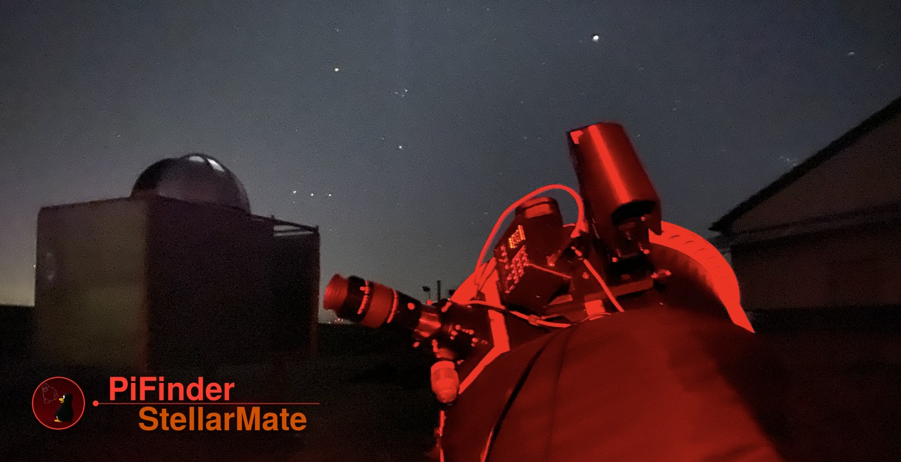
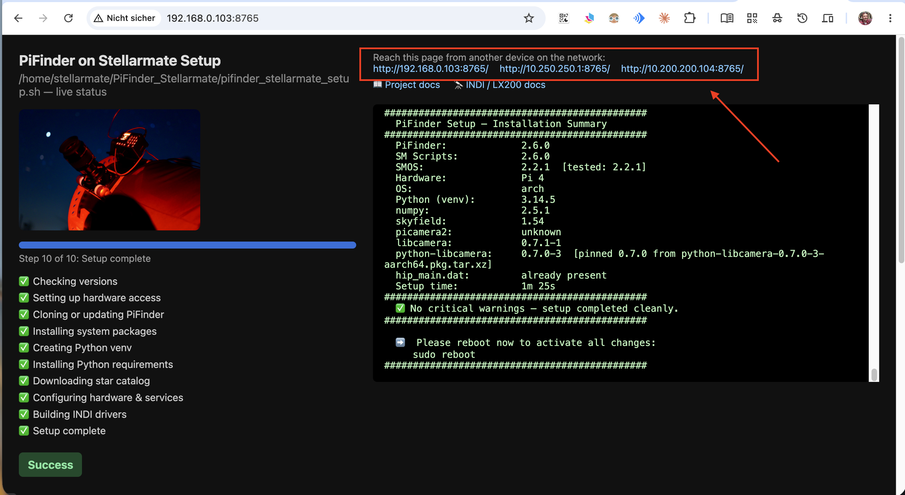
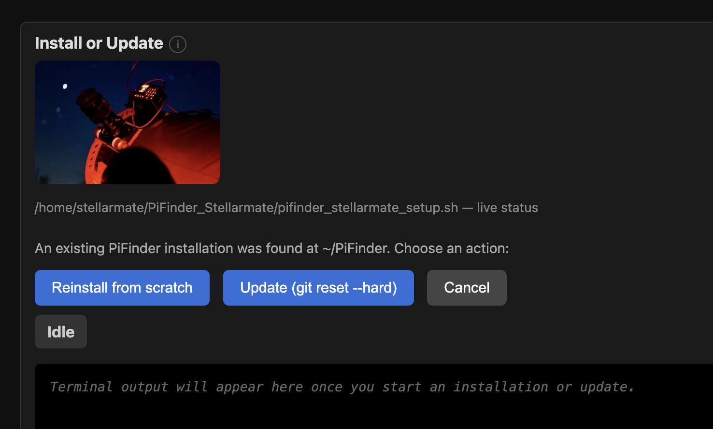
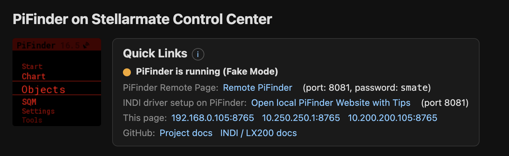
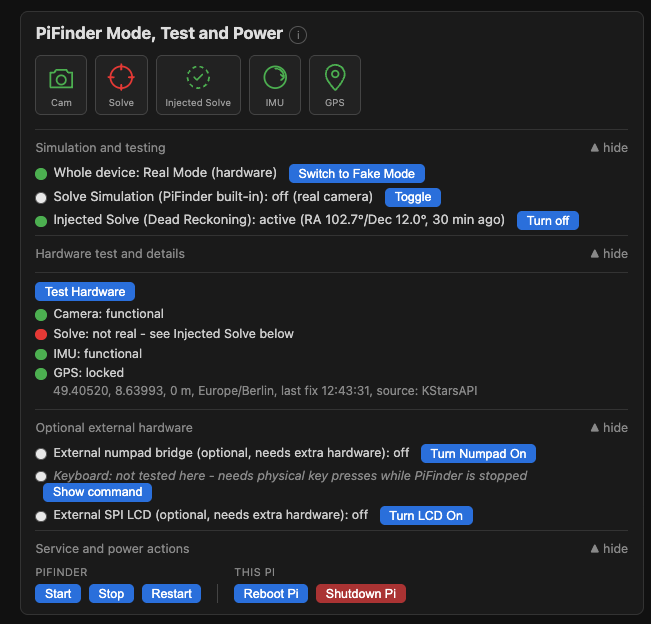
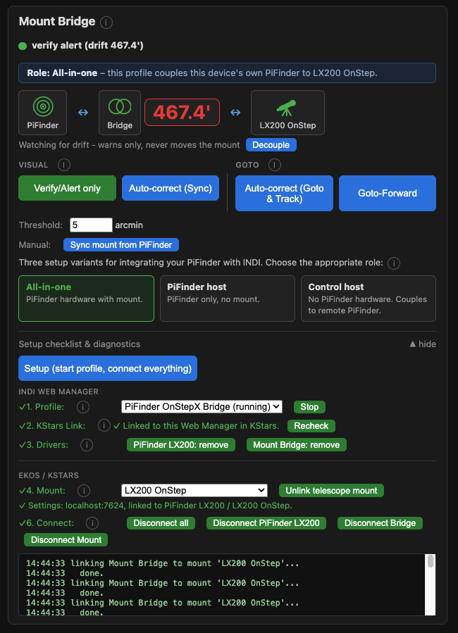
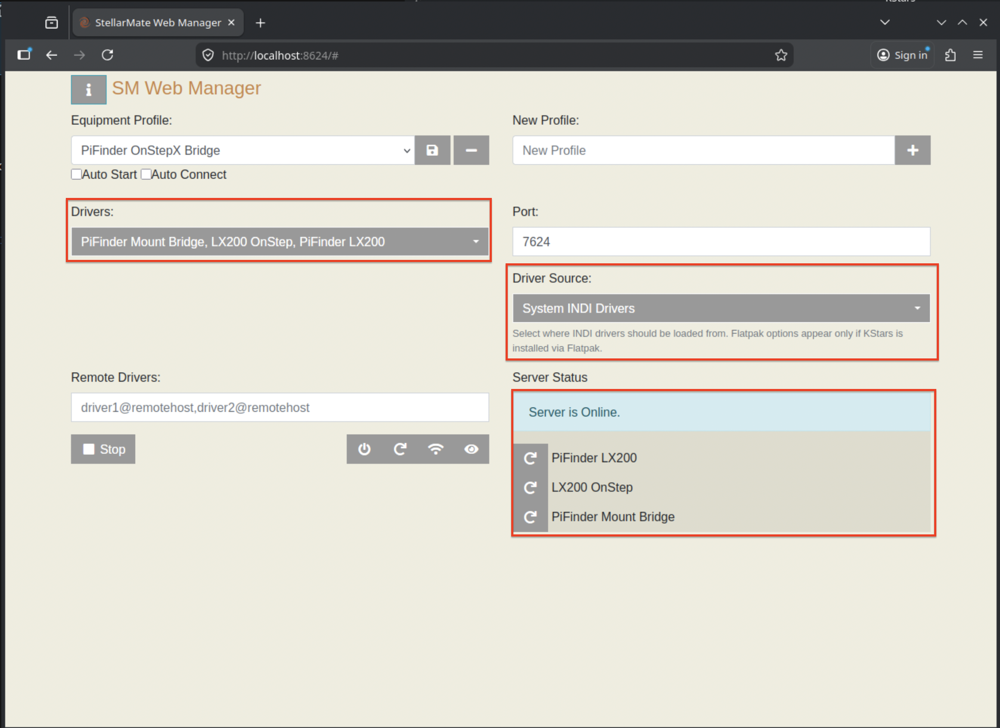
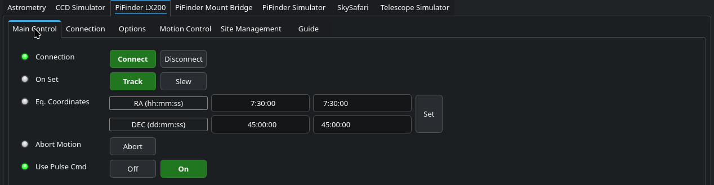

# PiFinder on Stellarmate

*[Deutsche Version](README_de.md)*



This project provides a set of scripts to seamlessly install, patch, and integrate the [PiFinder](https://www.pifinder.io/) software into a [Stellarmate](https://www.stellarmate.com/) environment. It automates the entire setup process, ensuring that PiFinder works correctly alongside Stellarmate's existing services.

The primary goal is to allow users to leverage the powerful plate-solving and object-finding capabilities of PiFinder on a device that is also running Stellarmate for astrophotography, EAA, and full equipment control.

> ### ⚠️ **Disclaimer**
>
> * This is a community project and is not officially affiliated with PiFinder or Stellarmate.
> * Use these scripts at your own risk. The author is not responsible for any damage to your hardware or software.
> * This process has been tested with the PiFinder version specified in `version.txt`.

> ### ✅ **Current Version — v2.0.0**
>
> * Built and verified for **PiFinder software 2.6.1** on **StellarMate OS 2.2.1** (Arch Linux) — PiFinder is now pinned to this exact release tag (see `version.txt`), not the upstream `release` branch's moving HEAD, for reproducible installs.
> * **Raspberry Pi 4**: Fully supported — camera ✅, plate solve ✅, IMU ✅, GPS ✅. Tested under real night sky (2026-07-12).
> * **Raspberry Pi 5**: Supported — GPS ✅, Web UI ✅, OLED ✅. (A months-long "OLED stays dark" issue was traced to a defective HAT unit, not a Pi5/software limitation — resolved 2026-07-17 by swapping the physical HAT board.) **Keyboard ⚠️**: on the test unit, a Geekworm X1203 UPS shield shares GPIO 16 with the keypad matrix's column 0 (keys 7/4/1/LEFT), permanently disabling that whole column — a real hardware resource conflict between the two add-on boards, not a Pi5 or software limitation, and specific to setups with that UPS shield attached. Camera requires a 15-pin FFC CSI adapter cable (Pi4 uses 22-pin) — not yet installed on the test unit.
> * **INDI integration**: standalone LX200 driver + optional real-mount coupling ("Mount Bridge"), verified end-to-end against a real Skywatcher EQ5/OnStepX mount, all four Coupling presets — see [Readme_PiFinder_LX200.md](Readme_PiFinder_LX200.md) and [CHANGELOG.md](CHANGELOG.md).
> * **New in this release**: the PiFinder tile gained "Quick keys" — a compact on-page keypad (arrows, Long, Enter, two selectable layouts) to drive PiFinder's OLED menu without switching to its separate Remote page. Mount Bridge, PiFinder Mode/Test/Power, and Install or Update are now collapsible, with your choice remembered across reloads. A Night mode toggle renders all page text in glowing red. PiFinder installs/updates now target a pinned release tag instead of the upstream `release` branch's moving HEAD, fixing an installer that could refuse to run the moment upstream cut a new release. A new "PiFinder" status badge shows PiFinder's own Mount Type + PiFinder Type settings at a glance (green while running, red if they don't match the connected mount), and the Mount Bridge diagram's mount icon now shows the mount's own type. See [CHANGELOG.md](CHANGELOG.md) for the full list.

---

## Quick Start

**1. Browser install (recommended)**

```bash
git clone https://github.com/apos/PiFinder_Stellarmate.git
cd PiFinder_Stellarmate
bash gui_installer/launch_setup_gui.sh
```

Then open the page in a browser — on the Pi itself, or from any other device on the same network
(no desktop session on the Pi required). See [Setup GUI / Control Center](#setup-gui--control-center-recommended) for details.

<table>
<tr>
<td align="center">
<a href="docs/images/readme/Setup_via_remote_browser.png"></a><br>
<sub>The Setup GUI opened remotely, from another device on the network</sub>
</td>
</tr>
</table>

**2. Terminal install**

```bash
git clone https://github.com/apos/PiFinder_Stellarmate.git
cd PiFinder_Stellarmate
./pifinder_stellarmate_setup.sh
```

Full details: [Installation](#installation).

---

## Key Features & Changes

This setup modifies the stock PiFinder installation to better integrate with Stellarmate:

*   **Automated Installation:** A single script handles downloading the correct PiFinder version, creating a Python virtual environment, installing dependencies, and applying all necessary patches.
*   **INDI Integration for KStars/Ekos & SkySafari:** A standalone `PiFinder LX200` INDI driver reports PiFinder's solved position and forwards GoTo requests as push-to targets. An optional `PiFinder Mount Bridge` driver can couple that position to any real INDI mount driver (verify/alert, auto-correct on drift, or full event-driven GoTo-forwarding). Built directly against system `libindi` — no INDI source checkout, no full INDI build. Built and installed automatically by the main setup script — see [Readme_PiFinder_LX200.md](Readme_PiFinder_LX200.md) for the technical reference and illustrated setup instructions (Web Manager profile, INDI Control Panel, KStars/Ekos, SkySafari).
*   **Stellarmate GPS Integration:** PiFinder is configured to use Stellarmate/KStars as its GPS source, removing the need for a separate GPS module on the PiFinder.
*   **Network Management Disabled:** All network configuration options (WiFi Mode, AP/Client switching) have been removed from the PiFinder's OLED menu and Web Interface. This prevents conflicts, as Stellarmate is responsible for all network management.
*   **Robust Patching:** Changes are applied using `diff` patches, making the process more reliable and easier to maintain than manual file edits.
*   **Compatibility:** The scripts are designed for Raspberry Pi 4 and Pi 5 running Stellarmate OS (Arch Linux). Both are fully supported — see the version banner above for the current per-Pi status.
*   **Comprehensive IP Address Display:** The web interface and the device's OLED status screen now show all available non-localhost IP addresses, providing better network visibility.
*   **Dynamic User:** The web interface authentication is patched to use the current system user (e.g., `stellarmate`) instead of a hardcoded default.
*   **Password-Protected Setup GUI:** `gui_installer/`'s webserver (destructive reinstall/update/reboot actions) now requires the same system-user password as PiFinder's own Remote login, checked via PAM — no separate password to remember.

## Hardware Requirements

### Raspberry Pi 4 *(works for basic tasks)*

| Component | Requirement |
|---|---|
| RAM | ≥ 4 GB (absolute minimum — 2 GB not possible) |
| Storage | USB 3.0 NVMe HAT (**mandatory** — SD card is not sufficient) |
| Power | Power HAT ≥ 5 A (**mandatory** — USB power is not enough) |

### Raspberry Pi 5 *(recommended)*

| Component | Requirement |
|---|---|
| RAM | > 4 GB (≥ 8 GB recommended) |
| Storage | NVMe HAT with PCIe (**mandatory** — SD card is not sufficient) |
| Power | Power HAT ≥ 5 A (**mandatory** — USB-C PD 5 A may work) |

> **Note on Camera (Pi 5):** The Pi 5 uses a **15-pin FFC CSI connector**, while Pi 4 uses 22-pin. A cable adapter is required to connect the PiFinder camera module to a Pi 5.

---

## Installation

The setup process is designed to be straightforward. It will guide you through a fresh installation or updating an existing one.

### Prerequisites

*   A Raspberry Pi 4 or Pi 5 with PiFinder hardware (hat, screen, camera, etc.).
*   Stellarmate OS 2.1.1 (Arch Linux) installed and running.
*   Basic familiarity with the Linux command line.

### Setup Steps

1.  **Enable Hardware Interfaces:**
    SPI and I2C are enabled automatically by the setup script via `/boot/config.txt`. No manual step required on Stellarmate OS (Arch Linux). `raspi-config` is not available on this platform.

2.  **Clone the Repository:**
    Open a terminal on your Stellarmate device and clone this repository:
    ```bash
    git clone https://github.com/apos/PiFinder_Stellarmate.git
    cd PiFinder_Stellarmate
    ```

3.  **Run the Setup Script:**
    Execute the main setup script. It will detect if a PiFinder installation exists and give you options.
    ```bash
    ./pifinder_stellarmate_setup.sh
    ```

    *   **If no PiFinder is found:** The script will clone the official PiFinder repository and apply all the necessary patches.
    *   **If PiFinder is found:** You will be prompted to either:
        *   **1. Reinstall from scratch:** This will completely delete the existing PiFinder directory and perform a fresh installation.
        *   **2. Update:** This will reset your local PiFinder to this project's pinned release tag (see `version.txt`) and re-apply all patches.

4.  **Python Virtual Environment (First Run Only):**
    The first time you run the script on a fresh system, it will stop after creating a Python virtual environment (`.venv`). You must activate it manually and re-run the script to complete the installation of dependencies. The script will provide the exact commands to run, which will look like this:
    ```bash
    source /home/stellarmate/PiFinder/python/.venv/bin/activate
    ./pifinder_stellarmate_setup.sh
    ```
    After this, the installation will complete, the PiFinder services will be started, and the
    PiFinder LX200 + Mount Bridge INDI drivers will be built and installed automatically — see
    [Using the INDI Driver](#using-the-indi-driver) below for what that gives you and how to set
    up the Web Manager profile.

### Setup GUI / Control Center (recommended)

If you'd rather not watch raw terminal output, `gui_installer/` provides a small local web page —
the "PiFinder on Stellarmate Control Center" — that runs the same setup script with a live,
auto-scrolling status view in your browser, including automatically handling the "activate the venv
and rerun" step and the reinstall/update choice via buttons (each asks for confirmation first), so
nothing needs to be typed at a prompt. Separate **Reset** (wipes just `~/PiFinder`'s Python
virtual environment/build state) and **Uninstall** (removes everything this project installed,
including this repo checkout itself) buttons are also available - see
[Readme_ControlCenter.md](Readme_ControlCenter.md#reset--uninstall) for the full scope difference.
Beyond installing/updating, it also doubles as an ongoing
dashboard: a mode-status tile shows whether PiFinder is running for real or in a decoupled
fake-hardware instance for dev/testing (with a one-click switch and a per-component hardware
checklist — camera/IMU/GPS, checked directly against the hardware rather than trusting PiFinder's own
software state), a "Simulation and testing" group (a "Solve Simulation" toggle for PiFinder's own
Test Mode, and "Injected Solve (Dead Reckoning)" - manually seed PiFinder's position from the
coupled mount and let real IMU dead-reckoning track from there, for testing without sky access), a
"Toggle Display" button
for an optional secondary small SPI display (see `test_tools/`), and always-available Reboot/Shutdown
buttons for the whole Pi. A **Mount Bridge** tile folds the Coupling Dial setup (Web Manager profile,
drivers, mount link, connect, and four one-click Coupling presets — Verify/Alert only,
Auto-correct (Sync), Auto-correct (Goto & Track), and Goto-Forward) into a single guided checklist,
including an "Autoconnect" mode that drives the whole thing automatically once you pick a Coupling
preset, or an explicit "Setup" button to run that same setup deliberately first. Run it with:
```bash
bash gui_installer/launch_setup_gui.sh
```
or copy/symlink `PiFinder Setup.desktop` into `~/Desktop/` for a clickable icon. It's
the same installer underneath — useful mainly if you're repeating installs/reinstalls often (e.g.
while testing).

The launcher is idempotent and always prints where things stand — running it again while the
server is already up just reports that instead of starting a second one:
```
$ bash gui_installer/launch_setup_gui.sh
Starting setup GUI webserver...
Webserver started.
   Setup GUI reachable at:
     http://192.168.0.105:8765/
     http://10.250.250.1:8765/
   Login: any username, password = your stellarmate system password
   (protects the page itself plus Reinstall/Update/Reboot; /state,
   /log and /shutdown stay reachable without login)
   To stop: gui_installer/launch_setup_gui.sh --shutdown-webserver

$ bash gui_installer/launch_setup_gui.sh
Setup GUI webserver is already running.
   Setup GUI reachable at:
     http://192.168.0.105:8765/
     http://10.250.250.1:8765/
   Login: any username, password = your stellarmate system password
   (protects the page itself plus Reinstall/Update/Reboot; /state,
   /log and /shutdown stay reachable without login)
   To stop: gui_installer/launch_setup_gui.sh --shutdown-webserver
```
To stop the background web server again:
```bash
bash gui_installer/launch_setup_gui.sh --shutdown-webserver
```

<table>
<tr>
<td align="center" width="50%">
<a href="docs/images/pfinder_lx200/pfsm_cc_install_update.png"></a><br>
<sub>Install/Update: live progress, terminal output, and Reboot/Close controls in one tile</sub>
</td>
<td align="center" width="50%">
<a href="docs/images/pfinder_lx200/pfsm_cc_pifinder_status.png"></a><br>
<sub>Quick Links: PiFinder status plus direct links (remote page, PFSM page, this page, GitHub docs)</sub>
</td>
</tr>
<tr>
<td align="center" width="50%">
<a href="docs/images/pfinder_lx200/pfsm_cc_mode_and_power.png"></a><br>
<sub>Mode & Power: hardware checklist, Simulation and testing (Fake Mode, Solve Simulation, Injected Solve), collapsible service/power controls</sub>
</td>
<td align="center" width="50%">
<a href="docs/images/pfinder_lx200/pfsm_cc_mount_bridge.png"></a><br>
<sub>Mount Bridge: connection diagram, Coupling presets, and the guided setup checklist</sub>
</td>
</tr>
</table>

## After Installation: PiFinder's "PFSM" Page

Once PiFinder is up, its own website (`/remote`, password `smate` by default) gets a new
**"PFSM"** nav entry (`/smos`). It's the on-device companion to the two manual steps below,
ordered by how often you actually need them:

1. **PFSM Control Center status/control** — shows whether `gui_installer/`'s webserver is
   currently running, with a Start button when it isn't, so you can relaunch it (e.g. to update
   PiFinder later) without opening a terminal. Reachable-at links for the Control Center itself
   are listed too.
2. **Web Manager setup (one-time)** — collapsed by default (it's only needed once per install);
   expand it for the same screenshot as [Readme_PiFinder_LX200.md](Readme_PiFinder_LX200.md) plus
   direct links to the Web Manager for every IP this Pi has, so you don't have to hunt down the
   port (`8624`) yourself.

This page requires no login (same reasoning as PiFinder's own home page — it needs to work right
after a fresh boot) and is meant to be the first thing you check after a fresh install, an update,
or a reboot.

<p align="center">
<a href="docs/images/pfinder_lx200/webmanager_profile.png"></a><br>
<sub>Web Manager setup step (expanded): StellarMate Web Manager profile with the PiFinder LX200 and PiFinder Mount Bridge drivers running</sub>
</p>

## Using the INDI Driver

`pifinder_stellarmate_setup.sh` builds and installs both INDI drivers for you (stopping any
already-running instance first, then restarting the StellarMate Web Manager so the new/updated
drivers show up in its catalog). You only need to run the build scripts yourself when you want to
rebuild just the drivers without rerunning the whole setup (e.g. after pulling a driver-only code
change):

```bash
cd ~/PiFinder_Stellarmate
bash bin/build_indi_driver.sh     # PiFinder LX200
bash bin/build_indi_bridge.sh     # PiFinder Mount Bridge (optional, only if you have a real mount)
```

<a href="docs/images/pfinder_lx200/indi_control_panel_tabs_PiFinder_LX200_main.png"></a><br>
<sub>PiFinder LX200's own INDI Control Panel tab, connected and reporting a live solved position</sub>

For the full setup walkthrough (StellarMate Web Manager profile, INDI Control Panel, KStars/Ekos
Remote mode, SkySafari), the complete LX200 command/property reference, and an explanation of the
code and deployment strategy, see **[Readme_PiFinder_LX200.md](Readme_PiFinder_LX200.md)**.

## SMOS Updates

Stellarmate OS uses BTRFS snapshot resets to apply updates. This wipes the root partition, which removes all manually installed packages and configuration (pacman repos, systemd services, swap, etc.). The `/home` partition survives intact.

After every SMOS update, run the restore script:

```bash
bash ~/PiFinder_Stellarmate/bin/restore_after_smos_update.sh
sudo reboot
```

This restores everything PiFinder needs: pacman repos, system packages, hardware groups, udev rules, `/boot/config.txt` overlays, swapfile, and systemd services.

### Syncing basic-memory / Claude context to Nextcloud

> **This is a maintainer-specific workflow, not a general PiFinder_Stellarmate setup step.** It
> only applies if you personally use [basic-memory](https://github.com/basicmachines-co/basic-memory)
> for Claude session context and already have your own Nextcloud WebDAV remote configured — most
> users won't have either and can skip this section entirely; it has no effect on PiFinder itself.

For those who do, the post-update script can also sync that local Claude AI memory/context to
Nextcloud:

```bash
bash ~/PiFinder_Stellarmate/bin/smos-post-update.sh --sync-memory
```

> **Note:** `rclone` is installed automatically by `restore_after_smos_update.sh`. The Nextcloud remote must be pre-configured in `~/.config/rclone/rclone.conf` (remote name: `nextcloud`, WebDAV).

### Version Compatibility

| PiFinder | SMOS | Pi 4 | Pi 5 |
|---|---|---|---|
| 2.6.0 | 2.2.1 | ✅ fully tested | ✅ GPS/Web UI/OLED confirmed, ⚠️ keyboard partially unusable with a Geekworm X1203 UPS attached (GPIO 16 conflict, see banner above) — camera adapter cable pending |
| 2.6.0 | 2.1.1 | ✅ tested | ⚠️ not re-verified since the OLED fix (hardware-based, so expected to carry over — see 2.2.1 row) |
| 2.5.1 | 2.1.1 | ✅ tested | — |

## Uninstallation

A script is provided to safely remove the PiFinder installation and services.

```bash
~/PiFinder_Stellarmate/bin/uninstall_pifinder_stellarmate.sh
```

This stops and disables every systemd unit this project installs (`pifinder`, `pifinder_splash`,
`pifinder-setup`, `pifinder-fake-mode-autostart`, `pifinder-control-center`,
`pifinder-numpad-bridge`), removes the PiFinder LX200 / Mount Bridge INDI drivers (binaries and
their `drivers.xml` catalog entries), removes the `/dev/gpiomem*` udev rule, unmasks
WirePlumber/PipeWire (masked during install to stop it from grabbing the camera), removes the Pi 5
`lgpio` build artifacts, and deletes the `~/PiFinder` directory. It will not remove the
`~/PiFinder_data` directory or the `PiFinder_Stellarmate` repository itself (delete those manually
if you want them gone too — the script prints the exact command). It also leaves a few genuinely
shared pieces of system config in place on purpose (the `/boot/config.txt` SPI/I2C/overlay lines,
the `python-libcamera` pacman version pin, and the hardware group memberships added to your user) —
the script prints what those are and why, in case you want to remove them by hand too.

The Control Center's own **Uninstall** button (see
[Setup GUI / Control Center](#setup-gui--control-center-recommended) above) runs this same script
with a `--selfmove` flag instead, which additionally deletes this `~/PiFinder_Stellarmate` checkout
itself - the terminal invocation above deliberately does not, so it's safe to run from within the
repo it's uninstalling.

## See Also

*   **[Readme_PiFinder_LX200.md](Readme_PiFinder_LX200.md)** — full INDI/Mount-Bridge documentation: illustrated setup guide, LX200 command/property reference, code and deployment strategy. ([Deutsche Version](Readme_PiFinder_LX200_de.md))
*   **[Readme_ControlCenter.md](Readme_ControlCenter.md)** — full Control Center documentation: architecture, design principles, feature walkthrough, API reference, strategic roadmap. ([Deutsche Version](Readme_ControlCenter_de.md))
*   **[Readme_KeyboardBridge.md](Readme_KeyboardBridge.md)** — full Keyboard Bridge (numpad-as-keypad) documentation: architecture, key mapping, self-healing design, roadmap. ([Deutsche Version](Readme_KeyboardBridge_de.md))
*   **[Readme_design_decisions.md](Readme_design_decisions.md)** — condensed summary of the key design decisions.
*   **[CHANGELOG.md](CHANGELOG.md)** — release history.
*   **[bin/README_compile_indi.md](bin/README_compile_indi.md)** — quick build reference for the PiFinder LX200 driver.
*   **[CONTRIBUTING.md](CONTRIBUTING.md)** — submodule setup after cloning, running the shell-script test suite.
---

<p align="center">
  <br>
  © github.com/apos 2026<br>
  <em>Unofficial community project, not affiliated with StellarMate or PiFinder.</em>
</p>

<p align="center">
  <a href="https://www.youtube.com/heyapos" target="_blank" rel="noopener"></a>
  &nbsp;&nbsp;
  <a href="https://avvp.de" target="_blank" rel="noopener"></a>
</p>
