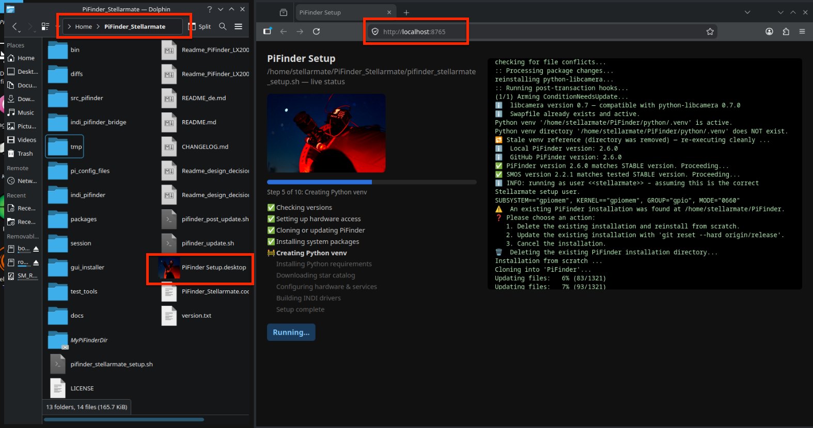

# PiFinder auf Stellarmate

*[English version](README.md)*


Dieses Projekt stellt eine Reihe von Skripten bereit, um die [PiFinder](https://www.pifinder.io/)-Software nahtlos in eine [Stellarmate](https://www.stellarmate.com/)-Umgebung zu installieren, zu patchen und zu integrieren. Es automatisiert den gesamten Einrichtungsprozess und sorgt dafür, dass PiFinder korrekt neben den bestehenden Stellarmate-Diensten funktioniert.

Das Hauptziel ist es, Nutzern die leistungsfähigen Plate-Solving- und Objektsuche-Funktionen von PiFinder auf einem Gerät zugänglich zu machen, das gleichzeitig Stellarmate für Astrofotografie, EAA und vollständige Ausrüstungssteuerung betreibt.

> ### ⚠️ **Haftungsausschluss**
>
> * Dies ist ein Community-Projekt und steht in keiner offiziellen Verbindung zu PiFinder oder Stellarmate.
> * Die Nutzung dieser Skripte erfolgt auf eigenes Risiko. Der Autor haftet nicht für Schäden an Hardware oder Software.
> * Dieser Ablauf wurde mit der in `version.txt` angegebenen PiFinder-Version getestet.

> ### ✅ **Aktuelle Version — v1.0.0**
>
> * Gebaut und verifiziert für **PiFinder-Software 2.6.0** auf **StellarMate OS 2.2.1** (Arch Linux).
> * **Raspberry Pi 4**: Vollständig unterstützt — Kamera ✅, Plate-Solve ✅, IMU ✅, GPS ✅. Unter echtem Nachthimmel getestet (2026-07-12).
> * **Raspberry Pi 5**: Teilweise unterstützt — GPS ✅, Web-UI ✅. OLED-Display funktioniert noch nicht (SPI-Treiber-Problem wird untersucht). Kamera benötigt 15-poliges FFC-CSI-Adapterkabel.
> * **INDI-Integration**: eigenständiger LX200-Treiber + optionale Kopplung an eine echte Montierung ("Mount Bridge"), Ende-zu-Ende verifiziert gegen eine echte Skywatcher-EQ5/OnStepX-Montierung — siehe [Readme_PiFinder_LX200_de.md](Readme_PiFinder_LX200_de.md) und [CHANGELOG.md](CHANGELOG.md).

---

## Schnellstart

```bash
git clone https://github.com/apos/PiFinder_Stellarmate.git
cd PiFinder_Stellarmate
./pifinder_stellarmate_setup.sh
```

Lieber im Browser statt roher Terminal-Ausgabe? Nutze stattdessen die [Setup-GUI](#setup-gui-optional) —
per SSH `bash gui_installer/launch_setup_gui.sh` ausführen, dann die Seite von jedem Gerät im
Netzwerk aus öffnen (keine Desktop-Sitzung auf dem Pi nötig). Alle Details: [Installation](#installation).

---

## Hauptfunktionen & Änderungen

Dieses Setup passt die Standard-PiFinder-Installation an, um sie besser mit Stellarmate zu integrieren:

*   **Automatisierte Installation:** Ein einziges Skript kümmert sich um das Herunterladen der richtigen PiFinder-Version, das Anlegen einer Python-Virtual-Environment, die Installation der Abhängigkeiten und das Anwenden aller notwendigen Patches.
*   **INDI-Integration für KStars/Ekos & SkySafari:** Ein eigenständiger `PiFinder LX200`-INDI-Treiber meldet PiFinders gesolvte Position und leitet GoTo-Anfragen als Push-to-Ziel an PiFinder weiter. Ein optionaler `PiFinder Mount Bridge`-Treiber kann diese Position an jeden echten INDI-Mount-Treiber koppeln (Verify/Alert, Auto-Correct bei Drift, oder vollständiges event-basiertes GoTo-Weiterreichen). Linkt direkt gegen System-`libindi` — kein INDI-Source-Checkout, kein kompletter INDI-Build nötig. Wird automatisch vom Haupt-Setup-Skript gebaut und installiert — siehe [Readme_PiFinder_LX200_de.md](Readme_PiFinder_LX200_de.md) für die technische Referenz und bebilderte Einrichtungsschritte (Web-Manager-Profil, INDI Control Panel, KStars/Ekos, SkySafari).
*   **Stellarmate-GPS-Integration:** PiFinder ist so konfiguriert, dass es Stellarmate/KStars als GPS-Quelle nutzt — ein separates GPS-Modul am PiFinder ist damit überflüssig.
*   **Netzwerkverwaltung deaktiviert:** Alle Netzwerk-Konfigurationsoptionen (WLAN-Modus, AP/Client-Umschaltung) wurden aus PiFinders OLED-Menü und Weboberfläche entfernt. Das verhindert Konflikte, da Stellarmate für die gesamte Netzwerkverwaltung zuständig ist.
*   **Robustes Patchen:** Änderungen werden über `diff`-Patches angewendet, was den Prozess zuverlässiger und wartbarer macht als manuelle Dateiänderungen.
*   **Kompatibilität:** Die Skripte sind für Raspberry Pi 4 und Pi 5 unter Stellarmate OS (Arch Linux) ausgelegt. Pi 4 ist vollständig getestet und stabil. Die Pi-5-Unterstützung befindet sich in aktiver Entwicklung (GPS ✅, Kamera-Adapterkabel erforderlich).
*   **Umfassende IP-Adress-Anzeige:** Die Weboberfläche und der OLED-Statusbildschirm des Geräts zeigen jetzt alle verfügbaren Nicht-Localhost-IP-Adressen an, was die Netzwerksichtbarkeit verbessert.
*   **Dynamischer Nutzer:** Die Authentifizierung der Weboberfläche wurde so gepatcht, dass sie den aktuellen Systemnutzer (z.B. `stellarmate`) statt eines fest hinterlegten Standardnutzers verwendet.

## Hardware-Anforderungen

### Raspberry Pi 4 *(funktioniert für Basis-Aufgaben)*

| Komponente | Anforderung |
|---|---|
| RAM | ≥ 4 GB (absolutes Minimum — 2 GB nicht möglich) |
| Speicher | USB-3.0-NVMe-HAT (**zwingend** — SD-Karte reicht nicht aus) |
| Strom | Power-HAT ≥ 5 A (**zwingend** — USB-Strom reicht nicht aus) |

### Raspberry Pi 5 *(empfohlen)*

| Komponente | Anforderung |
|---|---|
| RAM | > 4 GB (≥ 8 GB empfohlen) |
| Speicher | NVMe-HAT mit PCIe (**zwingend** — SD-Karte reicht nicht aus) |
| Strom | Power-HAT ≥ 5 A (**zwingend** — USB-C PD 5 A kann funktionieren) |

> **Hinweis zur Kamera (Pi 5):** Der Pi 5 nutzt einen **15-poligen FFC-CSI-Anschluss**, während der Pi 4 22-polig ist. Für den Anschluss des PiFinder-Kameramoduls an einen Pi 5 wird ein Adapterkabel benötigt.

---

## Installation

Der Einrichtungsprozess ist bewusst einfach gehalten. Er führt dich durch eine Neuinstallation oder die Aktualisierung einer bestehenden.

### Voraussetzungen

*   Ein Raspberry Pi 4 oder Pi 5 mit PiFinder-Hardware (Hat, Display, Kamera usw.).
*   Stellarmate OS 2.1.1 (Arch Linux) installiert und laufend.
*   Grundlegende Vertrautheit mit der Linux-Kommandozeile.

### Einrichtungsschritte

1.  **Hardware-Schnittstellen aktivieren:**
    SPI und I2C werden vom Setup-Skript automatisch über `/boot/config.txt` aktiviert. Auf Stellarmate OS (Arch Linux) ist kein manueller Schritt nötig. `raspi-config` ist auf dieser Plattform nicht verfügbar.

2.  **Repository klonen:**
    Öffne ein Terminal auf deinem Stellarmate-Gerät und klone dieses Repository:
    ```bash
    git clone https://github.com/apos/PiFinder_Stellarmate.git
    cd PiFinder_Stellarmate
    ```

3.  **Setup-Skript ausführen:**
    Führe das Haupt-Setup-Skript aus. Es erkennt, ob bereits eine PiFinder-Installation existiert, und bietet dir entsprechende Optionen.
    ```bash
    ./pifinder_stellarmate_setup.sh
    ```

    *   **Falls kein PiFinder gefunden wird:** Das Skript klont das offizielle PiFinder-Repository und wendet alle nötigen Patches an.
    *   **Falls PiFinder gefunden wird:** Du wirst gefragt, ob du:
        *   **1. Von Grund auf neu installieren möchtest:** Löscht das bestehende PiFinder-Verzeichnis vollständig und führt eine Neuinstallation durch.
        *   **2. Aktualisieren möchtest:** Setzt dein lokales PiFinder auf die offizielle `release`-Branch-Version zurück und wendet alle Patches erneut an.

4.  **Python-Virtual-Environment (nur beim ersten Durchlauf):**
    Beim ersten Ausführen des Skripts auf einem frischen System stoppt es, nachdem eine Python-Virtual-Environment (`.venv`) angelegt wurde. Du musst diese manuell aktivieren und das Skript erneut ausführen, um die Installation der Abhängigkeiten abzuschließen. Das Skript zeigt dir die genauen Befehle an, die etwa so aussehen:
    ```bash
    source /home/stellarmate/PiFinder/python/.venv/bin/activate
    ./pifinder_stellarmate_setup.sh
    ```
    Danach wird die Installation abgeschlossen, die PiFinder-Dienste werden gestartet, und die
    PiFinder-LX200- + Mount-Bridge-INDI-Treiber werden automatisch gebaut und installiert — siehe
    [Der INDI-Treiber](#der-indi-treiber) unten für das Web-Manager-Profil-Setup.

### Setup-GUI (optional)

Wer nicht die rohe Terminal-Ausgabe beobachten möchte: `gui_installer/` bietet eine kleine lokale
Webseite, die dasselbe Setup-Skript mit einer live mitscrollenden Statusanzeige im Browser
ausführt — inklusive automatischer Behandlung des "venv aktivieren und neu starten"-Schritts sowie
der Reinstall/Update-Auswahl per Button, sodass nichts mehr an einem Prompt eingetippt werden muss.
Starten mit:
```bash
bash gui_installer/launch_setup_gui.sh
```
oder `PiFinder Setup.desktop` nach `~/Desktop/` kopieren/verlinken für ein klickbares
Icon. Es ist derselbe Installer darunter — nützlich vor allem, wenn man Installationen/Reinstalls
häufiger wiederholt (z.B. beim Testen).

<table>
<tr>
<td align="center">
<a href="docs/images/readme/Setup_Browser.png"></a><br>
<sub>Die Setup-GUI: Live-Fortschrittsbalken, Schritt-Checkliste und Terminal-Ausgabe nebeneinander</sub>
</td>
</tr>
</table>

## Der INDI-Treiber

`pifinder_stellarmate_setup.sh` baut und installiert beide INDI-Treiber für dich (stoppt zuerst
eine ggf. laufende Instanz, startet danach den StellarMate Web Manager neu, damit die
neuen/aktualisierten Treiber in seinem Katalog auftauchen). Die Build-Skripte musst du nur dann
selbst aufrufen, wenn du **nur** die Treiber neu bauen willst, ohne das komplette Setup erneut
laufen zu lassen (z.B. nach dem Pullen einer reinen Treiber-Code-Änderung):

```bash
cd ~/PiFinder_Stellarmate
bash bin/build_indi_driver.sh     # PiFinder LX200
bash bin/build_indi_bridge.sh     # PiFinder Mount Bridge (optional, nur bei echter Montierung)
```

Für die vollständige Einrichtungs-Anleitung (StellarMate-Web-Manager-Profil, INDI Control Panel, KStars/Ekos-Remote-Modus, SkySafari), die komplette LX200-Kommando-/Property-Referenz und eine Erklärung der Code- und Deployment-Strategie siehe **[Readme_PiFinder_LX200_de.md](Readme_PiFinder_LX200_de.md)**.

## SMOS-Updates

Stellarmate OS nutzt BTRFS-Snapshot-Resets zur Anwendung von Updates. Das setzt die Root-Partition zurück, wodurch alle manuell installierten Pakete und Konfigurationen (Pacman-Repos, systemd-Dienste, Swap usw.) entfernt werden. Die `/home`-Partition bleibt dabei unversehrt.

Führe nach jedem SMOS-Update das Wiederherstellungs-Skript aus:

```bash
bash ~/PiFinder_Stellarmate/bin/restore_after_smos_update.sh
sudo reboot
```

Dies stellt alles wieder her, was PiFinder benötigt: Pacman-Repos, Systempakete, Hardware-Gruppen, udev-Regeln, `/boot/config.txt`-Overlays, Swapfile und systemd-Dienste.

### Synchronisation von basic-memory / Claude-Kontext mit Nextcloud

Das Post-Update-Skript kümmert sich auch um die Synchronisation des Claude-AI-Gedächtnisses und -Kontexts mit Nextcloud:

```bash
bash ~/PiFinder_Stellarmate/bin/smos-post-update.sh --sync-memory
```

> **Hinweis:** `rclone` wird automatisch von `restore_after_smos_update.sh` installiert. Der Nextcloud-Remote muss vorher in `~/.config/rclone/rclone.conf` konfiguriert sein (Remote-Name: `nextcloud`, WebDAV).

### Versionskompatibilität

| PiFinder | SMOS | Pi 4 | Pi 5 |
|---|---|---|---|
| 2.6.0 | 2.2.1 | ✅ vollständig getestet | ⚠️ nur GPS/Web-UI — OLED ausstehend |
| 2.6.0 | 2.1.1 | ✅ getestet | ⚠️ ebenso |
| 2.5.1 | 2.1.1 | ✅ getestet | — |

## Deinstallation

Ein Skript zum sicheren Entfernen der PiFinder-Installation und -Dienste steht bereit.

```bash
~/PiFinder_Stellarmate/bin/uninstall_pifinder_stellarmate.sh
```

Dies stoppt und deaktiviert die `pifinder`-Dienste, entfernt die systemd-Dateien und löscht das `~/PiFinder`-Verzeichnis. Das Verzeichnis `~/PiFinder_data` sowie das `PiFinder_Stellarmate`-Repository selbst werden dabei nicht entfernt.

## Siehe auch

*   **[Readme_PiFinder_LX200_de.md](Readme_PiFinder_LX200_de.md)** — vollständige INDI/Mount-Bridge-Dokumentation: bebilderte Einrichtungsanleitung, LX200-Kommando-/Property-Referenz, Code- und Deployment-Strategie. ([English version](Readme_PiFinder_LX200.md))
*   **[Readme_design_decisions_de.md](Readme_design_decisions_de.md)** — Zusammenfassung der wichtigsten Design-Entscheidungen.
*   **[CHANGELOG.md](CHANGELOG.md)** — Versionshistorie.
*   **[bin/README_compile_indi.md](bin/README_compile_indi.md)** — kurze Build-Referenz für den PiFinder-LX200-Treiber.
