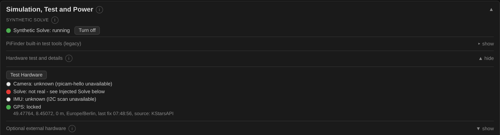

# PiFinder auf Stellarmate

*[English version](README.md)*


## Zusammenfassung

Dieses Projekt installiert, patcht und integriert das [PiFinder](https://www.pifinder.io/)-Plate-
Solving-Push-to-System in ein [StellarMate](https://www.stellarmate.com/)-Setup, sodass ein einzelner
Raspberry Pi PiFinders Plate-Solving und Objektsuche **neben** StellarMate für Astrofotografie, EAA
und vollständige Ausrüstungssteuerung betreibt. Das Setup-Skript automatisiert den gesamten Ablauf.

**Die Bausteine — und warum:**

- **Raspberry Pi** — die Plattform, die PiFinder und StellarMate ohnehin beide anvisieren.
- **PiFinder** — ein Python-basierter Push-to-Solver mit einer **Global-Shutter-Kamera** (saubere
  Plate-Solves auch während sich die Montierung bewegt). Open Source in Hard- *und* Software — genau
  das macht die Integration überhaupt machbar: Das Setup patcht ihn direkt an Ort und Stelle, statt
  ihn zu forken.
- **StellarMate** — ein gut gepflegtes Community-Projekt mit Open-Source-Kern und einem starken
  App-Ökosystem (StellarMate App, KStars/Ekos, INDI Web Manager) zum Steuern einer kompletten
  Imaging-Ausrüstung.
- **INDI** — der Kitt zwischen beiden. Beide Seiten sprechen es bereits: PiFinder stellt seine
  solvte Position als INDI-Teleskop bereit, und die optionale **Mount Bridge** koppelt das an jede
  INDI-unterstützte motorisierte Montierung — kein montierungsspezifisches Protokoll, kein
  Custom-Code pro Montierung.

> ### ⚠️ **Haftungsausschluss**
>
> * Dies ist ein Community-Projekt und steht in keiner offiziellen Verbindung zu PiFinder oder Stellarmate.
> * Die Nutzung dieser Skripte erfolgt auf eigenes Risiko. Der Autor haftet nicht für Schäden an Hardware oder Software.
> * Dieser Ablauf wurde mit der in `version.txt` angegebenen PiFinder-Version getestet.

> ### ✅ **Aktuell gepinnte Versionen**
>
> * Gepinnt auf **PiFinder 2.6.3** auf **StellarMate OS 2.3.0** (Arch Linux) über `version.txt` /
>   `pifinder_stellarmate_setup.sh` — ein fester Release-Tag, nicht der bewegliche HEAD des upstream
>   `release`-Branches. Vollständig getestet auf Pi 4, Pi 5 und dem x86-Dev-/Simulator-Host —
>   [Versionskompatibilität](#versionskompatibilität) hat die Details.
> * **Pi 5 Tastatur ⚠️** — ein Geekworm-X1203-UPS-Shield belegt GPIO 16 gemeinsam mit Tastatur-
>   Spalte 0 (Tasten 7/4/1/LEFT), die Spalte fällt aus. Hardware-Konflikt zwischen den zwei
>   Aufsteck-Boards, nur mit diesem Shield; eine [Numpad-Bridge](Readme_KeyboardBridge_de.md) umgeht
>   das.
> * **INDI-Integration** — eigenständiger LX200-Treiber + optionale Mount-Bridge-Kopplung,
>   Ende-zu-Ende verifiziert gegen eine echte Skywatcher-EQ5 / OnStepX-Montierung. Siehe
>   [Readme_PiFinder_LX200_de.md](Readme_PiFinder_LX200_de.md).
> * **Control Center** — Installationen/Updates, Hardware-Checkliste, Umschaltung Real / Full
>   Simulation / Fake Mode, die Mount Bridge und Reboot/Shutdown, in einer lokalen Webseite. Siehe
>   [Readme_ControlCenter_de.md](Readme_ControlCenter_de.md); ausgelieferte Änderungen in
>   [CHANGELOG.md](CHANGELOG.md).

---

## Inhaltsverzeichnis

1. [Schnellstart](#schnellstart)
2. [Hauptfunktionen & Änderungen](#hauptfunktionen--änderungen)
3. [Hardware-Anforderungen](#hardware-anforderungen)
4. [Installation](#installation)
5. [Nach der Installation: PiFinders "PFSM"-Seite](#nach-der-installation-pifinders-pfsm-seite)
6. [Der INDI-Treiber](#der-indi-treiber)
7. [SMOS-Updates](#smos-updates)
8. [Versionskompatibilität](#versionskompatibilität)
9. [Roadmap](#roadmap)
10. [Deinstallation](#deinstallation)
11. [Siehe auch](#siehe-auch)

---

## Schnellstart

**1. Browser-Installation (empfohlen)**

```bash
git clone https://github.com/apos/PiFinder_Stellarmate.git
cd PiFinder_Stellarmate
bash gui_installer/launch_setup_gui.sh
```

Öffne die Seite anschließend im Browser — direkt auf dem Pi oder von jedem anderen Gerät im
gleichen Netzwerk aus (keine Desktop-Sitzung auf dem Pi nötig). Details siehe
[Setup-GUI / Control Center](#setup-gui--control-center-empfohlen).

<table>
<tr>
<td align="center">
<a href="docs/images/readme/cc_full_page.png"></a><br>
<sub>Das Control Center, von einem beliebigen Browser im Netzwerk geöffnet — keine Desktop-Sitzung auf dem Pi nötig (Full Simulation gezeigt)</sub>
</td>
</tr>
</table>

**2. Terminal-Installation**

```bash
git clone https://github.com/apos/PiFinder_Stellarmate.git
cd PiFinder_Stellarmate
./pifinder_stellarmate_setup.sh
```

Alle Details: [Installation](#installation).

> **⚠️ In jedem Fall zwingend nötiger nächster Schritt: Equipment-Profil im Web Manager anlegen.**
> Eine fertige Installation allein macht PiFinder noch nicht über INDI/KStars/SkySafari nutzbar —
> die Treiber existieren nur im eigenen Katalog des StellarMate Web Managers, und es gibt kein
> Profil dafür, bis eines selbst angelegt wird — direkt im Web Manager
> (`http://<pi-adresse>:8624`, nicht über KStars).
> Siehe [Readme_PiFinder_LX200_de.md — Schritt 2](Readme_PiFinder_LX200_de.md#schritt-2-equipment-profil-im-web-manager-anlegen).

---

## Hauptfunktionen & Änderungen

Dieses Setup passt die Standard-PiFinder-Installation an, um sie besser mit Stellarmate zu integrieren:

*   **Automatisierte Installation:** Ein einziges Skript kümmert sich um das Herunterladen der richtigen PiFinder-Version, das Anlegen einer Python-Virtual-Environment, die Installation der Abhängigkeiten und das Anwenden aller notwendigen Patches.
*   **INDI-Integration für KStars/Ekos & SkySafari:** Ein eigenständiger `PiFinder LX200`-INDI-Treiber meldet PiFinders gesolvte Position und leitet GoTo-Anfragen als Push-to-Ziel an PiFinder weiter. Ein optionaler `PiFinder Mount Bridge`-Treiber kann diese Position an jeden echten INDI-Mount-Treiber koppeln (Verify/Alert, Auto-Correct bei Drift, oder vollständiges event-basiertes GoTo-Weiterreichen). Linkt direkt gegen System-`libindi` — kein INDI-Source-Checkout, kein kompletter INDI-Build nötig. Wird automatisch vom Haupt-Setup-Skript gebaut und installiert — siehe [Readme_PiFinder_LX200_de.md](Readme_PiFinder_LX200_de.md) für die technische Referenz und bebilderte Einrichtungsschritte (Web-Manager-Profil, INDI Control Panel, KStars/Ekos, SkySafari).
*   **Stellarmate-GPS-Integration:** PiFinder ist so konfiguriert, dass es Stellarmate/KStars als GPS-Quelle nutzt — ein separates GPS-Modul am PiFinder ist damit überflüssig.
*   **Netzwerkverwaltung deaktiviert:** Alle Netzwerk-Konfigurationsoptionen (WLAN-Modus, AP/Client-Umschaltung) wurden aus PiFinders OLED-Menü und Weboberfläche entfernt. Das verhindert Konflikte, da Stellarmate für die gesamte Netzwerkverwaltung zuständig ist.
*   **Robustes Patchen:** Änderungen werden über `diff`-Patches angewendet, was den Prozess zuverlässiger und wartbarer macht als manuelle Dateiänderungen.
*   **Kompatibilität:** Die Skripte sind für Raspberry Pi 4 und Pi 5 unter Stellarmate OS (Arch Linux) ausgelegt. Beide werden vollständig unterstützt — den aktuellen Stand pro Pi siehe Versions-Banner oben.
*   **Umfassende IP-Adress-Anzeige:** Die Weboberfläche und der OLED-Statusbildschirm des Geräts zeigen jetzt alle verfügbaren Nicht-Localhost-IP-Adressen an, was die Netzwerksichtbarkeit verbessert.
*   **Dynamischer Nutzer:** Die Authentifizierung der Weboberfläche wurde so gepatcht, dass sie den aktuellen Systemnutzer (z.B. `stellarmate`) statt eines fest hinterlegten Standardnutzers verwendet.
*   **Passwortgeschützte Setup-GUI:** Der Webserver von `gui_installer/` (destruktive Reinstall/Update/Reboot-Aktionen) verlangt jetzt dasselbe Systemnutzer-Passwort wie PiFinders eigener Remote-Login, geprüft via PAM — kein separates Passwort zu merken.

## Hardware-Anforderungen

### Raspberry Pi 4 *(funktioniert für Basis-Aufgaben)*

| Komponente | Anforderung |
|---|---|
| RAM | ≥ 4 GB (absolutes Minimum — 2 GB nicht möglich) |
| Speicher | USB-3.0-NVMe-HAT (**zwingend** — SD-Karte reicht nicht aus) |
| Strom | Power-HAT ≥ 5 A (**zwingend** — USB-Strom reicht nicht aus) |

### Raspberry Pi 5 *(empfohlen)*

| Komponente | Anforderung |
|---|---|
| RAM | > 4 GB (≥ 8 GB empfohlen) |
| Speicher | NVMe-HAT mit PCIe (**zwingend** — SD-Karte reicht nicht aus) |
| Strom | Power-HAT ≥ 5 A (**zwingend** — USB-C PD 5 A kann funktionieren) |

> **Hinweis zur Kamera (Pi 5):** Der Pi 5 nutzt einen **15-poligen FFC-CSI-Anschluss**, während der Pi 4 22-polig ist. Für den Anschluss des PiFinder-Kameramoduls an einen Pi 5 wird ein Adapterkabel benötigt.

---

## Installation

Der Einrichtungsprozess ist bewusst einfach gehalten. Er führt dich durch eine Neuinstallation oder die Aktualisierung einer bestehenden.

### Voraussetzungen

*   Ein Raspberry Pi 4 oder Pi 5 mit PiFinder-Hardware (Hat, Display, Kamera usw.).
*   Stellarmate OS 2.3.0 (Arch Linux) installiert und laufend — das Setup-Skript warnt (fährt aber fort), falls deine SMOS-Version von diesem getesteten Pin abweicht.
*   Grundlegende Vertrautheit mit der Linux-Kommandozeile.

### Einrichtungsschritte

1.  **Hardware-Schnittstellen aktivieren:**
    SPI und I2C werden vom Setup-Skript automatisch über `/boot/config.txt` aktiviert. Auf Stellarmate OS (Arch Linux) ist kein manueller Schritt nötig. `raspi-config` ist auf dieser Plattform nicht verfügbar.

2.  **Repository klonen:**
    Öffne ein Terminal auf deinem Stellarmate-Gerät und klone dieses Repository:
    ```bash
    git clone https://github.com/apos/PiFinder_Stellarmate.git
    cd PiFinder_Stellarmate
    ```

3.  **Setup-Skript ausführen:**
    Führe das Haupt-Setup-Skript aus. Es erkennt, ob bereits eine PiFinder-Installation existiert, und bietet dir entsprechende Optionen.
    ```bash
    ./pifinder_stellarmate_setup.sh
    ```

    *   **Falls kein PiFinder gefunden wird:** Das Skript klont das offizielle PiFinder-Repository und wendet alle nötigen Patches an.
    *   **Falls PiFinder gefunden wird:** Du wirst gefragt, ob du:
        *   **1. Von Grund auf neu installieren möchtest:** Löscht das bestehende PiFinder-Verzeichnis vollständig und führt eine Neuinstallation durch.
        *   **2. Aktualisieren möchtest:** Setzt dein lokales PiFinder auf den gepinnten Release-Tag dieses Projekts zurück (siehe `version.txt`) und wendet alle Patches erneut an.

4.  **Python-Virtual-Environment (nur beim ersten Durchlauf):**
    Beim ersten Ausführen des Skripts auf einem frischen System stoppt es, nachdem eine Python-Virtual-Environment (`.venv`) angelegt wurde. Du musst diese manuell aktivieren und das Skript erneut ausführen, um die Installation der Abhängigkeiten abzuschließen. Das Skript zeigt dir die genauen Befehle an, die etwa so aussehen:
    ```bash
    source /home/stellarmate/PiFinder/python/.venv/bin/activate
    ./pifinder_stellarmate_setup.sh
    ```
    Danach wird die Installation abgeschlossen, die PiFinder-Dienste werden gestartet, und die
    PiFinder-LX200- + Mount-Bridge-INDI-Treiber werden automatisch gebaut und installiert — siehe
    [Der INDI-Treiber](#der-indi-treiber) unten für das Web-Manager-Profil-Setup.

### Setup-GUI / Control Center (empfohlen)

Statt die rohe Terminal-Ausgabe zu beobachten: `gui_installer/` bietet eine kleine lokale Webseite —
das **PiFinder on Stellarmate Control Center** —, die dasselbe Setup-Skript mit einer Live-
Statusanzeige im Browser ausführt (Reinstall / Update / Reset / Uninstall als Buttons, jeweils mit
Bestätigung), und danach als laufendes Dashboard dient: die Hardware-Checkliste, Umschaltung
zwischen Real / Full Simulation / Fake Mode, die INDI-**Mount Bridge** (Coupling-Presets,
Einmal-Sync-Aktionen, geführtes Setup) und Reboot / Shutdown.

Die vollständige Dokumentation — Architektur, jede Kachel, die Mount-Bridge-Sync-Workflows, die
API-Oberfläche — steht in **[Readme_ControlCenter_de.md](Readme_ControlCenter_de.md)**
([English version](Readme_ControlCenter.md)).

```bash
bash gui_installer/launch_setup_gui.sh          # starten (idempotent; gibt die URLs aus)
bash gui_installer/launch_setup_gui.sh --shutdown-webserver   # stoppen
```

`http://<pi-adresse>:8765` öffnen — beliebiger Benutzername, Passwort = dein
`stellarmate`-Systempasswort. Oder `PiFinder Setup.desktop` nach `~/Desktop/` kopieren/verlinken für
ein klickbares Icon.

> **Entwicklung ohne Pi?** [Readme_UTM_dev_X86_de.md](Readme_UTM_dev_X86_de.md) macht aus einem x86-
> StellarMate-OS-Image (UTM-VM auf einem Mac) eine vollwertige Control-Host- + Simulator-
> Entwicklungsmaschine — das Control Center, die Setup-Skripte und die Mount-Bridge-Coupling-Logik
> laufen gegen den **PiFinder Simulator** und **Injected Solve**
> ([Readme_PiFinder_Simulator.md](Readme_PiFinder_Simulator.md)), ohne Hardware.

<table>
<tr>
<td align="center" width="50%">
<a href="docs/images/readme/cc_install_running.png"></a><br>
<sub>Install or Update: eine 10-Schritt-Fortschrittsleiste, eine Phasen-Checkliste und die Live-Terminal-Ausgabe des Setup-Skripts in einer Kachel</sub>
</td>
<td align="center" width="50%">
<a href="docs/images/readme/cc_mode_tile.png"></a><br>
<sub>Simulation, Test and Power: Synthetic Solve, die direkt-gegen-Hardware-Checkliste und einklappbare Service-/Power-Aktionen</sub>
</td>
</tr>
<tr>
<td align="center" width="50%">
<a href="docs/images/readme/cc_mount_bridge_baseline.png"></a><br>
<sub>Die PiFinder-Kachel: OLED-Spiegel und Quick Keys, die Cam/Solve/IMU/GPS-Badges und das Mount-Bridge-Verbindungsdiagramm (Drift, Höhe, Coupling)</sub>
</td>
<td align="center" width="50%">
<a href="docs/images/readme/cc_mount_bridge_coupling.png"></a><br>
<sub>Die INDI-Mount-Bridge-Kachel: Quick Actions, die Coupling-Presets und die geführte Einrichtungs-Checkliste (eingeklappt)</sub>
</td>
</tr>
</table>

## Nach der Installation: PiFinders "PFSM"-Seite

Sobald PiFinder läuft, bekommt seine eigene Webseite (`/remote`, Standardpasswort `smate`) einen
neuen Menüpunkt **"PFSM"** (`/smos`). Er ist die On-Device-Begleitung zu den zwei manuellen
Schritten unten, sortiert danach, wie oft man sie tatsächlich braucht:

1. **PFSM-Control-Center-Status/-Steuerung** — zeigt, ob der Webserver von `gui_installer/` gerade
   läuft, mit einem Start-Button, falls nicht, damit du ihn (z.B. für ein späteres PiFinder-Update)
   ohne Terminal neu starten kannst. Erreichbarkeits-Links für das Control Center selbst werden
   ebenfalls aufgelistet.
2. **Web Manager einrichten (einmalig)** — standardmäßig eingeklappt (nur einmal pro Installation
   nötig); ausgeklappt zeigt sich derselbe Screenshot wie
   [Readme_PiFinder_LX200_de.md](Readme_PiFinder_LX200_de.md) plus direkte Links zum Web Manager
   für jede IP dieses Pi, damit du den Port (`8624`) nicht selbst heraussuchen musst.

Diese Seite braucht kein Login (dieselbe Begründung wie bei PiFinders eigener Startseite — sie muss
direkt nach einem frischen Boot funktionieren) und ist als erste Anlaufstelle nach einer
Neuinstallation, einem Update oder einem Reboot gedacht.

<p align="center">
<a href="docs/images/pfinder_lx200/webmanager_profile.png"></a><br>
<sub>Web-Manager-Einrichtungsschritt (ausgeklappt): StellarMate-Web-Manager-Profil mit laufenden PiFinder-LX200- und PiFinder-Mount-Bridge-Treibern</sub>
</p>

## Der INDI-Treiber

`pifinder_stellarmate_setup.sh` baut und installiert beide INDI-Treiber für dich (stoppt zuerst
eine ggf. laufende Instanz, startet danach den StellarMate Web Manager neu, damit die
neuen/aktualisierten Treiber in seinem Katalog auftauchen). Die Build-Skripte musst du nur dann
selbst aufrufen, wenn du **nur** die Treiber neu bauen willst, ohne das komplette Setup erneut
laufen zu lassen (z.B. nach dem Pullen einer reinen Treiber-Code-Änderung):

```bash
cd ~/PiFinder_Stellarmate
bash bin/build_indi_driver.sh     # PiFinder LX200
bash bin/build_indi_bridge.sh     # PiFinder Mount Bridge (optional, nur bei echter Montierung)
```

<a href="docs/images/pfinder_lx200/indi_control_panel_tabs_PiFinder_LX200_main.png"></a><br>
<sub>PiFinder LX200s eigener INDI-Control-Panel-Tab, verbunden und mit live gemeldeter, gelöster Position</sub>

Für die vollständige Einrichtungs-Anleitung (StellarMate-Web-Manager-Profil, INDI Control Panel, KStars/Ekos-Remote-Modus, SkySafari), die komplette LX200-Kommando-/Property-Referenz und eine Erklärung der Code- und Deployment-Strategie siehe **[Readme_PiFinder_LX200_de.md](Readme_PiFinder_LX200_de.md)**.

## SMOS-Updates

Stellarmate OS nutzt BTRFS-Snapshot-Resets zur Anwendung von Updates. Das setzt die Root-Partition zurück, wodurch alle manuell installierten Pakete und Konfigurationen (Pacman-Repos, systemd-Dienste, Swap usw.) entfernt werden. Die `/home`-Partition bleibt dabei unversehrt.

Führe nach jedem SMOS-Update das Wiederherstellungs-Skript aus:

```bash
bash ~/PiFinder_Stellarmate/bin/restore_after_smos_update.sh
sudo reboot
```

Dies stellt alles wieder her, was PiFinder benötigt: Pacman-Repos, Systempakete, Hardware-Gruppen, udev-Regeln, `/boot/config.txt`-Overlays, Swapfile und systemd-Dienste.

### Synchronisation von basic-memory / Claude-Kontext mit Nextcloud

> **Das ist ein persönlicher Workflow des Maintainers, kein allgemeiner Setup-Schritt für
> PiFinder_Stellarmate.** Relevant nur, wenn man selbst [basic-memory](https://github.com/basicmachines-co/basic-memory)
> für Claude-Sitzungskontext nutzt und bereits einen eigenen Nextcloud-WebDAV-Remote eingerichtet
> hat — die meisten Nutzer haben beides nicht und können diesen Abschnitt einfach überspringen; er
> hat keinerlei Auswirkung auf PiFinder selbst.

Für alle, die das nutzen, kann das Post-Update-Skript zusätzlich diesen lokalen Claude-AI-Kontext mit Nextcloud synchronisieren:

```bash
bash ~/PiFinder_Stellarmate/bin/smos-post-update.sh --sync-memory
```

> **Hinweis:** `rclone` wird automatisch von `restore_after_smos_update.sh` installiert. Der Nextcloud-Remote muss vorher in `~/.config/rclone/rclone.conf` konfiguriert sein (Remote-Name: `nextcloud`, WebDAV).

## Versionskompatibilität

Die zentrale Quelle der Wahrheit dafür, welche PiFinder- / StellarMate-OS- / Raspberry-Pi-
Kombinationen dieses Projekt getestet hat. Andere Dokumente in diesem Repo verweisen hierher, statt
das zu wiederholen.

| PiFinder | SMOS | Pi 4 | Pi 5 | UTM x86 (Dev / Simulator) |
|---|---|---|---|---|
| 2.6.3 | 2.3.0 | ✅ vollständig getestet | ✅ vollständig getestet | ✅ getestet — Installation, Control Center, Mount Bridge gegen den PiFinder Simulator (kein echtes Plate-Solving; siehe [Readme_UTM_dev_X86_de.md](Readme_UTM_dev_X86_de.md)) |
| 2.6.0 | 2.2.1 | ✅ vollständig getestet | ✅ GPS/Web-UI/OLED bestätigt, ⚠️ Tastatur mit angeschlossenem Geekworm-X1203-UPS teilweise unbrauchbar (GPIO-16-Konflikt, siehe Banner oben) — Kamera-Adapterkabel ausstehend | — |
| 2.6.0 | 2.1.1 | ✅ getestet | ⚠️ seit dem OLED-Fix nicht erneut verifiziert (hardwarebasiert, sollte also übertragbar sein — siehe Zeile 2.2.1) | — |
| 2.5.1 | 2.1.1 | ✅ getestet | — | — |

## Roadmap

Getrackte, priorisierte Arbeit — Issues, Testfälle, nächste Schritte — liegt im
**[GitHub-Projekt](https://github.com/users/apos/projects/15)**
([Roadmap-Ansicht](https://github.com/users/apos/projects/15/views/4)). Ausgelieferte Änderungen
stehen im **[CHANGELOG.md](CHANGELOG.md)**. Die Richtung:

**Version 2.x — konsolidieren, was da ist**

- Den aktuellen Funktionsumfang durchgehend härten und testen (Mount-Bridge-Coupling, Full
  Simulation, das Control Center) — das meiste davon steht bereits im Abschnitt `[Unreleased]` von
  `CHANGELOG.md`.
- Ausgewählte Änderungen zurück ins Upstream-Projekt [PiFinder](https://github.com/brickbots/PiFinder)
  spielen (welche PRs — noch zu entscheiden).
- Ein Guiding-Watcher (Dithering- / Sternverlust-Erkennung während der Aufnahme) — Issue bereits
  offen.

**Version 3.x — integrieren**

- Tiefere StellarMate-Integration, in Zusammenarbeit mit dem SMOS-Projekt.
- Die wesentlichen Aktionen direkt in der PiFinder-App-Oberfläche anbieten statt nur eines Links aufs
  Control Center — vor allem die Quick Actions, den Coupling-Modus, das INDI-Setup, Multi-Point
  Alignment und Test Hardware.
- Ein „echter" Simulator — Plate-Solving gegen den GSC-Katalog statt einer injizierten Position.

## Deinstallation

Ein Skript zum sicheren Entfernen der PiFinder-Installation und -Dienste steht bereit.

```bash
~/PiFinder_Stellarmate/bin/uninstall_pifinder_stellarmate.sh
```

Dies stoppt und deaktiviert jeden systemd-Unit, den dieses Projekt installiert (`pifinder`,
`pifinder_splash`, `pifinder-setup`, `pifinder-fake-mode-autostart`, `pifinder-control-center`,
`pifinder-numpad-bridge`), entfernt die PiFinder-LX200-/Mount-Bridge-INDI-Treiber (Binaries und
ihre `drivers.xml`-Katalog-Einträge), entfernt die `/dev/gpiomem*`-udev-Regel, demaskiert
WirePlumber/PipeWire (beim Setup maskiert, damit es sich nicht die Kamera greift), entfernt die
Pi-5-`lgpio`-Build-Artefakte und löscht das `~/PiFinder`-Verzeichnis. Das Verzeichnis
`~/PiFinder_data` sowie das `PiFinder_Stellarmate`-Repository selbst werden dabei nicht entfernt
(bei Bedarf manuell löschen — das Skript gibt den passenden Befehl aus). Bewusst unangetastet
bleiben außerdem ein paar echt geteilte Systemkonfigurationsteile (die SPI/I2C/Overlay-Zeilen in
`/boot/config.txt`, der `python-libcamera`-Pacman-Versions-Pin sowie die dem eigenen User
hinzugefügten Hardware-Gruppenmitgliedschaften) — das Skript zeigt am Ende, welche das genau sind
und warum, falls man auch diese von Hand entfernen möchte.

Der **Uninstall**-Button des Control Centers (siehe
[Setup GUI / Control Center](#setup-gui--control-center-empfohlen) oben) führt dasselbe Skript
stattdessen mit einem `--selfmove`-Flag aus, das zusätzlich diesen `~/PiFinder_Stellarmate`-Checkout
selbst löscht — der obige Terminal-Aufruf tut das bewusst nicht, damit er gefahrlos aus dem Repo
heraus ausgeführt werden kann, das er gerade deinstalliert.

## Siehe auch

*   **[Readme_ControlCenter_de.md](Readme_ControlCenter_de.md)** — vollständige Control-Center-Dokumentation: Architektur, Designprinzipien, Feature-Übersicht, Mount-Bridge- & Sync-Workflows, API-Referenz. ([English version](Readme_ControlCenter.md))
*   **[Readme_PiFinder_LX200_de.md](Readme_PiFinder_LX200_de.md)** — die INDI-Schicht: bebilderte Schritt-für-Schritt-Einrichtung (Equipment-Profil im Web Manager, INDI Control Panel, KStars/Ekos, SkySafari), LX200-Kommando-/Property-Referenz, Code- und Deployment-Strategie. ([English version](Readme_PiFinder_LX200.md))
*   **[Readme_KeyboardBridge_de.md](Readme_KeyboardBridge_de.md)** — die Numpad-als-Tastatur-Bridge: Architektur, Tastenbelegung, Selbstheilungs-Design. ([English version](Readme_KeyboardBridge.md))
*   **[Readme_UTM_dev_X86_de.md](Readme_UTM_dev_X86_de.md)** — ein x86-StellarMate-OS-VM (UTM auf einem Mac) als hardwarefreie Control-Host- + Simulator-Entwicklungsmaschine einrichten. ([English version](Readme_UTM_dev_X86.md))
*   **[Readme_PiFinder_Simulator.md](Readme_PiFinder_Simulator.md)** — der PiFinder Simulator / Injected Solve, zum Testen der Mount Bridge ohne echte Montierung oder klaren Himmel.
*   **[Readme_PiFinder_in_KStars_de.md](Readme_PiFinder_in_KStars_de.md)** — wie KStars die PiFinder-Geräte auf der Himmelskarte zeichnet und was die Rechtsklick-Operationen Goto/Sync/Abort je Gerät tatsächlich bewirken. ([English version](Readme_PiFinder_in_KStars.md))
*   **[Readme_design_decisions_de.md](Readme_design_decisions_de.md)** — Zusammenfassung der wichtigsten Design-Entscheidungen. ([English version](Readme_design_decisions.md))
*   **[CHANGELOG.md](CHANGELOG.md)** — Versionshistorie · **[GitHub-Projekt](https://github.com/users/apos/projects/15)** — getrackte Roadmap.
*   **[bin/README_compile_indi.md](bin/README_compile_indi.md)** — kurze Build-Referenz für den PiFinder-LX200-Treiber.
*   **[CONTRIBUTING.md](CONTRIBUTING.md)** — Submodul-Einrichtung nach dem Klonen, Ausführen der Shell-Skript-Testsuite (Englisch).

---

<p align="center">
  <br>
  © github.com/apos 2026<br>
  <em>Unofficial community project, not affiliated with StellarMate or PiFinder.</em>
</p>
