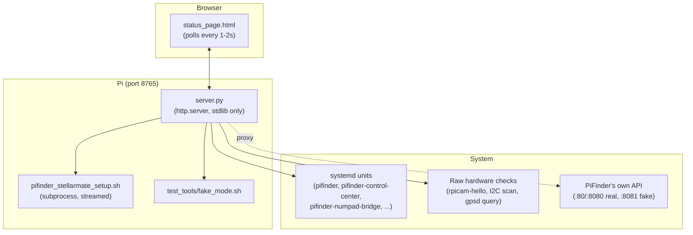

# PiFinder Stellarmate Control Center Documentation

*[Deutsche Version](Readme_ControlCenter_de.md)*

> ### ✅ Built & verified against
>
> * **PiFinder software 2.6.0** on **StellarMate OS 2.2.1** (Arch Linux), Raspberry Pi 4 and Pi 5
> * Pure Python **stdlib** (`http.server`) backend — no framework, no external web dependency
> * Live-tested end-to-end: fresh install, reinstall, update, reboot-persistence, Fake/Real Mode
>   switching, all hardware toggles

This document covers the **PiFinder Stellarmate Control Center** (`gui_installer/`) — the local web
application that installs, updates, monitors, and controls this project's PiFinder integration. It
started as a thin wrapper around the setup script's terminal output and grew into this project's
primary operational surface. Companion to the main [README.md](README.md), which covers the base
PiFinder-on-StellarMate installation this tool manages, and to
[Readme_KeyboardBridge.md](Readme_KeyboardBridge.md), whose toggle button lives here.

---

## Table of Contents

1. [Basic Functionality (Overview)](#basic-functionality-overview)
2. [Design Principles](#design-principles)
3. [Architecture](#architecture)
4. [Feature Walkthrough](#feature-walkthrough)
5. [Installation & Illustrated Guide](#installation--illustrated-guide)
6. [Technical Reference: API Surface](#technical-reference-api-surface)
7. [Persistence & Process Model](#persistence--process-model)
8. [Authentication & Security Model](#authentication--security-model)
9. [Known Limitations & Troubleshooting](#known-limitations--troubleshooting)
10. [Development & Testing](#development--testing)
11. [Strategic Roadmap](#strategic-roadmap)
12. [Version Compatibility](#version-compatibility)

---

## Basic Functionality (Overview)

The Control Center exists because a StellarMate-managed PiFinder install has operational needs a
plain terminal session doesn't serve well: watching a long install run from a phone while standing
at the telescope, switching between a hardware-free "Fake Mode" and the real service for
development, checking whether the camera/IMU/GPS are actually detected independent of what
PiFinder's own software believes, and rebooting/shutting down the Pi without SSH.

It runs as a small, dependency-free Python web server (`gui_installer/server.py` +
`gui_installer/status_page.html`) reachable at `http://<pi-address>:8765`, deliberately kept **stdlib
only** — its job includes bootstrapping the very venv/pip environment PiFinder itself needs, so it
cannot depend on anything that environment would provide.



---

## Design Principles

Established and enforced over multiple UI-polish rounds this project went through (see
`basic-memory/pifinder-stellarmate/00017_bm-ui-design-anforderung-klar-einheitlich` for the global
principle this project's UI now follows):

1. **One consistent status-row pattern everywhere.** Every status line is `<dot> Label: status`, in
   that order, with no exceptions — an inconsistency here (one row reading `status <dot>` instead)
   was flagged and fixed specifically because it broke this rule.
2. **Traffic-light semantics, not emoji.** Four states — white (unknown/checking), green (fully
   functional), yellow (running but degraded, e.g. hardware missing), red (failed/not running) — as
   a colored dot, not an emoji, so the same visual language reads correctly regardless of font/OS
   emoji rendering.
3. **Verify against real, independent state — never trust "the process is alive."** `pifinder.service`
   can report `systemctl is-active` = true even with a fully crashed camera subprocess (a known
   PiFinder architecture quirk, see [Feature Walkthrough](#hardware-checklist)). Every status check
   in this tool that matters for a "is this actually usable" answer checks the real, underlying
   signal (raw hardware probes, actual HTTP reachability with response verification, settle-checked
   process state) rather than a single process-alive bit.
4. **Confirm before anything destructive or hard to reverse.** Reinstall, Update, Reboot, and
   Shutdown all require an explicit confirmation dialog — and that dialog gets *more* insistent
   (stronger wording) if another run is already in progress, rather than firing immediately on
   click.
5. **Context-aware labels over generic ones.** "PiFinder is running, but not functional" always
   names *which* hardware is missing (camera, IMU, or both) rather than a fixed, potentially
   misleading generic label.

---

## Architecture

Two logical halves, sharing one HTTP server and one page:

- **Install/Update orchestration** — runs `pifinder_stellarmate_setup.sh --action=<reinstall|update|
  cancel>` as a subprocess, streams its stdout into a rolling buffer the frontend polls (`/log`,
  `/state`), and parses two kinds of markers the script itself emits into that same stream:
  `###PHASE### <label>` (drives the 10-step progress bar — tracks the *furthest* phase reached, so
  the venv-bootstrap self-restart mid-run doesn't make progress appear to jump backwards) and
  `###REBOOT_NEEDED### true|false` (drives the conditional Reboot button — only shown if this run
  actually touched `/boot/config.txt`, since that's the only case that needs one).
- **Live status/control** — a family of independent, on-demand checks and toggles (mode switch,
  hardware checklist, Solve Simulation, LCD overlay, numpad bridge, power actions), each backed by
  its own small, focused function in `server.py`. None of these depend on an install/update run being
  in progress or complete; they're always live once the server itself is running.

Both halves are served by the same single-threaded-per-request `ThreadingHTTPServer` — long-running
actions (an install run, a mode switch, waiting out a reboot) are always dispatched to a background
`threading.Thread`, so the HTTP server itself never blocks waiting for them; the frontend polls for
progress instead of holding a request open.

---

## Feature Walkthrough

### Setup / Install / Update

Drives `pifinder_stellarmate_setup.sh` through its `--action=` flag instead of interactive terminal
prompts (including the venv-bootstrap two-pass self-restart, which the script otherwise expects a
human to sit through). A 10-step progress bar and checklist track phase markers from the script; a
Reboot button appears only when actually needed.

### Fake/Real Mode Switch

A dedicated tile shows whether PiFinder is currently running for real (`pifinder.service`) or as a
hardware-free instance for dev/testing (`test_tools/fake_mode.sh`, port 8081), with a one-click
switch. The switch doesn't trust the launched process's exit code alone — it **settle-checks** the
actual target state (up to 8 seconds, polling every second) before declaring success, since
`systemctl start`/`pf_remote.py launch` both return as soon as the process is *spawned*, not once
it's actually reachable.

### Hardware Checklist

Checks camera, IMU, and GPS **directly against the hardware**, independent of what PiFinder's own
software believes:

| Check | Method | Why not just ask PiFinder |
|---|---|---|
| Camera | `rpicam-hello --list-cameras` | `pifinder.service` can report "active" with a fully crashed camera subprocess — the rest of the app (web server, GPS, IMU) keeps running regardless, a known upstream architecture quirk. |
| IMU | Raw I2C bus scan for the BNO055's address (`0x28`/`0x29`), run through PiFinder's own venv (needs `board`/`adafruit_bno055`) | Same reasoning — a software-level "IMU ok" isn't independent evidence the chip is actually wired up. |
| GPS | Direct query to `gpsd`'s own `DEVICES` report over its native protocol (port 2947) | `gpsd` is a shared, concurrent-safe daemon — safe to query alongside PiFinder's own connection to it, and reports the receiver's *presence*, independent of whether a fix has been acquired yet. |

Keyboard is deliberately **not** included in this live checklist (checking it needs PiFinder
stopped, since it needs exclusive GPIO access) — the row instead points at
`test_tools/keypad_gpio_matrix_test.py` for a manual, PiFinder-stopped check.

### Solve Simulation

A direct toggle for PiFinder's own "Tools → Test Mode" (canned test images substituted for the
camera, for exercising plate-solve UI without sky access) via `POST /api/debug_solve` — proxied
through this server rather than fetched directly from the browser (PiFinder's own API doesn't set
CORS headers, and this way the toggle works regardless of which port PiFinder actually landed on).
Built specifically because driving this via simulated keypresses (`/api/key` menu navigation) proved
unreliable — keypresses could be silently dropped, leaving the menu cursor stuck.

### Hardware / Peripherals: External SPI LCD & Numpad Bridge

Two independent toggles for hardware-free dev/test peripherals:

- **External SPI LCD** — enables/disables a Waveshare 3.5" LCD's device-tree overlay in
  `/boot/config.txt` and reboots (Pi firmware overlays only apply at boot; there's no live-toggle
  path). Needs the same GPIO lines a real HAT's OLED/keypad use, so the two can never be active
  simultaneously. Once active, `pifinder-fake-mode-autostart.service` brings up Fake Mode plus both
  LCD bridges automatically on every boot.
- **Numpad Bridge** — see [Readme_KeyboardBridge.md](Readme_KeyboardBridge.md) for the bridge
  itself. This toggle just drives `pifinder-numpad-bridge.service`'s enabled-state (`systemctl
  enable/disable --now`).

### Power Actions

Always-visible Reboot/Shutdown buttons (`sudo reboot`/`sudo poweroff`), each with its own
confirmation dialog that becomes more insistent if an install/update or mode switch is currently in
progress. Distinct from the "Close Setup" action, which only stops this web server's own process
(and persists that as `pifinder-control-center.service`'s disabled state, so it doesn't silently
restart on the next boot either).

---

## Installation & Illustrated Guide

Installed and kept up to date automatically by `pifinder_stellarmate_setup.sh` — nothing to do
manually on a normal install. To launch it directly:

```bash
bash gui_installer/launch_setup_gui.sh
```

Then open `http://<pi-address>:8765` in a browser — on the Pi itself, or from any other device on
the same network (no desktop session on the Pi required; the server binds `0.0.0.0`).

<table>
<tr>
<td align="center" width="50%">
<a href="docs/images/readme/Setup_Browser.png"></a><br>
<sub>Live progress bar, step checklist, and terminal output side by side during an install/update run</sub>
</td>
<td align="center" width="50%">
<a href="docs/images/readme/Setup_Ready.png"></a><br>
<sub>Run complete: OLED mirror plus the quick-links tile (PiFinder status, INDI Drivers page, this page's own links, GitHub docs)</sub>
</td>
</tr>
</table>

<table>
<tr>
<td align="center">
<a href="docs/images/readme/Setup_via_remote_browser.png"></a><br>
<sub>Opened remotely from another device on the network — no desktop session on the Pi needed</sub>
</td>
</tr>
</table>

<table>
<tr>
<td align="center">
<a href="docs/images/pfinder_lx200/Pifinder Stellarmate Control Center.png"></a><br>
<sub>The full Control Center page, as linked from PiFinder's own "INDI Drivers" page. Close-up
screenshots of the individual live-status tiles (Mode switch, Hardware checklist, Solve Simulation,
LCD/Numpad toggles, Power) are a documentation follow-up, see <a href="#strategic-roadmap">Strategic Roadmap</a>.</sub>
</td>
</tr>
</table>

---

## Technical Reference: API Surface

All routes served by `gui_installer/server.py`. `Auth` = requires HTTP Basic Auth against the
`stellarmate` system account (see [Authentication & Security Model](#authentication--security-model)).

| Method | Path | Auth | Purpose |
|---|---|---|---|
| GET | `/` | ✅ | The page itself |
| GET | `/state` | — | Install/update run status (polled by the frontend) |
| GET | `/log` | — | Streamed install/update terminal output |
| POST | `/start?action=fresh\|reinstall\|update\|cancel` | ✅ | Start a setup-script run |
| POST | `/reboot` | ✅ | Reboot the Pi |
| POST | `/shutdown` | — | Stop *this web server* (not the Pi) |
| POST | `/poweroff` | ✅ | Power off the Pi |
| GET | `/api/pifinder_mode` | ✅ | Current Fake/Real/none mode + any in-flight switch status |
| POST | `/api/pifinder_mode?action=enable_fake\|disable_fake` | ✅ | Trigger a mode switch |
| GET | `/api/pifinder_mode_log?position=N` | ✅ | Incremental mode-switch script output |
| GET | `/api/hardware_status` | ✅ | Camera/IMU/GPS presence (raw hardware checks) |
| GET | `/api/debug_solve?port=N` | ✅ | Proxy: PiFinder's own Solve Simulation state |
| POST | `/api/debug_solve?port=N` | ✅ | Proxy: toggle PiFinder's own Solve Simulation |
| GET | `/api/display_bridge` | ✅ | Whether the LCD overlay is currently active |
| POST | `/api/display_bridge?action=start\|stop` | ✅ | Toggle the LCD overlay (triggers a reboot) |
| GET | `/api/keyboard_bridge` | ✅ | Whether the numpad bridge service is running |
| POST | `/api/keyboard_bridge?action=start\|stop` | ✅ | Toggle the numpad bridge |
| GET | `/pifinder.jpg`, `/avvp_logo.png`, `/heyapos_logo.png`, `/pifinder_welcome.png` | ✅ | Static assets |

`/state`, `/log`, and `/shutdown` are deliberately auth-exempt: PiFinder's own unauthenticated "INDI
Drivers" page cross-origin-polls `/state`/`/log` to show "Setup is running" without a login prompt,
and cross-origin requests never carry this page's cached Basic Auth credentials anyway, so
`/shutdown` (non-destructive to the Pi itself — it only stops this GUI's server) has to stay open
for that same cross-origin button to work.

---

## Persistence & Process Model

| Component | Persistence mechanism |
|---|---|
| Control Center itself | `pifinder-control-center.service` — `systemctl enable/disable --now`, toggled by the "Close Setup"/launch actions |
| Install/update runs | One-shot subprocess per run, no persistence needed (either finishes or is cancelled) |
| Fake/Real Mode | `test_tools/fake_mode.sh` manages `pifinder.service` (systemd) vs. a `pf_remote.py`-launched fake instance |
| External SPI LCD | `/boot/config.txt` overlay line — persists across reboots by definition (firmware-level) |
| Numpad Bridge | `pifinder-numpad-bridge.service` — same enable/disable pattern as the Control Center itself |

The recurring pattern across every toggle in this tool: **systemd's own enabled-state is the single
source of truth for "should this be on after a reboot,"** never a flag file or an in-memory variable
in `server.py`. This was arrived at after two separate incidents where a plain tracked subprocess
(`Popen`) failed to survive a reinstall or a reboot — see
`basic-memory/pifinder-stellarmate/00027` (Fake Mode surviving a `rm -rf` unnoticed, running stale
code) and `00035` (the numpad bridge's original design).

---

## Authentication & Security Model

- The page itself and every state-changing action require **HTTP Basic Auth against the
  `stellarmate` system account's real password**, verified via PAM (`pam_auth.py`) — the same
  account and mechanism PiFinder's own Remote login checks, so there's exactly one password to
  remember for both.
- `/state`, `/log`, `/shutdown` are intentionally open (see the API table above) — none of the three
  can do anything destructive to the Pi itself.
- The server binds `0.0.0.0` (reachable from any device on the LAN, not just the Pi) — **there is no
  rate limiting or lockout on failed auth attempts**, so this should never be exposed beyond a
  trusted home/observatory network. This is documented in the server's own top-level comment and
  repeated here deliberately.
- CORS (`Access-Control-Allow-Origin: *`) is only set on the auth-exempt JSON routes, specifically to
  let PiFinder's own "INDI Drivers" page (a different origin/port) read them via `fetch()` —
  widening CORS to the authenticated routes would defeat the purpose of requiring auth at all.

---

## Known Limitations & Troubleshooting

- **No camera/IMU on Pi 5 with certain UPS shields**: unrelated to this tool itself, but surfaces
  through its hardware checklist — see `basic-memory/pifinder-stellarmate/00000` for the documented
  Geekworm X1203/GPIO 16 conflict, which the checklist will correctly report as "keyboard"
  hardware-affected (not camera/IMU/GPS, which this checklist covers).
- **A crashed camera subprocess can leave `pifinder.service` reporting "active."** This is exactly
  why the hardware checklist exists and checks raw hardware rather than trusting `systemctl
  is-active` — see [Design Principles](#design-principles) point 3.
- **The page's cached JS/HTML can go stale across an update** if a browser tab was left open through
  a Control-Center-updating run — `Cache-Control: no-store, must-revalidate` is set specifically to
  minimize this, but a hard refresh after any update is still the safest first troubleshooting step
  if a button seems to reference a route that no longer exists.
- **`/boot/config.txt` overlay changes require a reboot** — there is no live-toggle path for Pi
  firmware overlays; the LCD toggle's reboot is not optional, not a bug.

---

## Development & Testing

- `test_tools/fake_mode.sh start`/`stop` can be exercised directly, independent of the Control
  Center's own tile, for scripting/automation.
- The `pifinder-remote` Claude Code skill's `pf_remote.py` (`.claude/skills/pifinder-remote/`) is
  what `fake_mode.sh` uses under the hood to launch a fake-hardware instance — see
  `basic-memory/pifinder-stellarmate/00020` for that skill's own design.
- No automated test suite exists for `gui_installer/` yet (see Strategic Roadmap) — all verification
  to date has been live, manual, end-to-end testing against real installs/reinstalls/reboots.

---

## Strategic Roadmap

Prioritized per `basic-memory/pifinder-stellarmate/00001`'s GitHub-Projects-schema TODO table
([[bm-github-project-schema-todo-format]] for the schema convention itself). Effort/dependency notes
included since several of these build on each other:

| Priority | Size | Item | Depends on |
|---|---|---|---|
| P2 | XS | Close-up screenshots of the newer live-status tiles (Mode switch, Hardware checklist, Solve Simulation row, LCD/Numpad toggle rows, Power tile) for this document and the main README | None — pure documentation task |
| P2 | L | Guided, GUI-driven test workflow (user request, 2026-07-16): step through enabling Test Mode, configuring the Web Manager, checking Ekos settings, all from one screen | Benefits from the second Control Center page below existing first, to avoid overloading the current single-page layout |
| P2 | M | Second, decoupled Control Center page for PiFinder-mode details and multiple test-runner buttons (Keypad GPIO test, Fake LX200 simulator) — first page stays focused on Setup/Update/Install | None, but the guided test workflow above would build on it |
| P2 | L | Persistent, password-protected admin webserver replacing the on-demand setup-GUI-server model — would also structurally fix the reboot-disconnects-the-browser problem, and could host `smos-post-update.sh` actions, an IgnorePkg-pin status dashboard, and INDI-driver rebuilds as buttons | None — independent, larger architectural change; see `basic-memory/pifinder-stellarmate/00015` for the original brainstorm |
| P3 (not yet tracked) | M | Automated test coverage for `server.py`'s request handlers (currently zero — all verification has been manual/live) | None |

No currently-open bugs are tracked against the Control Center itself (its most recent regressions —
the session-bus/`stellarmatewebmanager` restart issue, the dot-order UI inconsistency — are both
resolved, see `basic-memory/pifinder-stellarmate/00033`).

---

## Version Compatibility

| PiFinder | SMOS | Pi 4 | Pi 5 |
|---|---|---|---|
| 2.6.0 | 2.2.1 | ✅ fully tested | ✅ fully tested |
| 2.5.1 | 2.1.1 | ✅ tested | — |

The Control Center itself has no PiFinder-version-specific code paths — it only ever talks to
PiFinder through its stable `/api/*` Remote API and to the system through `systemctl`/raw hardware
probes, both independent of the installed PiFinder version.

## See Also

- [Readme_KeyboardBridge.md](Readme_KeyboardBridge.md) — the numpad-as-keypad bridge this tool's
  "Turn Numpad On/Off" button controls.
- [Readme_PiFinder_LX200.md](Readme_PiFinder_LX200.md) — the INDI integration layer, whose "INDI
  Drivers" page links back to this Control Center.
- [README.md](README.md) — base PiFinder-on-StellarMate installation.
- `basic-memory/pifinder-stellarmate/00017` (global UI design principle), `00021` (mode-switch
  state-machine design), `00030`/`00033`/`00035` (persistence-model iterations).
