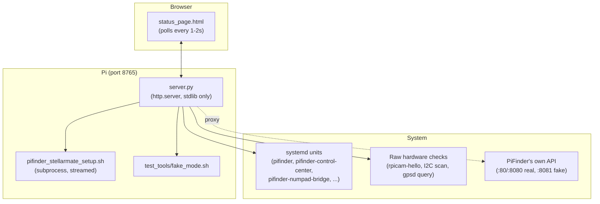

# PiFinder Stellarmate Control Center Documentation

*[Deutsche Version](Readme_ControlCenter_de.md)*

> ### ✅ Built & verified against
>
> * Pure Python **stdlib** (`http.server`) backend — no framework, no external web dependency
> * Live-tested end-to-end: fresh install, reinstall, update, reboot-persistence, Fake/Real Mode
>   switching, all hardware toggles
> * No PiFinder-version-specific code — talks to PiFinder only through its stable `/api/*` Remote
>   API. For the tested PiFinder / StellarMate OS / Pi combinations, see the
>   [Version Compatibility table in README.md](README.md#version-compatibility).

This document covers the **PiFinder Stellarmate Control Center** (`gui_installer/`) — the local web
application that installs, updates, monitors, and controls this project's PiFinder integration, and
the primary operational surface for a StellarMate-managed install. Companion to the main
[README.md](README.md) (base installation) and [Readme_KeyboardBridge.md](Readme_KeyboardBridge.md)
(whose toggle button lives here).

---

## Table of Contents

1. [Basic Functionality (Overview)](#basic-functionality-overview)
2. [Design Principles](#design-principles)
3. [Status Badges & Colours](#status-badges--colours)
4. [Architecture](#architecture)
5. [Feature Walkthrough](#feature-walkthrough)
6. [Installation & Illustrated Guide](#installation--illustrated-guide)
7. [Mount Bridge & Sync Workflows](#mount-bridge--sync-workflows)
8. [Technical Reference: API Surface](#technical-reference-api-surface)
9. [Persistence & Process Model](#persistence--process-model)
10. [Authentication & Security Model](#authentication--security-model)
11. [Known Limitations & Troubleshooting](#known-limitations--troubleshooting)
12. [Development & Testing](#development--testing)
13. [Roadmap](#roadmap)
14. [Version Compatibility](#version-compatibility)

---

## Basic Functionality (Overview)

The Control Center exists because a StellarMate-managed PiFinder install has operational needs a
plain terminal session doesn't serve well: watching a long install run from a phone while standing
at the telescope, switching between a hardware-free "Fake Mode" and the real service for
development, checking whether the camera/IMU/GPS are actually detected independent of what
PiFinder's own software believes, and rebooting/shutting down the Pi without SSH.

It runs as a small, dependency-free Python web server (`gui_installer/server.py` +
`gui_installer/status_page.html`) reachable at `http://<pi-address>:8765`, deliberately kept **stdlib
only** — its job includes bootstrapping the very venv/pip environment PiFinder itself needs, so it
cannot depend on anything that environment would provide.


```mermaid
flowchart TB
    subgraph Browser
        UI["status_page.html<br/>(polls every 1-2s)"]
    end
    subgraph "Pi (port 8765)"
        Server["server.py<br/>(http.server, stdlib only)"]
        Setup["pifinder_stellarmate_setup.sh<br/>(subprocess, streamed)"]
        FakeMode["test_tools/fake_mode.sh"]
    end
    subgraph "System"
        Systemd["systemd units<br/>(pifinder, pifinder-control-center,<br/>pifinder-numpad-bridge, ...)"]
        HW["Raw hardware checks<br/>(rpicam-hello, I2C scan, gpsd query)"]
        PF["PiFinder's own API<br/>(:80/:8080 real, :8081 fake)"]
    end
    UI <--> Server
    Server --> Setup
    Server --> FakeMode
    Server --> Systemd
    Server --> HW
    Server -.proxy.-> PF
```

---

## Design Principles

1. **One status-row pattern everywhere.** Every status line is `<dot> Label: status`, in that order.
2. **Traffic-light colours, not emoji.** Four states (white / green / yellow / red) as a coloured
   dot, so the language reads the same regardless of font or OS emoji rendering.
3. **Verify real state, never "the process is alive."** `pifinder.service` can be `systemctl
   is-active` = true with a crashed camera subprocess. Every check that answers "is this usable"
   reads the underlying signal — a hardware probe, a verified HTTP response, a settle-checked
   process state.
4. **Confirm anything destructive or hard to reverse.** Reinstall, Update, Reboot, and Shutdown each
   confirm first; the dialog is worded more strongly if a run is already in progress.
5. **Context-aware labels.** "PiFinder is running, but not functional" names *which* hardware is
   missing (camera, IMU, or both).

---

## Status Badges & Colours

### The colour language


Every indicator on the page — the badges above, the dots on status lines, the Mount Bridge diagram —
uses the same four states:

| | Meaning |
|---|---|
| ⚪ **white / neutral** | Unknown — not checked yet, or unreachable. Pulses while a check is running. |
| 🟢 **green** | Confirmed working. |
| 🟡 **yellow** | Running but degraded — hardware missing, no GPS fix, a value past its threshold. |
| 🔴 **red** | Failed, not running, or a value out of safe range. |

Every colour comes from a real check (a hardware probe, a verified HTTP response, a settle-checked
process state), not from "the process is alive". `Cam` / `Solve` / `IMU` / `GPS` always match their
row in **Hardware test and details** ([Feature Walkthrough → Hardware Checklist](#hardware-checklist)).

### Cam


Is a camera detected and usable? `rpicam-hello --list-cameras`, run through PiFinder's venv.

| | Status | Shows |
|---|---|---|
| ⚪ | `checking…` / `unknown (…)` | Not tested yet this session, or the probe tool isn't on this host (no `rpicam-hello` on x86). |
| 🟢 | `functional` | A real capture succeeded. |
| 🔴 | `not detected` / `error (…)` | No camera, or the capture/driver failed. A crashed camera subprocess shows here even while `pifinder.service` reports "active". |

### Solve


Is PiFinder's plate-solver producing a position right now? Read from PiFinder's `solve_source`.

| | Status | Shows |
|---|---|---|
| ⚪ | `unknown` | No data from PiFinder. |
| 🟢 | `solving` | The camera is solving successfully. No age limit — separate from Mount Bridge's own 5 s freshness gate. |
| 🟡 | `estimating from IMU` | No recent camera solve; position is dead-reckoned from the IMU. Pulses. |
| 🔴 | `no star match` | Last attempt found no stars — normal indoors / no sky, not a fault. |
| 🔴 | `not real – see Injected Solve` | An Injected Solve is active; the position isn't a real plate-solve. |

### Injected

Appears docked onto `Solve`'s right edge **only while [Injected Solve](#synthetic-solve-vs-a-manual-one-shot-seed)
is active** (Synthetic Solve, Re-seed from mount, Set position, or Sync). Its presence is the
signal — no colour scale. Whenever it shows, `Solve` is red.

### IMU


Is the BNO055 orientation sensor wired up? Raw I²C bus scan for its address, run through PiFinder's venv.

| | Status | Shows |
|---|---|---|
| ⚪ | `checking…` / `unknown (…)` | Not tested yet this session, or the probe tool isn't on this host. |
| 🟢 | `functional` | The chip answered on the I²C bus. |
| 🔴 | `not detected` / `error (…)` | Nothing at the BNO055 address, or the read errored. |

### GPS


PiFinder's own GPS status, queried from PiFinder.

| | Status | Shows |
|---|---|---|
| ⚪ | `not reachable` | PiFinder isn't answering — Real or Fake Mode must be running. |
| 🟢 | `locked` | A fix is held (detail row: lat/lon, timezone, last fix, source). |
| 🟡 | `no fix yet` | Receiver present and reachable, no fix yet. |

### PiFinder (Mount Type)


PiFinder's own **Mount Type** + **PiFinder Type** settings (both feed its dead-reckoning). Shown
whenever PiFinder is reachable. The value (`Right / Equatorial`, …) is always shown; the colour is
Mount Bridge's verdict:

| | State | Shows |
|---|---|---|
| ⚪ | neutral | PiFinder reachable, but no connected INDI mount to verify against. |
| 🟢 | green | Mount Type matches the connected mount. Colours this badge and the diagram's Mount type line together. |
| 🔴 | red | Mount Type ≠ connected mount — dead-reckoning would be wrong. (PiFinder Type can't be auto-checked; check it against your rig yourself.) |

### Mount Bridge diagram


`PiFinder ↔ Bridge ↔ Mount`, directly under the badge row. Present only with a Mount Bridge in the
profile.

**Device nodes** (`PiFinder`, `Bridge`, `Mount`) — each node icon shows that device's INDI
`CONNECTION`: ⚪ not linked / unknown · 🟢 connected · 🔴 loaded but disconnected. The dotted arrows
show what the Bridge is doing (reading, correcting, forwarding a GoTo).

### Drift


Angular distance between PiFinder's solved position and the mount's reported position, in arcminutes
(`1° 5'` past 60'). Hidden unless a coupling mode is watching and the Bridge is connected. Freezes
at its last value while the mount is below the horizon.

| | State | Meaning |
|---|---|---|
| 🟢 | ≤ Threshold | Within your drift Threshold (default 5′). |
| 🟡 | > Threshold | Past the Threshold — Verify/Alert warns, Auto-correct acts. |
| 🔴 | ≥ 30′ (≈ 0.5°) | Past a generic "outside the eyepiece field of view" limit (full-moon diameter, not your actual optics). |

### Altitude


The mount's own altitude, recomputed every driver tick from its reported position. Hidden until the
mount reports a position.

| | State | Meaning |
|---|---|---|
| ⚪ | neutral | Above the horizon safety margin. |
| 🔴 | red | At or below the horizon — the mount refuses a Sync or GoTo there; a recovery card appears (**Sync mount from PiFinder** / **Goto Home Position**). |

### Status-line dots

The `<dot> Label: status` lines use the same four colours: `PiFinder is running` (🟢) / `not
detected` (🔴); `Normal (NN% CPU)` (🟢) / busy Pi (🟡–🔴); the INDI Mount Bridge line (🟢 connected /
⚪ `(unconfirmed)` while a check is momentarily out). The coupling status line under the diagram is
⚪ not coupled / 🟢 watching or holding / 🟡–🔴 drift past threshold, with a `Details` expander.

---

## Architecture

Two logical halves, sharing one HTTP server and one page:

- **Install/Update orchestration** — runs `pifinder_stellarmate_setup.sh --action=<reinstall|update|
  cancel>` as a subprocess, streams its stdout into a rolling buffer the frontend polls (`/log`,
  `/state`), and parses two kinds of markers the script itself emits into that same stream:
  `###PHASE### <label>` (drives the 10-step progress bar — tracks the *furthest* phase reached, so
  the venv-bootstrap self-restart mid-run doesn't make progress appear to jump backwards) and
  `###REBOOT_NEEDED### true|false` (drives the conditional Reboot button — only shown if this run
  actually touched `/boot/config.txt`, since that's the only case that needs one).
- **Live status/control** — a family of independent, on-demand checks and toggles (mode switch,
  hardware checklist, Solve Simulation, LCD overlay, numpad bridge, power actions), each backed by
  its own small, focused function in `server.py`. None of these depend on an install/update run being
  in progress or complete; they're always live once the server itself is running.

Both halves are served by the same single-threaded-per-request `ThreadingHTTPServer` — long-running
actions (an install run, a mode switch, waiting out a reboot) are always dispatched to a background
`threading.Thread`, so the HTTP server itself never blocks waiting for them; the frontend polls for
progress instead of holding a request open.

---

## Feature Walkthrough

### Setup / Install / Update

Runs `pifinder_stellarmate_setup.sh` via its `--action=` flag — no terminal prompts, the
venv-bootstrap self-restart handled automatically. A 10-step progress bar + checklist track the
script's phase markers; the Reboot button shows only when `/boot/config.txt` changed.

### Reset / Uninstall

Two destructive actions, grouped by scope. Both confirm first; the same explanations are in
[help.html](gui_installer/help.html).

- **Reset** (in the **PiFinder** group) — stops `pifinder.service` / `pifinder_splash.service` /
  `pifinder-setup.service`, then wipes only `~/PiFinder`'s Python venv and build state (`POST
  /reset`, streamed via `GET /api/reset_log`). Services, INDI drivers, and udev rules stay
  installed.
- **Uninstall** (in the **PiFinder Stellarmate** group) — stops, disables, and removes every
  systemd unit this project installs, removes the INDI drivers, and deletes `~/PiFinder` **and this
  `~/PiFinder_Stellarmate` checkout** (`POST /uninstall`, streamed via `GET /api/uninstall_log`).
  Runs `bin/uninstall_pifinder_stellarmate.sh --selfmove` (copies itself to `/tmp` so it can delete
  its own source tree).

### Fake / Real Mode Switch

Shows whether PiFinder runs for real (`pifinder.service`) or as a hardware-free instance
(`test_tools/fake_mode.sh`, port 8081), with a one-click switch. **Settle-checked**: it polls the
target state for up to 8 s before reporting success, since `systemctl start` / `pf_remote.py launch`
return as soon as the process is spawned, not once it's reachable.

### Hardware Checklist

Checks camera, IMU, and GPS **directly against the hardware**, not against PiFinder's software
state (`pifinder.service` can be "active" with a crashed camera subprocess):

| Check | Method |
|---|---|
| Camera | `rpicam-hello --list-cameras` |
| IMU | Raw I²C bus scan for the BNO055 address (`0x28`/`0x29`), through PiFinder's venv |
| GPS | `gpsd`'s own `DEVICES` report over its native protocol (port 2947) — reports the receiver's *presence*, separate from whether a fix is acquired |

Keyboard isn't in the live checklist (it needs PiFinder stopped for exclusive GPIO access) — the
row points at `test_tools/keypad_gpio_matrix_test.py` instead.

### Solve Simulation

Toggles PiFinder's own **Tools → Test Mode** (canned test images for the camera) via `POST
/api/debug_solve`, proxied through this server (PiFinder's API sets no CORS headers, and this way
the toggle works whichever port PiFinder landed on).

### Hardware / Peripherals: External SPI LCD & Numpad Bridge

- **External SPI LCD** — toggles a Waveshare 3.5" LCD's device-tree overlay in `/boot/config.txt`
  and reboots (firmware overlays only apply at boot). Uses the same GPIO lines as a real HAT's
  OLED/keypad, so the two can't be active at once. Once on,
  `pifinder-fake-mode-autostart.service` brings up Fake Mode + both LCD bridges on every boot.
- **Numpad Bridge** — drives `pifinder-numpad-bridge.service`'s enabled-state (`systemctl
  enable/disable --now`). See [Readme_KeyboardBridge.md](Readme_KeyboardBridge.md).

### Power Actions

Reboot / Shutdown (`sudo reboot` / `sudo poweroff`), each with a confirmation dialog. Separate from
**Close Setup**, which stops only this web server and persists
`pifinder-control-center.service` as disabled so it doesn't restart on boot.

---

## Installation & Illustrated Guide

Installed and kept up to date automatically by `pifinder_stellarmate_setup.sh` — nothing to do
manually on a normal install. To launch it directly:

```bash
bash gui_installer/launch_setup_gui.sh
```

Then open `http://<pi-address>:8765` in a browser — on the Pi itself, or from any other device on
the same network (no desktop session on the Pi required; the server binds `0.0.0.0`). Any username
works; the password is the `stellarmate` system account's password (see
[Authentication & Security Model](#authentication--security-model)).

### The page at a glance

<table>
<tr>
<td align="center">
<a href="docs/images/readme/cc_full_page.png"></a><br>
<sub>The whole page (Full Simulation shown here). Top to bottom: the <strong>PiFinder</strong> tile (OLED mirror, quick keys, the Cam/Solve/IMU/GPS badge row, and — directly under it — the Mount Bridge connection diagram), the <strong>INDI Mount Bridge</strong> tile, <strong>Simulation, Test and Power</strong>, and <strong>Install or Update</strong> at the bottom. Every tile heading collapses; the state is remembered per browser.</sub>
</td>
</tr>
</table>

The three status tiles are covered elsewhere — the PiFinder badge row and the Mount Bridge diagram
in [Mount Bridge & Sync Workflows](#mount-bridge--sync-workflows), the hardware checklist and mode
switches in [Feature Walkthrough](#feature-walkthrough). The rest of this section is the one tile
that section doesn't reach: **Install or Update**.

### Installing or updating

<table>
<tr>
<td align="center">
<a href="docs/images/readme/cc_install_idle.png"></a><br>
<sub>The idle tile when an install already exists. <strong>PFSM Source Branch</strong> picks which branch of <em>this project's own scripts</em> a run uses (not PiFinder itself); the ↻ re-checks what is actually on disk. The three PiFinder actions and a separate <strong>Uninstall</strong>.</sub>
</td>
</tr>
</table>

- **Reinstall from scratch** — deletes `~/PiFinder` entirely, clones a fresh copy of the official
  `release` branch at the pinned version, then re-applies every StellarMate patch. Confirm dialog:
  *Reinstall from scratch? This permanently deletes the existing ~/PiFinder directory and everything
  in it.*
- **Update** — `git reset --hard` + `pull` on the existing `~/PiFinder` to the pinned version, then
  re-applies the patches, keeping the directory. Confirm dialog: *Update? This runs `git reset
  --hard` on ~/PiFinder, discarding any local changes there.*
- **Reset** — stops the PiFinder services and wipes only `~/PiFinder`'s Python venv and build state;
  services, INDI drivers, udev rules, data and config are untouched. Use it to get a clean slate for
  a re-run without losing anything else.
- **Uninstall** — in its own group because it acts on much more: removes every systemd unit, the
  INDI drivers, `~/PiFinder`, **and this `~/PiFinder_Stellarmate` checkout itself** (the Control
  Center stops working once it starts). See
  [Reset / Uninstall](#reset--uninstall) and [help.html#uninstall](gui_installer/help.html).

Reinstall, Update, Reboot and Shutdown all confirm first, and the dialog gets *more* insistent if a
run is already in progress rather than firing immediately.

<table>
<tr>
<td align="center">
<a href="docs/images/readme/cc_install_running.png"></a><br>
<sub>A run in progress: a 10-step progress bar, a per-phase checklist (green check = done, striped = current), and the setup script's live terminal output streamed straight into the tile.</sub>
</td>
</tr>
</table>

The progress bar tracks the *furthest* phase reached, so the venv-bootstrap self-restart mid-run
doesn't make progress appear to jump backwards. A **Reboot Now** button appears **only** when this
run actually changed `/boot/config.txt` (the only case that needs one). When the run finishes, the
Control Center restarts itself once to load any new code, then returns to the idle state above; the
full summary — versions, timings, any warnings — is written to
`~/PiFinder_Stellarmate/.gui_setup.log`.

Running elsewhere: `INDI-only` (checkbox) installs just the INDI build dependencies and both INDI
drivers — no clone, no venv, no catalog — for a separate control host coupled to a PiFinder over the
network (see [help.html#indi-only-mode](gui_installer/help.html)).

### Next: create your equipment profile (mandatory)

> **⚠️ A finished install alone does not make PiFinder usable via INDI/KStars/SkySafari.** The
> INDI drivers this install just built (`PiFinder LX200`, optionally `PiFinder Mount Bridge`) only
> exist in the StellarMate Web Manager's own driver catalog — they don't appear anywhere inside
> Ekos, and there is no profile for them until you create one yourself. Skipping this step is the
> single most common reason the Mount Bridge tile below, or SkySafari, or Ekos's device list, all
> stay empty after an otherwise successful install.

Do this once, directly in the Web Manager (`http://<pi-address>:8624`, not through KStars) — full
walkthrough with screenshots:
[Readme_PiFinder_LX200.md — Step 2: create an equipment profile in the Web Manager](Readme_PiFinder_LX200.md#step-2-create-an-equipment-profile-in-the-web-manager).

---

## Mount Bridge & Sync Workflows

The Control Center's **INDI Mount Bridge** area couples PiFinder's own plate-solved sky position to a
telescope mount, through the `PiFinder Mount Bridge` INDI driver — so the everyday "is my mount still
where PiFinder thinks it is, and fix it if not" workflow doesn't need the separate INDI Control
Panel. The driver, the coupling modes, and the split-host variants are covered in full in
[Readme_PiFinder_LX200.md](Readme_PiFinder_LX200.md); this section is a picture walkthrough of the
Control Center surface for it — reading the tiles, and the **sync-based** recovery flows that make up
day-to-day use.

> **All screenshots below are from Full Simulation mode** (a simulated PiFinder plus a simulated
> mount — INDI's own `Telescope Simulator`, presented as mount type `EQ_GEM`), not real hardware.
> The layout, badges, and buttons are identical on a real setup; only the device name and the
> numbers differ. Coordinate GoTos aren't meaningful in this simulation setup, so the walkthroughs
> stay on sync-based recovery — the one exception is **Goto Home Position**, which is a native OnStep
> reference-position command, not a coordinate GoTo.

### Reading the tiles

<table>
<tr>
<td align="center">
<a href="docs/images/readme/cc_mount_bridge_baseline.png"></a><br>
<sub>Baseline reading (Full Simulation): PiFinder badge row, the Mount Bridge connection diagram, and the coupling status line — the top of the page, nothing expanded.</sub>
</td>
</tr>
</table>

Two things to read here, top to bottom:

- **The PiFinder badge row** — `Cam` / `Solve` / `Injected` / `IMU` / `GPS` and the screen-orientation
  badge, each in the page's four-state colour language (white = unknown, green = ok, yellow =
  degraded, red = failed). In the shot, `Solve` is red (no real camera solve indoors) but `Injected`
  is green — the position PiFinder is reporting is a *synthetic* one (see
  [Synthetic Solve vs. a manual one-shot seed](#synthetic-solve-vs-a-manual-one-shot-seed) below).
- **The Mount Bridge diagram** — `PiFinder ↔ Bridge ↔ Mount`, with two readouts wedged between the
  Bridge and Mount icons:
  - **Drift** — the angular distance between PiFinder's solved position and the mount's reported
    position, in arcminutes (shown as `1° 5'` past 60'). Green within your Threshold, yellow past it,
    red past ~0.5°. Only shown while a coupling mode is actively watching.
  - **Alt** — the mount's own altitude, recomputed every driver tick from its reported position.
    Turns red at or below the horizon safety margin.
  - Below the diagram, a one-line coupling status (`Watching for drift` · `verify alert (drift
    0.2')`) — a coloured dot plus words for the same state, with a `Details` expander so the row
    doesn't change height as the text changes.

This diagram and the drift/alt readouts live in the **PiFinder** tile (directly under the badge row)
because they're pure status; the `INDI Mount Bridge` section further down is where the *actions* are.

### "PiFinder's simulated position isn't related to the mount"

<table>
<tr>
<td align="center">
<a href="docs/images/readme/cc_mount_bridge_sim_mismatch.png"></a><br>
<sub>Full Simulation startup notice: PiFinder's simulated sky position was seeded independently of the mount, so any agreement between them is coincidental until you tie them together.</sub>
</td>
</tr>
</table>

In Full Simulation the simulated PiFinder and the simulated mount each pick a start position on
their own. When the Mount Bridge driver starts and finds it had nothing better to go on than its
compiled-in fallback, it raises this amber card once: the drift number may *look* fine at a glance
(it's a real star, after all), but Verify/Alert and Sync-from-PiFinder don't actually mean anything
relative to the mount yet. The card offers the two ways to make them mean something — pick whichever
matches which side you trust:

| Button | What it does | Use when |
|---|---|---|
| **Re-seed from mount** | Reads the mount's current position and injects *that* as PiFinder's position. | The mount is where you want to be; PiFinder's (simulated) solve is the odd one out. |
| **Sync mount from PiFinder** | Syncs the mount to whatever PiFinder currently shows — an instant position update, no slew. | PiFinder's position is correct (a real solve, or one you deliberately set) and the mount's belief is wrong — e.g. after moving the mount by hand. |

Either one, once it succeeds, clears the card. The same **Sync mount from PiFinder** button also
appears in Quick Actions and in the drift banner — everywhere, it does a one-shot sync to PiFinder's
*currently visible* position, no freshness check, regardless of coupling mode.

### Mount below the horizon

<table>
<tr>
<td align="center">
<a href="docs/images/readme/cc_mount_bridge_below_horizon.png"></a><br>
<sub>Full Simulation: the mount's reported position is below the horizon — the <code>Alt</code> badge is red and a recovery card appears with the two ways out.</sub>
</td>
</tr>
</table>

When the mount's own reported position drops to or below the horizon safety margin, the `Alt` badge
turns red and this recovery card appears. No software toggle helps here — the driver won't let a
Sync or GoTo through to a below-horizon target anyway — so the card offers only the two real ways
out:

- **Sync mount from PiFinder** — if PiFinder's *own* position is above the horizon (which it often
  is: the disagreement is the whole point), this succeeds and corrects the mount's belief with no
  physical motion.
- **Goto Home Position** — sends the mount to its native OnStep home/reference position. This is a
  firmware reference command, not a coordinate GoTo, so it works even when a coordinate GoTo would
  be refused.

The drift figure freezes at its last value while this is showing — it isn't recomputed while the
mount is below the horizon, since it wouldn't mean anything.

### Choosing a Coupling mode

<table>
<tr>
<td align="center">
<a href="docs/images/readme/cc_mount_bridge_coupling.png"></a><br>
<sub>The <code>INDI Mount Bridge</code> section (Full Simulation): Quick Actions on top, the Coupling presets below, and the one-time Settings collapsed at the bottom.</sub>
</td>
</tr>
</table>

The section splits into what you use every session and what you set once:

- **Quick Actions** — the one-shot buttons: **Sync mount from PiFinder** (above), **Align to Held
  Target** and **Goto Held Target** (correct PiFinder's or the mount's belief about the held target
  — need an active coupling mode), and **Stop movement** (emergency stop; also sets Coupling to Off
  so nothing re-triggers). **Threshold** (arcmin) is how far off before Verify/Alert warns or an
  Auto-correct mode acts. **Decouple** sets Coupling back to Off.
- **Coupling presets** — pick one:
  - **Verify/Alert only** — watches the drift, never moves the mount. The passive "is my mount still
    aligned?" check for astrophotography.
  - **Auto-correct (Sync)** — same watching, but once drift passes the Threshold it syncs the mount
    to PiFinder's position (instant, no slew — works on any mount). The push-to-by-hand-then-correct
    workflow.
  - **GoTo** — physically slews; holds whichever target was most recently set from either side.
    Needs a real Goto-capable mount, so it isn't exercised in this simulation setup.
- **Settings** (collapsed) — Role, hardware mode, and the numbered setup checklist. One-time
  per-session configuration, kept out of the everyday flow.

Clicking a preset before the numbered setup steps are all green doesn't fail — it runs the setup
first (Autoconnect), then applies the mode you clicked.

### Synthetic Solve vs. a manual one-shot seed

Both feed PiFinder a position it didn't plate-solve, for exercising everything downstream of a solve
(the Mount Bridge, the UI) without sky access — but they're different tools:

<table>
<tr>
<td align="center">
<a href="docs/images/readme/cc_synthetic_solve.png"></a><br>
<sub>Synthetic Solve (in <em>Simulation, Test and Power</em>): one toggle, kept alive by a background watchdog.</sub>
</td>
</tr>
</table>

**Synthetic Solve** *continuously* feeds PiFinder the simulated mount's position (via
`test_tools/pifinder_truth_injector.py`), so PiFinder and the simulated mount track together as one
moves. One toggle, one dot; a watchdog restarts the feed if it dies. This is the normal Full
Simulation "there is a sky" switch. It drives the green `Injected` badge in the PiFinder tile.

<table>
<tr>
<td align="center">
<a href="docs/images/readme/cc_mount_bridge_manual_seed.png"></a><br>
<sub>Manual one-shot seed (Full Simulation), inside Quick Actions: <code>Re-seed from mount</code>, <code>Set position</code>, and a direct RA/Dec entry.</sub>
</td>
</tr>
</table>

**Manual one-shot seed** (collapsed inside Quick Actions) injects a *single* position and stops:
**Re-seed from mount** reads the mount's current position once, **Set position** takes a literal
RA/Dec (JNow, degrees), and either turns the injection on if it wasn't. PiFinder's normal IMU
dead-reckoning tracks from that anchor exactly as it would from a real solve. Use this to place
PiFinder at one known spot — e.g. to set up the disagreement for a Sync test — rather than have it
follow the mount. `Turn off` returns PiFinder to real camera solving. Deliberately *not* reflected
in the Synthetic Solve dot, to keep that one signal simple.

---

## Technical Reference: API Surface

All routes served by `gui_installer/server.py`. `Auth` = requires HTTP Basic Auth against the
`stellarmate` system account (see [Authentication & Security Model](#authentication--security-model)).

| Method | Path | Auth | Purpose |
|---|---|---|---|
| GET | `/` | ✅ | The page itself |
| GET | `/state` | — | Install/update run status (polled by the frontend) |
| GET | `/log` | — | Streamed install/update terminal output |
| POST | `/start?action=fresh\|reinstall\|update\|cancel` | ✅ | Start a setup-script run |
| POST | `/reset` | ✅ | Start a Reset run (`~/PiFinder` venv/build only) |
| GET | `/api/reset_log?position=N` | ✅ | Incremental Reset output |
| POST | `/uninstall` | ✅ | Start an Uninstall run (removes everything, incl. this checkout) |
| GET | `/api/uninstall_log?position=N` | — | Incremental Uninstall output (exempt like `/state`/`/log` - see below) |
| GET | `/page_version` | — | Content hash of `status_page.html`, used for the "reload now" stale-tab banner |
| POST | `/reboot` | ✅ | Reboot the Pi |
| POST | `/shutdown` | — | Stop *this web server* (not the Pi) |
| POST | `/poweroff` | ✅ | Power off the Pi |
| GET | `/api/pifinder_mode` | ✅ | Current Fake/Real/none mode + any in-flight switch status |
| POST | `/api/pifinder_mode?action=enable_fake\|disable_fake` | ✅ | Trigger a mode switch |
| GET | `/api/pifinder_mode_log?position=N` | ✅ | Incremental mode-switch script output |
| GET | `/api/hardware_status` | ✅ | Camera/IMU/GPS presence (raw hardware checks) |
| GET | `/api/debug_solve?port=N` | ✅ | Proxy: PiFinder's own Solve Simulation state |
| POST | `/api/debug_solve?port=N` | ✅ | Proxy: toggle PiFinder's own Solve Simulation |
| GET | `/api/display_bridge` | ✅ | Whether the LCD overlay is currently active |
| POST | `/api/display_bridge?action=start\|stop` | ✅ | Toggle the LCD overlay (triggers a reboot) |
| GET | `/api/keyboard_bridge` | ✅ | Whether the numpad bridge service is running |
| POST | `/api/keyboard_bridge?action=start\|stop` | ✅ | Toggle the numpad bridge |
| GET | `/pifinder.jpg`, `/avvp_logo.png`, `/heyapos_logo.png`, `/pifinder_welcome.png` | ✅ | Static assets |

`/state`, `/log`, `/shutdown`, `/page_version`, and `/api/uninstall_log` are deliberately auth-exempt.
PiFinder's own unauthenticated "INDI Drivers" page cross-origin-polls `/state`/`/log` to show "Setup
is running" without a login prompt, and cross-origin requests never carry this page's cached Basic
Auth credentials anyway, so `/shutdown` (non-destructive to the Pi itself — it only stops this GUI's
server) has to stay open for that same cross-origin button to work. `/api/uninstall_log` specifically
skips the PAM check inside `_require_auth()` for latency reasons: this server stops its own systemd
unit partway through an Uninstall run, so a slower, authenticated poll has a worse chance of
completing at all before the connection drops.

---

## Persistence & Process Model

| Component | Persistence mechanism |
|---|---|
| Control Center itself | `pifinder-control-center.service` — `systemctl enable/disable --now`, toggled by the "Close Setup"/launch actions |
| Install/update runs | One-shot subprocess per run, no persistence needed (either finishes or is cancelled) |
| Fake/Real Mode | `test_tools/fake_mode.sh` manages `pifinder.service` (systemd) vs. a `pf_remote.py`-launched fake instance |
| External SPI LCD | `/boot/config.txt` overlay line — persists across reboots by definition (firmware-level) |
| Numpad Bridge | `pifinder-numpad-bridge.service` — same enable/disable pattern as the Control Center itself |

Every toggle uses the same rule: **systemd's own enabled-state is the single source of truth for
"on after a reboot"** — never a flag file or an in-memory variable in `server.py`.

---

## Authentication & Security Model

- The page itself and every state-changing action require **HTTP Basic Auth against the
  `stellarmate` system account's real password**, verified via PAM (`pam_auth.py`) — the same
  account and mechanism PiFinder's own Remote login checks, so there's exactly one password to
  remember for both.
- `/state`, `/log`, `/shutdown` are intentionally open (see the API table above) — none of the three
  can do anything destructive to the Pi itself.
- Failed logins are rate-limited per client IP: 5 *confirmed wrong-password* attempts within 30
  seconds locks that IP out until the window elapses, and a semaphore caps concurrent PAM calls at
  2 regardless of outcome (this page's own ~15 concurrent polls on load could otherwise
  starve the GIL with password-hashing work, or trip the lockout purely from the resulting race —
  neither is a real attack). This is a basic guard against casual brute-forcing, not a substitute
  for keeping the server off an untrusted network.
- The server binds `0.0.0.0` (reachable from any device on the LAN, not just the Pi), so this
  should never be exposed beyond a trusted home/observatory network regardless of the above.
- CORS (`Access-Control-Allow-Origin: *`) is only set on the auth-exempt JSON routes, specifically to
  let PiFinder's own "PFSM" page (a different origin/port) read them via `fetch()` —
  widening CORS to the authenticated routes would defeat the purpose of requiring auth at all.

---

## Known Limitations & Troubleshooting

- **No camera/IMU on Pi 5 with certain UPS shields**: unrelated to this tool itself, but surfaces
  through its hardware checklist — the Geekworm X1203/GPIO 16 conflict (see the compatibility banner
  in the main [README.md](README.md)), which the checklist will correctly report as "keyboard"
  hardware-affected (not camera/IMU/GPS, which this checklist covers).
- **A crashed camera subprocess can leave `pifinder.service` reporting "active."** This is exactly
  why the hardware checklist exists and checks raw hardware rather than trusting `systemctl
  is-active` — see [Design Principles](#design-principles) point 3.
- **The page's cached JS/HTML can go stale across an update** if a browser tab was left open through
  a Control-Center-updating run — `Cache-Control: no-store, must-revalidate` is set specifically to
  minimize this, but a hard refresh after any update is still the safest first troubleshooting step
  if a button seems to reference a route that no longer exists.
- **`/boot/config.txt` overlay changes require a reboot** — there is no live-toggle path for Pi
  firmware overlays; the LCD toggle's reboot is not optional, not a bug.

---

## Development & Testing

- `test_tools/fake_mode.sh start`/`stop` can be exercised directly, independent of the Control
  Center's own tile, for scripting/automation.
- The `pifinder-remote` Claude Code skill's `pf_remote.py` (`.claude/skills/pifinder-remote/`) is
  what `fake_mode.sh` uses under the hood to launch a fake-hardware instance.
- No automated test suite exists for `gui_installer/` yet (see Roadmap) — all verification
  to date has been live, manual, end-to-end testing against real installs/reinstalls/reboots.

---

## Roadmap

The project-wide direction (v2.x / v3.x) is in the main [README.md](README.md#roadmap). Tracked,
prioritized work — including Control-Center-specific items — lives in the
[GitHub Project](https://github.com/users/apos/projects/15) ([roadmap
view](https://github.com/users/apos/projects/15/views/4)); shipped changes are in
[CHANGELOG.md](CHANGELOG.md).

---

## Version Compatibility

The PiFinder / StellarMate OS / Pi test matrix is maintained in one place — the
[Version Compatibility table in the main README.md](README.md#version-compatibility).

The Control Center itself has no PiFinder-version-specific code paths — it only ever talks to
PiFinder through its stable `/api/*` Remote API and to the system through `systemctl`/raw hardware
probes, both independent of the installed PiFinder version.

## See Also

- [Readme_KeyboardBridge.md](Readme_KeyboardBridge.md) — the numpad-as-keypad bridge this tool's
  "Turn Numpad On/Off" button controls.
- [Readme_PiFinder_LX200.md](Readme_PiFinder_LX200.md) — the INDI integration layer, whose "INDI
  Drivers" page links back to this Control Center.
- [README.md](README.md) — base PiFinder-on-StellarMate installation, the version matrix, and the
  project roadmap.
- [Readme_design_decisions.md](Readme_design_decisions.md) — condensed rationale behind the key
  design decisions across the project.

---

<p align="center">
  <br>
  © github.com/apos 2026<br>
  <em>Unofficial community project, not affiliated with StellarMate or PiFinder.</em>
</p>
