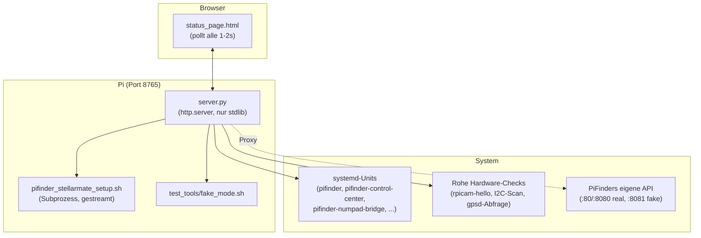

# PiFinder Stellarmate Control Center Dokumentation

*[English version](Readme_ControlCenter.md)*

> ### ✅ Getestet und verifiziert gegen
>
> * **PiFinder-Software 2.6.0** auf **StellarMate OS 2.2.1** (Arch Linux), Raspberry Pi 4 und Pi 5
> * Reines Python-**stdlib** (`http.server`) im Backend — kein Framework, keine externe
>   Web-Abhängigkeit
> * Live durchgehend getestet: Neuinstallation, Reinstall, Update, Reboot-Persistenz,
>   Fake/Real-Mode-Wechsel, alle Hardware-Toggles

Dieses Dokument beschreibt das **PiFinder Stellarmate Control Center** (`gui_installer/`) — die
lokale Webanwendung, die diese Projekts PiFinder-Integration installiert, aktualisiert, überwacht
und steuert. Es begann als dünner Wrapper um die Terminal-Ausgabe des Setup-Skripts und wuchs zur
zentralen Bedienoberfläche dieses Projekts heran. Begleitet das Haupt-[README.md](README.md), das
die Basis-PiFinder-auf-StellarMate-Installation beschreibt, die dieses Tool verwaltet, sowie
[Readme_KeyboardBridge_de.md](Readme_KeyboardBridge_de.md), dessen Umschalt-Button hier lebt.

---

## Inhaltsverzeichnis

1. [Grundfunktionalität (Überblick)](#grundfunktionalität-überblick)
2. [Designprinzipien](#designprinzipien)
3. [Architektur](#architektur)
4. [Feature-Übersicht](#feature-übersicht)
5. [Installation & bebilderte Anleitung](#installation--bebilderte-anleitung)
6. [Technische Referenz: API-Oberfläche](#technische-referenz-api-oberfläche)
7. [Persistenz & Prozessmodell](#persistenz--prozessmodell)
8. [Authentifizierung & Sicherheitsmodell](#authentifizierung--sicherheitsmodell)
9. [Bekannte Einschränkungen & Fehlerbehebung](#bekannte-einschränkungen--fehlerbehebung)
10. [Entwicklung & Testing](#entwicklung--testing)
11. [Strategische Roadmap](#strategische-roadmap)
12. [Versionskompatibilität](#versionskompatibilität)

---

## Grundfunktionalität (Überblick)

Das Control Center existiert, weil eine StellarMate-verwaltete PiFinder-Installation operative
Bedürfnisse hat, die eine reine Terminal-Session schlecht bedient: einen langen Install-Lauf vom
Handy aus verfolgen, während man am Teleskop steht; zwischen einem hardware-freien "Fake Mode" und
dem echten Dienst für die Entwicklung wechseln; prüfen, ob Kamera/IMU/GPS tatsächlich erkannt
werden, unabhängig davon, was PiFinders eigene Software glaubt; den Pi rebooten/herunterfahren, ohne
SSH.

Es läuft als kleiner, abhängigkeitsfreier Python-Webserver (`gui_installer/server.py` +
`gui_installer/status_page.html`), erreichbar unter `http://<pi-adresse>:8765`, bewusst **nur mit
stdlib** gehalten — seine Aufgabe umfasst das Bootstrappen genau der venv-/pip-Umgebung, die
PiFinder selbst braucht, es kann also von nichts abhängen, das diese Umgebung erst bereitstellen
würde.



---

## Designprinzipien

Über mehrere UI-Politur-Runden hinweg etabliert und durchgesetzt (s.
`basic-memory/pifinder-stellarmate/00017_bm-ui-design-anforderung-klar-einheitlich` für das
globale Prinzip, dem dieses Projekt-UI inzwischen folgt):

1. **Überall ein konsistentes Status-Zeilen-Muster.** Jede Statuszeile ist `<Punkt> Label: Status`,
   in genau dieser Reihenfolge, ohne Ausnahme — eine Inkonsistenz hier (eine Zeile las stattdessen
   `Status <Punkt>`) wurde speziell deshalb gemeldet und gefixt, weil sie diese Regel brach.
2. **Ampel-Semantik statt Emoji.** Vier Zustände — weiß (unbekannt/wird geprüft), grün (voll
   funktionsfähig), gelb (läuft, aber eingeschränkt, z. B. fehlende Hardware), rot (fehlgeschlagen/nicht
   laufend) — als farbiger Punkt, kein Emoji, damit dieselbe visuelle Sprache unabhängig von
   Font-/OS-Emoji-Rendering korrekt gelesen wird.
3. **Gegen echten, unabhängigen Zustand prüfen — nie "der Prozess lebt" vertrauen.**
   `pifinder.service` kann `systemctl is-active` = true melden, selbst mit einem komplett
   abgestürzten Kamera-Subprozess (eine bekannte PiFinder-Architektur-Eigenheit, s.
   [Feature-Übersicht](#hardware-checkliste)). Jeder Status-Check in diesem Tool, der für eine
   "ist das tatsächlich benutzbar"-Antwort relevant ist, prüft das echte, zugrundeliegende Signal
   (rohe Hardware-Proben, tatsächliche HTTP-Erreichbarkeit mit Antwort-Verifikation,
   settle-geprüfter Prozesszustand) statt eines einzelnen Prozess-lebt-Bits.
4. **Vor allem Destruktiven oder schwer Umkehrbaren bestätigen lassen.** Reinstall, Update, Reboot
   und Shutdown verlangen alle einen expliziten Bestätigungsdialog — und dieser Dialog wird
   *eindringlicher* (stärkere Formulierung), falls bereits ein anderer Lauf in Arbeit ist, statt
   sofort bei Klick auszulösen.
5. **Kontextbewusste statt generischer Labels.** "PiFinder läuft, ist aber nicht funktionsfähig"
   benennt immer, **welche** Hardware fehlt (Kamera, IMU, oder beide), statt eines festen,
   potenziell irreführenden generischen Labels.

---

## Architektur

Zwei logische Hälften, die sich einen HTTP-Server und eine Seite teilen:

- **Install-/Update-Orchestrierung** — führt `pifinder_stellarmate_setup.sh --action=<reinstall|update|
  cancel>` als Subprozess aus, streamt dessen stdout in einen rollierenden Puffer, den das Frontend
  pollt (`/log`, `/state`), und parst zwei Arten von Markern, die das Skript selbst in denselben
  Stream schreibt: `###PHASE### <Label>` (steuert den 10-Schritt-Fortschrittsbalken — trackt die
  *am weitesten erreichte* Phase, damit der Selbst-Neustart mitten im Lauf beim venv-Bootstrap den
  Fortschritt nicht rückwärts springen lässt) und `###REBOOT_NEEDED### true|false` (steuert den
  konditionalen Reboot-Button — nur gezeigt, wenn dieser Lauf tatsächlich `/boot/config.txt`
  angefasst hat, da nur dann ein Reboot wirklich nötig ist).
- **Live-Status/-Steuerung** — eine Familie unabhängiger, bei Bedarf ausgeführter Checks und Toggles
  (Modus-Wechsel, Hardware-Checkliste, Solve Simulation, LCD-Overlay, Numpad-Bridge,
  Power-Aktionen), jede von einer eigenen kleinen, fokussierten Funktion in `server.py` getragen.
  Keine davon hängt davon ab, dass ein Install-/Update-Lauf gerade läuft oder abgeschlossen ist —
  sie sind immer live, sobald der Server selbst läuft.

Beide Hälften werden vom selben `ThreadingHTTPServer` bedient — lang laufende Aktionen (ein
Install-Lauf, ein Modus-Wechsel, das Abwarten eines Reboots) werden immer an einen
Hintergrund-`threading.Thread` delegiert, sodass der HTTP-Server selbst nie darauf wartend blockiert;
das Frontend pollt stattdessen den Fortschritt, statt einen Request offen zu halten.

---

## Feature-Übersicht

### Setup / Install / Update

Steuert `pifinder_stellarmate_setup.sh` über dessen `--action=`-Flag statt über interaktive
Terminal-Prompts (inklusive des venv-Bootstrap-Zweipass-Selbst-Neustarts, den das Skript sonst
erwartet, dass ein Mensch davorsitzt und durchklickt). Ein 10-Schritt-Fortschrittsbalken und eine
Checkliste tracken Phasen-Marker aus dem Skript; ein Reboot-Button erscheint nur, wenn tatsächlich
nötig.

### Fake/Real-Mode-Wechsel

Eine eigene Kachel zeigt, ob PiFinder aktuell real läuft (`pifinder.service`) oder als
hardware-freie Instanz für Entwicklung/Tests (`test_tools/fake_mode.sh`, Port 8081), mit einem
Ein-Klick-Wechsel. Der Wechsel vertraut nicht allein dem Exit-Code des gestarteten Prozesses — er
**settle-prüft** den tatsächlichen Zielzustand (bis zu 8 Sekunden, sekündlich gepollt), bevor er
Erfolg meldet, da `systemctl start`/`pf_remote.py launch` beide zurückkehren, sobald der Prozess
*gestartet* wurde, nicht sobald er tatsächlich erreichbar ist.

### Hardware-Checkliste

Prüft Kamera, IMU und GPS **direkt gegen die Hardware**, unabhängig davon, was PiFinders eigene
Software glaubt:

| Check | Methode | Warum nicht einfach PiFinder fragen |
|---|---|---|
| Kamera | `rpicam-hello --list-cameras` | `pifinder.service` kann "aktiv" melden, selbst mit einem komplett abgestürzten Kamera-Subprozess — der Rest der App (Webserver, GPS, IMU) läuft trotzdem weiter, eine bekannte Upstream-Architektur-Eigenheit. |
| IMU | Roher I2C-Bus-Scan nach der BNO055-Adresse (`0x28`/`0x29`), über PiFinders eigenes venv ausgeführt (braucht `board`/`adafruit_bno055`) | Dieselbe Begründung — ein Software-Level-"IMU ok" ist kein unabhängiger Beweis, dass der Chip tatsächlich verdrahtet ist. |
| GPS | Direkte Abfrage von `gpsd`s eigenem `DEVICES`-Report über dessen natives Protokoll (Port 2947) | `gpsd` ist ein geteilter, nebenläufig-sicherer Daemon — sicher abzufragen neben PiFinders eigener Verbindung dazu, und meldet die *Anwesenheit* des Empfängers, unabhängig davon, ob bereits ein Fix erreicht wurde. |

Die Tastatur ist bewusst **nicht** in dieser Live-Checkliste enthalten (ihre Prüfung braucht
gestopptes PiFinder, da sie exklusiven GPIO-Zugriff braucht) — die Zeile verweist stattdessen auf
`test_tools/keypad_gpio_matrix_test.py` für einen manuellen Check bei gestopptem PiFinder.

### Solve Simulation

Ein direkter Toggle für PiFinders eigenes "Tools → Test Mode" (Testbilder statt Kamera-Bildern, um
Plate-Solve-UI ohne Himmelszugang zu testen) über `POST /api/debug_solve` — proxied über diesen
Server statt direkt vom Browser abgerufen (PiFinders eigene API setzt keine CORS-Header, und so
funktioniert der Toggle unabhängig davon, auf welchem Port PiFinder tatsächlich gelandet ist). Extra
gebaut, weil sich das Ansteuern über simulierte Tastendrücke (`/api/key`-Menünavigation) als
unzuverlässig erwies — Tastendrücke konnten stillschweigend verloren gehen, der Menücursor blieb
hängen.

### Hardware / Peripheriegeräte: Externes SPI-LCD & Numpad-Bridge

Zwei unabhängige Toggles für hardware-freie Dev-/Test-Peripherie:

- **Externes SPI-LCD** — aktiviert/deaktiviert das Device-Tree-Overlay eines Waveshare-3.5"-LCDs in
  `/boot/config.txt` und rebootet (Pi-Firmware-Overlays greifen nur beim Booten; es gibt keinen
  Live-Toggle-Weg). Braucht dieselben GPIO-Leitungen wie das OLED/die Tastatur eines echten HATs,
  weshalb beide nie gleichzeitig aktiv sein können. Sobald aktiv, bringt
  `pifinder-fake-mode-autostart.service` bei jedem Boot automatisch Fake Mode plus beide
  LCD-Bridges hoch.
- **Numpad-Bridge** — s. [Readme_KeyboardBridge_de.md](Readme_KeyboardBridge_de.md) für die Bridge
  selbst. Dieser Toggle steuert nur den Enabled-Zustand von `pifinder-numpad-bridge.service`
  (`systemctl enable/disable --now`).

### Power-Aktionen

Immer sichtbare Reboot-/Shutdown-Buttons (`sudo reboot`/`sudo poweroff`), jeweils mit eigenem
Bestätigungsdialog, der eindringlicher wird, falls gerade ein Install/Update oder Modus-Wechsel
läuft. Zu unterscheiden von "Close Setup", das nur diesen Webserver-eigenen Prozess stoppt (und das
als deaktivierten Zustand von `pifinder-control-center.service` persistiert, damit er beim nächsten
Boot auch nicht stillschweigend wieder anläuft).

---

## Installation & bebilderte Anleitung

Wird automatisch von `pifinder_stellarmate_setup.sh` installiert und aktuell gehalten — bei einer
normalen Installation manuell nichts zu tun. Zum direkten Starten:

```bash
bash gui_installer/launch_setup_gui.sh
```

Dann `http://<pi-adresse>:8765` im Browser öffnen — auf dem Pi selbst, oder von jedem anderen Gerät
im selben Netzwerk (keine Desktop-Session auf dem Pi nötig; der Server bindet `0.0.0.0`).

<table>
<tr>
<td align="center" width="50%">
<a href="docs/images/readme/Setup_Browser.png"></a><br>
<sub>Live-Fortschrittsbalken, Schritt-Checkliste und Terminal-Ausgabe nebeneinander während eines Install-/Update-Laufs</sub>
</td>
<td align="center" width="50%">
<a href="docs/images/readme/Setup_Ready.png"></a><br>
<sub>Lauf abgeschlossen: OLED-Spiegel plus die Quick-Links-Kachel (PiFinder-Status, INDI-Drivers-Seite, eigene Links dieser Seite, GitHub-Doku)</sub>
</td>
</tr>
</table>

<table>
<tr>
<td align="center">
<a href="docs/images/readme/Setup_via_remote_browser.png"></a><br>
<sub>Von einem anderen Gerät im Netzwerk aus geöffnet — keine Desktop-Session auf dem Pi nötig</sub>
</td>
</tr>
</table>

<table>
<tr>
<td align="center">
<a href="docs/images/pfinder_lx200/Pifinder Stellarmate Control Center.png"></a><br>
<sub>Die komplette Control-Center-Seite, so verlinkt von PiFinders eigener "INDI Drivers"-Seite.
Nahaufnahme-Screenshots der einzelnen Live-Status-Kacheln (Modus-Wechsel, Hardware-Checkliste,
Solve-Simulation-Zeile, LCD-/Numpad-Toggle-Zeilen, Power-Kachel) sind eine offene Doku-Aufgabe, s.
<a href="#strategische-roadmap">Strategische Roadmap</a>.</sub>
</td>
</tr>
</table>

---

## Technische Referenz: API-Oberfläche

Alle von `gui_installer/server.py` bedienten Routen. `Auth` = braucht HTTP-Basic-Auth gegen das
`stellarmate`-Systemkonto (s. [Authentifizierung & Sicherheitsmodell](#authentifizierung--sicherheitsmodell)).

| Methode | Pfad | Auth | Zweck |
|---|---|---|---|
| GET | `/` | ✅ | Die Seite selbst |
| GET | `/state` | — | Install-/Update-Lauf-Status (vom Frontend gepollt) |
| GET | `/log` | — | Gestreamte Install-/Update-Terminal-Ausgabe |
| POST | `/start?action=fresh\|reinstall\|update\|cancel` | ✅ | Setup-Skript-Lauf starten |
| POST | `/reboot` | ✅ | Pi rebooten |
| POST | `/shutdown` | — | Nur diesen Webserver stoppen (nicht den Pi) |
| POST | `/poweroff` | ✅ | Pi ausschalten |
| GET | `/api/pifinder_mode` | ✅ | Aktueller Fake/Real/none-Modus + Status eines laufenden Wechsels |
| POST | `/api/pifinder_mode?action=enable_fake\|disable_fake` | ✅ | Modus-Wechsel auslösen |
| GET | `/api/pifinder_mode_log?position=N` | ✅ | Inkrementelle Modus-Wechsel-Skript-Ausgabe |
| GET | `/api/hardware_status` | ✅ | Kamera-/IMU-/GPS-Anwesenheit (rohe Hardware-Checks) |
| GET | `/api/debug_solve?port=N` | ✅ | Proxy: PiFinders eigener Solve-Simulation-Zustand |
| POST | `/api/debug_solve?port=N` | ✅ | Proxy: PiFinders eigene Solve Simulation umschalten |
| GET | `/api/display_bridge` | ✅ | Ob das LCD-Overlay gerade aktiv ist |
| POST | `/api/display_bridge?action=start\|stop` | ✅ | LCD-Overlay umschalten (löst Reboot aus) |
| GET | `/api/keyboard_bridge` | ✅ | Ob der Numpad-Bridge-Dienst läuft |
| POST | `/api/keyboard_bridge?action=start\|stop` | ✅ | Numpad-Bridge umschalten |
| GET | `/pifinder.jpg`, `/avvp_logo.png`, `/heyapos_logo.png`, `/pifinder_welcome.png` | ✅ | Statische Assets |

`/state`, `/log` und `/shutdown` sind bewusst auth-frei: PiFinders eigene, nicht-authentifizierte
"INDI Drivers"-Seite pollt `/state`/`/log` per Cross-Origin, um "Setup läuft" ohne Login-Prompt zu
zeigen, und Cross-Origin-Requests tragen ohnehin nie die gecachten Basic-Auth-Credentials dieser
Seite — deshalb muss auch `/shutdown` (für den Pi selbst nicht destruktiv — stoppt nur diesen
GUI-Server) offen bleiben, damit derselbe Cross-Origin-Button funktioniert.

---

## Persistenz & Prozessmodell

| Komponente | Persistenz-Mechanismus |
|---|---|
| Control Center selbst | `pifinder-control-center.service` — `systemctl enable/disable --now`, umgeschaltet über die "Close Setup"-/Launch-Aktionen |
| Install-/Update-Läufe | Einmaliger Subprozess pro Lauf, keine Persistenz nötig (läuft entweder durch oder wird abgebrochen) |
| Fake/Real Mode | `test_tools/fake_mode.sh` verwaltet `pifinder.service` (systemd) vs. eine per `pf_remote.py` gestartete Fake-Instanz |
| Externes SPI-LCD | Overlay-Zeile in `/boot/config.txt` — übersteht Reboots per Definition (Firmware-Ebene) |
| Numpad-Bridge | `pifinder-numpad-bridge.service` — dasselbe Enable/Disable-Muster wie das Control Center selbst |

Das wiederkehrende Muster über jeden Toggle in diesem Tool hinweg: **systemds eigener
Enabled-Zustand ist die einzige Quelle der Wahrheit dafür, "sollte das nach einem Reboot an sein",**
nie eine Flag-Datei oder eine In-Memory-Variable in `server.py`. Dazu kam es nach zwei getrennten
Vorfällen, bei denen ein einfach getrackter Subprozess (`Popen`) einen Reinstall oder einen Reboot
nicht überlebte — s. `basic-memory/pifinder-stellarmate/00027` (Fake Mode überlebte unbemerkt ein
`rm -rf`, lief mit veraltetem Code weiter) und `00035` (das ursprüngliche Design der
Numpad-Bridge).

---

## Authentifizierung & Sicherheitsmodell

- Die Seite selbst und jede zustandsändernde Aktion verlangen **HTTP-Basic-Auth gegen das echte
  Passwort des `stellarmate`-Systemkontos**, verifiziert per PAM (`pam_auth.py`) — dasselbe Konto
  und derselbe Mechanismus, den auch PiFinders eigener Remote-Login prüft, es gibt also genau ein
  Passwort für beides zu merken.
- `/state`, `/log`, `/shutdown` sind absichtlich offen (s. API-Tabelle oben) — keiner der drei kann
  dem Pi selbst irgendetwas Destruktives antun.
- Der Server bindet `0.0.0.0` (von jedem Gerät im LAN erreichbar, nicht nur vom Pi) — **es gibt kein
  Rate-Limiting oder Lockout bei fehlgeschlagenen Auth-Versuchen**, daher sollte dies nie über ein
  vertrauenswürdiges Heim-/Observatoriums-Netzwerk hinaus exponiert werden. Im eigenen
  Top-Level-Kommentar des Servers dokumentiert und hier bewusst wiederholt.
- CORS (`Access-Control-Allow-Origin: *`) ist nur auf den auth-freien JSON-Routen gesetzt, speziell
  damit PiFinders eigene "INDI Drivers"-Seite (ein anderer Origin/Port) sie per `fetch()` lesen kann
  — CORS auf die authentifizierten Routen auszuweiten würde den Zweck der Auth-Pflicht selbst
  untergraben.

---

## Bekannte Einschränkungen & Fehlerbehebung

- **Keine Kamera/IMU auf Pi 5 mit bestimmten UPS-Shields**: unabhängig von diesem Tool selbst, zeigt
  sich aber über dessen Hardware-Checkliste — s. `basic-memory/pifinder-stellarmate/00000` für den
  dokumentierten Geekworm-X1203/GPIO-16-Konflikt, den die Checkliste korrekt als
  Tastatur-Hardware-betroffen meldet (nicht Kamera/IMU/GPS, die diese Checkliste abdeckt).
- **Ein abgestürzter Kamera-Subprozess kann `pifinder.service` weiterhin "aktiv" melden lassen.**
  Genau deshalb existiert die Hardware-Checkliste und prüft rohe Hardware, statt `systemctl
  is-active` zu vertrauen — s. [Designprinzipien](#designprinzipien) Punkt 3.
- **Die gecachte JS/HTML der Seite kann über ein Update hinweg veraltet sein**, falls ein
  Browser-Tab während eines das Control Center selbst aktualisierenden Laufs offen blieb —
  `Cache-Control: no-store, must-revalidate` ist speziell dafür gesetzt, dies zu minimieren, aber
  ein harter Reload nach jedem Update bleibt der sicherste erste Fehlerbehebungsschritt, falls ein
  Button auf eine nicht mehr existierende Route zu verweisen scheint.
- **Overlay-Änderungen in `/boot/config.txt` brauchen einen Reboot** — es gibt keinen
  Live-Toggle-Weg für Pi-Firmware-Overlays; der Reboot des LCD-Toggles ist nicht optional, kein Bug.

---

## Entwicklung & Testing

- `test_tools/fake_mode.sh start`/`stop` kann direkt ausgeführt werden, unabhängig von der eigenen
  Kachel des Control Centers, für Skripting/Automatisierung.
- Der `pifinder-remote`-Claude-Code-Skill (`pf_remote.py`,
  `.claude/skills/pifinder-remote/`) ist das, was `fake_mode.sh` unter der Haube nutzt, um eine
  Fake-Hardware-Instanz zu starten — s. `basic-memory/pifinder-stellarmate/00020` für das Design
  dieses Skills selbst.
- Für `gui_installer/` existiert bisher keine automatisierte Testsuite (s. Strategische Roadmap) —
  jede bisherige Verifikation war live, manuell, Ende-zu-Ende gegen echte
  Installs/Reinstalls/Reboots.

---

## Strategische Roadmap

Priorisiert nach dem GitHub-Projects-Schema aus `basic-memory/pifinder-stellarmate/00001`s
TODO-Tabelle ([[bm-github-project-schema-todo-format]] für die Schema-Konvention selbst).
Aufwand-/Abhängigkeitshinweise inklusive, da mehrere davon aufeinander aufbauen:

| Priorität | Größe | Punkt | Abhängig von |
|---|---|---|---|
| P2 | XS | Nahaufnahme-Screenshots der neueren Live-Status-Kacheln (Modus-Wechsel, Hardware-Checkliste, Solve-Simulation-Zeile, LCD-/Numpad-Toggle-Zeilen, Power-Kachel) für dieses Dokument und das Haupt-README | Keine — reine Doku-Aufgabe |
| P2 | L | Geführter, GUI-gesteuerter Test-Workflow (User-Wunsch, 2026-07-16): Test Mode aktivieren, Web Manager konfigurieren, Ekos-Einstellungen prüfen, alles von einem Screen aus | Profitiert davon, dass die zweite Control-Center-Seite unten bereits existiert, um das aktuelle Einzelseiten-Layout nicht zu überladen |
| P2 | M | Zweite, entkoppelte Control-Center-Seite für PiFinder-Modus-Details und mehrere Test-Runner-Buttons (Keypad-GPIO-Test, Fake-LX200-Simulator) — erste Seite bleibt auf Setup/Update/Install fokussiert | Keine, aber der geführte Test-Workflow oben würde darauf aufbauen |
| P2 | L | Dauerhaft laufender, passwortgeschützter Admin-Webserver statt des On-Demand-Setup-GUI-Server-Modells — würde auch das Reboot-Verbindungsverlust-Problem strukturell lösen und könnte `smos-post-update.sh`-Aktionen, ein IgnorePkg-Pin-Status-Dashboard und INDI-Treiber-Rebuilds als Buttons anbieten | Keine — unabhängige, größere Architektur-Änderung; s. `basic-memory/pifinder-stellarmate/00015` für das ursprüngliche Brainstorming |
| P3 (noch nicht getrackt) | M | Automatisierte Testabdeckung für `server.py`s Request-Handler (aktuell null — jede Verifikation war manuell/live) | Keine |

Aktuell sind keine offenen Bugs zum Control Center selbst getrackt (seine jüngsten Regressionen —
das Session-Bus-/`stellarmatewebmanager`-Restart-Problem, die Punkt-Reihenfolge-UI-Inkonsistenz —
sind beide behoben, s. `basic-memory/pifinder-stellarmate/00033`).

---

## Versionskompatibilität

| PiFinder | SMOS | Pi 4 | Pi 5 |
|---|---|---|---|
| 2.6.0 | 2.2.1 | ✅ vollständig getestet | ✅ vollständig getestet |
| 2.5.1 | 2.1.1 | ✅ getestet | — |

Das Control Center selbst hat keine PiFinder-versionsspezifischen Codepfade — es spricht PiFinder
nur über dessen stabile `/api/*`-Remote-API an und das System nur über `systemctl`/rohe
Hardware-Proben, beides unabhängig von der installierten PiFinder-Version.

## Siehe auch

- [Readme_KeyboardBridge_de.md](Readme_KeyboardBridge_de.md) — die Numpad-als-Tastatur-Bridge, die
  der "Turn Numpad On/Off"-Button dieses Tools steuert.
- [Readme_PiFinder_LX200_de.md](Readme_PiFinder_LX200_de.md) — die INDI-Integrationsschicht, deren
  "INDI Drivers"-Seite zurück auf dieses Control Center verlinkt.
- [README.md](README.md) — Basis-PiFinder-auf-StellarMate-Installation.
- `basic-memory/pifinder-stellarmate/00017` (globales UI-Designprinzip), `00021`
  (Mode-Switch-State-Machine-Design), `00030`/`00033`/`00035` (Iterationen des Persistenz-Modells).
