# PiFinder Stellarmate Control Center Dokumentation

*[English version](Readme_ControlCenter.md)*

> ### ✅ Getestet und verifiziert gegen
>
> * Reines Python-**stdlib** (`http.server`) im Backend — kein Framework, keine externe
>   Web-Abhängigkeit
> * Live durchgehend getestet: Neuinstallation, Reinstall, Update, Reboot-Persistenz,
>   Fake/Real-Mode-Wechsel, alle Hardware-Toggles
> * Kein PiFinder-versionsspezifischer Code — spricht PiFinder nur über dessen stabile
>   `/api/*`-Remote-API an. Für die getesteten PiFinder- / StellarMate-OS- / Pi-Kombinationen s. die
>   [Versionskompatibilitäts-Tabelle in README.md](README.md#version-compatibility).

Dieses Dokument beschreibt das **PiFinder Stellarmate Control Center** (`gui_installer/`) — die
lokale Webanwendung, die diese Projekts PiFinder-Integration installiert, aktualisiert, überwacht
und steuert, und die zentrale Bedienoberfläche einer StellarMate-verwalteten Installation. Begleitet
das Haupt-[README.md](README.md) (Basis-Installation) und
[Readme_KeyboardBridge_de.md](Readme_KeyboardBridge_de.md) (dessen Umschalt-Button hier lebt).

---

## Inhaltsverzeichnis

1. [Grundfunktionalität (Überblick)](#grundfunktionalität-überblick)
2. [Designprinzipien](#designprinzipien)
3. [Status-Badges & Farben](#status-badges--farben)
4. [Architektur](#architektur)
5. [Feature-Übersicht](#feature-übersicht)
6. [Installation & bebilderte Anleitung](#installation--bebilderte-anleitung)
7. [Mount Bridge & Sync-Workflows](#mount-bridge--sync-workflows)
8. [Technische Referenz: API-Oberfläche](#technische-referenz-api-oberfläche)
9. [Persistenz & Prozessmodell](#persistenz--prozessmodell)
10. [Authentifizierung & Sicherheitsmodell](#authentifizierung--sicherheitsmodell)
11. [Bekannte Einschränkungen & Fehlerbehebung](#bekannte-einschränkungen--fehlerbehebung)
12. [Entwicklung & Testing](#entwicklung--testing)
13. [Roadmap](#roadmap)
14. [Versionskompatibilität](#versionskompatibilität)

---

## Grundfunktionalität (Überblick)

Das Control Center existiert, weil eine StellarMate-verwaltete PiFinder-Installation operative
Bedürfnisse hat, die eine reine Terminal-Session schlecht bedient: einen langen Install-Lauf vom
Handy aus verfolgen, während man am Teleskop steht; zwischen einem hardware-freien "Fake Mode" und
dem echten Dienst für die Entwicklung wechseln; prüfen, ob Kamera/IMU/GPS tatsächlich erkannt
werden, unabhängig davon, was PiFinders eigene Software glaubt; den Pi rebooten/herunterfahren, ohne
SSH.

Es läuft als kleiner, abhängigkeitsfreier Python-Webserver (`gui_installer/server.py` +
`gui_installer/status_page.html`), erreichbar unter `http://<pi-adresse>:8765`, bewusst **nur mit
stdlib** gehalten — seine Aufgabe umfasst das Bootstrappen genau der venv-/pip-Umgebung, die
PiFinder selbst braucht, es kann also von nichts abhängen, das diese Umgebung erst bereitstellen
würde.

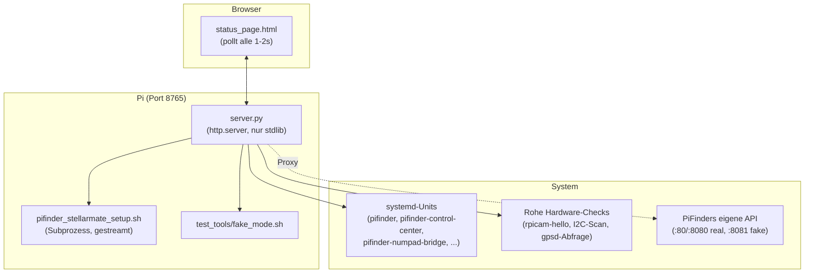
```mermaid
flowchart TB
    subgraph Browser
        UI["status_page.html<br/>(pollt alle 1-2s)"]
    end
    subgraph "Pi (Port 8765)"
        Server["server.py<br/>(http.server, nur stdlib)"]
        Setup["pifinder_stellarmate_setup.sh<br/>(Subprozess, gestreamt)"]
        FakeMode["test_tools/fake_mode.sh"]
    end
    subgraph "System"
        Systemd["systemd-Units<br/>(pifinder, pifinder-control-center,<br/>pifinder-numpad-bridge, ...)"]
        HW["Rohe Hardware-Checks<br/>(rpicam-hello, I2C-Scan, gpsd-Abfrage)"]
        PF["PiFinders eigene API<br/>(:80/:8080 real, :8081 fake)"]
    end
    UI <--> Server
    Server --> Setup
    Server --> FakeMode
    Server --> Systemd
    Server --> HW
    Server -.Proxy.-> PF
```

---

## Designprinzipien

1. **Überall ein Status-Zeilen-Muster.** Jede Statuszeile ist `<Punkt> Label: Status`, in dieser
   Reihenfolge.
2. **Ampel-Farben, kein Emoji.** Vier Zustände (weiß / grün / gelb / rot) als farbiger Punkt, damit
   die Sprache unabhängig von Font oder OS-Emoji-Rendering gleich gelesen wird.
3. **Echten Zustand prüfen, nie "der Prozess lebt".** `pifinder.service` kann `systemctl is-active`
   = true sein, während der Kamera-Subprozess abgestürzt ist. Jeder Check, der "ist das benutzbar"
   beantwortet, liest das zugrundeliegende Signal — eine Hardware-Probe, eine verifizierte
   HTTP-Antwort, einen settle-geprüften Prozesszustand.
4. **Alles Destruktive oder schwer Umkehrbare bestätigen.** Reinstall, Update, Reboot und Shutdown
   fragen jeweils vorher; der Dialog ist stärker formuliert, wenn schon ein Lauf in Arbeit ist.
5. **Kontextbewusste Labels.** "PiFinder läuft, ist aber nicht funktionsfähig" benennt, **welche**
   Hardware fehlt (Kamera, IMU, oder beide).

---

## Status-Badges & Farben

### Die Farbsprache

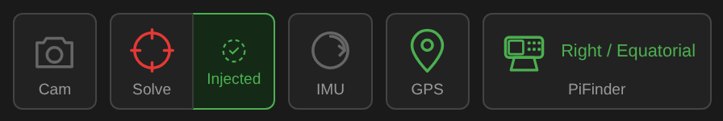

Jede Anzeige auf der Seite — die Badges oben, die Punkte auf Statuszeilen, das
Mount-Bridge-Diagramm — nutzt dieselben vier Zustände:

| | Bedeutung |
|---|---|
| ⚪ **weiß / neutral** | Unbekannt — noch nicht geprüft, oder nicht erreichbar. Pulsiert, während eine Prüfung läuft. |
| 🟢 **grün** | Bestätigt funktioniert. |
| 🟡 **gelb** | Läuft, aber eingeschränkt — fehlende Hardware, kein GPS-Fix, ein Wert über seinem Schwellwert. |
| 🔴 **rot** | Fehlgeschlagen, läuft nicht, oder ein Wert außerhalb des sicheren Bereichs. |

Jede Farbe kommt aus einer echten Prüfung (einer Hardware-Probe, einer verifizierten HTTP-Antwort,
einem settle-geprüften Prozesszustand), nicht aus "der Prozess lebt". `Cam` / `Solve` / `IMU` /
`GPS` stimmen immer mit ihrer Zeile in **Hardware test and details** überein
([Feature-Übersicht → Hardware-Checkliste](#hardware-checkliste)).

### Cam


Wird eine Kamera erkannt und ist sie nutzbar? `rpicam-hello --list-cameras`, durch PiFinders venv.

| | Status | Zeigt |
|---|---|---|
| ⚪ | `checking…` / `unknown (…)` | In dieser Sitzung noch nicht getestet, oder das Prüf-Tool ist nicht auf diesem Host (kein `rpicam-hello` auf x86). |
| 🟢 | `functional` | Eine echte Aufnahme war erfolgreich. |
| 🔴 | `not detected` / `error (…)` | Keine Kamera, oder Aufnahme/Treiber schlug fehl. Ein abgestürzter Kamera-Subprozess zeigt sich hier, selbst wenn `pifinder.service` "aktiv" meldet. |

### Solve

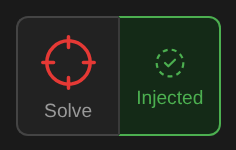

Produziert PiFinders Plate-Solver gerade eine Position? Aus PiFinders `solve_source`.

| | Status | Zeigt |
|---|---|---|
| ⚪ | `unknown` | Keine Daten von PiFinder. |
| 🟢 | `solving` | Die Kamera solvt erfolgreich. Ohne Altersgrenze — getrennt von Mount Bridges eigenem 5-s-Freshness-Gate. |
| 🟡 | `estimating from IMU` | Kein aktueller Kamera-Solve; Position wird per IMU-Dead-Reckoning geschätzt. Pulsiert. |
| 🔴 | `no star match` | Letzter Versuch fand keine Sterne — normal drinnen / ohne Himmel, kein Fehler. |
| 🔴 | `not real – see Injected Solve` | Ein Injected Solve ist aktiv; die Position ist kein echter Plate-Solve. |

### Injected

Erscheint an `Solve`s rechtem Rand **nur solange ein [Injected Solve](#synthetic-solve-vs-manueller-einmal-seed)
aktiv ist** (Synthetic Solve, Re-seed from mount, Set position oder Sync). Seine Anwesenheit ist das
Signal — keine Farbskala. Wann immer er sichtbar ist, ist `Solve` rot.

### IMU

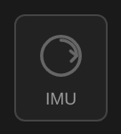

Ist der BNO055-Orientierungssensor verdrahtet? Roher I²C-Bus-Scan nach seiner Adresse, durch
PiFinders venv.

| | Status | Zeigt |
|---|---|---|
| ⚪ | `checking…` / `unknown (…)` | In dieser Sitzung noch nicht getestet, oder das Prüf-Tool ist nicht auf diesem Host. |
| 🟢 | `functional` | Der Chip hat auf dem I²C-Bus geantwortet. |
| 🔴 | `not detected` / `error (…)` | Nichts an der BNO055-Adresse, oder der Read schlug fehl. |

### GPS


PiFinders eigener GPS-Status, von PiFinder abgefragt.

| | Status | Zeigt |
|---|---|---|
| ⚪ | `not reachable` | PiFinder antwortet nicht — Real- oder Fake-Mode muss laufen. |
| 🟢 | `locked` | Ein Fix liegt vor (Detailzeile: Lat/Lon, Zeitzone, letzter Fix, Quelle). |
| 🟡 | `no fix yet` | Empfänger da und erreichbar, noch kein Fix. |

### PiFinder (Mount Type)

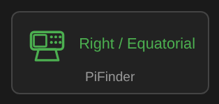

PiFinders eigene **Mount-Type-** + **PiFinder-Type-**Einstellungen (beide fließen ins
Dead-Reckoning). Sichtbar, wann immer PiFinder erreichbar ist. Der Wert (`Right / Equatorial`, …)
wird immer gezeigt; die Farbe ist Mount Bridges Urteil:

| | Zustand | Zeigt |
|---|---|---|
| ⚪ | neutral | PiFinder erreichbar, aber keine verbundene INDI-Montierung zum Abgleichen. |
| 🟢 | grün | Mount Type passt zur verbundenen Montierung. Färbt dieses Badge und die Typ-Zeile des Mount-Icons im Diagramm gemeinsam. |
| 🔴 | rot | Mount Type ≠ verbundene Montierung — Dead-Reckoning wäre falsch. (PiFinder Type ist nicht automatisch prüfbar; selbst gegen dein Setup abgleichen.) |

### Mount-Bridge-Diagramm


`PiFinder ↔ Bridge ↔ Mount`, direkt unter der Badge-Zeile. Nur vorhanden, wenn eine Mount Bridge im
Profil ist.

**Geräte-Nodes** (`PiFinder`, `Bridge`, `Mount`) — jedes Node-Icon zeigt die INDI-`CONNECTION`
dieses Geräts: ⚪ nicht verknüpft / unbekannt · 🟢 verbunden · 🔴 geladen, aber getrennt. Die
gepunkteten Pfeile zeigen, was die Bridge tut (lesen, korrigieren, ein GoTo weiterleiten).

### Drift

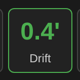

Winkelabstand zwischen PiFinders solvter Position und der von der Montierung gemeldeten Position,
in Bogenminuten (`1° 5'` jenseits von 60'). Ausgeblendet, wenn kein Coupling-Modus überwacht oder
die Bridge nicht verbunden ist. Friert unter dem Horizont auf seinem letzten Wert ein.

| | Zustand | Bedeutung |
|---|---|---|
| 🟢 | ≤ Threshold | Innerhalb deines Drift-Thresholds (Standard 5′). |
| 🟡 | > Threshold | Über dem Threshold — Verify/Alert warnt, Auto-correct greift ein. |
| 🔴 | ≥ 30′ (≈ 0,5°) | Über einer generischen "außerhalb des Okular-Gesichtsfelds"-Grenze (Vollmonddurchmesser, nicht deine tatsächliche Optik). |

### Höhe (Alt)

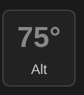

Die eigene Höhe der Montierung, bei jedem Treiber-Tick aus ihrer gemeldeten Position neu berechnet.
Ausgeblendet, bis die Montierung eine Position meldet.

| | Zustand | Bedeutung |
|---|---|---|
| ⚪ | neutral | Über dem Horizont-Sicherheitsabstand. |
| 🔴 | rot | Am oder unter dem Horizont — die Montierung verweigert dort Sync und GoTo; eine Recovery-Karte erscheint (**Sync mount from PiFinder** / **Goto Home Position**). |

### Statuszeilen-Punkte

Die `<Punkt> Label: Status`-Zeilen nutzen dieselben vier Farben: `PiFinder is running` (🟢) / `not
detected` (🔴); `Normal (NN% CPU)` (🟢) / ausgelasteter Pi (🟡–🔴); die INDI-Mount-Bridge-Zeile
(🟢 verbunden / ⚪ `(unconfirmed)`, während eine Prüfung kurz aussetzt). Die Coupling-Statuszeile
unter dem Diagramm ist ⚪ nicht gekoppelt / 🟢 überwacht oder hält / 🟡–🔴 Drift über Threshold, mit
`Details`-Aufklapper.

---

## Architektur

Zwei logische Hälften, die sich einen HTTP-Server und eine Seite teilen:

- **Install-/Update-Orchestrierung** — führt `pifinder_stellarmate_setup.sh --action=<reinstall|update|
  cancel>` als Subprozess aus, streamt dessen stdout in einen rollierenden Puffer, den das Frontend
  pollt (`/log`, `/state`), und parst zwei Arten von Markern, die das Skript selbst in denselben
  Stream schreibt: `###PHASE### <Label>` (steuert den 10-Schritt-Fortschrittsbalken — trackt die
  *am weitesten erreichte* Phase, damit der Selbst-Neustart mitten im Lauf beim venv-Bootstrap den
  Fortschritt nicht rückwärts springen lässt) und `###REBOOT_NEEDED### true|false` (steuert den
  konditionalen Reboot-Button — nur gezeigt, wenn dieser Lauf tatsächlich `/boot/config.txt`
  angefasst hat, da nur dann ein Reboot wirklich nötig ist).
- **Live-Status/-Steuerung** — eine Familie unabhängiger, bei Bedarf ausgeführter Checks und Toggles
  (Modus-Wechsel, Hardware-Checkliste, Solve Simulation, LCD-Overlay, Numpad-Bridge,
  Power-Aktionen), jede von einer eigenen kleinen, fokussierten Funktion in `server.py` getragen.
  Keine davon hängt davon ab, dass ein Install-/Update-Lauf gerade läuft oder abgeschlossen ist —
  sie sind immer live, sobald der Server selbst läuft.

Beide Hälften werden vom selben `ThreadingHTTPServer` bedient — lang laufende Aktionen (ein
Install-Lauf, ein Modus-Wechsel, das Abwarten eines Reboots) werden immer an einen
Hintergrund-`threading.Thread` delegiert, sodass der HTTP-Server selbst nie darauf wartend blockiert;
das Frontend pollt stattdessen den Fortschritt, statt einen Request offen zu halten.

---

## Feature-Übersicht

### Setup / Install / Update

Führt `pifinder_stellarmate_setup.sh` über dessen `--action=`-Flag aus — keine Terminal-Prompts,
der venv-Bootstrap-Selbst-Neustart wird automatisch behandelt. Ein 10-Schritt-Fortschrittsbalken +
Checkliste tracken die Phasen-Marker des Skripts; der Reboot-Button erscheint nur, wenn sich
`/boot/config.txt` geändert hat.

### Reset / Uninstall

Zwei destruktive Aktionen, nach Wirkungsbereich gruppiert. Beide fragen vorher; dieselben
Erklärungen stehen in [help.html](gui_installer/help.html).

- **Reset** (in der **PiFinder**-Gruppe) — stoppt `pifinder.service` / `pifinder_splash.service` /
  `pifinder-setup.service`, dann wird nur `~/PiFinder`s Python-venv und Build-Zustand gelöscht
  (`POST /reset`, gestreamt über `GET /api/reset_log`). Dienste, INDI-Treiber und udev-Regeln
  bleiben installiert.
- **Uninstall** (in der **PiFinder Stellarmate**-Gruppe) — stoppt, deaktiviert und entfernt jeden
  systemd-Unit dieses Projekts, entfernt die INDI-Treiber und löscht `~/PiFinder` **und diesen
  `~/PiFinder_Stellarmate`-Checkout** (`POST /uninstall`, gestreamt über `GET /api/uninstall_log`).
  Läuft `bin/uninstall_pifinder_stellarmate.sh --selfmove` (kopiert sich nach `/tmp`, um den eigenen
  Quellbaum löschen zu können).

### Fake / Real-Mode-Wechsel

Zeigt, ob PiFinder real läuft (`pifinder.service`) oder als hardware-freie Instanz
(`test_tools/fake_mode.sh`, Port 8081), mit Ein-Klick-Wechsel. **Settle-geprüft**: pollt den
Zielzustand bis zu 8 s, bevor Erfolg gemeldet wird, da `systemctl start` / `pf_remote.py launch`
zurückkehren, sobald der Prozess gestartet ist, nicht sobald er erreichbar ist.

### Hardware-Checkliste

Prüft Kamera, IMU und GPS **direkt gegen die Hardware**, nicht gegen PiFinders Software-Zustand
(`pifinder.service` kann "aktiv" sein mit abgestürztem Kamera-Subprozess):

| Check | Methode |
|---|---|
| Kamera | `rpicam-hello --list-cameras` |
| IMU | Roher I²C-Bus-Scan nach der BNO055-Adresse (`0x28`/`0x29`), über PiFinders venv |
| GPS | `gpsd`s eigener `DEVICES`-Report über dessen natives Protokoll (Port 2947) — meldet die *Anwesenheit* des Empfängers, getrennt davon, ob ein Fix erreicht ist |

Die Tastatur ist nicht in der Live-Checkliste (sie braucht gestopptes PiFinder für exklusiven
GPIO-Zugriff) — die Zeile verweist stattdessen auf `test_tools/keypad_gpio_matrix_test.py`.

### Solve Simulation

Schaltet PiFinders eigenes **Tools → Test Mode** um (Testbilder für die Kamera) über `POST
/api/debug_solve`, proxied über diesen Server (PiFinders API setzt keine CORS-Header, und so
funktioniert der Toggle unabhängig vom Port, auf dem PiFinder gelandet ist).

### Hardware / Peripheriegeräte: Externes SPI-LCD & Numpad-Bridge

- **Externes SPI-LCD** — schaltet das Device-Tree-Overlay eines Waveshare-3.5"-LCDs in
  `/boot/config.txt` um und rebootet (Firmware-Overlays greifen nur beim Booten). Nutzt dieselben
  GPIO-Leitungen wie OLED/Tastatur eines echten HATs, beide können also nicht gleichzeitig aktiv
  sein. Sobald an, bringt `pifinder-fake-mode-autostart.service` bei jedem Boot Fake Mode + beide
  LCD-Bridges hoch.
- **Numpad-Bridge** — steuert den Enabled-Zustand von `pifinder-numpad-bridge.service` (`systemctl
  enable/disable --now`). S. [Readme_KeyboardBridge_de.md](Readme_KeyboardBridge_de.md).

### Power-Aktionen

Reboot / Shutdown (`sudo reboot` / `sudo poweroff`), jeweils mit Bestätigungsdialog. Getrennt von
**Close Setup**, das nur diesen Webserver stoppt und `pifinder-control-center.service` als
deaktiviert persistiert, damit er beim Boot nicht wieder anläuft.

---

## Installation & bebilderte Anleitung

Wird automatisch von `pifinder_stellarmate_setup.sh` installiert und aktuell gehalten — bei einer
normalen Installation manuell nichts zu tun. Zum direkten Starten:

```bash
bash gui_installer/launch_setup_gui.sh
```

Dann `http://<pi-adresse>:8765` im Browser öffnen — auf dem Pi selbst, oder von jedem anderen Gerät
im selben Netzwerk (keine Desktop-Session auf dem Pi nötig; der Server bindet `0.0.0.0`). Jeder
Benutzername funktioniert; das Passwort ist das des `stellarmate`-Systemkontos (s.
[Authentifizierung & Sicherheitsmodell](#authentifizierung--sicherheitsmodell)).

### Die Seite auf einen Blick

<table>
<tr>
<td align="center">
<a href="docs/images/readme/cc_full_page.png">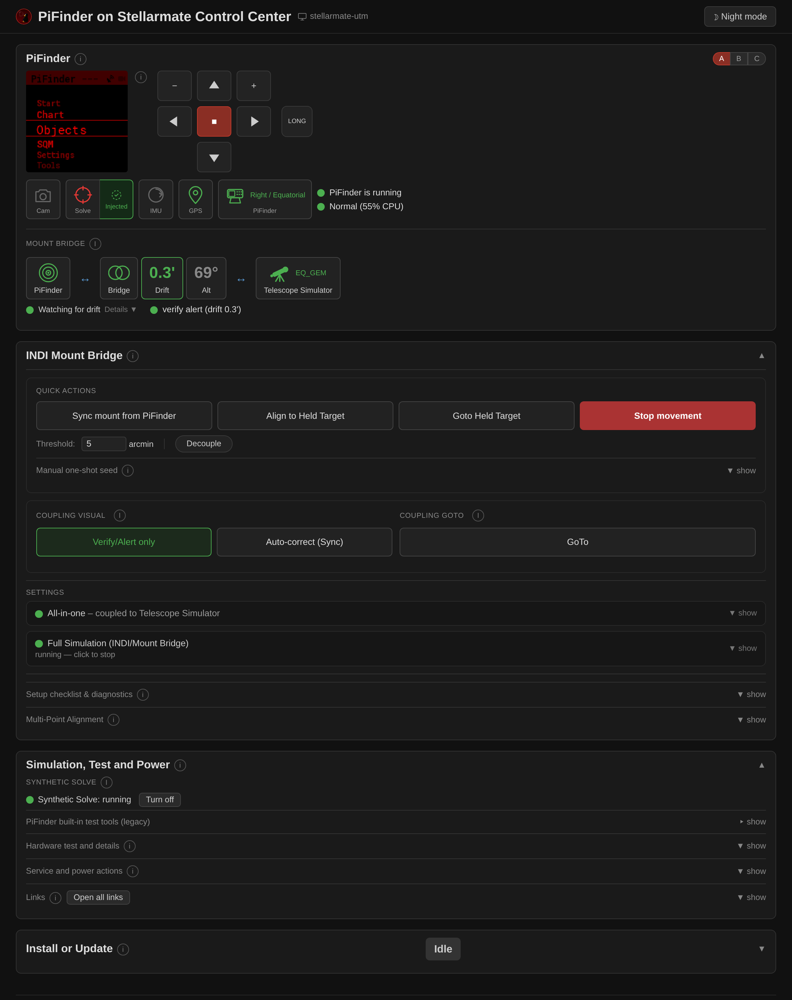</a><br>
<sub>Die ganze Seite (hier im Full-Simulation-Modus). Von oben nach unten: die <strong>PiFinder</strong>-Kachel (OLED-Spiegel, Quick Keys, die Cam/Solve/IMU/GPS-Badge-Zeile und direkt darunter das Mount-Bridge-Verbindungsdiagramm), die <strong>INDI Mount Bridge</strong>-Kachel, <strong>Simulation, Test and Power</strong> und ganz unten <strong>Install or Update</strong>. Jede Kachelüberschrift klappt ein; der Zustand wird pro Browser gemerkt.</sub>
</td>
</tr>
</table>

Die drei Status-Kacheln sind an anderer Stelle beschrieben — die PiFinder-Badge-Zeile und das
Mount-Bridge-Diagramm in [Mount Bridge & Sync-Workflows](#mount-bridge--sync-workflows), die
Hardware-Checkliste und die Mode-Schalter in [Feature-Übersicht](#feature-übersicht). Der Rest
dieses Abschnitts ist die eine Kachel, die dort nicht vorkommt: **Install or Update**.

### Installieren oder aktualisieren

<table>
<tr>
<td align="center">
<a href="docs/images/readme/cc_install_idle.png">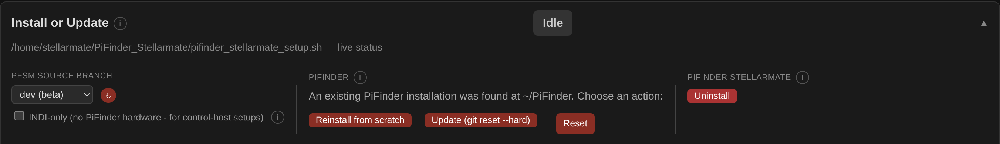</a><br>
<sub>Die Kachel im Ruhezustand, wenn bereits eine Installation existiert. <strong>PFSM Source Branch</strong> wählt, welchen Branch <em>der projekteigenen Skripte</em> ein Lauf benutzt (nicht PiFinder selbst); das ↻ prüft neu, was tatsächlich auf der Platte liegt. Die drei PiFinder-Aktionen und ein separates <strong>Uninstall</strong>.</sub>
</td>
</tr>
</table>

- **Reinstall from scratch** — löscht `~/PiFinder` komplett, klont den offiziellen `release`-Branch
  auf der gepinnten Version frisch, dann werden alle StellarMate-Patches neu angewendet.
  Bestätigungsdialog: *Reinstall from scratch? This permanently deletes the existing ~/PiFinder
  directory and everything in it.*
- **Update** — `git reset --hard` + `pull` auf dem vorhandenen `~/PiFinder` auf die gepinnte
  Version, danach die Patches erneut; das Verzeichnis bleibt. Bestätigungsdialog: *Update? This runs
  `git reset --hard` on ~/PiFinder, discarding any local changes there.*
- **Reset** — stoppt die PiFinder-Services und löscht nur `~/PiFinder`s Python-venv und
  Build-Zustand; Services, INDI-Treiber, udev-Regeln, Daten und Konfiguration bleiben unangetastet.
  Für einen sauberen Ausgangspunkt vor einem erneuten Lauf, ohne sonst etwas zu verlieren.
- **Uninstall** — in einer eigenen Gruppe, weil es viel mehr betrifft: entfernt jede systemd-Unit,
  die INDI-Treiber, `~/PiFinder` **und diesen `~/PiFinder_Stellarmate`-Checkout selbst** (das
  Control Center hört auf zu funktionieren, sobald es startet). Siehe
  [Reset / Uninstall](#reset--uninstall) und [help.html#uninstall](gui_installer/help.html).

Reinstall, Update, Reboot und Shutdown fragen alle vorher nach — und der Dialog wird *eindringlicher*,
falls bereits ein Lauf in Arbeit ist, statt sofort auszulösen.

<table>
<tr>
<td align="center">
<a href="docs/images/readme/cc_install_running.png">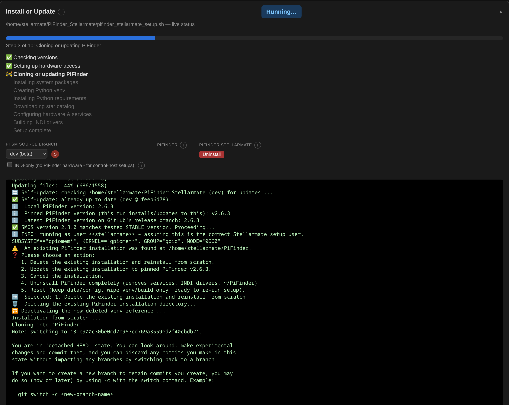</a><br>
<sub>Ein laufender Vorgang: eine 10-Schritt-Fortschrittsleiste, eine Phasen-Checkliste (grüner Haken = fertig, gestreift = aktuell) und die Live-Terminal-Ausgabe des Setup-Skripts direkt in der Kachel.</sub>
</td>
</tr>
</table>

Die Fortschrittsleiste verfolgt die *am weitesten* erreichte Phase, damit der venv-Bootstrap-
Selbst-Neustart mitten im Lauf den Fortschritt nicht rückwärts springen lässt. Ein **Reboot
Now**-Button erscheint **nur**, wenn dieser Lauf tatsächlich `/boot/config.txt` geändert hat (der
einzige Fall, der einen braucht). Wenn der Lauf endet, startet sich das Control Center einmal selbst
neu, um neuen Code zu laden, und kehrt dann in den obigen Ruhezustand zurück; die vollständige
Zusammenfassung — Versionen, Zeiten, etwaige Warnungen — steht in
`~/PiFinder_Stellarmate/.gui_setup.log`.

Auf einem anderen Gerät: `INDI-only` (Checkbox) installiert nur die INDI-Build-Abhängigkeiten und
beide INDI-Treiber — kein Clone, kein venv, kein Katalog — für einen separaten Control-Host, der
über das Netz an einen PiFinder gekoppelt ist (s. [help.html#indi-only-mode](gui_installer/help.html)).

### Als Nächstes: Equipment-Profil anlegen (zwingend erforderlich)

> **⚠️ Eine fertige Installation allein macht PiFinder noch nicht über INDI/KStars/SkySafari
> nutzbar.** Die gerade gebauten INDI-Treiber (`PiFinder LX200`, optional `PiFinder Mount Bridge`)
> existieren nur im eigenen Treiber-Katalog des StellarMate Web Managers — sie tauchen nirgends in
> Ekos auf, und es gibt kein Profil dafür, bis eines selbst angelegt wird. Diesen Schritt zu
> überspringen ist der mit Abstand häufigste Grund, warum die Mount-Bridge-Kachel unten, SkySafari
> oder Ekos' Geräteliste nach einer sonst erfolgreichen Installation leer bleiben.

Das einmal direkt im Web Manager erledigen (`http://<pi-adresse>:8624`, nicht über KStars) —
vollständige bebilderte Anleitung:
[Readme_PiFinder_LX200_de.md — Schritt 2: Equipment-Profil im Web-Manager anlegen](Readme_PiFinder_LX200_de.md#schritt-2-equipment-profil-im-web-manager-anlegen).

---

## Mount Bridge & Sync-Workflows

Der **INDI-Mount-Bridge**-Bereich des Control Center koppelt PiFinders eigene, plate-solvte
Himmelsposition an eine Teleskopmontierung — über den `PiFinder Mount Bridge`-INDI-Treiber, sodass
der Alltags-Workflow "steht meine Montierung noch da, wo PiFinder sie vermutet, und wenn nicht, wie
korrigiere ich das" nicht das separate INDI-Kontrollfeld braucht. Der Treiber, die Coupling-Modi und
die Split-Host-Varianten sind vollständig in
[Readme_PiFinder_LX200_de.md](Readme_PiFinder_LX200_de.md) beschrieben; dieser Abschnitt ist eine
bebilderte Anleitung für die Control-Center-Oberfläche dazu — die Kacheln lesen, plus die
**Sync-basierten** Wiederherstellungs-Abläufe des täglichen Gebrauchs.

> **Alle Screenshots unten stammen aus dem Full-Simulation-Modus** (ein simulierter PiFinder plus
> eine simulierte Montierung — INDIs eigener `Telescope Simulator`, dargestellt als Montierungstyp
> `EQ_GEM`), keine echte Hardware. Layout, Badges und Buttons sind auf einem realen Setup identisch;
> nur der Gerätename und die Zahlen unterscheiden sich. Koordinaten-GoTos sind in diesem
> Simulations-Setup nicht sinnvoll, deshalb bleiben die Abläufe Sync-basiert — die einzige Ausnahme
> ist **Goto Home Position**, ein natives OnStep-Referenzpositions-Kommando, kein Koordinaten-GoTo.

### Die Kacheln lesen

<table>
<tr>
<td align="center">
<a href="docs/images/readme/cc_mount_bridge_baseline.png">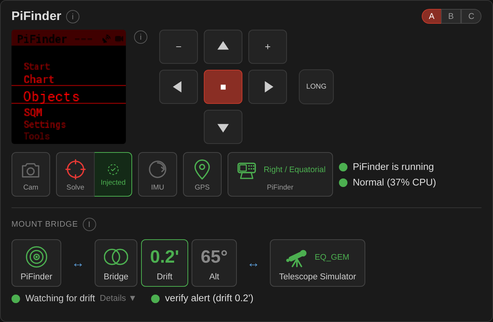</a><br>
<sub>Grundzustand (Full Simulation): PiFinder-Badge-Zeile, das Mount-Bridge-Verbindungsdiagramm und die Coupling-Statuszeile — der Seitenanfang, nichts aufgeklappt.</sub>
</td>
</tr>
</table>

Hier gibt es zwei Dinge zu lesen, von oben nach unten:

- **Die PiFinder-Badge-Zeile** — `Cam` / `Solve` / `Injected` / `IMU` / `GPS` und das
  Schirm-Orientierungs-Badge, jeweils in der Vier-Zustands-Ampelsprache der Seite (weiß = unbekannt,
  grün = ok, gelb = eingeschränkt, rot = fehlgeschlagen). Im Screenshot ist `Solve` rot (drinnen
  kein echter Kamera-Solve), aber `Injected` grün — die Position, die PiFinder meldet, ist eine
  *synthetische* (s. [Synthetic Solve vs. manueller Einmal-Seed](#synthetic-solve-vs-manueller-einmal-seed)
  unten).
- **Das Mount-Bridge-Diagramm** — `PiFinder ↔ Bridge ↔ Mount`, mit zwei Anzeigen zwischen
  Bridge- und Mount-Icon:
  - **Drift** — der Winkelabstand zwischen PiFinders solvter Position und der von der Montierung
    gemeldeten Position, in Bogenminuten (als `1° 5'` jenseits von 60'). Grün innerhalb des
    Schwellwerts, gelb darüber, rot jenseits von ~0,5°. Nur sichtbar, solange ein Coupling-Modus
    aktiv überwacht.
  - **Alt** — die eigene Höhe der Montierung, bei jedem Treiber-Tick aus ihrer gemeldeten Position
    neu berechnet. Wird rot am oder unter dem Horizont-Sicherheitsabstand.
  - Unter dem Diagramm eine einzeilige Coupling-Statuszeile (`Watching for drift` · `verify alert
    (drift 0.2')`) — farbiger Punkt plus Worte für denselben Zustand, mit `Details`-Aufklapper,
    damit die Zeile ihre Höhe nicht ändert, wenn der Text sich ändert.

Dieses Diagramm und die Drift-/Alt-Anzeigen sitzen in der **PiFinder**-Kachel (direkt unter der
Badge-Zeile), weil sie reiner Status sind; der `INDI Mount Bridge`-Abschnitt weiter unten enthält
die *Aktionen*.

### "PiFinder's simulated position isn't related to the mount"

<table>
<tr>
<td align="center">
<a href="docs/images/readme/cc_mount_bridge_sim_mismatch.png">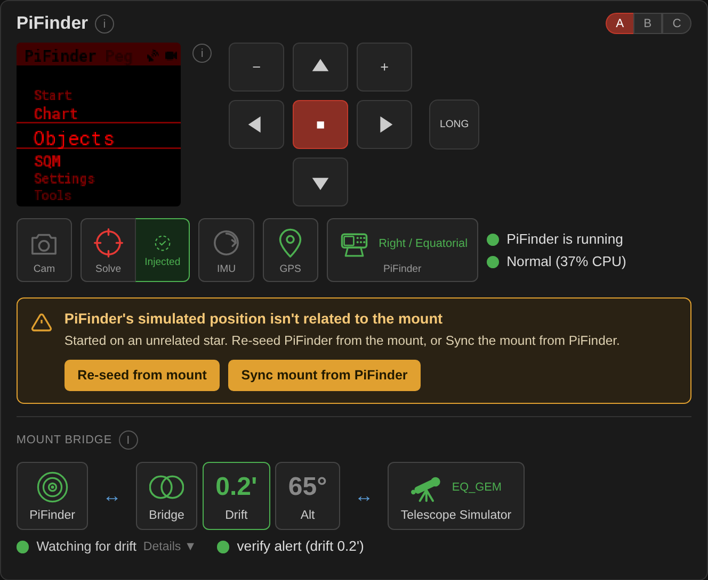</a><br>
<sub>Full-Simulation-Starthinweis: PiFinders simulierte Himmelsposition wurde unabhängig von der Montierung gesetzt, jede Übereinstimmung ist also Zufall, bis man beide verknüpft.</sub>
</td>
</tr>
</table>

In Full Simulation wählen der simulierte PiFinder und die simulierte Montierung ihre Startposition
jeweils selbst. Wenn der Mount-Bridge-Treiber startet und feststellt, dass er nichts Besseres als
seinen einkompilierten Fallback zur Verfügung hatte, zeigt er diese gelbe Karte einmalig: Die
Drift-Zahl mag auf den ersten Blick *in Ordnung* aussehen (es ist ja ein echter Stern), aber
Verify/Alert und Sync-from-PiFinder bedeuten relativ zur Montierung noch nichts. Die Karte bietet
die zwei Wege an, das zu ändern — nimm den, der zur vertrauenswürdigen Seite passt:

| Button | Was er tut | Wann |
|---|---|---|
| **Re-seed from mount** | Liest die aktuelle Position der Montierung und injiziert *diese* als PiFinders Position. | Die Montierung steht richtig; PiFinders (simulierter) Solve ist der Ausreißer. |
| **Sync mount from PiFinder** | Synct die Montierung auf das, was PiFinder gerade zeigt — sofortige Positionsaktualisierung, kein Slew. | PiFinders Position stimmt (ein echter Solve, oder eine bewusst gesetzte) und die Montierung glaubt Falsches — z. B. nach Bewegen der Montierung von Hand. |

Sobald eine der beiden erfolgreich ist, verschwindet die Karte. Derselbe **Sync mount from
PiFinder**-Button erscheint auch in den Quick Actions und im Drift-Banner — überall macht er einen
Einmal-Sync auf PiFinders *gerade sichtbare* Position, ohne Frische-Prüfung, unabhängig vom
Coupling-Modus.

### Montierung unter dem Horizont

<table>
<tr>
<td align="center">
<a href="docs/images/readme/cc_mount_bridge_below_horizon.png">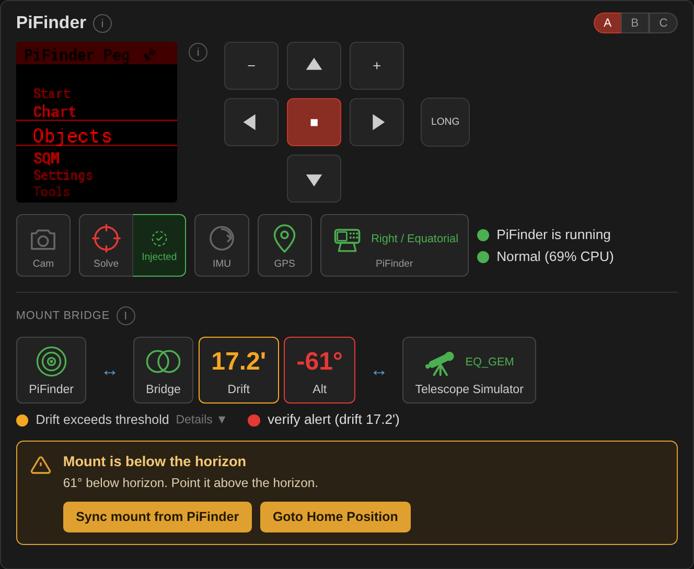</a><br>
<sub>Full Simulation: die gemeldete Position der Montierung liegt unter dem Horizont — das <code>Alt</code>-Badge ist rot und eine Wiederherstellungs-Karte zeigt die zwei Auswege.</sub>
</td>
</tr>
</table>

Sinkt die gemeldete Position der Montierung auf oder unter den Horizont-Sicherheitsabstand, wird das
`Alt`-Badge rot und diese Wiederherstellungs-Karte erscheint. Hier hilft kein Software-Schalter —
der Treiber lässt ohnehin keinen Sync oder GoTo auf ein Ziel unter dem Horizont durch — deshalb
bietet die Karte nur die zwei echten Auswege:

- **Sync mount from PiFinder** — wenn PiFinders *eigene* Position über dem Horizont liegt (was oft
  der Fall ist: genau diese Uneinigkeit ist der Punkt), gelingt dies und korrigiert die Annahme der
  Montierung ohne jede physische Bewegung.
- **Goto Home Position** — schickt die Montierung auf ihre native OnStep-Home-/Referenzposition. Ein
  Firmware-Referenzkommando, kein Koordinaten-GoTo, funktioniert also auch dann, wenn ein
  Koordinaten-GoTo abgelehnt würde.

Die Drift-Zahl friert währenddessen auf ihrem letzten Wert ein — sie wird unter dem Horizont nicht
neu berechnet, da sie nichts bedeuten würde.

### Einen Coupling-Modus wählen

<table>
<tr>
<td align="center">
<a href="docs/images/readme/cc_mount_bridge_coupling.png">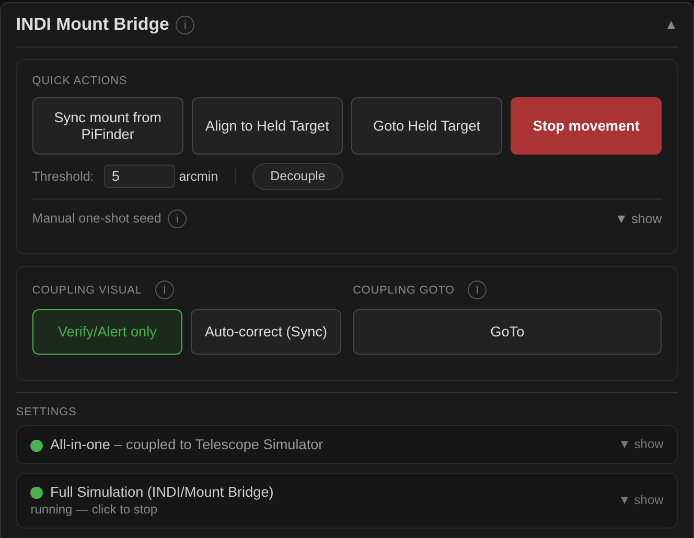</a><br>
<sub>Der <code>INDI Mount Bridge</code>-Abschnitt (Full Simulation): Quick Actions oben, die Coupling-Presets darunter, die einmaligen Settings unten eingeklappt.</sub>
</td>
</tr>
</table>

Der Abschnitt trennt, was man jede Sitzung benutzt, von dem, was man einmal einstellt:

- **Quick Actions** — die Einmal-Buttons: **Sync mount from PiFinder** (oben), **Align to Held
  Target** und **Goto Held Target** (korrigieren PiFinders bzw. der Montierung Annahme über das
  gehaltene Ziel — brauchen einen aktiven Coupling-Modus) und **Stop movement** (Not-Halt; setzt
  außerdem Coupling auf Off, damit nichts nachtriggert). **Threshold** (Bogenmin.) ist, wie weit
  daneben, bevor Verify/Alert warnt oder ein Auto-correct-Modus eingreift. **Decouple** setzt
  Coupling zurück auf Off.
- **Coupling-Presets** — eines wählen:
  - **Verify/Alert only** — überwacht die Drift, bewegt die Montierung nie. Der passive "steht meine
    Montierung noch richtig?"-Check für die Astrofotografie.
  - **Auto-correct (Sync)** — dieselbe Überwachung, aber sobald die Drift den Threshold übersteigt,
    synct es die Montierung auf PiFinders Position (sofort, kein Slew — funktioniert mit jeder
    Montierung). Der Von-Hand-schieben-dann-korrigieren-Workflow.
  - **GoTo** — slewt physisch; hält das zuletzt von einer der beiden Seiten gesetzte Ziel. Braucht
    eine echte Goto-fähige Montierung und wird daher in diesem Simulations-Setup nicht durchgespielt.
- **Settings** (eingeklappt) — Rolle, Hardware-Modus und die nummerierte Einrichtungs-Checkliste.
  Einmalige Konfiguration pro Sitzung, aus dem Alltagsablauf herausgehalten.

Ein Preset zu klicken, bevor die nummerierten Setup-Schritte alle grün sind, schlägt nicht fehl —
es führt erst das Setup aus (Autoconnect) und wendet dann den geklickten Modus an.

#### Rollen

Die drei **Rollen**-Karten unter *Settings* legen fest, was dieses Gerät im Gesamt-Setup tut —
eine auszuwählen baut das Equipment-Profil für dich um (welches PiFinder LX200, und ob eine Mount
Bridge):

<table>
<tr>
<td align="center">
<a href="docs/images/readme/cc_roles.png"></a><br>
<sub><em>Settings → Role</em>: die drei Rollen.</sub>
</td>
</tr>
</table>

| Rolle | Dieses Gerät | Profil, das sie baut |
|---|---|---|
| **All-in-one** | PiFinder-Hardware **mit** hier angeschlossener Montierung | PiFinder LX200 (lokal) + Mount Bridge |
| **PiFinder host** | Nur PiFinder — die Kopplung läuft auf einem anderen Rechner | PiFinder LX200 (lokal), keine Mount Bridge |
| **Control host** | Keine PiFinder-Hardware — koppelt einen **entfernten** PiFinder an eine Montierung hier | PiFinder LX200 (entfernt, per IP) + Mount Bridge |

Die Rolle wird normalerweise einmal beim Setup gewählt. Ein **Control host** ist genau der Fall für
die **`INDI-only`**-Checkbox im [Install- oder Update-Tile](#installieren-oder-aktualisieren)
(`--mode=indi_only`): installiert nur die zwei INDI-Treiber und ihre Build-Abhängigkeiten — kein
PiFinder-Klon, kein venv. `PiFinder LX200` selbst ist in jeder Rolle derselbe Treiber; nur seine
Adresse (lokal vs. entfernte IP) und ob eine Mount Bridge da ist ändern sich
([Readme_PiFinder_LX200_de.md](Readme_PiFinder_LX200_de.md)).

<table>
<tr>
<td align="center">
<a href="docs/images/readme/cc_settings_expanded.png">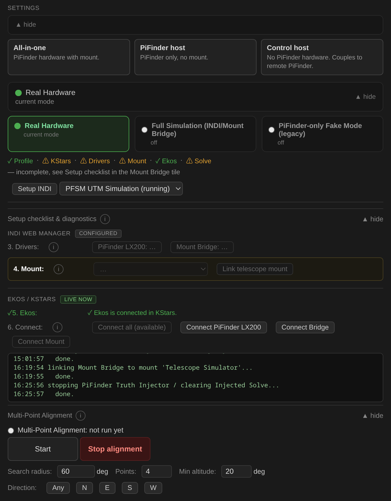</a><br>
<sub>Der ganze <em>Settings</em>-Block ausgeklappt, zur Einordnung: Rollen-Karten, Hardware-Modus (Real Hardware / Full Simulation / Fake Mode), die nummerierte Einrichtungs-Checkliste und Multi-Point Alignment.</sub>
</td>
</tr>
</table>

### Synthetic Solve vs. manueller Einmal-Seed

Beide füttern PiFinder eine Position, die er nicht plate-gesolvt hat, um alles hinter einem Solve
(die Mount Bridge, die UI) ohne Himmelssicht zu testen — aber es sind verschiedene Werkzeuge:

<table>
<tr>
<td align="center">
<a href="docs/images/readme/cc_synthetic_solve.png"></a><br>
<sub>Synthetic Solve (in <em>Simulation, Test and Power</em>): ein Toggle, von einem Hintergrund-Watchdog am Leben gehalten.</sub>
</td>
</tr>
</table>

**Synthetic Solve** füttert PiFinder *kontinuierlich* die Position der simulierten Montierung (über
`test_tools/pifinder_truth_injector.py`), sodass PiFinder und die simulierte Montierung als eins
mitlaufen, wenn eine sich bewegt. Ein Toggle, ein Punkt; ein Watchdog startet die Fütterung neu,
falls sie stirbt. Das ist der normale "es gibt einen Himmel"-Schalter für Full Simulation. Er treibt
das grüne `Injected`-Badge in der PiFinder-Kachel.

<table>
<tr>
<td align="center">
<a href="docs/images/readme/cc_mount_bridge_manual_seed.png">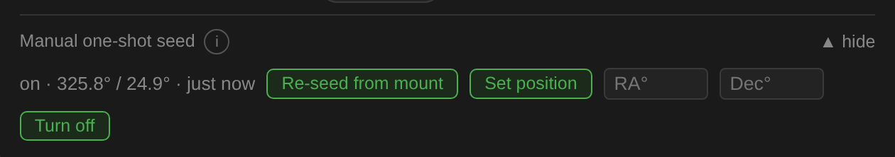</a><br>
<sub>Manueller Einmal-Seed (Full Simulation), in den Quick Actions: <code>Re-seed from mount</code>, <code>Set position</code> und eine direkte RA/Dec-Eingabe.</sub>
</td>
</tr>
</table>

**Manueller Einmal-Seed** (eingeklappt in den Quick Actions) injiziert *eine einzelne* Position und
hört dann auf: **Re-seed from mount** liest die aktuelle Position der Montierung einmal, **Set
position** nimmt eine wörtliche RA/Dec (JNow, Grad), und beide schalten die Injektion ein, falls sie
aus war. PiFinders normales IMU-Dead-Reckoning trackt von diesem Anker aus weiter, genau wie von
einem echten Solve. Damit setzt man PiFinder an *eine* bekannte Stelle — z. B. um die Uneinigkeit
für einen Sync-Test herzustellen — statt ihn der Montierung folgen zu lassen. `Turn off` bringt
PiFinder zum echten Kamera-Solving zurück. Bewusst *nicht* im Synthetic-Solve-Punkt gespiegelt, um
dieses eine Signal einfach zu halten.

---

## Technische Referenz: API-Oberfläche

Alle von `gui_installer/server.py` bedienten Routen. `Auth` = braucht HTTP-Basic-Auth gegen das
`stellarmate`-Systemkonto (s. [Authentifizierung & Sicherheitsmodell](#authentifizierung--sicherheitsmodell)).

| Methode | Pfad | Auth | Zweck |
|---|---|---|---|
| GET | `/` | ✅ | Die Seite selbst |
| GET | `/state` | — | Install-/Update-Lauf-Status (vom Frontend gepollt) |
| GET | `/log` | — | Gestreamte Install-/Update-Terminal-Ausgabe |
| POST | `/start?action=fresh\|reinstall\|update\|cancel` | ✅ | Setup-Skript-Lauf starten |
| POST | `/reset` | ✅ | Reset-Lauf starten (nur `~/PiFinder`s venv/Build-Zustand) |
| GET | `/api/reset_log?position=N` | ✅ | Inkrementelle Reset-Ausgabe |
| POST | `/uninstall` | ✅ | Uninstall-Lauf starten (entfernt alles, inkl. dieses Checkouts) |
| GET | `/api/uninstall_log?position=N` | — | Inkrementelle Uninstall-Ausgabe (ausgenommen wie `/state`/`/log` — s. u.) |
| GET | `/page_version` | — | Content-Hash von `status_page.html`, für das "Jetzt neu laden"-Banner bei veralteten Tabs |
| POST | `/reboot` | ✅ | Pi rebooten |
| POST | `/shutdown` | — | Nur diesen Webserver stoppen (nicht den Pi) |
| POST | `/poweroff` | ✅ | Pi ausschalten |
| GET | `/api/pifinder_mode` | ✅ | Aktueller Fake/Real/none-Modus + Status eines laufenden Wechsels |
| POST | `/api/pifinder_mode?action=enable_fake\|disable_fake` | ✅ | Modus-Wechsel auslösen |
| GET | `/api/pifinder_mode_log?position=N` | ✅ | Inkrementelle Modus-Wechsel-Skript-Ausgabe |
| GET | `/api/hardware_status` | ✅ | Kamera-/IMU-/GPS-Anwesenheit (rohe Hardware-Checks) |
| GET | `/api/debug_solve?port=N` | ✅ | Proxy: PiFinders eigener Solve-Simulation-Zustand |
| POST | `/api/debug_solve?port=N` | ✅ | Proxy: PiFinders eigene Solve Simulation umschalten |
| GET | `/api/display_bridge` | ✅ | Ob das LCD-Overlay gerade aktiv ist |
| POST | `/api/display_bridge?action=start\|stop` | ✅ | LCD-Overlay umschalten (löst Reboot aus) |
| GET | `/api/keyboard_bridge` | ✅ | Ob der Numpad-Bridge-Dienst läuft |
| POST | `/api/keyboard_bridge?action=start\|stop` | ✅ | Numpad-Bridge umschalten |
| GET | `/pifinder.jpg`, `/avvp_logo.png`, `/heyapos_logo.png`, `/pifinder_welcome.png` | ✅ | Statische Assets |

`/state`, `/log`, `/shutdown`, `/page_version` und `/api/uninstall_log` sind bewusst auth-frei.
PiFinders eigene, nicht-authentifizierte "PFSM"-Seite pollt `/state`/`/log` per Cross-Origin, um
"Setup läuft" ohne Login-Prompt zu zeigen, und Cross-Origin-Requests tragen ohnehin nie die
gecachten Basic-Auth-Credentials dieser Seite — deshalb muss auch `/shutdown` (für den Pi selbst
nicht destruktiv — stoppt nur diesen GUI-Server) offen bleiben, damit derselbe Cross-Origin-Button
funktioniert. `/api/uninstall_log` überspringt den PAM-Check in `_require_auth()` gezielt aus
Latenzgründen: dieser Server stoppt seinen eigenen systemd-Unit mitten in einem Uninstall-Lauf,
weshalb ein langsameres, authentifiziertes Polling eine schlechtere Chance hat, überhaupt
durchzukommen, bevor die Verbindung abreißt.

---

## Persistenz & Prozessmodell

| Komponente | Persistenz-Mechanismus |
|---|---|
| Control Center selbst | `pifinder-control-center.service` — `systemctl enable/disable --now`, umgeschaltet über die "Close Setup"-/Launch-Aktionen |
| Install-/Update-Läufe | Einmaliger Subprozess pro Lauf, keine Persistenz nötig (läuft entweder durch oder wird abgebrochen) |
| Fake/Real Mode | `test_tools/fake_mode.sh` verwaltet `pifinder.service` (systemd) vs. eine per `pf_remote.py` gestartete Fake-Instanz |
| Externes SPI-LCD | Overlay-Zeile in `/boot/config.txt` — übersteht Reboots per Definition (Firmware-Ebene) |
| Numpad-Bridge | `pifinder-numpad-bridge.service` — dasselbe Enable/Disable-Muster wie das Control Center selbst |

Jeder Toggle nutzt dieselbe Regel: **systemds eigener Enabled-Zustand ist die einzige Quelle der
Wahrheit für "nach einem Reboot an"** — nie eine Flag-Datei oder eine In-Memory-Variable in
`server.py`.

---

## Authentifizierung & Sicherheitsmodell

- Die Seite selbst und jede zustandsändernde Aktion verlangen **HTTP-Basic-Auth gegen das echte
  Passwort des `stellarmate`-Systemkontos**, verifiziert per PAM (`pam_auth.py`) — dasselbe Konto
  und derselbe Mechanismus, den auch PiFinders eigener Remote-Login prüft, es gibt also genau ein
  Passwort für beides zu merken.
- `/state`, `/log`, `/shutdown` sind absichtlich offen (s. API-Tabelle oben) — keiner der drei kann
  dem Pi selbst irgendetwas Destruktives antun.
- Fehlgeschlagene Logins werden pro Client-IP rate-limitiert: 5 *bestätigt falsche* Passwortversuche
  innerhalb von 30 Sekunden sperren diese IP, bis das Zeitfenster abläuft, zusätzlich begrenzt ein
  Semaphore gleichzeitige PAM-Aufrufe unabhängig vom Ergebnis auf 2 (die ~15
  gleichzeitigen Polls dieser Seite beim Laden könnten sonst den GIL mit Passwort-Hashing
  aushungern, oder das Lockout rein durch die entstehende Race auslösen — beides keine echten
  Angriffe). Das ist ein einfacher Schutz gegen beiläufiges Brute-Forcing, kein Ersatz dafür, den
  Server von einem nicht-vertrauenswürdigen Netzwerk fernzuhalten.
- Der Server bindet `0.0.0.0` (von jedem Gerät im LAN erreichbar, nicht nur vom Pi), daher sollte
  dies unabhängig davon nie über ein vertrauenswürdiges Heim-/Observatoriums-Netzwerk hinaus
  exponiert werden.
- CORS (`Access-Control-Allow-Origin: *`) ist nur auf den auth-freien JSON-Routen gesetzt, speziell
  damit PiFinders eigene "PFSM"-Seite (ein anderer Origin/Port) sie per `fetch()` lesen kann
  — CORS auf die authentifizierten Routen auszuweiten würde den Zweck der Auth-Pflicht selbst
  untergraben.

---

## Bekannte Einschränkungen & Fehlerbehebung

- **Keine Kamera/IMU auf Pi 5 mit bestimmten UPS-Shields**: unabhängig von diesem Tool selbst, zeigt
  sich aber über dessen Hardware-Checkliste — der Geekworm-X1203/GPIO-16-Konflikt (s. das
  Kompatibilitäts-Banner im Haupt-[README.md](README.md)), den die Checkliste korrekt als
  Tastatur-Hardware-betroffen meldet (nicht Kamera/IMU/GPS, die diese Checkliste abdeckt).
- **Ein abgestürzter Kamera-Subprozess kann `pifinder.service` weiterhin "aktiv" melden lassen.**
  Genau deshalb existiert die Hardware-Checkliste und prüft rohe Hardware, statt `systemctl
  is-active` zu vertrauen — s. [Designprinzipien](#designprinzipien) Punkt 3.
- **Die gecachte JS/HTML der Seite kann über ein Update hinweg veraltet sein**, falls ein
  Browser-Tab während eines das Control Center selbst aktualisierenden Laufs offen blieb —
  `Cache-Control: no-store, must-revalidate` ist speziell dafür gesetzt, dies zu minimieren, aber
  ein harter Reload nach jedem Update bleibt der sicherste erste Fehlerbehebungsschritt, falls ein
  Button auf eine nicht mehr existierende Route zu verweisen scheint.
- **Overlay-Änderungen in `/boot/config.txt` brauchen einen Reboot** — es gibt keinen
  Live-Toggle-Weg für Pi-Firmware-Overlays; der Reboot des LCD-Toggles ist nicht optional, kein Bug.

---

## Entwicklung & Testing

- `test_tools/fake_mode.sh start`/`stop` kann direkt ausgeführt werden, unabhängig von der eigenen
  Kachel des Control Centers, für Skripting/Automatisierung.
- Der `pifinder-remote`-Claude-Code-Skill (`pf_remote.py`,
  `.claude/skills/pifinder-remote/`) ist das, was `fake_mode.sh` unter der Haube nutzt, um eine
  Fake-Hardware-Instanz zu starten.
- Für `gui_installer/` existiert bisher keine automatisierte Testsuite (s. Roadmap) —
  jede bisherige Verifikation war live, manuell, Ende-zu-Ende gegen echte
  Installs/Reinstalls/Reboots.

---

## Roadmap

Die projektweite Ausrichtung (v2.x / v3.x) steht im Haupt-[README.md](README.md#roadmap).
Getrackte, priorisierte Arbeit — auch Control-Center-spezifische Punkte — liegt im
[GitHub-Projekt](https://github.com/users/apos/projects/15) ([Roadmap-Ansicht](https://github.com/users/apos/projects/15/views/4));
ausgelieferte Änderungen stehen im [CHANGELOG.md](CHANGELOG.md).

---

## Versionskompatibilität

Die PiFinder- / StellarMate-OS- / Pi-Testmatrix wird an einer Stelle gepflegt — der
[Versionskompatibilitäts-Tabelle im Haupt-README.md](README.md#version-compatibility).

Das Control Center selbst hat keine PiFinder-versionsspezifischen Codepfade — es spricht PiFinder
nur über dessen stabile `/api/*`-Remote-API an und das System nur über `systemctl`/rohe
Hardware-Proben, beides unabhängig von der installierten PiFinder-Version.

## Siehe auch

- [Readme_KeyboardBridge_de.md](Readme_KeyboardBridge_de.md) — die Numpad-als-Tastatur-Bridge, die
  der "Turn Numpad On/Off"-Button dieses Tools steuert.
- [Readme_PiFinder_LX200_de.md](Readme_PiFinder_LX200_de.md) — die INDI-Integrationsschicht, deren
  "PFSM"-Seite zurück auf dieses Control Center verlinkt.
- [README.md](README.md) — Basis-Installation, die Versionsmatrix und die Projekt-Roadmap.
- [Readme_design_decisions_de.md](Readme_design_decisions_de.md) — kompakte Begründung der
  wichtigsten Design-Entscheidungen im Projekt.

---

<p align="center">
  <br>
  © github.com/apos 2026<br>
  <em>Unofficial community project, not affiliated with StellarMate or PiFinder.</em>
</p>
