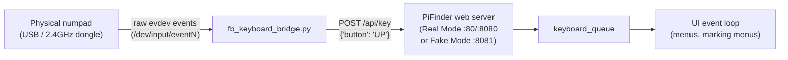
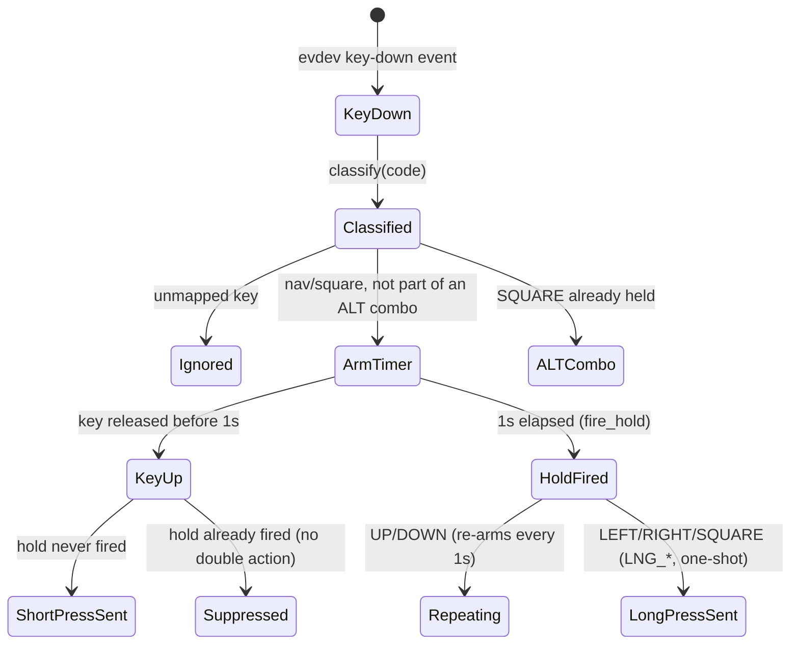

# Keyboard Bridge: Numpad-as-Keypad Documentation

*[Deutsche Version](Readme_KeyboardBridge_de.md)*

> ### ✅ Built & verified against
>
> * **PiFinder software 2.6.0** on **StellarMate OS 2.2.1** (Arch Linux), Raspberry Pi 4 and Pi 5
> * Test device: **LogiLink ID0120** (2.4GHz USB-dongle numpad, no dedicated arrow keys)
> * Python **evdev** package, any Linux kernel with `/dev/input/eventN` nodes (no X11 required)

This document covers the **Keyboard Bridge** (`test_tools/fb_keyboard_bridge.py`) — a small,
PiFinder-code-independent process that turns any plain USB/2.4GHz-dongle numeric keypad into a
fully functional PiFinder input device. It is a companion to the main [README.md](README.md) and to
[Readme_ControlCenter.md](Readme_ControlCenter.md), which documents the toggle button that starts
and stops it.

---

## Table of Contents

1. [Why This Exists](#why-this-exists)
2. [Architecture](#architecture)
3. [Key Mapping](#key-mapping)
4. [Behavioral Parity With the Real Keypad](#behavioral-parity-with-the-real-keypad)
5. [Installation & Illustrated Guide](#installation--illustrated-guide)
6. [Technical Reference](#technical-reference)
7. [Self-Healing & Persistence](#self-healing--persistence)
8. [Known Limitations & Troubleshooting](#known-limitations--troubleshooting)
9. [Development & Testing](#development--testing)
10. [Strategic Roadmap](#strategic-roadmap)
11. [Version Compatibility](#version-compatibility)

---

## Why This Exists

PiFinder's real input device is a physical keypad HAT wired directly to GPIO, read through
`keyboard_pi.py`. That's the right design for the finished product, but it creates two practical
problems this project runs into constantly:

1. **Hardware-free development and testing.** A HAT-only input path means every UI/software change
   has to be tested with the physical unit in hand — no bench testing, no CI, no "quick check from
   the desk" without the actual telescope mount hardware.
2. **A cheap, physically robust field-replacement.** PiFinder's HAT keypad shares GPIO lines with
   other add-on hardware in this project's own setup (see the GPIO 16 conflict documented in
   `basic-memory/pifinder-stellarmate/00000` and `00023`) — a small wireless numpad sidesteps that
   entirely, is lighter, and needs far less power.

The Keyboard Bridge solves both with one script: it reads raw key events from *any* Linux input
device (`evdev`) and forwards them to PiFinder's existing, stable `POST /api/key` Remote API — the
same endpoint the Web UI's virtual keypad, `pf_remote.py`, and the Setup GUI already use. No
PiFinder source code is touched; the bridge is a pure client of a public interface.



---

## Architecture

The bridge is intentionally **decoupled from PiFinder's own process and code**:

- **No shared state, no import of PiFinder modules.** It only ever calls the same HTTP API any
  external client could call. This means a bug in the bridge can never crash PiFinder itself, and a
  PiFinder code change can never silently break the bridge's syntax (only its *behavior*, if the API
  contract changes).
- **Auto-detects both ends.** The target keyboard device is found by scanning `/dev/input/*` for one
  that reports `KEY_ENTER` plus either `KEY_KP1` (a numpad) or `KEY_A` (a full keyboard) — this
  skips the Waveshare touchscreen and the power button, which also register as generic input
  devices. The target PiFinder instance is found by probing ports 80, 8080, and 8081 (Real Mode's
  two possible ports, then Fake Mode) and verifying the response is actually a PiFinder screenshot,
  not some unrelated service that happens to answer on that port (the same nginx-on-port-80 trap
  `fb_screen_mirror.py` also guards against).
- **Stdlib + one dependency.** Only `evdev` (for reading raw input events) and `Pillow` (only used to
  verify the auto-probe's response really is an image) are needed beyond the standard library —
  installed once into PiFinder's own venv, tracked in `bin/requirements_additional.txt` so a venv
  rebuild doesn't silently drop it again (this happened once, see
  `basic-memory/pifinder-stellarmate/00030`).

---

## Key Mapping

Tuned for a numpad-only device with no dedicated arrow keys. As of 2026-07-19, the mapping is
**entirely independent of NumLock state** — a deliberate redesign (see
[Known Limitations](#known-limitations--troubleshooting) for the earlier, NumLock-dependent design
and why it was replaced):

| Physical key | PiFinder action |
|---|---|
| `NumLock` | LEFT |
| `/` | UP |
| `*` | DOWN |
| `Backspace` | RIGHT |
| `+` | PLUS |
| `-` | MINUS |
| `Enter` | SQUARE |
| `0`–`9` | Always plain digits (catalog-number entry, etc.) |

Genuine dedicated arrow keys (`KEY_LEFT/RIGHT/UP/DOWN`) are also mapped directly, independent of the
remap above — if this script is ever pointed at a full keyboard instead of a bare numpad, arrow keys
work without any configuration change.

**Why NumLock-independent matters here specifically:** the test device is a 2.4GHz wireless dongle,
not a wired keyboard — there is no reliable way to read (or set) its NumLock LED state remotely.
Any design that branches behavior on NumLock state on this class of device is fragile by
construction; keeping every navigation key fixed regardless of NumLock removes the failure mode
entirely rather than working around it.

---

## Behavioral Parity With the Real Keypad

The bridge replicates three behaviors from `keyboard_pi.py` so muscle memory carries over between
the real HAT and this stand-in:

1. **Repeat-on-hold for UP/DOWN.** Holding either key fires the short press again every ~1 second,
   for fast list scrolling.
2. **Long-press for LEFT/RIGHT/SQUARE.** Holding for >1 second sends the `LNG_*` variant instead of
   the short action once released (`LNG_LEFT` = "back to top menu", `LNG_SQUARE` opens/navigates a
   marking menu).
3. **SQUARE-as-modifier (ALT combos).** Holding Enter/SQUARE while pressing another mapped key sends
   that key's `ALT_*` variant — matching the full set of `ALT_*` actions that exist on real hardware
   (`ALT_0`, `ALT_PLUS`, `ALT_MINUS`, `ALT_LEFT/UP/DOWN/RIGHT`).

A subtle correctness detail worth documenting explicitly, since it caused a real, hard-to-spot bug
during development: whether a long-press/hold action **already fired** is tracked in its own
`fired_codes` set, written only by the timer thread (`fire_hold()`) the instant it sends its action —
*before* any network I/O. The key-up handler (main thread) only ever reads and clears this set; it
never infers "did the hold fire" from whether a `Timer` object is still present in `hold_timers`,
because `fire_hold()` removes itself from `hold_timers` right as it fires, creating a race where
key-up could see "already gone" and (wrongly) send an extra short press on release. For SQUARE
specifically, that spurious extra press closed the marking menu the long-press had just opened — the
menu appeared to open and then immediately vanish. Fixed by using two independent signals for two
independent questions ("is a timer still pending" vs. "did the timer already fire") instead of
overloading one.

---

## Installation & Illustrated Guide

Deployed as a systemd unit (`pifinder-numpad-bridge.service`), toggled from the Control Center — see
[Readme_ControlCenter.md](Readme_ControlCenter.md#hardware--peripherals) for the toggle button
itself. There is nothing to configure manually for normal use; `pifinder_stellarmate_setup.sh`
installs the unit file and the `evdev` dependency automatically on every install/update.

```bash
# Manual install (normally done for you by pifinder_stellarmate_setup.sh):
sudo cp pi_config_files/pifinder-numpad-bridge.service /etc/systemd/system/
sudo systemctl daemon-reload

# Turned on/off via the Control Center's "Turn Numpad On/Off" button, or manually:
sudo systemctl enable --now pifinder-numpad-bridge.service   # on, persists across reboots
sudo systemctl disable --now pifinder-numpad-bridge.service  # off, persists across reboots
```

<table>
<tr>
<td align="center">
<a href="docs/images/pfinder_lx200/Pifinder Stellarmate Control Center.png"></a><br>
<sub>The Control Center — the numpad bridge's "Turn Numpad On/Off" row lives in the hardware/peripherals
section shown here. A dedicated close-up screenshot of that row is a documentation follow-up
(see <a href="#strategic-roadmap">Strategic Roadmap</a>).</sub>
</td>
</tr>
</table>

<table>
<tr>
<td align="center">
<a href="docs/images/readme/keyboard_brigde_and_lcd.png"></a><br>
<sub>The Keyboard Bridge and the external SPI LCD in actual use together - the numpad standing in
for the physical keypad, the LCD mirroring PiFinder's OLED output, both bridged independently of
each other (see <a href="Readme_ControlCenter.md#hardware--peripherals">Readme_ControlCenter.md</a>
for the LCD toggle).</sub>
</td>
</tr>
</table>

Run directly for manual testing/debugging (auto-detects both device and PiFinder instance). Note
that `fb_keyboard_bridge.py` itself is **this project's own script** (`PiFinder_Stellarmate/test_tools/`,
not part of PiFinder's own codebase) - the command below just happens to run it with PiFinder's own
venv Python interpreter, since that's where its one dependency (`evdev`) is installed (see
[Architecture](#architecture) above); `PiFinder_Stellarmate` has no separate venv of its own:

```bash
cd ~/PiFinder_Stellarmate
/home/stellarmate/PiFinder/python/.venv/bin/python3 test_tools/fb_keyboard_bridge.py
```

Optional flags: `--device /dev/input/eventN` (skip auto-detection), `--base-url http://127.0.0.1:8081`
(target a specific instance, e.g. Fake Mode explicitly).

---

## Technical Reference

### `classify(code)` — the single dispatch point

Every evdev keycode is classified exactly once into one of four kinds, keeping the rest of the event
loop free of scattered per-key `if` chains:

| Kind | Meaning | Source dict |
|---|---|---|
| `"square"` | Enter/KPEnter | `SQUARE_KEYS` |
| `"nav"` | LEFT/UP/DOWN/RIGHT | `FIXED_NAV` |
| `"btn"` | PLUS/MINUS | `FIXED_BTN` |
| `"digit"` | 0–9 | `ALWAYS_DIGIT` |

### `send(button)` — the only network call site

Every key action funnels through one function, which resolves the target URL (cached after the
first successful probe) and clears that cache on failure — see
[Self-Healing & Persistence](#self-healing--persistence) below.

### Full event state machine



---

## Self-Healing & Persistence

Two independent problems, two independent fixes:

- **Persistence across reboots**: managed as a real systemd unit
  (`Type=simple`, `Restart=always`), enabled/disabled by the Control Center's toggle — systemd's own
  enabled-state is what survives a reboot, not an in-memory flag. This replaced an earlier design
  that tracked a plain `Popen` object inside the Control Center's own server process, which
  obviously couldn't survive a reboot of the whole Pi at all (see
  `basic-memory/pifinder-stellarmate/00035`).
- **Self-healing across a Fake/Real Mode switch**: a mode switch changes *which port* is actually
  reachable (Real Mode: 80/8080, Fake Mode: 8081). Rather than being explicitly stopped and
  restarted whenever the mode changes (the original design, later found unnecessary), `send()` drops
  its cached target URL the instant a send fails, forcing the very next keypress to re-probe from
  scratch. No supervision from outside the process is needed at all.

---

## Known Limitations & Troubleshooting

- **No visual feedback if no PiFinder instance is reachable.** The bridge prints to stdout/journal
  only — if neither Real nor Fake Mode is running, keypresses are silently dropped (with a log line)
  until an instance appears. Check `journalctl -u pifinder-numpad-bridge.service -f` if keys seem to
  do nothing.
- **Historical design (superseded, documented for context):** an earlier version tracked NumLock
  state itself (seeded from the device's LED at startup, toggled on every NumLock press) to give
  `4/8/6/2` dual digit/navigation meaning depending on NumLock. Abandoned because a wireless dongle
  gives no reliable way to read or set that LED remotely — the current fixed mapping (see
  [Key Mapping](#key-mapping)) removes the entire failure class instead of working around it.
- **Bundled-with-LCD-autostart was an early design mistake**, since fixed: the bridge originally
  only started alongside the Waveshare LCD's Fake Mode autostart, even though it has no GPIO/overlay
  dependency of its own and works fine with the real OLED+HAT in Real Mode too. Split into its own
  independent toggle (`basic-memory/pifinder-stellarmate/00031`).
- **Requires PiFinder already running.** The Control Center's "Turn Numpad On" button explicitly
  refuses to start the bridge if neither Fake nor Real Mode is currently up (there'd be nothing to
  send to) — start PiFinder first.

---

## Development & Testing

- Run standalone against Fake Mode for a fully hardware-free test loop:
  `test_tools/fake_mode.sh start` then `fb_keyboard_bridge.py --base-url http://127.0.0.1:8081`.
- `keypad_gpio_matrix_test.py` (same `test_tools/` directory) is the equivalent raw-hardware
  diagnostic for the *real* HAT keypad — useful for telling apart a bridge-layer problem from a
  physical keypad problem when something doesn't respond as expected.
- No automated test suite exists for the bridge itself yet (see Strategic Roadmap).

---

## Strategic Roadmap

Prioritized per `basic-memory/pifinder-stellarmate/00001`'s GitHub-Projects-schema TODO table (see
[[bm-github-project-schema-todo-format]] for the schema itself):

| Priority | Size | Item |
|---|---|---|
| P2 | XS | Take and add a close-up screenshot of the Control Center's numpad toggle row to this document (currently only shown as part of the full-page screenshot). |
| P3 (not yet tracked) | S | Automated smoke test: feed synthetic evdev events through `classify()`/the event loop without real hardware, verify expected `/api/key` calls (would need a mock HTTP target — currently zero test coverage for this script). |
| P3 (not yet tracked) | M | Consider a small on-screen/journal status indicator visible without SSH access when no PiFinder instance is reachable, rather than only a log line. |

No open bugs are currently tracked against this component — its most recent redesign (NumLock-independent
mapping, systemd persistence, self-healing) resolved every previously known issue.

---

## Version Compatibility

| PiFinder | SMOS | Pi 4 | Pi 5 |
|---|---|---|---|
| 2.6.0 | 2.2.1 | ✅ tested | ✅ tested |
| 2.5.1 | 2.1.1 | ✅ tested (earlier mapping) | — |

Depends only on PiFinder's `POST /api/key` Remote API, which has been stable across every PiFinder
version this project has targeted — no PiFinder-version-specific behavior in the bridge itself.

## See Also

- [Readme_ControlCenter.md](Readme_ControlCenter.md) — the toggle button that starts/stops this
  bridge, and the sibling "External SPI LCD" toggle for hardware-free display testing.
- [README.md](README.md) — base PiFinder-on-StellarMate installation.
- `basic-memory/pifinder-stellarmate/00031`, `00035` — the two design iterations that led to the
  current architecture (decoupling from the LCD toggle, then systemd persistence).
