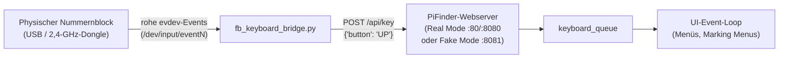
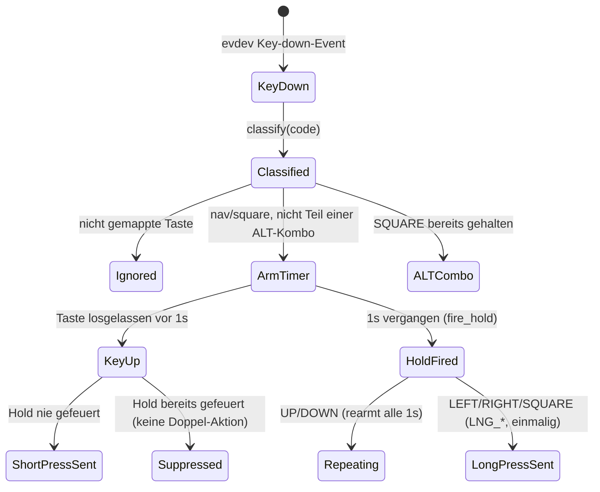

# Keyboard Bridge: Numpad-als-Tastatur-Dokumentation

*[English version](Readme_KeyboardBridge.md)*

> ### ✅ Getestet und verifiziert gegen
>
> * **PiFinder-Software 2.6.0** auf **StellarMate OS 2.2.1** (Arch Linux), Raspberry Pi 4 und Pi 5
> * Testgerät: **LogiLink ID0120** (2,4-GHz-USB-Dongle-Nummernblock, keine eigenen Pfeiltasten)
> * Python-Paket **evdev**, jeder Linux-Kernel mit `/dev/input/eventN`-Nodes (kein X11 nötig)

Dieses Dokument beschreibt die **Keyboard Bridge** (`test_tools/fb_keyboard_bridge.py`) — einen
kleinen, von PiFinders eigenem Code unabhängigen Prozess, der aus einem beliebigen
USB-/2,4-GHz-Dongle-Nummernblock ein voll funktionsfähiges PiFinder-Eingabegerät macht. Begleitet das
Haupt-[README.md](README.md) und [Readme_ControlCenter.md](Readme_ControlCenter.md), das den
Umschalt-Button dokumentiert, der diese Bridge startet und stoppt.

---

## Inhaltsverzeichnis

1. [Warum das existiert](#warum-das-existiert)
2. [Architektur](#architektur)
3. [Tastenbelegung](#tastenbelegung)
4. [Verhaltensgleichheit mit der echten Tastatur](#verhaltensgleichheit-mit-der-echten-tastatur)
5. [Installation & bebilderte Anleitung](#installation--bebilderte-anleitung)
6. [Technische Referenz](#technische-referenz)
7. [Selbstheilung & Persistenz](#selbstheilung--persistenz)
8. [Bekannte Einschränkungen & Fehlerbehebung](#bekannte-einschränkungen--fehlerbehebung)
9. [Entwicklung & Testing](#entwicklung--testing)
10. [Strategische Roadmap](#strategische-roadmap)
11. [Versionskompatibilität](#versionskompatibilität)

---

## Warum das existiert

PiFinders echtes Eingabegerät ist ein physisches Tastatur-HAT, direkt per GPIO verdrahtet und über
`keyboard_pi.py` ausgelesen. Für das fertige Produkt ist das die richtige Lösung, erzeugt aber zwei
praktische Probleme, auf die dieses Projekt ständig stößt:

1. **Hardware-freie Entwicklung und Tests.** Ein reiner HAT-Eingabepfad bedeutet: jede
   UI-/Software-Änderung muss mit der physischen Einheit in der Hand getestet werden — kein
   Bank-Test, keine CI, kein "kurzer Check vom Schreibtisch aus" ohne die tatsächliche
   Teleskop-Montierungs-Hardware.
2. **Ein günstiger, physisch robuster Feld-Ersatz.** PiFinders HAT-Tastatur teilt sich in diesem
   Projekt GPIO-Leitungen mit anderer Zusatz-Hardware (s. den GPIO-16-Konflikt, dokumentiert in
   `basic-memory/pifinder-stellarmate/00000` und `00023`) — ein kleiner Wireless-Nummernblock
   umgeht das komplett, ist leichter und braucht deutlich weniger Strom.

Die Keyboard Bridge löst beides mit einem Skript: Sie liest rohe Tastenereignisse von **jedem**
Linux-Eingabegerät (`evdev`) und leitet sie an PiFinders bestehende, stabile
`POST /api/key`-Remote-API weiter — denselben Endpunkt, den die Web-UI-eigene virtuelle Tastatur,
`pf_remote.py` und die Setup-GUI ohnehin schon nutzen. Kein PiFinder-Quellcode wird angefasst; die
Bridge ist ein reiner Client einer öffentlichen Schnittstelle.



---

## Architektur

Die Bridge ist bewusst **von PiFinders eigenem Prozess und Code entkoppelt**:

- **Kein geteilter Zustand, kein Import von PiFinder-Modulen.** Sie ruft nur dieselbe HTTP-API auf,
  die jeder externe Client auch aufrufen könnte. Ein Bug in der Bridge kann PiFinder selbst also nie
  zum Absturz bringen, und eine PiFinder-Code-Änderung kann die Bridge syntaktisch nie stillschweigend
  brechen (nur ihr *Verhalten*, falls sich der API-Vertrag ändert).
- **Erkennt beide Enden automatisch.** Das Ziel-Tastaturgerät wird gefunden, indem `/dev/input/*`
  nach einem Gerät durchsucht wird, das `KEY_ENTER` plus entweder `KEY_KP1` (Nummernblock) oder
  `KEY_A` (Vollständige Tastatur) meldet — das überspringt den Waveshare-Touchscreen und den
  Power-Button, die sich ebenfalls als generische Eingabegeräte melden. Die Ziel-PiFinder-Instanz
  wird gefunden, indem die Ports 80, 8080 und 8081 (Real Modes zwei mögliche Ports, dann Fake Mode)
  angefragt werden und verifiziert wird, dass die Antwort tatsächlich ein PiFinder-Screenshot ist,
  nicht irgendein unabhängiger Dienst, der zufällig auf diesem Port antwortet (dieselbe
  nginx-auf-Port-80-Falle, vor der sich auch `fb_screen_mirror.py` schützt).
- **Stdlib + eine Abhängigkeit.** Nur `evdev` (zum Lesen roher Eingabeereignisse) und `Pillow` (nur
  genutzt, um zu verifizieren, dass die Auto-Probe-Antwort tatsächlich ein Bild ist) werden über die
  Standardbibliothek hinaus gebraucht — einmalig in PiFinders eigenes venv installiert, getrackt in
  `bin/requirements_additional.txt`, damit ein venv-Rebuild diese Abhängigkeit nicht wieder
  stillschweigend verliert (ist genau einmal passiert, s.
  `basic-memory/pifinder-stellarmate/00030`).

---

## Tastenbelegung

Abgestimmt auf ein reines Nummernblock-Gerät ohne eigene Pfeiltasten. Seit 2026-07-19 ist die
Belegung **komplett unabhängig vom NumLock-Zustand** — ein bewusstes Redesign (s.
[Bekannte Einschränkungen](#bekannte-einschränkungen--fehlerbehebung) für das frühere,
NumLock-abhängige Design und warum es ersetzt wurde):

| Physische Taste | PiFinder-Aktion |
|---|---|
| `NumLock` | LEFT |
| `/` | UP |
| `*` | DOWN |
| `Backspace` | RIGHT |
| `+` | PLUS |
| `-` | MINUS |
| `Enter` | SQUARE |
| `0`–`9` | Immer normale Ziffern (Katalognummer-Eingabe usw.) |

Echte, dedizierte Pfeiltasten (`KEY_LEFT/RIGHT/UP/DOWN`) werden ebenfalls direkt gemappt, unabhängig
vom obigen Remap — falls dieses Skript jemals an eine vollständige Tastatur statt eines reinen
Nummernblocks angeschlossen wird, funktionieren Pfeiltasten ohne jede Konfigurationsänderung.

**Warum NumLock-Unabhängigkeit hier speziell wichtig ist:** das Testgerät ist ein 2,4-GHz-Wireless-Dongle,
keine kabelgebundene Tastatur — es gibt keine verlässliche Möglichkeit, seinen NumLock-LED-Status
remote auszulesen (oder zu setzen). Jedes Design, das Verhalten vom NumLock-Zustand auf dieser
Geräteklasse abhängig macht, ist konstruktionsbedingt fragil; die aktuelle, feste Zuordnung
unabhängig vom NumLock-Zustand beseitigt diese gesamte Fehlerklasse, statt nur um sie herumzuarbeiten.

---

## Verhaltensgleichheit mit der echten Tastatur

Die Bridge repliziert drei Verhaltensweisen aus `keyboard_pi.py`, damit sich die Muskelerinnerung
zwischen dem echten HAT und diesem Ersatz überträgt:

1. **Wiederholung bei gehaltener UP/DOWN-Taste.** Halten löst den kurzen Druck alle ~1 Sekunde
   erneut aus, für schnelles Scrollen durch Listen.
2. **Langer Druck für LEFT/RIGHT/SQUARE.** Halten über >1 Sekunde sendet beim Loslassen die
   `LNG_*`-Variante statt der kurzen Aktion (`LNG_LEFT` = "zurück zum obersten Menü", `LNG_SQUARE`
   öffnet/navigiert ein Marking Menu).
3. **SQUARE als Modifier (ALT-Kombos).** Enter/SQUARE gehalten während eine andere gemappte Taste
   gedrückt wird, sendet die `ALT_*`-Variante dieser Taste — passend zum vollständigen Satz an
   `ALT_*`-Aktionen, die auf echter Hardware existieren (`ALT_0`, `ALT_PLUS`, `ALT_MINUS`,
   `ALT_LEFT/UP/DOWN/RIGHT`).

Ein subtiles Korrektheitsdetail, das explizit dokumentiert werden sollte, da es während der
Entwicklung einen echten, schwer zu findenden Bug verursachte: ob eine Long-Press-/Hold-Aktion
**bereits ausgelöst** hat, wird in einem eigenen `fired_codes`-Set festgehalten, geschrieben nur vom
Timer-Thread (`fire_hold()`) genau in dem Moment, in dem er seine Aktion sendet — **bevor** jegliche
Netzwerk-I/O stattfindet. Der Key-up-Handler (Hauptthread) liest und leert dieses Set nur; er
schließt niemals aus dem Vorhandensein/Fehlen eines `Timer`-Objekts in `hold_timers`, ob der Hold
"gefeuert" hat, weil `fire_hold()` sich selbst genau in dem Moment aus `hold_timers` entfernt, in dem
es feuert — das erzeugt eine Race Condition, bei der Key-up "bereits weg" sehen und (fälschlich)
einen zusätzlichen kurzen Druck beim Loslassen senden könnte. Bei SQUARE speziell schloss dieser
überzählige Druck das gerade erst per Long-Press geöffnete Marking Menu wieder — das Menü öffnete
sich sichtbar und verschwand sofort wieder. Behoben, indem zwei unabhängige Signale für zwei
unabhängige Fragen genutzt werden ("läuft noch ein Timer" vs. "hat der Timer bereits gefeuert"),
statt eines für beide zu überladen.

---

## Installation & bebilderte Anleitung

Ausgeliefert als systemd-Unit (`pifinder-numpad-bridge.service`), umgeschaltet über das Control
Center — s. [Readme_ControlCenter.md](Readme_ControlCenter_de.md#hardware--peripheriegeräte) für
den Umschalt-Button selbst. Für den Normalgebrauch ist nichts manuell zu konfigurieren;
`pifinder_stellarmate_setup.sh` installiert die Unit-Datei und die `evdev`-Abhängigkeit bei jedem
Install/Update automatisch.

```bash
# Manuelle Installation (normalerweise übernimmt das pifinder_stellarmate_setup.sh für dich):
sudo cp pi_config_files/pifinder-numpad-bridge.service /etc/systemd/system/
sudo systemctl daemon-reload

# Über den "Turn Numpad On/Off"-Button im Control Center, oder manuell:
sudo systemctl enable --now pifinder-numpad-bridge.service   # an, übersteht Reboots
sudo systemctl disable --now pifinder-numpad-bridge.service  # aus, übersteht Reboots
```

<table>
<tr>
<td align="center">
<a href="docs/images/pfinder_lx200/Pifinder Stellarmate Control Center.png"></a><br>
<sub>Das Control Center — die "Turn Numpad On/Off"-Zeile der Numpad-Bridge liegt im hier gezeigten
Hardware-/Peripherie-Abschnitt. Ein eigener Nahaufnahme-Screenshot dieser Zeile ist eine offene
Doku-Aufgabe (s. <a href="#strategische-roadmap">Strategische Roadmap</a>).</sub>
</td>
</tr>
</table>

Direkt für manuelles Testen/Debugging ausführen (erkennt sowohl Gerät als auch PiFinder-Instanz
automatisch):

```bash
cd ~/PiFinder_Stellarmate
/home/stellarmate/PiFinder/python/.venv/bin/python3 test_tools/fb_keyboard_bridge.py
```

Optionale Flags: `--device /dev/input/eventN` (Auto-Erkennung überspringen), `--base-url
http://127.0.0.1:8081` (explizit eine bestimmte Instanz ansprechen, z. B. Fake Mode).

---

## Technische Referenz

### `classify(code)` — der einzige Dispatch-Punkt

Jeder evdev-Keycode wird genau einmal in eine von vier Arten klassifiziert, was den Rest der
Event-Loop frei von verstreuten Per-Taste-`if`-Ketten hält:

| Art | Bedeutung | Quell-Dict |
|---|---|---|
| `"square"` | Enter/KPEnter | `SQUARE_KEYS` |
| `"nav"` | LEFT/UP/DOWN/RIGHT | `FIXED_NAV` |
| `"btn"` | PLUS/MINUS | `FIXED_BTN` |
| `"digit"` | 0–9 | `ALWAYS_DIGIT` |

### `send(button)` — die einzige Stelle mit Netzwerkaufruf

Jede Tastenaktion läuft durch genau eine Funktion, die die Ziel-URL auflöst (nach der ersten
erfolgreichen Probe gecacht) und diesen Cache bei einem Fehlschlag leert — s.
[Selbstheilung & Persistenz](#selbstheilung--persistenz) unten.

### Vollständige Event-Zustandsmaschine



---

## Selbstheilung & Persistenz

Zwei unabhängige Probleme, zwei unabhängige Fixes:

- **Persistenz über Reboots hinweg**: verwaltet als echte systemd-Unit (`Type=simple`,
  `Restart=always`), umgeschaltet über den Control-Center-Button — systemds eigener
  Enabled-Zustand ist das, was einen Reboot übersteht, nicht eine Variable im Arbeitsspeicher. Das
  ersetzte ein früheres Design, das ein einfaches `Popen`-Objekt innerhalb des Control-Center-eigenen
  Server-Prozesses trackte, was einen Reboot des ganzen Pi natürlich gar nicht überstehen konnte (s.
  `basic-memory/pifinder-stellarmate/00035`).
- **Selbstheilung über einen Fake/Real-Mode-Wechsel hinweg**: ein Moduswechsel ändert, **welcher
  Port** tatsächlich erreichbar ist (Real Mode: 80/8080, Fake Mode: 8081). Statt bei jedem
  Moduswechsel explizit gestoppt und neu gestartet zu werden (das ursprüngliche Design, später als
  unnötig erkannt), verwirft `send()` seine gecachte Ziel-URL in dem Moment, in dem ein Sendeversuch
  fehlschlägt — das zwingt den allernächsten Tastendruck, von Grund auf neu zu proben. Keinerlei
  Überwachung von außerhalb des Prozesses ist nötig.

---

## Bekannte Einschränkungen & Fehlerbehebung

- **Keine visuelle Rückmeldung, wenn keine PiFinder-Instanz erreichbar ist.** Die Bridge gibt nur
  stdout/Journal aus — läuft weder Real noch Fake Mode, werden Tastendrücke stillschweigend
  verworfen (mit Log-Zeile), bis eine Instanz erscheint. `journalctl -u
  pifinder-numpad-bridge.service -f` prüfen, wenn Tasten scheinbar nichts tun.
- **Historisches Design (abgelöst, hier zur Einordnung dokumentiert):** eine frühere Version
  trackte den NumLock-Zustand selbst (beim Start aus der LED des Geräts geseedet, bei jedem
  NumLock-Druck umgeschaltet), um `4/8/6/2` je nach NumLock eine doppelte Ziffern-/Navigations-Bedeutung
  zu geben. Verworfen, weil ein Wireless-Dongle keine verlässliche Möglichkeit bietet, diese LED
  remote zu lesen oder zu setzen — die aktuelle feste Belegung (s. [Tastenbelegung](#tastenbelegung))
  beseitigt die gesamte Fehlerklasse, statt sie zu umgehen.
- **Zusammen mit dem LCD-Autostart gebündelt war ein früher Design-Fehler**, inzwischen behoben: die
  Bridge startete ursprünglich nur zusammen mit dem Fake-Mode-Autostart des Waveshare-LCDs, obwohl
  sie keine eigene GPIO-/Overlay-Abhängigkeit hat und auch mit echtem OLED+HAT im Real Mode
  problemlos läuft. In einen eigenständigen Toggle aufgeteilt
  (`basic-memory/pifinder-stellarmate/00031`).
- **Braucht bereits laufendes PiFinder.** Der "Turn Numpad On"-Button im Control Center weigert sich
  explizit, die Bridge zu starten, wenn weder Fake noch Real Mode gerade laufen (es gäbe nichts, an
  das gesendet werden könnte) — erst PiFinder starten.

---

## Entwicklung & Testing

- Eigenständig gegen Fake Mode für einen komplett hardware-freien Testzyklus ausführen:
  `test_tools/fake_mode.sh start`, dann `fb_keyboard_bridge.py --base-url http://127.0.0.1:8081`.
- `keypad_gpio_matrix_test.py` (gleiches `test_tools/`-Verzeichnis) ist die entsprechende
  Roh-Hardware-Diagnose für die **echte** HAT-Tastatur — nützlich, um ein Bridge-Problem von einem
  physischen Tastatur-Problem zu unterscheiden, wenn etwas nicht wie erwartet reagiert.
- Für die Bridge selbst existiert bisher keine automatisierte Testsuite (s. Strategische Roadmap).

---

## Strategische Roadmap

Priorisiert nach dem GitHub-Projects-Schema aus `basic-memory/pifinder-stellarmate/00001`s
TODO-Tabelle (s. [[bm-github-project-schema-todo-format]] für das Schema selbst):

| Priorität | Größe | Punkt |
|---|---|---|
| P2 | XS | Nahaufnahme-Screenshot der Numpad-Umschalt-Zeile im Control Center für dieses Dokument ergänzen (bisher nur als Teil des Ganzseiten-Screenshots gezeigt). |
| P3 (noch nicht getrackt) | S | Automatisierter Smoke-Test: synthetische evdev-Events durch `classify()`/die Event-Loop schicken, ohne echte Hardware, erwartete `/api/key`-Aufrufe verifizieren (bräuchte ein Mock-HTTP-Ziel — aktuell keinerlei Testabdeckung für dieses Skript). |
| P3 (noch nicht getrackt) | M | Kleiner On-Screen-/Journal-Statusindikator erwägen, sichtbar ohne SSH-Zugriff, wenn keine PiFinder-Instanz erreichbar ist, statt nur einer Log-Zeile. |

Aktuell sind keine offenen Bugs zu dieser Komponente getrackt — ihr jüngstes Redesign
(NumLock-unabhängige Belegung, systemd-Persistenz, Selbstheilung) hat jedes zuvor bekannte Problem
gelöst.

---

## Versionskompatibilität

| PiFinder | SMOS | Pi 4 | Pi 5 |
|---|---|---|---|
| 2.6.0 | 2.2.1 | ✅ getestet | ✅ getestet |
| 2.5.1 | 2.1.1 | ✅ getestet (frühere Belegung) | — |

Hängt nur von PiFinders `POST /api/key`-Remote-API ab, die über jede von diesem Projekt anvisierte
PiFinder-Version hinweg stabil geblieben ist — kein PiFinder-versionsspezifisches Verhalten in der
Bridge selbst.

## Siehe auch

- [Readme_ControlCenter_de.md](Readme_ControlCenter_de.md) — der Umschalt-Button, der diese Bridge
  startet/stoppt, und der geschwisterliche "External SPI LCD"-Toggle für hardwarefreie
  Display-Tests.
- [README.md](README.md) — Basis-PiFinder-auf-StellarMate-Installation.
- `basic-memory/pifinder-stellarmate/00031`, `00035` — die zwei Design-Iterationen, die zur
  aktuellen Architektur führten (Entkopplung vom LCD-Toggle, dann systemd-Persistenz).
