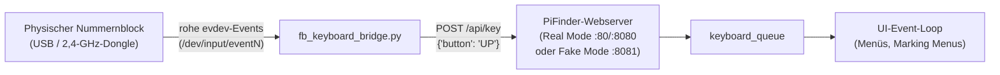
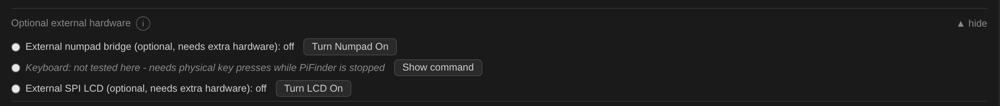
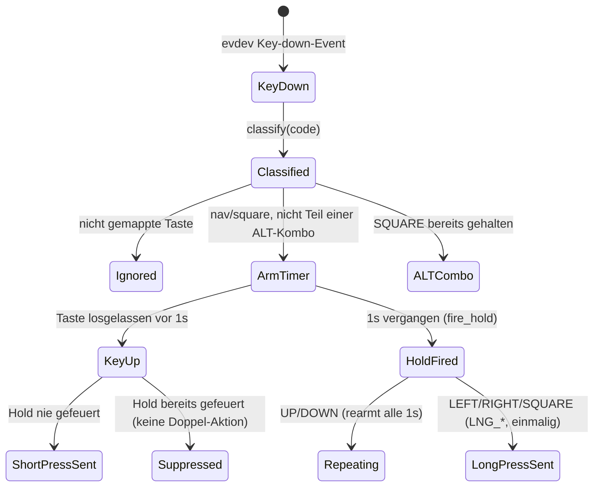

# Keyboard Bridge: Numpad-als-Tastatur-Dokumentation

*[English version](Readme_KeyboardBridge.md)*

> ### ✅ Getestet und verifiziert gegen
>
> * Testgerät: **LogiLink ID0120** (2,4-GHz-USB-Dongle-Nummernblock, keine eigenen Pfeiltasten)
> * Python-Paket **evdev**, jeder Linux-Kernel mit `/dev/input/eventN`-Nodes (kein X11 nötig)
> * Hängt nur von PiFinders stabiler `POST /api/key`-Remote-API ab — kein
>   PiFinder-versionsspezifisches Verhalten. Getestete PiFinder- / StellarMate-OS- / Pi-Kombinationen:
>   s. die [Versionskompatibilitäts-Tabelle in README.md](README.md#version-compatibility).

Dieses Dokument beschreibt die **Keyboard Bridge** (`test_tools/fb_keyboard_bridge.py`) — einen
kleinen, von PiFinders eigenem Code unabhängigen Prozess, der aus einem beliebigen
USB-/2,4-GHz-Dongle-Nummernblock ein voll funktionsfähiges PiFinder-Eingabegerät macht. Begleitet das
Haupt-[README.md](README.md) und [Readme_ControlCenter.md](Readme_ControlCenter.md), das den
Umschalt-Button dokumentiert, der diese Bridge startet und stoppt.

---

## Inhaltsverzeichnis

1. [Warum das existiert](#warum-das-existiert)
2. [Architektur](#architektur)
3. [Tastenbelegung](#tastenbelegung)
4. [Verhaltensgleichheit mit der echten Tastatur](#verhaltensgleichheit-mit-der-echten-tastatur)
5. [Installation & bebilderte Anleitung](#installation--bebilderte-anleitung)
6. [Technische Referenz](#technische-referenz)
7. [Selbstheilung & Persistenz](#selbstheilung--persistenz)
8. [Bekannte Einschränkungen & Fehlerbehebung](#bekannte-einschränkungen--fehlerbehebung)
9. [Entwicklung & Testing](#entwicklung--testing)
10. [Roadmap](#roadmap)
11. [Versionskompatibilität](#versionskompatibilität)

---

## Warum das existiert

PiFinders echtes Eingabegerät ist ein Tastatur-HAT an GPIO (über `keyboard_pi.py` ausgelesen). Ein
reiner HAT-Pfad hat zwei Nachteile:

1. **Kein hardware-freies Testen.** Jede UI-Änderung braucht die physische Einheit in der Hand —
   kein Bench-Test, keine CI.
2. **GPIO-Konkurrenz.** Die HAT-Tastatur teilt sich GPIO-Leitungen mit anderer Zusatz-Hardware
   (z. B. der Geekworm-X1203-USV / GPIO-16-Konflikt — s. das Kompatibilitäts-Banner im
   Haupt-[README.md](README.md)). Ein Wireless-Nummernblock umgeht das, ist leichter und
   stromsparender.

Die Keyboard Bridge liest rohe Tastenereignisse von **jedem** Linux-Eingabegerät (`evdev`) und
leitet sie an PiFinders stabile `POST /api/key`-Remote-API weiter — denselben Endpunkt, den die
Web-UI-Tastatur, `pf_remote.py` und die Setup-GUI nutzen. Kein PiFinder-Quellcode wird angefasst;
die Bridge ist ein reiner Client einer öffentlichen API.


```mermaid
flowchart LR
    numpad["Physischer Nummernblock<br/>(USB / 2,4-GHz-Dongle)"] -->|"rohe evdev-Events<br/>(/dev/input/eventN)"| bridge["fb_keyboard_bridge.py"]
    bridge -->|"POST /api/key<br/>{'button': 'UP'}"| pifinder["PiFinder-Webserver<br/>(Real Mode :80/:8080<br/>oder Fake Mode :8081)"]
    pifinder --> keyboard_queue["keyboard_queue"]
    keyboard_queue --> ui["UI-Event-Loop<br/>(Menüs, Marking Menus)"]
```

---

## Architektur

Die Bridge ist bewusst **von PiFinders eigenem Prozess und Code entkoppelt**:

- **Kein geteilter Zustand, kein Import von PiFinder-Modulen.** Sie ruft nur dieselbe HTTP-API auf,
  die jeder externe Client auch aufrufen könnte. Ein Bug in der Bridge kann PiFinder selbst also nie
  zum Absturz bringen, und eine PiFinder-Code-Änderung kann die Bridge syntaktisch nie stillschweigend
  brechen (nur ihr *Verhalten*, falls sich der API-Vertrag ändert).
- **Erkennt beide Enden automatisch.** Das Ziel-Tastaturgerät wird gefunden, indem `/dev/input/*`
  nach einem Gerät durchsucht wird, das `KEY_ENTER` plus entweder `KEY_KP1` (Nummernblock) oder
  `KEY_A` (Vollständige Tastatur) meldet — das überspringt den Waveshare-Touchscreen und den
  Power-Button, die sich ebenfalls als generische Eingabegeräte melden. Die Ziel-PiFinder-Instanz
  wird gefunden, indem die Ports 80, 8080 und 8081 (Real Modes zwei mögliche Ports, dann Fake Mode)
  angefragt werden und verifiziert wird, dass die Antwort tatsächlich ein PiFinder-Screenshot ist,
  nicht irgendein unabhängiger Dienst, der zufällig auf diesem Port antwortet (dieselbe
  nginx-auf-Port-80-Falle, vor der sich auch `fb_screen_mirror.py` schützt).
- **Stdlib + eine Abhängigkeit.** Nur `evdev` (zum Lesen roher Eingabeereignisse) und `Pillow` (nur
  genutzt, um zu verifizieren, dass die Auto-Probe-Antwort tatsächlich ein Bild ist) werden über die
  Standardbibliothek hinaus gebraucht — einmalig in PiFinders eigenes venv installiert, getrackt in
  `bin/requirements_additional.txt`, damit ein venv-Rebuild diese Abhängigkeit nicht wieder
  stillschweigend verliert (ist genau einmal passiert).

---

## Tastenbelegung

Abgestimmt auf ein reines Nummernblock-Gerät ohne eigene Pfeiltasten. Die Belegung ist **komplett
unabhängig vom NumLock-Zustand** — wichtig für einen kabellosen Nummernblock, bei dem es keine
verlässliche Möglichkeit gibt, dessen NumLock-LED remote zu lesen oder zu setzen:

| Physische Taste | PiFinder-Aktion |
|---|---|
| `NumLock` | LEFT |
| `/` | UP |
| `*` | DOWN |
| `Backspace` | RIGHT |
| `+` | PLUS |
| `-` | MINUS |
| `Enter` | SQUARE |
| `0`–`9` | Immer normale Ziffern (Katalognummer-Eingabe usw.) |

Echte, dedizierte Pfeiltasten (`KEY_LEFT/RIGHT/UP/DOWN`) werden ebenfalls direkt gemappt, unabhängig
vom obigen Remap — falls dieses Skript jemals an eine vollständige Tastatur statt eines reinen
Nummernblocks angeschlossen wird, funktionieren Pfeiltasten ohne jede Konfigurationsänderung.

**Warum NumLock-Unabhängigkeit hier speziell wichtig ist:** das Testgerät ist ein 2,4-GHz-Wireless-Dongle,
keine kabelgebundene Tastatur — es gibt keine verlässliche Möglichkeit, seinen NumLock-LED-Status
remote auszulesen (oder zu setzen). Jedes Design, das Verhalten vom NumLock-Zustand auf dieser
Geräteklasse abhängig macht, ist konstruktionsbedingt fragil; die aktuelle, feste Zuordnung
unabhängig vom NumLock-Zustand beseitigt diese gesamte Fehlerklasse, statt nur um sie herumzuarbeiten.

---

## Verhaltensgleichheit mit der echten Tastatur

Die Bridge repliziert drei Verhaltensweisen aus `keyboard_pi.py`, damit sich die Muskelerinnerung
zwischen dem echten HAT und diesem Ersatz überträgt:

1. **Wiederholung bei gehaltener UP/DOWN-Taste.** Halten löst den kurzen Druck alle ~1 Sekunde
   erneut aus, für schnelles Scrollen durch Listen.
2. **Langer Druck für LEFT/RIGHT/SQUARE.** Halten über >1 Sekunde sendet beim Loslassen die
   `LNG_*`-Variante statt der kurzen Aktion (`LNG_LEFT` = "zurück zum obersten Menü", `LNG_SQUARE`
   öffnet/navigiert ein Marking Menu).
3. **SQUARE als Modifier (ALT-Kombos).** Enter/SQUARE gehalten während eine andere gemappte Taste
   gedrückt wird, sendet die `ALT_*`-Variante dieser Taste — passend zum vollständigen Satz an
   `ALT_*`-Aktionen, die auf echter Hardware existieren (`ALT_0`, `ALT_PLUS`, `ALT_MINUS`,
   `ALT_LEFT/UP/DOWN/RIGHT`).

Zwei unabhängige Signale für zwei unabhängige Fragen: `hold_timers` = läuft noch ein Hold-Timer;
`fired_codes` = hat ein Hold bereits gefeuert (geschrieben von `fire_hold()` vor jeglicher
Netzwerk-I/O, gelesen und geleert vom Key-up-Handler). Der Key-up-Handler schließt nie aus
`hold_timers`, ob der Hold gefeuert hat — `fire_hold()` entfernt sich selbst beim Feuern aus
`hold_timers`, das würde also racen und einen überzähligen kurzen Druck beim Loslassen senden.

---

## Installation & bebilderte Anleitung

Ausgeliefert als systemd-Unit (`pifinder-numpad-bridge.service`), umgeschaltet über das Control
Center — s. [Readme_ControlCenter.md](Readme_ControlCenter_de.md#hardware--peripheriegeräte) für
den Umschalt-Button selbst. Für den Normalgebrauch ist nichts manuell zu konfigurieren;
`pifinder_stellarmate_setup.sh` installiert die Unit-Datei und die `evdev`-Abhängigkeit bei jedem
Install/Update automatisch.

```bash
# Manuelle Installation (normalerweise übernimmt das pifinder_stellarmate_setup.sh für dich):
sudo cp pi_config_files/pifinder-numpad-bridge.service /etc/systemd/system/
sudo systemctl daemon-reload

# Über den "Turn Numpad On/Off"-Button im Control Center, oder manuell:
sudo systemctl enable --now pifinder-numpad-bridge.service   # an, übersteht Reboots
sudo systemctl disable --now pifinder-numpad-bridge.service  # aus, übersteht Reboots
```

<table>
<tr>
<td align="center">
<a href="docs/images/readme/cc_numpad_row.png"></a><br>
<sub>Der <strong>Turn Numpad On/Off</strong>-Schalter im Control Center — in der Kachel <em>Simulation, Test and Power</em>, unter <em>Hardware test and details → Optional external hardware</em>. Kein Reboot; funktioniert gegen Real- oder Fake-Mode.</sub>
</td>
</tr>
</table>

<table>
<tr>
<td align="center">
<a href="docs/images/readme/keyboard_brigde_and_lcd.png"></a><br>
<sub>Keyboard Bridge und externes SPI-LCD im tatsächlichen Zusammenspiel — der Nummernblock als
Ersatz für die physische Tastatur, das LCD als Spiegel von PiFinders OLED-Ausgabe, beide unabhängig
voneinander angebunden (s.
<a href="Readme_ControlCenter_de.md#hardware--peripheriegeräte">Readme_ControlCenter_de.md</a> für
den LCD-Toggle).</sub>
</td>
</tr>
</table>

Direkt für manuelles Testen/Debugging ausführen (erkennt sowohl Gerät als auch PiFinder-Instanz
automatisch). Zur Klarstellung: `fb_keyboard_bridge.py` selbst ist **ein eigenes Skript dieses
Projekts** (`PiFinder_Stellarmate/test_tools/`, nicht Teil von PiFinders eigenem Code) — der
folgende Befehl führt es nur zufällig mit PiFinders eigenem venv-Python-Interpreter aus, weil dort
die einzige Abhängigkeit (`evdev`) installiert ist (s. [Architektur](#architektur) oben);
`PiFinder_Stellarmate` hat kein eigenes venv:

```bash
cd ~/PiFinder_Stellarmate
/home/stellarmate/PiFinder/python/.venv/bin/python3 test_tools/fb_keyboard_bridge.py
```

Optionale Flags: `--device /dev/input/eventN` (Auto-Erkennung überspringen), `--base-url
http://127.0.0.1:8081` (explizit eine bestimmte Instanz ansprechen, z. B. Fake Mode).

---

## Technische Referenz

### `classify(code)` — der einzige Dispatch-Punkt

Jeder evdev-Keycode wird genau einmal in eine von vier Arten klassifiziert, was den Rest der
Event-Loop frei von verstreuten Per-Taste-`if`-Ketten hält:

| Art | Bedeutung | Quell-Dict |
|---|---|---|
| `"square"` | Enter/KPEnter | `SQUARE_KEYS` |
| `"nav"` | LEFT/UP/DOWN/RIGHT | `FIXED_NAV` |
| `"btn"` | PLUS/MINUS | `FIXED_BTN` |
| `"digit"` | 0–9 | `ALWAYS_DIGIT` |

### `send(button)` — die einzige Stelle mit Netzwerkaufruf

Jede Tastenaktion läuft durch genau eine Funktion, die die Ziel-URL auflöst (nach der ersten
erfolgreichen Probe gecacht) und diesen Cache bei einem Fehlschlag leert — s.
[Selbstheilung & Persistenz](#selbstheilung--persistenz) unten.

### Vollständige Event-Zustandsmaschine


```mermaid
stateDiagram-v2
    [*] --> KeyDown: evdev Key-down-Event
    KeyDown --> Classified: classify(code)
    Classified --> Ignored: nicht gemappte Taste
    Classified --> ArmTimer: nav/square, nicht Teil einer ALT-Kombo
    Classified --> ALTCombo: SQUARE bereits gehalten
    ArmTimer --> KeyUp: Taste losgelassen vor 1s
    ArmTimer --> HoldFired: 1s vergangen (fire_hold)
    HoldFired --> Repeating: UP/DOWN (rearmt alle 1s)
    HoldFired --> LongPressSent: LEFT/RIGHT/SQUARE (LNG_*, einmalig)
    KeyUp --> ShortPressSent: Hold nie gefeuert
    KeyUp --> Suppressed: Hold bereits gefeuert (keine Doppel-Aktion)
```

---

## Selbstheilung & Persistenz

Zwei unabhängige Probleme, zwei unabhängige Fixes:

- **Persistenz über Reboots hinweg**: verwaltet als echte systemd-Unit (`Type=simple`,
  `Restart=always`), umgeschaltet über den Control-Center-Button — systemds eigener
  Enabled-Zustand ist das, was einen Reboot übersteht, nicht eine Variable im Arbeitsspeicher. Das
  ersetzte ein früheres Design, das ein einfaches `Popen`-Objekt innerhalb des Control-Center-eigenen
  Server-Prozesses trackte, was einen Reboot des ganzen Pi natürlich gar nicht überstehen konnte.
- **Selbstheilung über einen Fake/Real-Mode-Wechsel hinweg**: ein Moduswechsel ändert, **welcher
  Port** tatsächlich erreichbar ist (Real Mode: 80/8080, Fake Mode: 8081). Statt bei jedem
  Moduswechsel explizit gestoppt und neu gestartet zu werden (das ursprüngliche Design, später als
  unnötig erkannt), verwirft `send()` seine gecachte Ziel-URL in dem Moment, in dem ein Sendeversuch
  fehlschlägt — das zwingt den allernächsten Tastendruck, von Grund auf neu zu proben. Keinerlei
  Überwachung von außerhalb des Prozesses ist nötig.

---

## Bekannte Einschränkungen & Fehlerbehebung

- **Keine visuelle Rückmeldung, wenn keine PiFinder-Instanz erreichbar ist.** Die Bridge gibt nur
  stdout/Journal aus — läuft weder Real noch Fake Mode, werden Tastendrücke stillschweigend
  verworfen (mit Log-Zeile), bis eine Instanz erscheint. `journalctl -u
  pifinder-numpad-bridge.service -f` prüfen, wenn Tasten scheinbar nichts tun.
- **Braucht bereits laufendes PiFinder.** Der "Turn Numpad On"-Button im Control Center weigert sich
  explizit, die Bridge zu starten, wenn weder Fake noch Real Mode gerade laufen (es gäbe nichts, an
  das gesendet werden könnte) — erst PiFinder starten.

---

## Entwicklung & Testing

- Eigenständig gegen Fake Mode für einen komplett hardware-freien Testzyklus ausführen:
  `test_tools/fake_mode.sh start`, dann `fb_keyboard_bridge.py --base-url http://127.0.0.1:8081`.
- `keypad_gpio_matrix_test.py` (gleiches `test_tools/`-Verzeichnis) ist die entsprechende
  Roh-Hardware-Diagnose für die **echte** HAT-Tastatur — nützlich, um ein Bridge-Problem von einem
  physischen Tastatur-Problem zu unterscheiden, wenn etwas nicht wie erwartet reagiert.
- Für die Bridge selbst existiert bisher keine automatisierte Testsuite (s. Roadmap).

---

## Roadmap

Die projektweite Ausrichtung (v2.x / v3.x) steht im Haupt-[README.md](README.md#roadmap).
Getrackte, priorisierte Arbeit liegt im [GitHub-Projekt](https://github.com/users/apos/projects/15)
([Roadmap-Ansicht](https://github.com/users/apos/projects/15/views/4)); ausgelieferte Änderungen
stehen im [CHANGELOG.md](CHANGELOG.md).

---

## Versionskompatibilität

Die PiFinder- / StellarMate-OS- / Pi-Testmatrix wird an einer Stelle gepflegt — der
[Versionskompatibilitäts-Tabelle im Haupt-README.md](README.md#version-compatibility).

Die Bridge hängt nur von PiFinders `POST /api/key`-Remote-API ab, die über jede von diesem Projekt
anvisierte PiFinder-Version hinweg stabil geblieben ist — kein PiFinder-versionsspezifisches
Verhalten in der Bridge selbst.

## Siehe auch

- [Readme_ControlCenter_de.md](Readme_ControlCenter_de.md) — der Umschalt-Button, der diese Bridge
  startet/stoppt, und der geschwisterliche "External SPI LCD"-Toggle für hardwarefreie
  Display-Tests.
- [README.md](README.md) — Basis-Installation, die Versionsmatrix und die Projekt-Roadmap.

---

<p align="center">
  <br>
  © github.com/apos 2026<br>
  <em>Unofficial community project, not affiliated with StellarMate or PiFinder.</em>
</p>
