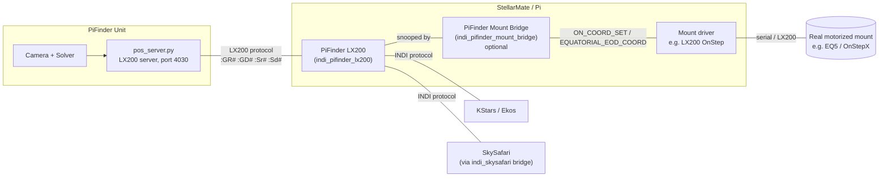
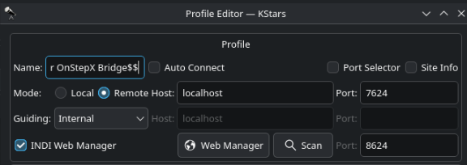
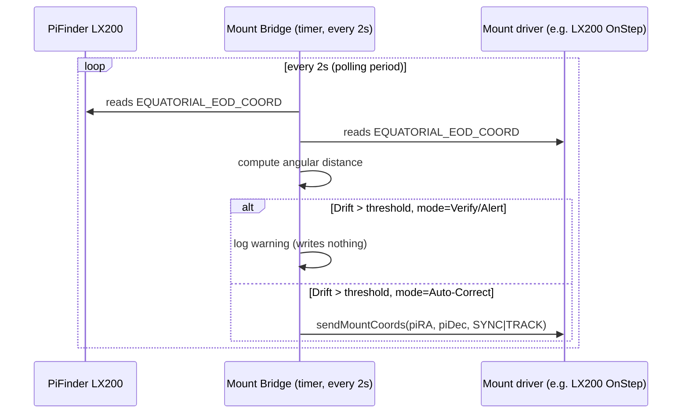

# PiFinder LX200 INDI Integration

*[Deutsche Version](Readme_PiFinder_LX200_de.md)*

> ### ✅ Built & verified against
>
> * **PiFinder software 2.6.0**
> * **StellarMate OS 2.2.1** (Arch Linux)
> * **libindi 2.2.2** (system package — no INDI source checkout needed)
> * Real hardware: Raspberry Pi 4 + PiFinder unit + **Skywatcher EQ5 with an OnStepX controller** (`indi_lx200_OnStep` 1.27)
>
> If you're on different versions, the concepts below still apply, but property names/behavior of
> third-party mount drivers (like OnStep) may differ slightly between libindi releases.

This document covers the **INDI integration layer** that connects PiFinder to KStars/Ekos,
SkySafari, and (optionally) a real motorized mount. It is a companion to the main
[README.md](README.md), which covers the base PiFinder-on-StellarMate installation.

---

## Table of Contents

1. [Basic Functionality (Overview)](#basic-functionality-overview)
2. [The Three Building Blocks](#the-three-building-blocks)
3. [Installation & Illustrated Guide](#installation--illustrated-guide)
4. [Technical Reference](#technical-reference)
5. [Code, Deployment & Strategy](#code-deployment--strategy)
6. [Known Limitations & Troubleshooting](#known-limitations--troubleshooting)
7. [Version Compatibility](#version-compatibility)

---

## Basic Functionality (Overview)

PiFinder is a **push-to plate-solving aid** — it has a camera and a solver, but **no motor**. It
tells you *where the telescope is currently pointed* and, given a target, *which way to push it*.
This integration makes that information available to the standard astronomy software ecosystem via
INDI, and optionally couples it to a real motorized mount so PiFinder can act as an automatic
alignment/GoTo source instead of a manual push-to aid.

Three independent, separately-deployable pieces work together:



| Component | What it is | Required? |
|---|---|---|
| **PiFinder LX200** (`indi_pifinder_lx200`) | INDI telescope driver. Reports PiFinder's solved position; forwards GoTo requests to PiFinder as a push-to target. | Yes — this is the core integration. |
| **PiFinder Mount Bridge** (`indi_pifinder_mount_bridge`) | Optional INDI auxiliary driver. Couples PiFinder's position to *any* real INDI mount driver, generically (never speaks a mount-specific protocol). | Only if you have a motorized mount you want PiFinder to talk to. |
| A real mount's own INDI driver (e.g. `indi_lx200_OnStep`) | Not part of this project — whatever driver your mount normally uses. | Only if you have a motorized mount. |

Two practical use cases this covers:

1. **Pure push-to** (Dobson, manual Alt-Az, EQ platform): only "PiFinder LX200" is needed. KStars and
   SkySafari show where the telescope is pointed and let you select a GoTo target, which shows up on
   PiFinder's own screen as push-to arrows.
2. **PiFinder + real motorized mount**: add the Mount Bridge. Depending on the chosen *coupling
   mode*, PiFinder can passively verify the mount's alignment, periodically correct drift, or
   directly drive the mount's GoTo — see [Coupling modes](#the-mount-bridge-coupling-dial)
   below.

---

## The Three Building Blocks

### 1. PiFinder LX200 (`indi_pifinder_lx200`)

- A standalone INDI telescope driver, built directly against the system `libindi` package (no INDI
  source checkout, no fat multi-driver binary — see
  [Why a standalone build](#why-a-standalone-build-instead-of-a-fat-binaryindi-source-checkout)).
- Connects to PiFinder's own built-in LX200 server (`pos_server.py`, TCP port **4030**) — the same
  server PiFinder's SkySafari support already uses.
- Capabilities: `TELESCOPE_CAN_GOTO`, `TELESCOPE_CAN_ABORT`, `TELESCOPE_HAS_TIME`,
  `TELESCOPE_HAS_LOCATION`. Deliberately **no** `TELESCOPE_CAN_SYNC`, no Park/Flip/tracking-rate
  control, no custom alignment protocol — PiFinder has no motor and nothing to synchronize about
  itself (see [Property reference](#property-reference-pifinder-lx200) for why).
- Source: [`indi_pifinder/lx200_pifinder.cpp`](indi_pifinder/lx200_pifinder.cpp) /
  [`.h`](indi_pifinder/lx200_pifinder.h)

### 2. PiFinder Mount Bridge (`indi_pifinder_mount_bridge`)

- A separate, optional INDI auxiliary driver (device family "Auxiliary", not "Telescope" — it isn't
  itself a mount).
- Contains an **embedded INDI client** (`INDI::BaseClient`, same pattern as the stock
  `indi_skysafari` driver) that connects to the local `indiserver` as a normal client and snoops two
  devices: the active "PiFinder" device and the active "Mount" device.
- Speaks **only generic INDI telescope properties** to the mount (`EQUATORIAL_EOD_COORD`,
  `ON_COORD_SET`) — it never needs to know which mount firmware is behind the driver. This is what
  makes it work with *any* INDI-supported mount, not just OnStepX.
- Source: [`indi_pifinder_bridge/pifinder_mount_bridge.cpp`](indi_pifinder_bridge/pifinder_mount_bridge.cpp)
  / [`.h`](indi_pifinder_bridge/pifinder_mount_bridge.h),
  [`pifinder_bridge_client.cpp`](indi_pifinder_bridge/pifinder_bridge_client.cpp) /
  [`.h`](indi_pifinder_bridge/pifinder_bridge_client.h)

### The Mount Bridge: Coupling Dial

One property (`BRIDGE_MODE`, labelled "Coupling" in the UI) selects how tightly PiFinder and the
real mount are coupled:

| Mode | Behavior | When it makes sense |
|---|---|---|
| **Off** | No coupling at all. Pure push-to. | Dobson, no motor. |
| **Verify/Alert only** | Continuously compares PiFinder's solved position to the mount's reported position; logs a warning if they disagree by more than the configured threshold. Never writes to the mount. | Astrophotography: a passive "is my mount still correctly aligned?" sanity check. |
| **Auto-correct on drift** | Same comparison, but if drift exceeds the threshold, automatically sends a `Sync` or `Goto/Track` (configurable via `CORRECTION_ACTION`) to the mount. | Manual push-to-then-correct workflows: you slew by hand until PiFinder shows on-target, the Bridge picks up the resulting drift and straightens the mount out afterwards. |
| **Goto-Forward** *(new)* | Event-driven: the moment PiFinder receives a **new** GoTo/push-to target (from its own UI, from KStars, or from SkySafari→PiFinder), the Bridge immediately sends a real `Goto` to the mount. After the mount finishes slewing, it waits for a fresh PiFinder solve and auto-corrects any residual with a `Sync`. | Standalone visual use: PiFinder is the single GoTo interface, the mount just executes. |

There's also a **Manual (one-shot)** control (`MANUAL_TRIGGER`: "Sync Now" / "Goto Now") that works
regardless of the selected mode — useful for a single manual correction without switching modes.

---

## Installation & Illustrated Guide

### Prerequisites

- StellarMate OS with PiFinder installed (see [README.md](README.md))
- `cmake`, a C++ compiler, and the `libindi` package (already present on StellarMate OS)
- A running `indiserver` — either started manually or (recommended) via the StellarMate
  Web Manager as an **Equipment Profile**

### Step 1: Build and install the drivers

`pifinder_stellarmate_setup.sh` does this for you automatically: it stops any already-running
driver instance first (to avoid "Text file busy"), builds and installs both drivers, and restarts
the StellarMate Web Manager so they show up in its catalog. Nothing to do here on a normal install.

You only need to run the build scripts yourself if you want to rebuild just the drivers without
rerunning the whole setup (e.g. after pulling a driver-only code change):

```bash
cd ~/PiFinder_Stellarmate
bash bin/build_indi_driver.sh     # PiFinder LX200
bash bin/build_indi_bridge.sh     # PiFinder Mount Bridge (only if you want to couple a real mount)
```

If a driver is already running (e.g. started via the Web Manager), stop it first — otherwise the
install fails with "Text file busy".

**Important:** The StellarMate Web Manager (`stellarmatewebmanager`, port 8624) reads its driver
catalog **only at its own process startup**. After a manual rebuild (or a driver version change),
restart it once:

```bash
systemctl --user restart stellarmatewebmanager.service
```

This must run from the actual GUI/VNC desktop session, not from a plain SSH session.

### Step 2: Create an equipment profile in the Web Manager

Open `http://<pi-address>:8624` in a browser.


- **Driver Source**: "System INDI Drivers"
- Under "Telescopes": add **PiFinder LX200**, and optionally your real mount's driver
  (e.g. "LX200 OnStep")
- Under "Auxiliary": add **PiFinder Mount Bridge** (only if you want it)
- Save the profile, click **Start**

### Step 3: INDI Control Panel — connect the devices

The tab strip at the top shows all three devices side by side once the profile is running.

Connect **PiFinder LX200**:
- Tab "PiFinder LX200" → Connection
- Connection Mode: **TCP**, Address `127.0.0.1`, Port **`4030`**
- Click "Connect"

Then check the "Main Control" tab — it's also directly visible there that "On Set" only offers
**Track/Slew**, no Sync (see [What happens on a GoTo](#what-happens-on-a-goto-to-pifinder-lx200)).

Connect **your real mount** (OnStepX example): pick the serial port or TCP connection as
appropriate, then "Connect".

Connect **PiFinder Mount Bridge** (if used):
- Tab "PiFinder Mount Bridge" → subtab "Options" → "Active devices" → set `PiFinder` and `Mount`
  to the correct device names (e.g. "PiFinder LX200" / "LX200 OnStep")
- Click "Connect" (Main Control tab)
- Then set "Coupling" to the mode you want (see the table above)

Click any thumbnail below for the full-size screenshot:

<table>
<tr>
<td align="center" width="50%">
<a href="docs/images/pfinder_lx200/indi_control_panel_tabs_PiFinder_LX200_connection.png"></a><br>
<sub>All three tabs; PiFinder LX200 → Connection (TCP 127.0.0.1:4030)</sub>
</td>
<td align="center" width="50%">
<a href="docs/images/pfinder_lx200/indi_control_panel_tabs_PiFinder_LX200_main.png"></a><br>
<sub>PiFinder LX200 → Main Control: only Track/Slew, no Sync</sub>
</td>
</tr>
<tr>
<td align="center" width="50%">
<a href="docs/images/pfinder_lx200/indi_control_panel_tabs_PiFinder_Mount_Bridge_options.png"></a><br>
<sub>Mount Bridge → Options: Active devices set</sub>
</td>
<td align="center" width="50%">
<a href="docs/images/pfinder_lx200/indi_control_panel_tabs_PiFinder_Mount_Bridge_main.png"></a><br>
<sub>Mount Bridge → Main Control: Coupling, Manual trigger, Drift status</sub>
</td>
</tr>
</table>

### Step 4: KStars/Ekos (Remote mode)

**Critical: the Ekos profile must use "Remote Host" mode, not "Local".** The StellarMate App and
Flatpak KStars each have their **own, independent driver catalogs**, which don't read
`/usr/share/indi/drivers.xml` live — in **Local** mode, Ekos tries to launch drivers itself from
that local catalog and will never find our custom-built ones. In **Remote Host** mode, Ekos
doesn't launch or look up anything locally at all: it's purely a network client of the
`indiserver` that the Web Manager already started, so it doesn't matter which driver catalog Ekos
itself has.

- Ekos Profile Editor → **Mode: Remote Host** (not "Local"!), Host `localhost`, Port **`7624`**
  (the `indiserver` port from the Web Manager profile)
- Also enable **"INDI Web Manager"**, Port **`8624`** — this lets Ekos talk to the Web Manager's
  own API (so its Start/Stop controls act on the remote profile), and the **"Scan"** button can
  auto-discover it on the network instead of typing the host manually
- Click "Start" → Ekos connects to the running server → every device already connected appears
  automatically in the INDI Control Panel / Mount tab

Right-clicking a star shows both devices as separate targets in the context menu — the red
crosshair markers show where PiFinder is currently "looking" versus where the mount actually is
(deliberately far apart here, for illustration). The "PiFinder LX200" submenu expanded shows only
**Goto / Abort / Find Telescope**, no Sync (see
[Why no TELESCOPE_CAN_SYNC?](#why-no-telescope_can_sync)). Click any thumbnail for the full-size
screenshot:

<table>
<tr>
<td align="center" width="33%">
<a href="docs/images/pfinder_lx200/kstars_indi_remote_webmanager.png"></a><br>
<sub>Ekos Profile Editor: Mode "Remote Host", Host localhost, Port 7624, INDI Web Manager enabled</sub>
</td>
<td align="center" width="33%">
<a href="docs/images/pfinder_lx200/kstars_context_menu_both_mount_and_pifinder.png"></a><br>
<sub>Sky map: PiFinder and mount as separate target devices in the context menu</sub>
</td>
<td align="center" width="33%">
<a href="docs/images/pfinder_lx200/kstars_context_menu_PiFinder_LX200.png"></a><br>
<sub>"PiFinder LX200" submenu: only Goto, Abort, Find Telescope</sub>
</td>
</tr>
</table>

### Step 5: Connecting SkySafari

SkySafari does **not** connect directly to port 7624; instead it goes through the bundled
**"SkySafari"** driver (`indi_skysafari`), which acts as its own LX200 bridge listening on port
**9624**:

- Add the "SkySafari" driver to the profile too and start it
- Tab "SkySafari" → Options → set **Active devices → Telescope** to **"PiFinder LX200"**
  (the default is often "Telescope Simulator"!). After changing it: briefly disconnect/reconnect
  the SkySafari driver.
- In the SkySafari app: enter the StellarMate box's server IP, **port 9624**


SkySafari itself needs no PiFinder-specific profile — it speaks generic LX200 to the
`indi_skysafari` driver, which (via `ACTIVE_DEVICES` → Telescope) points at "PiFinder LX200".

Full connection stack, for reference:

```
SkySafari app ──(LX200, port 9624)──> indi_skysafari ──(INDI, snoops ACTIVE_TELESCOPE)──┐
                                                                                          ↓
KStars/Ekos (Remote, port 7624) ─────────────(INDI protocol)───────────────────> PiFinder LX200
                                                                                          │
                                                                                   (LX200, port 4030)
                                                                                          ↓
                                                                                  PiFinder pos_server.py
```

---

## Technical Reference

### LX200 commands: PiFinder LX200 ↔ PiFinder's own server

The driver talks to PiFinder's own `pos_server.py` (port 4030) using a small, fixed subset of the
LX200 protocol — the same commands PiFinder's existing SkySafari support already uses:

| Command | Direction | Purpose | Driver code |
|---|---|---|---|
| `#:GR#` | Driver → PiFinder | Query current right ascension (HH:MM:SS) | `ReadScopeStatus()` |
| `#:GD#` | Driver → PiFinder | Query current declination (+/-DD*MM'SS) | `ReadScopeStatus()` |
| `:Sr<RA>#` | Driver → PiFinder | Set target RA (part of a push-to/GoTo) | `Goto()` |
| `:Sd<DEC>#` | Driver → PiFinder | Set target DEC — triggers `handle_goto_command()` on PiFinder's side once both coordinates are set | `Goto()` |

**No Sync command** (`:CM#` or similar) is ever sent — there's nothing to synchronize on
PiFinder's side (see below).

**Polling:** `ReadScopeStatus()` is called regularly by the INDI base class (default every 1000ms)
and queries `:GR#`/`:GD#` fresh on every cycle.

**Important performance fix:** PiFinder terminates every response with `#` and then sends nothing
more. A naive `tty_read()` would block until the full timeout (several seconds) instead of
returning immediately after the `#` — this caused a 6–10 second lag per position update in an
earlier driver version. Fixed with `tty_nread_section(fd, response, max_len, '#', timeout,
&nbytes_read)`, which reads exactly up to the terminator.

### What happens on a GoTo to "PiFinder LX200"?

Important to understand, since there's no slew animation: `Goto()` sends `:Sr#`/`:Sd#` to
PiFinder's own server, which registers a new **push-to target** from it (the same mechanism as a
SkySafari push-to, or a manual object selection directly on PiFinder). PiFinder's own reported
position (`:GR#`/`:GD#`) does **not** change as a result — that comes independently from the live
plate-solve. `TrackState` is set to `SCOPE_IDLE` immediately (never `SLEWING`), because nothing
physically happens as long as no Mount Bridge is attached.

### Why no `TELESCOPE_CAN_SYNC`?

Sync normally means "correct your internal position model to this value". PiFinder has no such
model — it reports the freshly solved actual position on every frame, there's nothing to correct.
Feeding a "sync" back onto PiFinder's position does make sense, though — that's exactly the job of
the **Mount Bridge** (Sync/Goto *to the mount*, not to PiFinder).

### Property reference: PiFinder LX200

Standard `INDI::Telescope` properties this driver actually uses/enables (a selection, not
exhaustive — see `LX200Telescope`/`INDI::Telescope` in libindi for details):

| Property | Type | Purpose |
|---|---|---|
| `CONNECTION` | Switch | Connect/Disconnect |
| `DEVICE_ADDRESS` | Text | TCP target address/port (default `127.0.0.1:4030`) |
| `EQUATORIAL_EOD_COORD` | Number (read-only for display, written on Goto) | Current RA/DEC |
| `TARGET_EOD_COORD` | Number (managed by the base class itself) | Last commanded GoTo target — **this** is the property the Mount Bridge snoops to detect new push-to requests (see below) |
| `ON_COORD_SET` | Switch | Only `TRACK` available (no `SYNC`, no separate `SLEW`) |
| `TELESCOPE_ABORT_MOTION` | Switch | Abort (essentially a no-op since there's no motor, but part of the base capability) |

### Property reference: PiFinder Mount Bridge

| Property | Type | Elements | Purpose |
|---|---|---|---|
| `BRIDGE_SETTINGS` | Text | `INDISERVER_HOST`, `INDISERVER_PORT` | Where the internal client finds the `indiserver` (default `localhost:7624`) |
| `ACTIVE_DEVICES` | Text | `ACTIVE_PIFINDER`, `ACTIVE_MOUNT` | Which two devices are snooped |
| `BRIDGE_MODE` | Switch (1oM) | `MODE_OFF`, `MODE_VERIFY_ALERT`, `MODE_AUTO_CORRECT`, `MODE_GOTO_FORWARD` | Coupling degree, see table above |
| `CORRECTION_ACTION` | Switch (1oM) | `ACTION_SYNC`, `ACTION_GOTO` | What `MODE_AUTO_CORRECT` does when drift is exceeded |
| `MANUAL_TRIGGER` | Switch | `TRIGGER_SYNC_NOW`, `TRIGGER_GOTO_NOW` | Immediate action, independent of mode |
| `DRIFT_THRESHOLD` | Number | `THRESHOLD_ARCMIN` (default 5.0) | Threshold for drift alert/correction |
| `DRIFT_STATUS` | Number (read-only) | `DRIFT_ARCMIN` | Currently computed angular distance PiFinder↔mount |

The Bridge sends **only** generic INDI standard properties to the mount: `EQUATORIAL_EOD_COORD`
(target RA/DEC) + `ON_COORD_SET` (switch `SYNC` or `TRACK`) — never a mount-specific command.
That's the core design that makes the Bridge generic across any INDI mount.

### Data flow: Auto-Correct / Verify-Alert (drift polling)



### Data flow: Goto-Forward (event-driven)

```mermaid
stateDiagram-v2
    [*] --> IDLE
    IDLE --> IDLE: TARGET_EOD_COORD unchanged
    IDLE --> SLEWING: new target detected\n→ Goto/Track sent to mount
    SLEWING --> SLEWING: mount still busy
    SLEWING --> SETTLING: mount finished slewing
    SETTLING --> SETTLING: settle ticks (3× poll cycle)\nwaiting for a fresh PiFinder solve
    SETTLING --> IDLE: drift computed;\nSync sent if exceeded
```



Why a settle delay? After the mount it's mounted on physically moves, PiFinder needs a moment to
solve again — the Bridge waits 3 poll cycles (default: 6 seconds at a 2s poll period) before
treating the "actual" position as trustworthy.

Why a **Sync** at the end instead of another Goto? The mount has already physically arrived via
the preceding Goto — a remaining deviation is a calibration/model error, not a missed slew.
Another Goto would cause unnecessary back-and-forth movement ("hunting").

Why does the Bridge snoop `TARGET_EOD_COORD` instead of a property of its own? `INDI::Telescope`
(the base class of every LX200-style driver, including `PiFinder LX200`) already publishes this
property **automatically** on every successful `Goto()` call (see `inditelescope.cpp`,
`ISNewNumber()`) — regardless of whether the driver itself has a motor. Adding a custom property to
the PiFinder driver turned out to be unnecessary (a first attempt even collided with this existing
property, see [Known bugs](#bugs-found-during-development)).

---

## Code, Deployment & Strategy

### Why a standalone build instead of a fat-binary/INDI-source checkout?

Earlier iterations of this project were based on a fork of the entire `indi` source tree
(fat-binary approach, a ~13.5 MB binary with dozens of unrelated mount drivers compiled in, a full
INDI rebuild on every change). The current approach instead links directly against the
already-installed system `libindi` (`libindilx200.so`, `libindidriver.so` — present on every
StellarMate device):

- **Binary size**: 13.5 MB → **80 KB**
- **Build time**: full INDI tree → **seconds** (only one `.cpp` file)
- **No `indi-source` dependency** — only system headers/libs (`pkg-config libindi`)
- **No conflict with `pacman`** — no longer overwrites `/usr/bin/indi_lx200generic`, which belongs
  to the system package

This required the modern `LX200Telescope` base class's API to be nearly identical to the old
`LX200Generic` (same method names) — the port was therefore mechanical.

### Why two separate drivers instead of one?

- **PiFinder LX200** covers the role that's identical in *every* scenario, whether or not a
  motorized mount exists. Stays minimal, changes independently of everything else.
- **PiFinder Mount Bridge** is the **only** building block that even knows a second, real mount
  optionally exists. Separately deployable, separately enabled, no impact on the core use case
  (pure push-to) when not needed.
- Both are built completely independently (`bin/build_indi_driver.sh` /
  `bin/build_indi_bridge.sh`), with no build-time dependency between them.

### Build system

Both drivers use a minimal `CMakeLists.txt` against `pkg-config libindi`, no custom loader, no
`main()` — each driver instantiates itself via a single global `std::unique_ptr<...>` (following
`telescope_simulator.cpp` from the INDI tree, the standard pattern for any single driver). The
build scripts (`bin/build_indi_driver.sh`, `bin/build_indi_bridge.sh`) configure, build, install to
`/usr/bin/`, and register the driver (if needed) in `/usr/share/indi/drivers.xml`.

### Testing strategy

Staged, from safest to most realistic:

1. **Fake LX200 server** (`test_tools/fake_pifinder_lx200.py`): simulates PiFinder's server on port
   4031 with a demo tour (Vega → Sheliak → Sulafat → M57) — tests the driver with no physical
   PiFinder device at all.
2. **`indi_simulator_telescope`**: tests the Mount Bridge logic (snooping, Sync/Goto forwarding,
   drift computation) against a simulated mount, with no physical movement/risk.
3. **Real hardware** (real PiFinder + real EQ5/OnStepX): final verification of all modes (Sync,
   Goto, Goto-Forward) with actual, visible mount movement.

### Bugs found during development

For traceability, and as a warning for similar future changes:

1. **Symlink name mismatch** (old driver): the binary's name didn't match the name expected in
   `drivers.xml` — the driver failed to load.
2. **`tty_read()` instead of `tty_nread_section()`**: 6–10s lag per position update (see above,
   [LX200 commands](#lx200-commands-pifinder-lx200--pifinders-own-server)).
3. **`TARGET_EOD_COORD` name collision**: a first attempt at building the Goto-Forward feature via
   a new property collided with the identically-named property already provided by
   `INDI::Telescope` (different element names: `RA`/`DEC` vs. the self-chosen `TARGET_RA`/
   `TARGET_DEC`) — leading to `IDSetNumber` errors ("No INumber 'TARGET_RA'"). Fix: removed the
   custom property entirely, used the existing base-class property instead.
4. **`loadConfig()` on every client connection**: `PiFinderMountBridge::ISGetProperties()` called
   `loadConfig(true)` on **every** new client connection (every `indi_getprop` call, every reopen
   of the INDI Control Panel) — silently overwriting the just-chosen Coupling mode with the
   last-saved one. Fixed with an `m_configLoaded` flag so `loadConfig()` only actually loads
   anything on the very first call.

---

## Known Limitations & Troubleshooting

- **The StellarMate App and Flatpak KStars each have their own, separate driver catalogs**, which
  don't read `/usr/share/indi/drivers.xml` live. After every rebuild/version change of a driver:
  `systemctl --user restart stellarmatewebmanager.service` (from the GUI/VNC session, not SSH).
  For KStars: use **Remote mode** (see [Step 4](#step-4-kstarsekos-remote-mode)) instead of
  looking in the local device tree.
- **`LOGF_INFO`/`LOG_ERROR` from the drivers don't appear** in the server's own log
  (`/tmp/indiserver.log`, when started via the Web Manager) — but they are correctly sent as an
  INDI message to connected clients and are visible in the INDI Control Panel's log area at the
  bottom.
- **Pi 5**: this INDI integration has only been tested on real hardware on a Pi 4. No known reason
  it should behave differently on a Pi 5, but unverified.
- **Goto-Forward assumes a fixed settle time** (3 poll cycles, 6s by default) before treating
  PiFinder's solve as "fresh". With very slow plate-solving (weak field, few stars) this may be too
  short — in that case `DRIFT_STATUS` may briefly show a not-yet-converged value.
- **No automatic GoTo forwarding without the Mount Bridge in "Goto-Forward" mode**: pure push-to
  (just "PiFinder LX200", no Bridge) never moves a real mount — this is by design.

---

## Version Compatibility

| Component | Version |
|---|---|
| PiFinder | 2.6.0 |
| StellarMate OS | 2.2.1 (Arch Linux) |
| libindi | 2.2.2 |
| Tested mount/driver | Skywatcher EQ5 + OnStepX, `indi_lx200_OnStep` 1.27 |
| Hardware | Raspberry Pi 4 |

See also the "Version Compatibility" table in the [main README](README.md) for the base PiFinder
installation.
