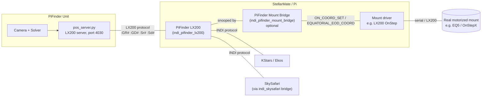
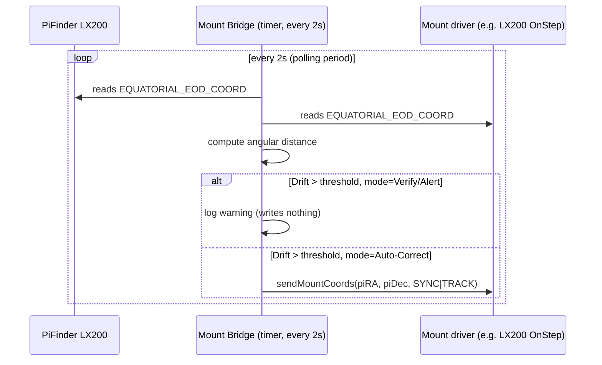
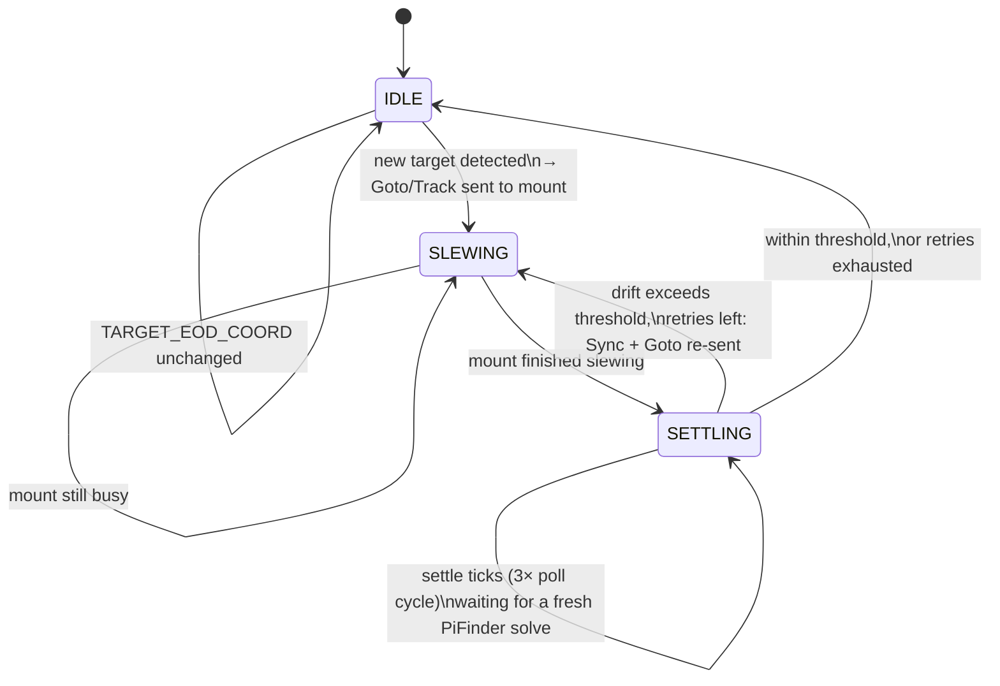

# PiFinder LX200 INDI Integration

*[Deutsche Version](Readme_PiFinder_LX200_de.md)*

> ### ✅ Built & verified against
>
> * **libindi 2.2.2** (system package — no INDI source checkout needed)
> * Verified against a real mount: **Skywatcher EQ5 + OnStepX** (`indi_lx200_OnStep` 1.27)
>
> If you're on a different libindi release, the concepts below still apply, but property
> names/behavior of third-party mount drivers (like OnStep) may differ slightly. For the tested
> PiFinder / StellarMate OS / Pi combinations, see the
> [Version Compatibility table in README.md](README.md#version-compatibility).

> ### ⚠️ Mandatory: this only works through the StellarMate Web Manager
>
> The PiFinder LX200 / Mount Bridge drivers live **only** in the Web Manager's own driver catalog,
> under **"System INDI Drivers"** — nowhere else. Ekos has its own, separate, built-in catalog and
> **cannot** see or launch these drivers itself, in any mode. There is no way to set this up
> entirely from within KStars/Ekos: the Equipment Profile has to be built in the Web Manager first
> ([Step 2](#step-2-create-an-equipment-profile-in-the-web-manager)), and Ekos then only ever
> connects to it remotely, in **"Remote Host"** mode, never "Local"
> ([Step 4](#step-4-kstarsekos-remote-mode)). Skipping the Web Manager, or leaving Ekos on "Local"
> mode, means the drivers simply never appear — this is the single most common way this setup fails.

This document covers the **INDI integration layer** that connects PiFinder to KStars/Ekos,
SkySafari, and (optionally) a real motorized mount. It is a companion to the main
[README.md](README.md), which covers the base PiFinder-on-StellarMate installation.

---

## Table of Contents

1. [Basic Functionality (Overview)](#basic-functionality-overview)
2. [The Three Building Blocks](#the-three-building-blocks)
3. [Installation & Illustrated Guide](#installation--illustrated-guide)
4. [Technical Reference](#technical-reference)
5. [Code, Deployment & Strategy](#code-deployment--strategy)
6. [Known Limitations & Troubleshooting](#known-limitations--troubleshooting)
7. [Version Compatibility](#version-compatibility)

---

## Basic Functionality (Overview)

PiFinder is a **push-to plate-solving aid** — it has a camera and a solver, but **no motor**. It
tells you *where the telescope is currently pointed* and, given a target, *which way to push it*.
This integration makes that information available to the standard astronomy software ecosystem via
INDI, and optionally couples it to a real motorized mount so PiFinder can act as an automatic
alignment/GoTo source instead of a manual push-to aid.

Three independent, separately-deployable pieces work together:


```mermaid
flowchart LR
    subgraph PiFinder Unit
        CAM[Camera + Solver] --> POS[pos_server.py<br/>LX200 server, port 4030]
    end

    subgraph StellarMate / Pi
        DRV["PiFinder LX200<br/>(indi_pifinder_lx200)"]
        BRIDGE["PiFinder Mount Bridge<br/>(indi_pifinder_mount_bridge)<br/>optional"]
        MOUNTDRV["Mount driver<br/>e.g. LX200 OnStep"]
    end

    MOUNT[("Real motorized mount<br/>e.g. EQ5 / OnStepX")]

    KStars["KStars / Ekos"]
    SkySafari["SkySafari<br/>(via indi_skysafari bridge)"]

    POS -- "LX200 protocol\n:GR# :GD# :Sr# :Sd#" --- DRV
    DRV -- "INDI protocol" --- KStars
    DRV -- "INDI protocol" --- SkySafari
    DRV -- "snooped by" --- BRIDGE
    BRIDGE -- "ON_COORD_SET / EQUATORIAL_EOD_COORD" --- MOUNTDRV
    MOUNTDRV -- "serial / LX200" --- MOUNT
```

| Component | What it is | Required? |
|---|---|---|
| **PiFinder LX200** (`indi_pifinder_lx200`) | INDI telescope driver. Reports PiFinder's solved position; forwards GoTo requests to PiFinder as a push-to target. | Yes — this is the core integration. |
| **PiFinder Mount Bridge** (`indi_pifinder_mount_bridge`) | Optional INDI auxiliary driver. Couples PiFinder's position to *any* real INDI mount driver, generically (never speaks a mount-specific protocol). | Only if you have a motorized mount you want PiFinder to talk to. |
| A real mount's own INDI driver (e.g. `indi_lx200_OnStep`) | Not part of this project — whatever driver your mount normally uses. | Only if you have a motorized mount. |

Two practical use cases this covers:

1. **Pure push-to** (Dobson, manual Alt-Az, EQ platform): only "PiFinder LX200" is needed. KStars and
   SkySafari show where the telescope is pointed and let you select a GoTo target, which shows up on
   PiFinder's own screen as push-to arrows.
2. **PiFinder + real motorized mount**: add the Mount Bridge. Depending on the chosen *coupling
   mode*, PiFinder can passively verify the mount's alignment, periodically correct drift, or
   directly drive the mount's GoTo — see [Coupling modes](#the-mount-bridge-coupling-dial)
   below.

---

## The Three Building Blocks

### 1. PiFinder LX200 (`indi_pifinder_lx200`)

- A standalone INDI telescope driver, built directly against the system `libindi` package (no INDI
  source checkout, no fat multi-driver binary — see
  [Why a standalone build](#why-a-standalone-build-instead-of-a-fat-binaryindi-source-checkout)).
- Connects to PiFinder's own built-in LX200 server (`pos_server.py`, TCP port **4030**) — the same
  server PiFinder's SkySafari support already uses.
- Capabilities: `TELESCOPE_CAN_GOTO`, `TELESCOPE_CAN_ABORT`, `TELESCOPE_HAS_TIME`,
  `TELESCOPE_HAS_LOCATION`. Deliberately **no** `TELESCOPE_CAN_SYNC`, no Park/Flip/tracking-rate
  control, no custom alignment protocol — PiFinder has no motor and nothing to synchronize about
  itself (see [Property reference](#property-reference-pifinder-lx200) for why).
- Source: [`indi_pifinder/lx200_pifinder.cpp`](indi_pifinder/lx200_pifinder.cpp) /
  [`.h`](indi_pifinder/lx200_pifinder.h)

### 2. PiFinder Mount Bridge (`indi_pifinder_mount_bridge`)

- A separate, optional INDI auxiliary driver (device family "Auxiliary", not "Telescope" — it isn't
  itself a mount).
- Contains an **embedded INDI client** (`INDI::BaseClient`, same pattern as the stock
  `indi_skysafari` driver) that connects to the local `indiserver` as a normal client and snoops two
  devices: the active "PiFinder" device and the active "Mount" device.
- Speaks **only generic INDI telescope properties** to the mount (`EQUATORIAL_EOD_COORD`,
  `ON_COORD_SET`) — it never needs to know which mount firmware is behind the driver. This is what
  makes it work with *any* INDI-supported mount, not just OnStepX.
- Source: [`indi_pifinder_bridge/pifinder_mount_bridge.cpp`](indi_pifinder_bridge/pifinder_mount_bridge.cpp)
  / [`.h`](indi_pifinder_bridge/pifinder_mount_bridge.h),
  [`pifinder_bridge_client.cpp`](indi_pifinder_bridge/pifinder_bridge_client.cpp) /
  [`.h`](indi_pifinder_bridge/pifinder_bridge_client.h)

### The Mount Bridge: Coupling Dial

One property (`BRIDGE_MODE`, labelled "Coupling" in the UI) selects how tightly PiFinder and the
real mount are coupled:

| Mode | Behavior | When it makes sense |
|---|---|---|
| **Off** | No coupling at all. Pure push-to. | Dobson, no motor. |
| **Verify/Alert only** | Continuously compares PiFinder's solved position to the mount's reported position; logs a warning if they disagree by more than the configured threshold. Never writes to the mount. | Astrophotography: a passive "is my mount still correctly aligned?" sanity check. |
| **Auto-correct on drift** | Same comparison, but if drift exceeds the threshold, automatically sends a `Sync` or `Goto/Track` (configurable via `CORRECTION_ACTION`) to the mount. | Manual push-to-then-correct workflows: you slew by hand until PiFinder shows on-target, the Bridge picks up the resulting drift and straightens the mount out afterwards. |
| **Goto-Forward** | Event-driven: the moment PiFinder receives a **new** GoTo/push-to target (from its own UI, from KStars, or from SkySafari→PiFinder), the Bridge immediately sends a real `Goto` to the mount. After the mount finishes slewing, it waits for a fresh PiFinder solve and, if still outside the threshold, syncs the mount and re-sends the Goto - repeating (bounded) until it lands within threshold or gives up. | Standalone visual use: PiFinder is the single GoTo interface, the mount just executes. |

There's also a **Manual (one-shot)** control (`MANUAL_TRIGGER`) that fires a single Sync or Goto
regardless of the selected mode, for a one-off correction without switching modes — see the
[property reference](#property-reference-pifinder-mount-bridge) for the full list of triggers.

---

## Installation & Illustrated Guide

### Prerequisites

- StellarMate OS with PiFinder installed (see [README.md](README.md))
- `cmake`, a C++ compiler, and the `libindi` package (already present on StellarMate OS)
- A running `indiserver` — either started manually or (recommended) via the StellarMate
  Web Manager as an **Equipment Profile**

### Step 1: Build and install the drivers

`pifinder_stellarmate_setup.sh` does this for you automatically: it stops any already-running
driver instance first (to avoid "Text file busy"), builds and installs both drivers, and restarts
the StellarMate Web Manager so they show up in its catalog. Nothing to do here on a normal install.

You only need to run the build scripts yourself if you want to rebuild just the drivers without
rerunning the whole setup (e.g. after pulling a driver-only code change):

```bash
cd ~/PiFinder_Stellarmate
bash bin/build_indi_driver.sh     # PiFinder LX200
bash bin/build_indi_bridge.sh     # PiFinder Mount Bridge (only if you want to couple a real mount)
```

If a driver is already running (e.g. started via the Web Manager), stop it first — otherwise the
install fails with "Text file busy".

**Important:** The StellarMate Web Manager (`stellarmatewebmanager`, port 8624) reads its driver
catalog **only at its own process startup**. After a manual rebuild (or a driver version change),
restart it once:

```bash
systemctl --user restart stellarmatewebmanager.service
```

This must run from the actual GUI/VNC desktop session, not from a plain SSH session.

### Step 2: Create an equipment profile in the Web Manager

> **⚠️ This step is mandatory and cannot be done from within Ekos.** Open the StellarMate Web
> Manager directly (not through KStars) and build the profile here — this is the *only* place the
> PiFinder drivers exist.

Open `http://<pi-address>:8624` in a browser. The whole Web Manager is a single page:

| Control | What it does |
|---|---|
| **Equipment Profile** dropdown | Selects the profile to edit / run |
| 💾 save / **−** (next to it) | Save edits to the selected profile / delete it |
| **New Profile** field + **+** | Create a new, empty profile with that name |
| **Auto Start** / **Auto Connect** | Start this profile when the Web Manager boots / connect all its devices once the server is up |
| **Drivers** ("N items selected") | The multi-select of drivers this profile runs |
| **Port** | `indiserver` port (default **`7624`**) |
| **Driver Source** | Which driver catalog the list is read from — must be **"System INDI Drivers"** |
| **Remote Drivers** | `driver@host` entries for drivers on another box — not needed here |
| **Stop** / **Start** + icon row (power, restart, network, 👁) | Start/stop the `indiserver` for the selected profile; 👁 opens the INDI Control Panel |
| **Server Status** | Live list of the drivers the running server has loaded |

**Build the profile:**

1. Type a name into **New Profile** → **+**.
2. Open **Drivers** and tick **PiFinder LX200**, optionally your real mount's driver
   (e.g. *LX200 OnStep*), and — for mount coupling — **PiFinder Mount Bridge**. Add
   *PiFinder Simulator* / *Telescope Simulator* only for a hardware-free test setup.
3. Leave **Port** at `7624`. Set **Driver Source** to **System INDI Drivers**.
4. Click 💾 **save**, then **Start**.

**Driver Source** must be **"System INDI Drivers"**: the PiFinder drivers are installed as system
INDI drivers (`/usr/share/indi/`). The other options ("KStars Flatpak – Stable / Nightly") read a
Flatpak KStars' bundled catalog, which does not contain them — select one of those and the
PiFinder drivers disappear from the Drivers list. They are not visible from Ekos's own driver
catalog either (see the warning at the top of this document).

<table>
<tr>
<td align="center" width="55%">
<a href="docs/images/pfinder_lx200/webmanager_overview.png"></a><br>
<sub>Web Manager: profile "PFSM UTM Simulation" — Drivers, Port, Driver Source, Server Status</sub>
</td>
<td align="center" width="45%">
<a href="docs/images/pfinder_lx200/webmanager_drivers_list.png"></a><br>
<sub>Drivers multi-select — the PiFinder drivers appear here, and only here</sub>
</td>
</tr>
<tr>
<td align="center" width="55%">
<a href="docs/images/pfinder_lx200/webmanager_driver_source.png"></a><br>
<sub>Driver Source: use "System INDI Drivers"; the Flatpak catalogs lack the PiFinder drivers</sub>
</td>
<td align="center" width="45%">
<a href="docs/images/pfinder_lx200/webmanager_profile.png"></a><br>
<sub>A real-mount profile: PiFinder Mount Bridge + LX200 OnStep + PiFinder LX200, all online</sub>
</td>
</tr>
</table>

### Step 3: INDI Control Panel — connect the devices

Open it from KStars: **Tools → Devices → INDI Control Panel** (`Ctrl+I`); it also opens on its
own when the profile starts. There is one top-level tab per driver in the profile:

| Tab | Role | Connect it? |
|---|---|---|
| **PiFinder LX200** | PiFinder's solved position, as an INDI telescope | Yes — the core integration |
| **PiFinder Mount Bridge** | Couples PiFinder to a real mount | Only with a motorized mount |
| your mount's driver (e.g. *LX200 OnStep*) | The real mount | As usual for that mount |
| *PiFinder Simulator*, *Telescope Simulator*, *SkySafari*, … | Optional test / bridge drivers | See the [Simulator guide](Readme_PiFinder_Simulator.md) and [Step 5](#step-5-connecting-skysafari) |

#### PiFinder LX200

1. **Connection** subtab: Connection Mode **Network**, Connection Type **TCP**, Server address
   `127.0.0.1` port **`4030`** → **Set**.
2. **Main Control** subtab → **Connect**. *On Set* then shows only **Track / Slew**, no Sync
   (see [Why no `TELESCOPE_CAN_SYNC`?](#why-no-telescope_can_sync)); *Eq. Coordinates* shows the
   live solved position.

The **Options**, **Motion Control**, **Site Management** and **Guide** subtabs are inherited from
the LX200 base class. They are shown but inert: PiFinder has no motor, and it takes time and
location from its own GPS (the driver logs `updateTime called, ignoring` /
`updateLocation called, ignoring`).

<table>
<tr>
<td align="center" width="50%">
<a href="docs/images/pfinder_lx200/indi_control_panel_tabs_PiFinder_LX200_connection.png"></a><br>
<sub>PiFinder LX200 → Connection: Network / TCP, 127.0.0.1 : 4030</sub>
</td>
<td align="center" width="50%">
<a href="docs/images/pfinder_lx200/indi_control_panel_tabs_PiFinder_LX200_main.png"></a><br>
<sub>PiFinder LX200 → Main Control: Track / Slew only, no Sync</sub>
</td>
</tr>
</table>

#### Your real mount

Connect it the way you normally would for that driver — serial port or TCP, then **Connect**.
Nothing PiFinder-specific here.

#### PiFinder Mount Bridge

1. **Options** subtab → **Active devices**: set `PiFinder` to the PiFinder LX200 device name and
   `Mount` to your mount's device name (e.g. *PiFinder LX200* / *LX200 OnStep*). The **Settings**
   row above points the Bridge's embedded client at the local `indiserver` — leave it at
   `localhost` : `7624`.
2. **Main Control** subtab → **Connect**, then set **Coupling** to the mode you want
   ([Coupling Dial](#the-mount-bridge-coupling-dial)). This tab also carries the one-shot
   triggers, the drift threshold and live drift status, the Multi-Point Alignment run, and the
   unexplained-reposition prompt — see the
   [property reference](#property-reference-pifinder-mount-bridge).
3. **Shadow Sync** subtab: mirrors each mount command the Bridge sends onto a second,
   non-driving device (default *PiFinder Simulator*), so a simulated PiFinder can track a real
   mount. Auto-arms when the shadow device is present; only relevant for the simulator setups.

<table>
<tr>
<td align="center" width="33%">
<a href="docs/images/pfinder_lx200/indi_control_panel_tabs_PiFinder_Mount_Bridge_main.png"></a><br>
<sub>Mount Bridge → Main Control: Coupling, correction action, triggers, alignment</sub>
</td>
<td align="center" width="33%">
<a href="docs/images/pfinder_lx200/indi_control_panel_tabs_PiFinder_Mount_Bridge_options.png"></a><br>
<sub>Mount Bridge → Options: Active devices + indiserver Settings</sub>
</td>
<td align="center" width="33%">
<a href="docs/images/pfinder_lx200/indi_control_panel_tabs_PiFinder_Mount_Bridge_shadow.png"></a><br>
<sub>Mount Bridge → Shadow Sync: mirror commands onto a non-driving device</sub>
</td>
</tr>
</table>

### Step 4: KStars/Ekos (Remote mode)

**Critical: the Ekos profile must use "Remote Host" mode, not "Local".** The StellarMate App and
Flatpak KStars each have their **own, independent driver catalogs**, which don't read
`/usr/share/indi/drivers.xml` live — in **Local** mode, Ekos tries to launch drivers itself from
that local catalog and will never find our custom-built ones. In **Remote Host** mode, Ekos
doesn't launch or look up anything locally at all: it's purely a network client of the
`indiserver` that the Web Manager already started, so it doesn't matter which driver catalog Ekos
itself has.

**In the Ekos tab** (Tools → Ekos, `Ctrl+K`):

1. **1. Select Profile** — pick your profile in the dropdown. The buttons next to it: **+** new,
   **✏** edit, **✗** delete, **⛶** set default, **🪄** wizard.
2. **✏ edit** opens the **Profile Editor**:
   - **Mode: Remote Host** (not "Local"!), Host `localhost`, Port **`7624`** — the `indiserver`
     port from the Web Manager profile.
   - **Auto Connect** on: connect all devices as soon as Ekos starts.
   - **INDI Web Manager** (checkbox + Port `8624`) — optional. Tick it and Ekos's own Start/Stop
     buttons act on the *remote* Web Manager profile, and **Scan** can find the box on the
     network. Leave it off and Ekos is a pure network client of an `indiserver` you start
     elsewhere (the Web Manager, or the Control Center).
   - **Select Devices** — in Remote Host mode this only lists drivers Ekos itself would launch;
     for a PiFinder setup it can stay effectively empty (the PiFinder drivers are **not** here
     and don't need to be — they run under the Web Manager). Click **Save**.
3. **2. Start & Stop Ekos** — the **▶ / ■** button starts/stops the session. On start, every
   device the remote server already has connected shows up in the Mount / Capture / … modules
   and the INDI Control Panel.
4. **3. Connect & Disconnect Devices** — force a reconnect of all devices without restarting Ekos.

<table>
<tr>
<td align="center" width="60%">
<a href="docs/images/pfinder_lx200/ekos_select_profile.png"></a><br>
<sub>Ekos: Select Profile → Start &amp; Stop Ekos → Connect &amp; Disconnect Devices (session stopped)</sub>
</td>
<td align="center" width="40%">
<a href="docs/images/pfinder_lx200/ekos_profile_editor.png"></a><br>
<sub>Profile Editor: Mode "Remote Host", localhost:7624, Auto Connect</sub>
</td>
</tr>
</table>

Right-clicking a star shows both devices as separate targets in the context menu — the red
crosshair markers show where PiFinder is currently "looking" versus where the mount actually is
(deliberately far apart here, for illustration). The "PiFinder LX200" submenu expanded shows only
**Goto / Abort / Find Telescope**, no Sync (see
[Why no TELESCOPE_CAN_SYNC?](#why-no-telescope_can_sync)). Click any thumbnail for the full-size
screenshot:

<table>
<tr>
<td align="center" width="50%">
<a href="docs/images/pfinder_lx200/kstars_context_menu_both_mount_and_pifinder.png"></a><br>
<sub>Sky map: PiFinder and mount as separate target devices in the context menu</sub>
</td>
<td align="center" width="50%">
<a href="docs/images/pfinder_lx200/kstars_context_menu_PiFinder_LX200.png"></a><br>
<sub>"PiFinder LX200" submenu: only Goto, Abort, Find Telescope</sub>
</td>
</tr>
</table>

### Step 5: Connecting SkySafari

SkySafari does **not** connect directly to port 7624; instead it goes through the bundled
**"SkySafari"** driver (`indi_skysafari`), which acts as its own LX200 bridge listening on port
**9624**:

- Add the "SkySafari" driver to the profile too and start it
- Tab "SkySafari" → Options → set **Active devices → Telescope** to **"PiFinder LX200"**
  (the default is often "Telescope Simulator"!). After changing it: briefly disconnect/reconnect
  the SkySafari driver.
- In the SkySafari app: enter the StellarMate box's server IP, **port 9624**

SkySafari itself needs no PiFinder-specific profile — it speaks generic LX200 to the
`indi_skysafari` driver, which (via `ACTIVE_DEVICES` → Telescope) points at "PiFinder LX200".

Full connection stack, for reference:

```
SkySafari app ──(LX200, port 9624)──> indi_skysafari ──(INDI, snoops ACTIVE_TELESCOPE)──┐
                                                                                          ↓
KStars/Ekos (Remote, port 7624) ─────────────(INDI protocol)───────────────────> PiFinder LX200
                                                                                          │
                                                                                   (LX200, port 4030)
                                                                                          ↓
                                                                                  PiFinder pos_server.py
```

<table>
<tr>
<td align="center">
<a href="docs/images/pfinder_lx200/skysafari_ip_port_Meade_LXClassic.png"></a><br>
<sub>SkySafari network connections: telescope selection (LX200-compatible), IP address, and port number 9624</sub>
</td>
</tr>
</table>

---

## Technical Reference

### LX200 commands: PiFinder LX200 ↔ PiFinder's own server

The driver talks to PiFinder's own `pos_server.py` (port 4030) using a small, fixed subset of the
LX200 protocol — the same commands PiFinder's existing SkySafari support already uses:

| Command | Direction | Purpose | Driver code |
|---|---|---|---|
| `#:GR#` | Driver → PiFinder | Query current right ascension (HH:MM:SS) | `ReadScopeStatus()` |
| `#:GD#` | Driver → PiFinder | Query current declination (+/-DD*MM'SS) | `ReadScopeStatus()` |
| `:Sr<RA>#` | Driver → PiFinder | Set target RA (part of a push-to/GoTo) | `Goto()` |
| `:Sd<DEC>#` | Driver → PiFinder | Set target DEC — triggers `handle_goto_command()` on PiFinder's side once both coordinates are set | `Goto()` |

**No Sync command** (`:CM#` or similar) is ever sent — there's nothing to synchronize on
PiFinder's side (see below).

**Polling:** `ReadScopeStatus()` is called regularly by the INDI base class (default every 1000ms)
and queries `:GR#`/`:GD#` fresh on every cycle.

**Important performance fix:** PiFinder terminates every response with `#` and then sends nothing
more. A naive `tty_read()` would block until the full timeout (several seconds) instead of
returning immediately after the `#` — this caused a 6–10 second lag per position update in an
earlier driver version. Fixed with `tty_nread_section(fd, response, max_len, '#', timeout,
&nbytes_read)`, which reads exactly up to the terminator.

### What happens on a GoTo to "PiFinder LX200"?

Important to understand, since there's no slew animation: `Goto()` sends `:Sr#`/`:Sd#` to
PiFinder's own server, which registers a new **push-to target** from it (the same mechanism as a
SkySafari push-to, or a manual object selection directly on PiFinder). PiFinder's own reported
position (`:GR#`/`:GD#`) does **not** change as a result — that comes independently from the live
plate-solve. `TrackState` is set to `SCOPE_IDLE` immediately (never `SLEWING`), because nothing
physically happens as long as no Mount Bridge is attached.

### Why no `TELESCOPE_CAN_SYNC`?

Sync normally means "correct your internal position model to this value". PiFinder has no such
model — it reports the freshly solved actual position on every frame, there's nothing to correct.
Feeding a "sync" back onto PiFinder's position does make sense, though — that's exactly the job of
the **Mount Bridge** (Sync/Goto *to the mount*, not to PiFinder).

### Property reference: PiFinder LX200

Standard `INDI::Telescope` properties this driver actually uses/enables (a selection, not
exhaustive — see `LX200Telescope`/`INDI::Telescope` in libindi for details):

| Property | Type | Purpose |
|---|---|---|
| `CONNECTION` | Switch | Connect/Disconnect |
| `DEVICE_ADDRESS` | Text | TCP target address/port (default `127.0.0.1:4030`) |
| `EQUATORIAL_EOD_COORD` | Number (read-only for display, written on Goto) | Current RA/DEC |
| `TARGET_EOD_COORD` | Number (managed by the base class itself) | Last commanded GoTo target — **this** is the property the Mount Bridge snoops to detect new push-to requests (see below) |
| `ON_COORD_SET` | Switch | `TRACK` / `SLEW` (both route through `Goto()`); no `SYNC` |
| `TELESCOPE_ABORT_MOTION` | Switch | Abort (essentially a no-op since there's no motor, but part of the base capability) |

### Property reference: PiFinder Mount Bridge

**Controls** (on the Main Control subtab unless noted):

| Property | Type | Purpose |
|---|---|---|
| `BRIDGE_SETTINGS` | Text *(Options)* | `indiserver` host/port for the embedded client (default `localhost:7624`) |
| `ACTIVE_DEVICES` | Text *(Options)* | Which PiFinder and Mount devices are snooped |
| `SHADOW_DEVICE_NAME` / `SHADOW_SYNC` | Text / Switch *(Shadow Sync)* | Second, non-driving device to mirror mount commands onto, and its on/off toggle |
| `BRIDGE_MODE` | Switch (1oM) | Coupling: `MODE_OFF` / `MODE_VERIFY_ALERT` / `MODE_AUTO_CORRECT` / `MODE_GOTO_FORWARD` — see [Coupling Dial](#the-mount-bridge-coupling-dial) |
| `CORRECTION_ACTION` | Switch (1oM) | What Auto-correct does on drift: `ACTION_SYNC` or `ACTION_GOTO` (Goto/Track) |
| `MANUAL_TRIGGER` | Switch (≤1) | One-shot, any mode: `TRIGGER_SYNC_NOW`, `TRIGGER_GOTO_NOW`, `TRIGGER_GOTO_HELD` (re-send the held original target), `TRIGGER_ALIGN_HELD`, `TRIGGER_SYNC_TO_COORDS` |
| `SYNC_TO_COORDS` | Number | RA/DEC (JNow) used by `TRIGGER_SYNC_TO_COORDS` |
| `ABORT_MOUNT` | Switch | Emergency stop — sends an abort to the mount |
| `MULTI_POINT_ALIGN` | Switch (≤1) | Start / Stop an automated multi-point alignment run ([#191](https://github.com/apos/PiFinder_Stellarmate/issues/191)) |
| `ALIGN_CONFIG` / `ALIGN_DIRECTION` | Number / Switch (1oM) | That run's search radius, point count, min altitude; preferred sky region (Any/N/E/S/W) |
| `REPOSITION_CONFIRM` | Switch (≤1) | Answer to an unexplained-reposition prompt: adopt the new position, or revert to the held target |
| `DRIFT_THRESHOLD` | Number | Drift beyond this (arcmin, default 5.0) triggers an alert / correction |
| `MAX_SYNC_DRIFT` | Number | Sanity limit: an auto-Sync above this (arcmin, default 120) is refused |
| `SOLVE_FRESHNESS` | Number | Max solve age (s, default 5) an auto-correction will act on |

**Read-only status:**

| Property | Shows |
|---|---|
| `DRIFT_STATUS` | Current PiFinder↔mount angular separation (arcmin) |
| `MOUNT_HORIZON_STATUS` | Mount altitude (deg); the drift computation freezes while the mount is below the horizon |
| `TARGET_SOURCE` (+ `…_AGE`, `CORRECTION_AGE`) | Whether the Bridge is currently following PiFinder or the mount, and how long since that / the last self-sent command |
| `ORIGINAL_TARGET` (+ `…_DRIFT`) | J2000 RA/DEC of the last genuinely new GoTo target, and current drift from it |
| `ALIGN_PROGRESS` | Multi-point run: current point / total / verified |
| `MOUNT_REJECT` | Populated when the mount refuses a Goto/Sync (axis or elevation limit) |
| `PIFINDER_ORIENTATION` | PiFinder's own mount-type / screen-direction, snooped from the PiFinder device |

To the mount the Bridge sends **only** generic INDI standard properties — `EQUATORIAL_EOD_COORD`
(target RA/DEC) + `ON_COORD_SET` (`SYNC` or `TRACK`), never a mount-specific command. That is the
core design that makes it work with any INDI mount.

### In practice: which controls you actually touch

The tables above are the full surface. Day to day it comes down to a handful:

| Where | Control | When |
|---|---|---|
| PiFinder LX200 → Connection | Network / TCP `127.0.0.1:4030` | Once, at setup |
| PiFinder LX200 → Main Control | **Connect** | Every session (or let Auto Connect do it) |
| Mount Bridge → Options | **Active devices** (PiFinder + Mount) | Once, at setup |
| Mount Bridge → Main Control | **Connect**, then **Coupling** | Every session — Coupling is the one dial you change by intent |
| Mount Bridge → Main Control | **Drift Threshold** | Rarely — tighten / loosen the drift alarm |
| Mount Bridge → Main Control | **Manual (one-shot)** → *Sync Now* / *Goto Held Target* | Recovery after a bump or a refused slew |
| any driver → Options → Configuration | **Save** | After changing anything you want to survive a restart |

Everything else is read-only status or an inherited base-class control that does nothing for
PiFinder (see [Step 3](#step-3-indi-control-panel--connect-the-devices)).

**Can you group or rearrange properties in the INDI Control Panel?** No. The layout is fixed by
each driver: one tab per device, then that driver's own property groups as subtabs (*Main
Control*, *Connection*, *Options*, …). There is no way to make custom groups, hide rows, or
reorder them. Two things soften it: **Options → Configuration → Save** makes a driver reappear
with your values already set, and **Ekos** surfaces the few properties that matter mid-session in
its own module GUIs (Mount, Capture, Focus, Align), so the raw panel is rarely needed during a run.

### Data flow: Auto-Correct / Verify-Alert (drift polling)


```mermaid
sequenceDiagram
    participant PF as PiFinder LX200
    participant BR as Mount Bridge (timer, every 2s)
    participant MT as Mount driver (e.g. LX200 OnStep)

    loop every 2s (polling period)
        BR->>PF: reads EQUATORIAL_EOD_COORD
        BR->>MT: reads EQUATORIAL_EOD_COORD
        BR->>BR: compute angular distance
        alt Drift > threshold, mode=Verify/Alert
            BR->>BR: log warning (writes nothing)
        else Drift > threshold, mode=Auto-Correct
            BR->>MT: sendMountCoords(piRA, piDec, SYNC|TRACK)
        end
    end
```

### Data flow: Goto-Forward (event-driven)


```mermaid
stateDiagram-v2
    [*] --> IDLE
    IDLE --> IDLE: TARGET_EOD_COORD unchanged
    IDLE --> SLEWING: new target detected\n→ Goto/Track sent to mount
    SLEWING --> SLEWING: mount still busy
    SLEWING --> SETTLING: mount finished slewing
    SETTLING --> SETTLING: settle ticks (3× poll cycle)\nwaiting for a fresh PiFinder solve
    SETTLING --> SLEWING: drift exceeds threshold,\nretries left: Sync + Goto re-sent
    SETTLING --> IDLE: within threshold,\nor retries exhausted
```

Why a settle delay? After the mount it's mounted on physically moves, PiFinder needs a moment to
solve again — the Bridge waits 3 poll cycles (default: 6 seconds at a 2s poll period) before
treating the "actual" position as trustworthy.

Why a **Sync followed by another Goto**, not just a Sync? The mount has already physically
arrived via the preceding Goto, so a residual is usually the mount's own model being slightly off
at this sky position rather than a missed slew - a Sync alone would just relabel the mount's
coordinates to match PiFinder without moving anything closer to the actual target. Syncing first
corrects the model with PiFinder's more precise solve, then re-issuing the Goto (now benefiting
from that corrected model) should land closer. This repeats - re-verify, sync + re-Goto again if
still outside the threshold - up to `MAX_SETTLE_RETRIES` (3) attempts before giving up and logging
a warning, so a genuinely noisy solve can't chase itself forever.

The Bridge snoops `TARGET_EOD_COORD` rather than a property of its own because `INDI::Telescope`
(the base class of every LX200-style driver, including `PiFinder LX200`) publishes it automatically
on every successful `Goto()` call (see `inditelescope.cpp`, `ISNewNumber()`), regardless of whether
the driver has a motor. A custom property would only duplicate — and collide with — that one.

---

## Code, Deployment & Strategy

### Why a standalone build instead of a fat-binary/INDI-source checkout?

Earlier iterations of this project were based on a fork of the entire `indi` source tree
(fat-binary approach, a ~13.5 MB binary with dozens of unrelated mount drivers compiled in, a full
INDI rebuild on every change). The current approach instead links directly against the
already-installed system `libindi` (`libindilx200.so`, `libindidriver.so` — present on every
StellarMate device):

- **Binary size**: 13.5 MB → **80 KB**
- **Build time**: full INDI tree → **seconds** (only one `.cpp` file)
- **No `indi-source` dependency** — only system headers/libs (`pkg-config libindi`)
- **No conflict with `pacman`** — does not overwrite `/usr/bin/indi_lx200generic`, which belongs
  to the system package

This required the modern `LX200Telescope` base class's API to be nearly identical to the old
`LX200Generic` (same method names) — the port was therefore mechanical.

### Why two separate drivers instead of one?

- **PiFinder LX200** covers the role that's identical in *every* scenario, whether or not a
  motorized mount exists. Stays minimal, changes independently of everything else.
- **PiFinder Mount Bridge** is the **only** building block that even knows a second, real mount
  optionally exists. Separately deployable, separately enabled, no impact on the core use case
  (pure push-to) when not needed.
- Both are built completely independently (`bin/build_indi_driver.sh` /
  `bin/build_indi_bridge.sh`), with no build-time dependency between them.

### Build system

Both drivers use a minimal `CMakeLists.txt` against `pkg-config libindi`, no custom loader, no
`main()` — each driver instantiates itself via a single global `std::unique_ptr<...>` (following
`telescope_simulator.cpp` from the INDI tree, the standard pattern for any single driver). The
build scripts (`bin/build_indi_driver.sh`, `bin/build_indi_bridge.sh`) configure, build, install to
`/usr/bin/`, and register the driver (if needed) in `/usr/share/indi/drivers.xml`.

### Testing strategy

Staged, from safest to most realistic:

1. **Fake LX200 server** (`test_tools/fake_pifinder_lx200.py`): simulates PiFinder's server on port
   4031 with a demo tour (Vega → Sheliak → Sulafat → M57) — tests the driver with no physical
   PiFinder device at all.
2. **`indi_simulator_telescope`**: tests the Mount Bridge logic (snooping, Sync/Goto forwarding,
   drift computation) against a simulated mount, with no physical movement/risk.
3. **Real hardware** (real PiFinder + real EQ5/OnStepX): final verification of all modes (Sync,
   Goto, Goto-Forward) with actual, visible mount movement.

### Implementation gotchas

- The driver binary's name must match the name in `drivers.xml`, or it won't load.
- Read PiFinder's LX200 replies with `tty_nread_section()`, not `tty_read()` — the latter adds
  6–10 s of lag per position update.
- Don't add a custom `TARGET_*` property to forward Goto targets — `INDI::Telescope` already
  publishes `TARGET_EOD_COORD` (elements `RA`/`DEC`); snoop that.
- `PiFinderMountBridge::ISGetProperties()` must not call `loadConfig()` on every client connection —
  it would overwrite the current Coupling mode with the last-saved one on every `indi_getprop` or
  INDI Control Panel reopen. An `m_configLoaded` flag limits it to the first call.

---

## Known Limitations & Troubleshooting

- **The StellarMate App and Flatpak KStars each have their own, separate driver catalogs**, which
  don't read `/usr/share/indi/drivers.xml` live. After every rebuild/version change of a driver:
  `systemctl --user restart stellarmatewebmanager.service` (from the GUI/VNC session, not SSH).
  For KStars: use **Remote mode** (see [Step 4](#step-4-kstarsekos-remote-mode)) instead of
  looking in the local device tree.
- **`LOGF_INFO`/`LOG_ERROR` from the drivers don't appear** in the server's own log
  (`/tmp/indiserver.log`, when started via the Web Manager) — but they are correctly sent as an
  INDI message to connected clients and are visible in the INDI Control Panel's log area at the
  bottom.
- **Pi 5**: this INDI integration has only been tested on real hardware on a Pi 4. No known reason
  it should behave differently on a Pi 5, but unverified.
- **Goto-Forward assumes a fixed settle time** (3 poll cycles, 6s by default) before treating
  PiFinder's solve as "fresh". With very slow plate-solving (weak field, few stars) this may be too
  short — in that case `DRIFT_STATUS` may briefly show a not-yet-converged value.
- **No automatic GoTo forwarding without the Mount Bridge in "Goto-Forward" mode**: pure push-to
  (just "PiFinder LX200", no Bridge) never moves a real mount — this is by design.

---

## Version Compatibility

The PiFinder / StellarMate OS / Raspberry Pi test matrix is maintained in one place — the
[Version Compatibility table in README.md](README.md#version-compatibility). INDI-specific
particulars for this driver:

| Component | Version |
|---|---|
| libindi | 2.2.2 (system package) |
| Tested mount / driver | Skywatcher EQ5 + OnStepX, `indi_lx200_OnStep` 1.27 |

---

<p align="center">
  <br>
  © github.com/apos 2026<br>
  <em>Unofficial community project, not affiliated with StellarMate or PiFinder.</em>
</p>
