# PiFinder LX200 INDI Integration

*[English version](Readme_PiFinder_LX200.md)*

> ### ✅ Built & verified against
>
> * **PiFinder software 2.6.0**
> * **StellarMate OS 2.2.1** (Arch Linux)
> * **libindi 2.2.2** (system package — no INDI source checkout needed)
> * Real hardware: Raspberry Pi 4 + PiFinder unit + **Skywatcher EQ5 with an OnStepX controller** (`indi_lx200_OnStep` 1.27)
>
> If you're on different versions, the concepts below still apply, but property names/behavior of
> third-party mount drivers (like OnStep) may differ slightly between libindi releases.

This document covers the **INDI integration layer** that connects PiFinder to KStars/Ekos,
SkySafari, and (optionally) a real motorized mount. It is a companion to the main
[README.md](README.md), which covers the base PiFinder-on-StellarMate installation.

---

## Table of Contents

1. [Grundfunktionalität (Overview)](#grundfunktionalität-overview)
2. [Die drei Bausteine](#die-drei-bausteine)
3. [Installation & bebilderte Anleitung](#installation--bebilderte-anleitung)
4. [Technische Referenz](#technische-referenz)
5. [Code, Deployment & Strategien](#code-deployment--strategien)
6. [Bekannte Einschränkungen & Troubleshooting](#bekannte-einschränkungen--troubleshooting)
7. [Versionskompatibilität](#versionskompatibilität)

---

## Grundfunktionalität (Overview)

PiFinder is a **push-to plate-solving aid** — it has a camera and a solver, but **no motor**. It
tells you *where the telescope is currently pointed* and, given a target, *which way to push it*.
This integration makes that information available to the standard astronomy software ecosystem via
INDI, and optionally couples it to a real motorized mount so PiFinder can act as an automatic
alignment/GoTo source instead of a manual push-to aid.

Three independent, separately-deployable pieces work together:

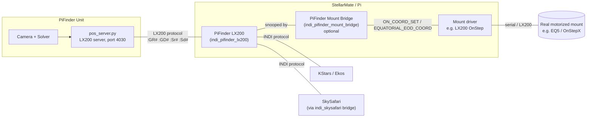

| Component | What it is | Required? |
|---|---|---|
| **PiFinder LX200** (`indi_pifinder_lx200`) | INDI telescope driver. Reports PiFinder's solved position; forwards GoTo requests to PiFinder as a push-to target. | Yes — this is the core integration. |
| **PiFinder Mount Bridge** (`indi_pifinder_mount_bridge`) | Optional INDI auxiliary driver. Couples PiFinder's position to *any* real INDI mount driver, generically (never speaks a mount-specific protocol). | Only if you have a motorized mount you want PiFinder to talk to. |
| A real mount's own INDI driver (e.g. `indi_lx200_OnStep`) | Not part of this project — whatever driver your mount normally uses. | Only if you have a motorized mount. |

Two practical use cases this covers:

1. **Pure push-to** (Dobson, manual Alt-Az, EQ platform): only "PiFinder LX200" is needed. KStars and
   SkySafari show where the telescope is pointed and let you select a GoTo target, which shows up on
   PiFinder's own screen as push-to arrows.
2. **PiFinder + real motorized mount**: add the Mount Bridge. Depending on the chosen *coupling
   mode*, PiFinder can passively verify the mount's alignment, periodically correct drift, or
   directly drive the mount's GoTo — see [Coupling modes](#die-mount-bridge-kopplungsgrad-dial)
   below.

---

## Die drei Bausteine

### 1. PiFinder LX200 (`indi_pifinder_lx200`)

- A standalone INDI telescope driver, built directly against the system `libindi` package (no INDI
  source checkout, no fat multi-driver binary — see
  [Why a standalone build](#warum-ein-standalone-build-statt-fat-binaryindi-source-checkout)).
- Connects to PiFinder's own built-in LX200 server (`pos_server.py`, TCP port **4030**) — the same
  server PiFinder's SkySafari support already uses.
- Capabilities: `TELESCOPE_CAN_GOTO`, `TELESCOPE_CAN_ABORT`, `TELESCOPE_HAS_TIME`,
  `TELESCOPE_HAS_LOCATION`. Deliberately **no** `TELESCOPE_CAN_SYNC`, no Park/Flip/tracking-rate
  control, no custom alignment protocol — PiFinder has no motor and nothing to synchronize about
  itself (see [Property reference](#property-referenz) for why).
- Source: [`indi_pifinder/lx200_pifinder.cpp`](indi_pifinder/lx200_pifinder.cpp) /
  [`.h`](indi_pifinder/lx200_pifinder.h)

### 2. PiFinder Mount Bridge (`indi_pifinder_mount_bridge`)

- A separate, optional INDI auxiliary driver (device family "Auxiliary", not "Telescope" — it isn't
  itself a mount).
- Contains an **embedded INDI client** (`INDI::BaseClient`, same pattern as the stock
  `indi_skysafari` driver) that connects to the local `indiserver` as a normal client and snoops two
  devices: the active "PiFinder" device and the active "Mount" device.
- Speaks **only generic INDI telescope properties** to the mount (`EQUATORIAL_EOD_COORD`,
  `ON_COORD_SET`) — it never needs to know which mount firmware is behind the driver. This is what
  makes it work with *any* INDI-supported mount, not just OnStepX.
- Source: [`indi_pifinder_bridge/pifinder_mount_bridge.cpp`](indi_pifinder_bridge/pifinder_mount_bridge.cpp)
  / [`.h`](indi_pifinder_bridge/pifinder_mount_bridge.h),
  [`pifinder_bridge_client.cpp`](indi_pifinder_bridge/pifinder_bridge_client.cpp) /
  [`.h`](indi_pifinder_bridge/pifinder_bridge_client.h)

### Die Mount Bridge: Kopplungsgrad-Dial

One property (`BRIDGE_MODE`, labelled "Coupling" in the UI) selects how tightly PiFinder and the
real mount are coupled:

| Modus | Verhalten | Wann sinnvoll |
|---|---|---|
| **Off** | No coupling at all. Pure push-to. | Dobson, no motor. |
| **Verify/Alert only** | Continuously compares PiFinder's solved position to the mount's reported position; logs a warning if they disagree by more than the configured threshold. Never writes to the mount. | Astrophotography: a passive "is my mount still correctly aligned?" sanity check. |
| **Auto-correct on drift** | Same comparison, but if drift exceeds the threshold, automatically sends a `Sync` or `Goto/Track` (configurable via `CORRECTION_ACTION`) to the mount. | Manual push-to-then-correct workflows: you slew by hand until PiFinder shows on-target, the Bridge picks up the resulting drift and straightens the mount out afterwards. |
| **Goto-Forward** *(new)* | Event-driven: the moment PiFinder receives a **new** GoTo/push-to target (from its own UI, from KStars, or from SkySafari→PiFinder), the Bridge immediately sends a real `Goto` to the mount. After the mount finishes slewing, it waits for a fresh PiFinder solve and auto-corrects any residual with a `Sync`. | Standalone visual use: PiFinder is the single GoTo interface, the mount just executes. |

There's also a **Manual (one-shot)** control (`MANUAL_TRIGGER`: "Sync Now" / "Goto Now") that works
regardless of the selected mode — useful for a single manual correction without switching modes.

---

## Installation & bebilderte Anleitung

### Voraussetzungen

- StellarMate OS mit installiertem PiFinder (siehe [README.md](README.md))
- `cmake`, ein C++-Compiler, und das `libindi`-Paket (auf StellarMate OS bereits vorhanden)
- Ein laufender `indiserver` — entweder manuell gestartet oder (empfohlen) über den StellarMate
  Web-Manager als **Equipment Profile**

### Schritt 1: Treiber bauen und installieren

```bash
cd ~/PiFinder_Stellarmate
bash bin/build_indi_driver.sh     # PiFinder LX200
bash bin/build_indi_bridge.sh     # PiFinder Mount Bridge (nur falls du eine echte Mount koppeln willst)
```

Falls ein Treiber schon läuft (z.B. über den Web-Manager gestartet), vorher stoppen — sonst schlägt
die Installation mit "Text file busy" fehl.

**Wichtig:** Der StellarMate Web-Manager (`stellarmatewebmanager`, Port 8624) liest seinen
Treiber-Katalog **nur beim eigenen Prozessstart** ein. Nach dem allerersten Build (oder nach einer
Treiber-Versionsänderung) einmal neu starten:

```bash
systemctl --user restart stellarmatewebmanager.service
```

Das muss aus der echten GUI/VNC-Desktop-Session laufen, nicht aus einer reinen SSH-Session.

### Schritt 2: Equipment-Profil im Web-Manager anlegen

Im Browser: `http://<pi-adresse>:8624` öffnen.

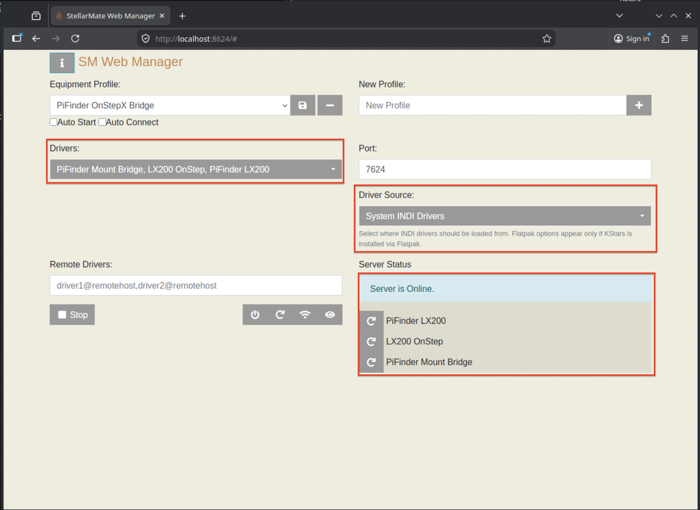

- **Driver Source**: "System INDI Drivers"
- Unter "Telescopes": **PiFinder LX200** hinzufügen, ggf. auch den Treiber deiner echten Mount
  (z.B. "LX200 OnStep")
- Unter "Auxiliary": **PiFinder Mount Bridge** hinzufügen (nur falls gewünscht)
- Profil speichern, **Start** klicken

### Schritt 3: INDI Control Panel — Geräte verbinden

Die Tab-Leiste oben zeigt alle drei Geräte nebeneinander, sobald das Profil läuft:

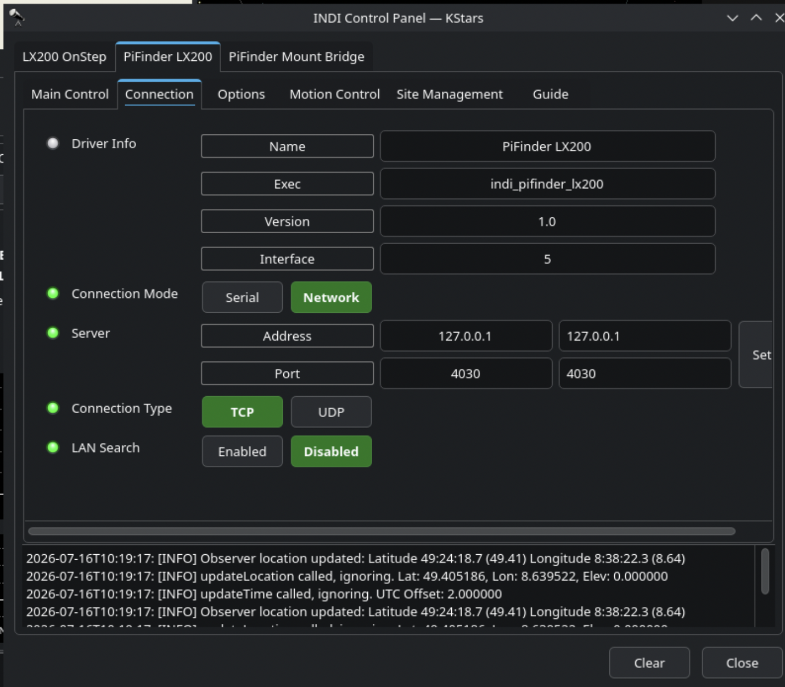

**PiFinder LX200** verbinden:
- Tab "PiFinder LX200" → Connection
- Connection Mode: **TCP**, Address `127.0.0.1`, Port **`4030`**
- "Connect" klicken

Danach im Tab "Main Control" bestätigen — hier ist auch direkt sichtbar, dass es unter "On Set"
nur **Track/Slew** gibt, kein Sync (siehe [Was passiert bei einem GoTo](#was-passiert-bei-einem-goto-auf-pifinder-lx200)):

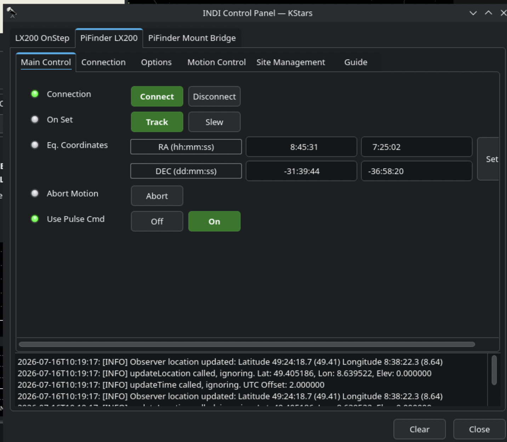

**Deine echte Mount** verbinden (Beispiel OnStepX): je nach Anbindung Serial-Port oder TCP wählen,
dann "Connect".

**PiFinder Mount Bridge** verbinden (falls verwendet):
- Tab "PiFinder Mount Bridge" → Untertab "Options" → "Active devices" → `PiFinder` und `Mount` auf
  die richtigen Gerätenamen setzen (z.B. "PiFinder LX200" / "LX200 OnStep")

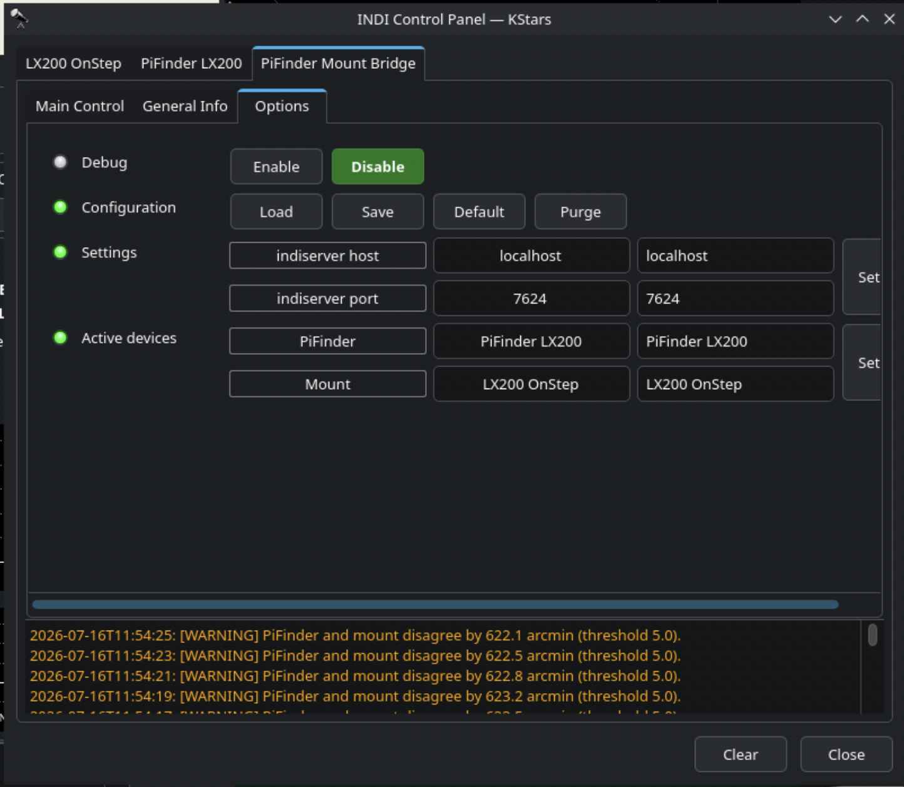

- "Connect" klicken (Main Control-Tab)
- Danach "Coupling" auf den gewünschten Modus setzen (siehe Tabelle oben)

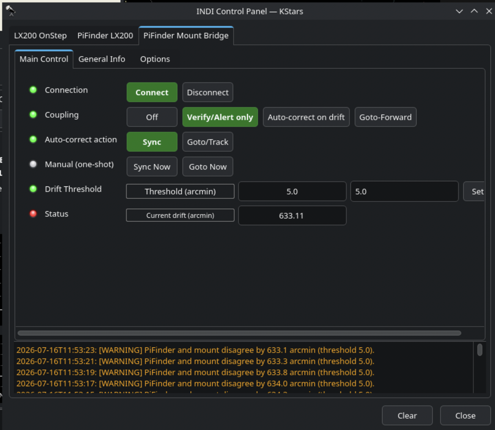

### Schritt 4: KStars/Ekos (Remote-Modus)

**Wichtig:** StellarMate-App und Flatpak-KStars haben ihre **eigenen, unabhängigen
Treiber-Kataloge**, die nicht live `/usr/share/indi/drivers.xml` lesen. Der zuverlässige Weg ist
daher, sich im **Remote-Modus** direkt mit dem bereits laufenden `indiserver` zu verbinden, statt
im lokalen Geräte-Auswahlbaum nach "PiFinder" zu suchen:

- Ekos-Profil-Editor → Modus **Remote**, Host `127.0.0.1`, Port **`7624`**
- "Start" klicken → Ekos verbindet sich zum laufenden Server → alle bereits verbundenen Geräte
  erscheinen automatisch im INDI Control Panel / Mount-Tab

Rechtsklick auf einen Stern zeigt beide Geräte als getrennte Ziele im Kontextmenü — die roten
Fadenkreuze markieren, wo PiFinder aktuell "hinsieht" und wo die Mount tatsächlich steht (hier
absichtlich weit auseinander, zur Illustration):

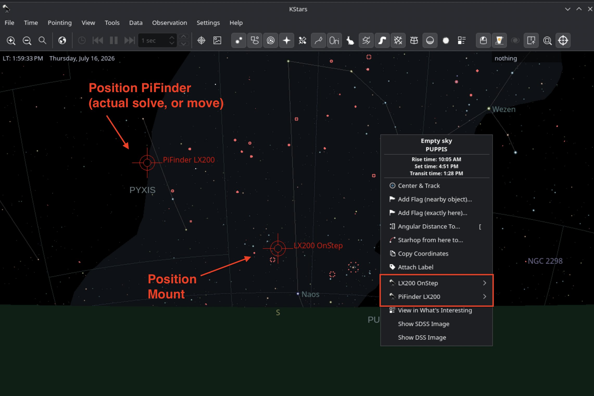

Untermenü "PiFinder LX200" aufgeklappt — nur **Goto / Abort / Find Telescope**, kein Sync (siehe
[Warum kein TELESCOPE_CAN_SYNC?](#warum-kein-telescope_can_sync)):

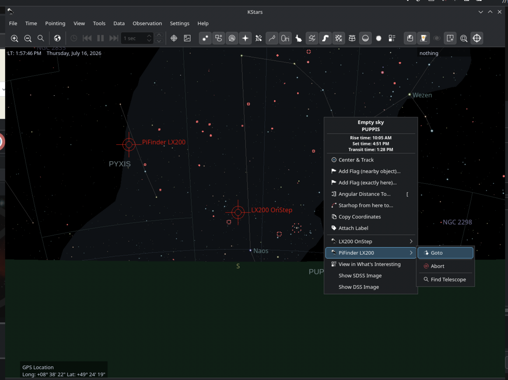

### Schritt 5: SkySafari anbinden

SkySafari verbindet sich **nicht** direkt auf Port 7624, sondern über den mitgelieferten Treiber
**"SkySafari"** (`indi_skysafari`), der als eigene LX200-Bridge auf Port **9624** lauscht:

- Treiber "SkySafari" ebenfalls zum Profil hinzufügen und starten
- Tab "SkySafari" → Options → **Active devices → Telescope** auf **"PiFinder LX200"** stellen
  (Standard ist oft "Telescope Simulator"!). Nach dem Ändern: SkySafari-Treiber kurz
  trennen/neu verbinden.
- In der SkySafari-App: Server-IP der StellarMate-Box eintragen, **Port 9624**

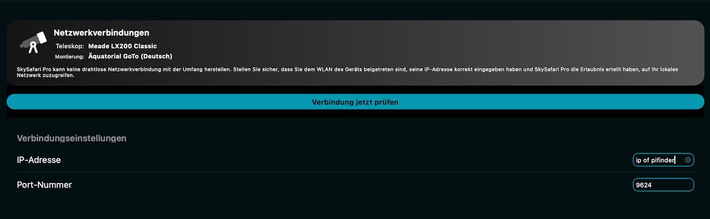

SkySafari braucht selbst kein PiFinder-spezifisches Profil — es spricht generisches LX200 zum
`indi_skysafari`-Treiber, der (via `ACTIVE_DEVICES` → Telescope) auf "PiFinder LX200" zeigt.

Kompletter Verbindungsstack zur Übersicht:

```
SkySafari-App ──(LX200, Port 9624)──> indi_skysafari ──(INDI, snoopt ACTIVE_TELESCOPE)──┐
                                                                                          ↓
KStars/Ekos (Remote, Port 7624) ─────────────(INDI-Protokoll)───────────────────> PiFinder LX200
                                                                                          │
                                                                                   (LX200, Port 4030)
                                                                                          ↓
                                                                                  PiFinder pos_server.py
```

---

## Technische Referenz

### LX200-Kommandos: PiFinder LX200 ↔ PiFinder-eigener Server

Der Treiber spricht mit PiFinders eigenem `pos_server.py` (Port 4030) über eine kleine, feste
Teilmenge des LX200-Protokolls — dieselben Befehle, die PiFinders bestehende SkySafari-Unterstützung
bereits nutzt:

| Kommando | Richtung | Zweck | Treiber-Code |
|---|---|---|---|
| `#:GR#` | Treiber → PiFinder | Aktuelle Rektaszension abfragen (HH:MM:SS) | `ReadScopeStatus()` |
| `#:GD#` | Treiber → PiFinder | Aktuelle Deklination abfragen (+/-DD*MM'SS) | `ReadScopeStatus()` |
| `:Sr<RA>#` | Treiber → PiFinder | Ziel-RA setzen (Teil eines Push-to/GoTo) | `Goto()` |
| `:Sd<DEC>#` | Treiber → PiFinder | Ziel-DEC setzen — löst auf PiFinder-Seite `handle_goto_command()` aus, sobald beide Koordinaten gesetzt sind | `Goto()` |

**Kein Sync-Kommando** (`:CM#` o.ä.) wird je gesendet — es gibt auf PiFinder-Seite nichts zu
synchronisieren (siehe unten).

**Polling:** `ReadScopeStatus()` wird von der INDI-Basisklasse regelmäßig aufgerufen (Standard alle
1000ms) und fragt bei jedem Zyklus `:GR#`/`:GD#` frisch ab.

**Wichtiger Performance-Fix:** PiFinder terminiert jede Antwort mit `#` und sendet danach nichts
mehr. Ein naives `tty_read()` würde bis zum vollen Timeout (mehrere Sekunden) blockieren, statt
sofort nach dem `#` zurückzukehren — das verursachte in einer früheren Treiberversion 6-10 Sekunden
Lag pro Positions-Update. Behoben durch `tty_nread_section(fd, response, max_len, '#', timeout,
&nbytes_read)`, das exakt bis zum Terminator liest.

### Was passiert bei einem GoTo auf "PiFinder LX200"?

Wichtig zu verstehen, weil es keine Slew-Animation gibt: `Goto()` schickt `:Sr#`/`:Sd#` an PiFinders
eigenen Server, der daraus ein neues **Push-to-Ziel** registriert (dieselbe Mechanik wie ein
SkySafari-Push-to, oder eine manuelle Objektauswahl direkt am PiFinder). PiFinders eigene gemeldete
Position (`:GR#`/`:GD#`) ändert sich davon **nicht** — die kommt unabhängig aus dem Live-Plate-Solve.
`TrackState` wird sofort auf `SCOPE_IDLE` gesetzt (nie `SLEWING`), weil physisch nichts passiert,
solange keine Mount Bridge angeschlossen ist.

### Warum kein `TELESCOPE_CAN_SYNC`?

Sync bedeutet normalerweise "korrigiere dein internes Positionsmodell auf diesen Wert". PiFinder hat
kein solches Modell — es meldet bei jedem Frame die frisch gesolvte Ist-Position, es gibt nichts zu
korrigieren. Ein "Sync" auf PiFinders Position zurückzumelden ergibt aber sehr wohl Sinn — das ist
genau die Aufgabe der **Mount Bridge** (Sync/Goto *an die Mount*, nicht an PiFinder).

### Property-Referenz: PiFinder LX200

Standard-`INDI::Telescope`-Properties, die dieser Treiber tatsächlich nutzt/aktiviert (Auswahl,
nicht erschöpfend — Details siehe `LX200Telescope`/`INDI::Telescope` in libindi):

| Property | Typ | Zweck |
|---|---|---|
| `CONNECTION` | Switch | Connect/Disconnect |
| `DEVICE_ADDRESS` | Text | TCP-Zieladresse/Port (Standard `127.0.0.1:4030`) |
| `EQUATORIAL_EOD_COORD` | Number (RO für reine Anzeige, wird bei Goto beschrieben) | Aktuelle RA/DEC |
| `TARGET_EOD_COORD` | Number (von der Basisklasse selbst verwaltet) | Zuletzt kommandiertes Goto-Ziel — **das** ist die Property, die die Mount Bridge snoopt, um neue Push-to-Anfragen zu erkennen (siehe unten) |
| `ON_COORD_SET` | Switch | Nur `TRACK` verfügbar (kein `SYNC`, kein separates `SLEW`) |
| `TELESCOPE_ABORT_MOTION` | Switch | Abort (no-op-artig, da kein Motor, aber Teil der Basis-Capability) |

### Property-Referenz: PiFinder Mount Bridge

| Property | Typ | Elemente | Zweck |
|---|---|---|---|
| `BRIDGE_SETTINGS` | Text | `INDISERVER_HOST`, `INDISERVER_PORT` | Wo der interne Client den `indiserver` findet (Standard `localhost:7624`) |
| `ACTIVE_DEVICES` | Text | `ACTIVE_PIFINDER`, `ACTIVE_MOUNT` | Welche zwei Geräte gesnoopt werden |
| `BRIDGE_MODE` | Switch (1oM) | `MODE_OFF`, `MODE_VERIFY_ALERT`, `MODE_AUTO_CORRECT`, `MODE_GOTO_FORWARD` | Kopplungsgrad, siehe Tabelle oben |
| `CORRECTION_ACTION` | Switch (1oM) | `ACTION_SYNC`, `ACTION_GOTO` | Was `MODE_AUTO_CORRECT` bei Drift-Überschreitung tut |
| `MANUAL_TRIGGER` | Switch | `TRIGGER_SYNC_NOW`, `TRIGGER_GOTO_NOW` | Sofort-Aktion, unabhängig vom Modus |
| `DRIFT_THRESHOLD` | Number | `THRESHOLD_ARCMIN` (Default 5.0) | Schwelle für Drift-Alarm/Korrektur |
| `DRIFT_STATUS` | Number (RO) | `DRIFT_ARCMIN` | Aktuell berechnete Winkeldistanz PiFinder↔Mount |

Die Bridge sendet an die Mount **ausschließlich** generische INDI-Standard-Properties:
`EQUATORIAL_EOD_COORD` (Ziel-RA/DEC) + `ON_COORD_SET` (Switch `SYNC` oder `TRACK`) — nie ein
mount-spezifisches Kommando. Das ist der Kern, der die Bridge generisch für jede INDI-Mount macht.

### Datenfluss: Auto-Correct / Verify-Alert (Drift-Polling)

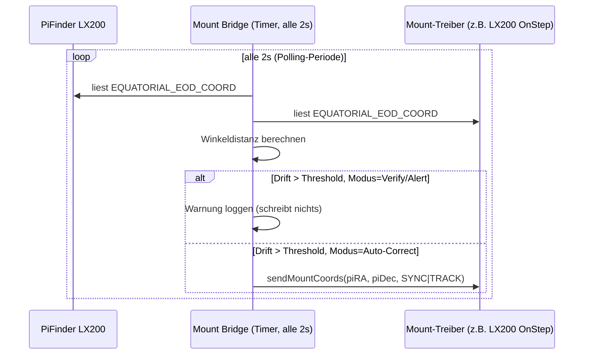

### Datenfluss: Goto-Forward (event-basiert)

```mermaid
stateDiagram-v2
    [*] --> IDLE
    IDLE --> IDLE: TARGET_EOD_COORD unverändert
    IDLE --> SLEWING: neues Ziel erkannt\n→ Goto/Track an Mount gesendet
    SLEWING --> SLEWING: Mount noch busy
    SLEWING --> SETTLING: Mount fertig geslewt
    SETTLING --> SETTLING: Settle-Ticks (3× Poll-Zyklus)\nwarten auf frischen PiFinder-Solve
    SETTLING --> IDLE: Drift berechnet;\nbei Überschreitung Sync gesendet
```

Warum ein Settle-Delay? PiFinder braucht nach einer physischen Bewegung der Montierung (auf der es
befestigt ist) einen Moment, um neu zu solven — die Bridge wartet 3 Poll-Zyklen (Standard: 6
Sekunden bei 2s-Polling), bevor sie die "Ist"-Position als verlässlich behandelt.

Warum am Ende ein **Sync** statt eines erneuten Goto? Die Mount ist durch den vorherigen Goto bereits
physisch angekommen — eine verbleibende Abweichung ist ein Kalibrierungs-/Modellfehler, kein
verpasster Slew. Ein erneutes Goto würde unnötig hin- und herfahren ("hunting").

Warum snoopt die Bridge `TARGET_EOD_COORD` statt einer eigenen Property? `INDI::Telescope`
(Basisklasse jedes LX200-artigen Treibers, inkl. `PiFinder LX200`) veröffentlicht diese Property
bereits **automatisch** bei jedem erfolgreichen `Goto()`-Aufruf (siehe `inditelescope.cpp`,
`ISNewNumber()`) — unabhängig davon, ob der Treiber selbst einen Motor hat. Ein eigener
Property-Zusatz im PiFinder-Treiber war unnötig (ein erster Versuch kollidierte sogar mit dieser
bereits vorhandenen Property, siehe [Bekannte Bugs](#während-der-entwicklung-gefundene-bugs)).

---

## Code, Deployment & Strategien

### Warum ein Standalone-Build statt Fat-Binary/INDI-Source-Checkout?

Frühere Iterationen dieses Projekts basierten auf einem Fork des kompletten `indi`-Quellbaums
(fat-binary-Ansatz, ~13,5 MB Binary mit Dutzenden fremden Mount-Treibern mitkompiliert, kompletter
INDI-Vollbuild bei jeder Änderung). Der aktuelle Ansatz verlinkt stattdessen direkt gegen das
bereits installierte System-`libindi` (`libindilx200.so`, `libindidriver.so` — auf jedem
StellarMate-Gerät vorhanden):

- **Binärgröße**: 13,5 MB → **80 KB**
- **Build-Zeit**: kompletter INDI-Baum → **Sekunden** (nur eine `.cpp`-Datei)
- **Keine `indi-source`-Abhängigkeit** — nur System-Header/-Libs (`pkg-config libindi`)
- **Kein Konflikt mit `pacman`** — überschreibt nicht mehr `/usr/bin/indi_lx200generic`, das dem
  System-Paket gehört

Voraussetzung dafür: die API der modernen `LX200Telescope`-Basisklasse ist zur alten
`LX200Generic` nahezu identisch (gleiche Methodennamen), die Portierung war daher mechanisch.

### Warum zwei getrennte Treiber statt einem?

- **PiFinder LX200** deckt die Rolle ab, die in *jedem* Szenario gleich ist — egal ob eine
  motorisierte Mount existiert oder nicht. Bleibt minimal, ändert sich unabhängig vom Rest.
- **PiFinder Mount Bridge** ist der **einzige** Baustein, der überhaupt weiß, dass es (optional)
  eine zweite, echte Mount gibt. Getrennt deploybar, getrennt aktivierbar, kein Einfluss auf den
  Kern-Anwendungsfall (reines Push-to), wenn nicht gebraucht.
- Beide sind komplett unabhängig buildbar (`bin/build_indi_driver.sh` /
  `bin/build_indi_bridge.sh`), keine Abhängigkeit zwischeneinander im Build.

### Build-System

Beide Treiber nutzen ein minimales `CMakeLists.txt` gegen `pkg-config libindi`, kein Custom-Loader,
kein `main()` — jeder Treiber instanziiert sich selbst über ein einzelnes globales
`std::unique_ptr<...>` (Vorbild: `telescope_simulator.cpp` aus dem INDI-Baum, das Standard-Pattern
für jeden Einzeltreiber). Build-Skripte (`bin/build_indi_driver.sh`, `bin/build_indi_bridge.sh`)
konfigurieren, bauen, installieren nach `/usr/bin/`, und tragen den Treiber (falls nötig) in
`/usr/share/indi/drivers.xml` ein.

### Testing-Strategie

Stufenweise, vom sichersten zum realistischsten Test:

1. **Fake-LX200-Server** (`test_tools/fake_pifinder_lx200.py`): simuliert PiFinders Server auf Port
   4031 mit einer Demo-Tour (Vega → Sheliak → Sulafat → M57) — testet den Treiber ganz ohne
   physisches PiFinder-Gerät.
2. **`indi_simulator_telescope`**: testet die Mount-Bridge-Logik (Snooping, Sync/Goto-Weiterleitung,
   Drift-Berechnung) gegen eine simulierte Mount, ohne physische Bewegung/Risiko.
3. **Reale Hardware** (echtes PiFinder + echte EQ5/OnStepX): finale Verifikation aller Modi
   (Sync, Goto, Goto-Forward) mit tatsächlicher, sichtbarer Mount-Bewegung.

### Während der Entwicklung gefundene Bugs

Für Nachvollziehbarkeit und als Warnung für ähnliche zukünftige Änderungen:

1. **Symlink-Namens-Mismatch** (alter Treiber): Binary-Name passte nicht zum in `drivers.xml`
   erwarteten Namen — Treiber lud nicht.
2. **`tty_read()` statt `tty_nread_section()`**: 6-10s Lag pro Positions-Update (siehe oben,
   [LX200-Kommandos](#lx200-kommandos-pifinder-lx200--pifinder-eigener-server)).
3. **`TARGET_EOD_COORD`-Namenskollision**: ein eigener Versuch, das Goto-Forward-Feature per neuer
   Property zu bauen, kollidierte mit der von `INDI::Telescope` bereits bereitgestellten
   gleichnamigen Property (andere Element-Namen: `RA`/`DEC` vs. selbstgewählt `TARGET_RA`/
   `TARGET_DEC`) — führte zu `IDSetNumber`-Fehlern ("No INumber 'TARGET_RA'"). Lösung: eigene
   Property komplett entfernt, stattdessen die vorhandene Basisklassen-Property genutzt.
4. **`loadConfig()` bei jeder Client-Verbindung**: `PiFinderMountBridge::ISGetProperties()` rief
   `loadConfig(true)` bei **jeder** neuen Client-Verbindung auf (jeder `indi_getprop`-Aufruf, jedes
   Neu-Öffnen des INDI Control Panels) — das überschrieb kommentarlos den gerade gewählten
   Coupling-Modus mit dem zuletzt gespeicherten. Fix: ein `m_configLoaded`-Flag sorgt dafür, dass
   `loadConfig()` nur beim allerersten Aufruf tatsächlich etwas lädt.

---

## Bekannte Einschränkungen & Troubleshooting

- **StellarMate-App und Flatpak-KStars haben eigene, getrennte Treiber-Kataloge**, die nicht live
  `/usr/share/indi/drivers.xml` lesen. Nach jedem Neu-Bau/jeder Versionsänderung eines Treibers:
  `systemctl --user restart stellarmatewebmanager.service` (aus der GUI/VNC-Session, nicht SSH).
  Für KStars: **Remote-Modus** verwenden (siehe [Schritt 4](#schritt-4-kstarsekos-remote-modus))
  statt im lokalen Geräte-Baum zu suchen.
- **`LOGF_INFO`/`LOG_ERROR` der Treiber erscheinen nicht** im servereigenen Log
  (`/tmp/indiserver.log`, wenn über den Web-Manager gestartet) — sie werden aber korrekt als
  INDI-Message an verbundene Clients gesendet und sind im INDI Control Panel (unterer
  Log-Bereich) sichtbar.
- **Pi 5**: Diese INDI-Integration wurde nur auf Pi 4 real-hardware-getestet. Kein bekannter Grund,
  warum es auf Pi 5 anders sein sollte, aber unverifiziert.
- **Goto-Forward setzt eine feste Settle-Zeit** (3 Poll-Zyklen, Standard 6s) voraus, bevor es
  PiFinders Solve als "frisch" behandelt. Bei sehr langsamem Plate-Solving (schwaches Sichtfeld,
  wenige Sterne) kann das zu kurz sein — in dem Fall zeigt `DRIFT_STATUS` ggf. kurzzeitig einen noch
  nicht konvergierten Wert.
- **Kein automatisches GoTo-Weiterreichen ohne Mount Bridge im Modus "Goto-Forward"**: reines
  Push-to (nur "PiFinder LX200", keine Bridge) bewegt nie eine echte Mount — das ist beabsichtigt.

---

## Versionskompatibilität

| Komponente | Version |
|---|---|
| PiFinder | 2.6.0 |
| StellarMate OS | 2.2.1 (Arch Linux) |
| libindi | 2.2.2 |
| Getestete Mount/Treiber | Skywatcher EQ5 + OnStepX, `indi_lx200_OnStep` 1.27 |
| Hardware | Raspberry Pi 4 |

Siehe auch die "Version Compatibility"-Tabelle im [Haupt-README](README.md) für die Basis-PiFinder-
Installation.
