# PiFinder LX200 INDI Integration

*[English version](Readme_PiFinder_LX200.md)*

> ### ✅ Getestet und verifiziert gegen
>
> * **libindi 2.2.2** (Systempaket — kein INDI-Source-Checkout nötig)
> * Verifiziert gegen eine echte Montierung: **Skywatcher EQ5 + OnStepX** (`indi_lx200_OnStep` 1.27)
>
> Bei einem anderen libindi-Release gelten die Konzepte unten weiterhin, aber Property-Namen/Verhalten
> von Fremd-Mount-Treibern (wie OnStep) können leicht abweichen. Für die getesteten PiFinder- /
> StellarMate-OS- / Pi-Kombinationen s. die
> [Versionskompatibilitäts-Tabelle in README.md](README.md#version-compatibility).

> ### ⚠️ Zwingend erforderlich: geht nur über den StellarMate Web Manager
>
> Die PiFinder-LX200-/Mount-Bridge-Treiber existieren **ausschließlich** im eigenen Treiber-Katalog
> des Web Managers, unter **"System INDI Drivers"** — sonst nirgends. Ekos hat seinen eigenen,
> separaten, eingebauten Katalog und kann diese Treiber **in keinem Modus** selbst finden oder
> starten. Es gibt keinen Weg, das komplett aus KStars/Ekos heraus einzurichten: Das
> Equipment-Profil muss zuerst im Web Manager angelegt werden
> ([Schritt 2](#schritt-2-equipment-profil-im-web-manager-anlegen)), Ekos verbindet sich danach nur
> noch remote dazu, im Modus **"Remote Host"**, niemals "Local"
> ([Schritt 4](#schritt-4-kstarsekos-remote-modus)). Wird der Web Manager übersprungen, oder bleibt
> Ekos auf "Local" stehen, tauchen die Treiber schlicht nie auf — das ist mit Abstand die häufigste
> Ursache, warum dieses Setup nicht funktioniert.

This document covers the **INDI integration layer** that connects PiFinder to KStars/Ekos,
SkySafari, and (optionally) a real motorized mount. It is a companion to the main
[README.md](README.md), which covers the base PiFinder-on-StellarMate installation.

---

## Table of Contents

1. [Grundfunktionalität (Overview)](#grundfunktionalität-overview)
2. [Die drei Bausteine](#die-drei-bausteine)
3. [Installation & bebilderte Anleitung](#installation--bebilderte-anleitung)
4. [Technische Referenz](#technische-referenz)
5. [Code, Deployment & Strategien](#code-deployment--strategien)
6. [Bekannte Einschränkungen & Troubleshooting](#bekannte-einschränkungen--troubleshooting)
7. [Versionskompatibilität](#versionskompatibilität)
8. [Screenshot-Referenz](#screenshot-referenz)

---

## Grundfunktionalität (Overview)

PiFinder is a **push-to plate-solving aid** — it has a camera and a solver, but **no motor**. It
tells you *where the telescope is currently pointed* and, given a target, *which way to push it*.
This integration makes that information available to the standard astronomy software ecosystem via
INDI, and optionally couples it to a real motorized mount so PiFinder can act as an automatic
alignment/GoTo source instead of a manual push-to aid.

Three independent, separately-deployable pieces work together:

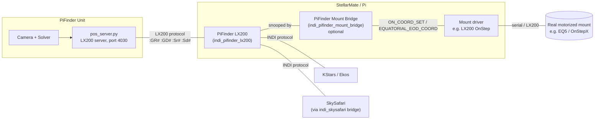
```mermaid
flowchart LR
    subgraph PiFinder Unit
        CAM[Camera + Solver] --> POS[pos_server.py<br/>LX200 server, port 4030]
    end

    subgraph StellarMate / Pi
        DRV["PiFinder LX200<br/>(indi_pifinder_lx200)"]
        BRIDGE["PiFinder Mount Bridge<br/>(indi_pifinder_mount_bridge)<br/>optional"]
        MOUNTDRV["Mount driver<br/>e.g. LX200 OnStep"]
    end

    MOUNT[("Real motorized mount<br/>e.g. EQ5 / OnStepX")]

    KStars["KStars / Ekos"]
    SkySafari["SkySafari<br/>(via indi_skysafari bridge)"]

    POS -- "LX200 protocol\n:GR# :GD# :Sr# :Sd#" --- DRV
    DRV -- "INDI protocol" --- KStars
    DRV -- "INDI protocol" --- SkySafari
    DRV -- "snooped by" --- BRIDGE
    BRIDGE -- "ON_COORD_SET / EQUATORIAL_EOD_COORD" --- MOUNTDRV
    MOUNTDRV -- "serial / LX200" --- MOUNT
```

| Component | What it is | Required? |
|---|---|---|
| **PiFinder LX200** (`indi_pifinder_lx200`) | INDI telescope driver. Reports PiFinder's solved position; forwards GoTo requests to PiFinder as a push-to target. | Yes — this is the core integration. |
| **PiFinder Mount Bridge** (`indi_pifinder_mount_bridge`) | Optional INDI auxiliary driver. Couples PiFinder's position to *any* real INDI mount driver, generically (never speaks a mount-specific protocol). | Only if you have a motorized mount you want PiFinder to talk to. |
| A real mount's own INDI driver (e.g. `indi_lx200_OnStep`) | Not part of this project — whatever driver your mount normally uses. | Only if you have a motorized mount. |

Two practical use cases this covers:

1. **Pure push-to** (Dobson, manual Alt-Az, EQ platform): only "PiFinder LX200" is needed. KStars and
   SkySafari show where the telescope is pointed and let you select a GoTo target, which shows up on
   PiFinder's own screen as push-to arrows.
2. **PiFinder + real motorized mount**: add the Mount Bridge. Depending on the chosen *coupling
   mode*, PiFinder can passively verify the mount's alignment, periodically correct drift, or
   directly drive the mount's GoTo — see [Coupling modes](#die-mount-bridge-kopplungsgrad-dial)
   below.

---

## Die drei Bausteine

### 1. PiFinder LX200 (`indi_pifinder_lx200`)

- A standalone INDI telescope driver, built directly against the system `libindi` package (no INDI
  source checkout, no fat multi-driver binary — see
  [Why a standalone build](#warum-ein-standalone-build-statt-fat-binaryindi-source-checkout)).
- Connects to PiFinder's own built-in LX200 server (`pos_server.py`, TCP port **4030**) — the same
  server PiFinder's SkySafari support already uses.
- Capabilities: `TELESCOPE_CAN_GOTO`, `TELESCOPE_CAN_ABORT`, `TELESCOPE_HAS_TIME`,
  `TELESCOPE_HAS_LOCATION`. Deliberately **no** `TELESCOPE_CAN_SYNC`, no Park/Flip/tracking-rate
  control, no custom alignment protocol — PiFinder has no motor and nothing to synchronize about
  itself (see [Property reference](#property-referenz) for why).
- Source: [`indi_pifinder/lx200_pifinder.cpp`](indi_pifinder/lx200_pifinder.cpp) /
  [`.h`](indi_pifinder/lx200_pifinder.h)

### 2. PiFinder Mount Bridge (`indi_pifinder_mount_bridge`)

- A separate, optional INDI auxiliary driver (device family "Auxiliary", not "Telescope" — it isn't
  itself a mount).
- Contains an **embedded INDI client** (`INDI::BaseClient`, same pattern as the stock
  `indi_skysafari` driver) that connects to the local `indiserver` as a normal client and snoops two
  devices: the active "PiFinder" device and the active "Mount" device.
- Speaks **only generic INDI telescope properties** to the mount (`EQUATORIAL_EOD_COORD`,
  `ON_COORD_SET`) — it never needs to know which mount firmware is behind the driver. This is what
  makes it work with *any* INDI-supported mount, not just OnStepX.
- Source: [`indi_pifinder_bridge/pifinder_mount_bridge.cpp`](indi_pifinder_bridge/pifinder_mount_bridge.cpp)
  / [`.h`](indi_pifinder_bridge/pifinder_mount_bridge.h),
  [`pifinder_bridge_client.cpp`](indi_pifinder_bridge/pifinder_bridge_client.cpp) /
  [`.h`](indi_pifinder_bridge/pifinder_bridge_client.h)

### Die Mount Bridge: Kopplungsgrad-Dial

One property (`BRIDGE_MODE`, labelled "Coupling" in the UI) selects how tightly PiFinder and the
real mount are coupled:

| Modus | Verhalten | Wann sinnvoll |
|---|---|---|
| **Off** | No coupling at all. Pure push-to. | Dobson, no motor. |
| **Verify/Alert only** | Continuously compares PiFinder's solved position to the mount's reported position; logs a warning if they disagree by more than the configured threshold. Never writes to the mount. | Astrophotography: a passive "is my mount still correctly aligned?" sanity check. |
| **Auto-correct on drift** | Same comparison, but if drift exceeds the threshold, automatically sends a `Sync` or `Goto/Track` (configurable via `CORRECTION_ACTION`) to the mount. | Manual push-to-then-correct workflows: you slew by hand until PiFinder shows on-target, the Bridge picks up the resulting drift and straightens the mount out afterwards. |
| **Goto-Forward** | Event-driven: the moment PiFinder receives a **new** GoTo/push-to target (from its own UI, from KStars, or from SkySafari→PiFinder), the Bridge immediately sends a real `Goto` to the mount. After the mount finishes slewing, it waits for a fresh PiFinder solve and auto-corrects any residual with a `Sync`. | Standalone visual use: PiFinder is the single GoTo interface, the mount just executes. |

There's also a **Manual (one-shot)** control (`MANUAL_TRIGGER`) that fires a single Sync or Goto
regardless of the selected mode, for a one-off correction without switching modes — see the
[property reference](#property-referenz-pifinder-mount-bridge) for the full list of triggers.

---

## Installation & bebilderte Anleitung

### Voraussetzungen

- StellarMate OS mit installiertem PiFinder (siehe [README.md](README.md))
- `cmake`, ein C++-Compiler, und das `libindi`-Paket (auf StellarMate OS bereits vorhanden)
- Ein laufender `indiserver` — entweder manuell gestartet oder (empfohlen) über den StellarMate
  Web-Manager als **Equipment Profile**

### Schritt 1: Treiber bauen und installieren

Das übernimmt `pifinder_stellarmate_setup.sh` automatisch für dich: es stoppt zuerst eine
eventuell laufende Treiber-Instanz (um "Text file busy" zu vermeiden), baut und installiert beide
Treiber, und startet danach den StellarMate Web Manager neu, damit sie in dessen Katalog
auftauchen. Bei einer normalen Installation ist hier nichts weiter zu tun.

Die Build-Skripte musst du nur dann selbst aufrufen, wenn du **nur** die Treiber neu bauen willst,
ohne das komplette Setup erneut laufen zu lassen (z.B. nach dem Pullen einer reinen
Treiber-Code-Änderung):

```bash
cd ~/PiFinder_Stellarmate
bash bin/build_indi_driver.sh     # PiFinder LX200
bash bin/build_indi_bridge.sh     # PiFinder Mount Bridge (nur falls du eine echte Mount koppeln willst)
```

Falls ein Treiber schon läuft (z.B. über den Web-Manager gestartet), vorher stoppen — sonst schlägt
die Installation mit "Text file busy" fehl.

**Wichtig:** Der StellarMate Web-Manager (`stellarmatewebmanager`, Port 8624) liest seinen
Treiber-Katalog **nur beim eigenen Prozessstart** ein. Nach einem manuellen Rebuild (oder nach
einer Treiber-Versionsänderung) einmal neu starten:

```bash
systemctl --user restart stellarmatewebmanager.service
```

Das muss aus der echten GUI/VNC-Desktop-Session laufen, nicht aus einer reinen SSH-Session.

### Schritt 2: Equipment-Profil im Web-Manager anlegen

> **⚠️ Dieser Schritt ist zwingend erforderlich und geht nicht aus Ekos heraus.** Den StellarMate
> Web Manager direkt öffnen (nicht über KStars) und das Profil hier anlegen — das ist der **einzige**
> Ort, an dem die PiFinder-Treiber überhaupt existieren.

Im Browser: `http://<pi-adresse>:8624` öffnen. Der Web Manager ist eine einzige Seite:

| Bedienelement | Funktion |
|---|---|
| **Equipment Profile** Dropdown | Wählt das zu bearbeitende / zu startende Profil |
| 💾 Speichern / **−** (daneben) | Änderungen am gewählten Profil speichern / es löschen |
| **New Profile** Feld + **+** | Neues, leeres Profil mit diesem Namen anlegen |
| **Auto Start** / **Auto Connect** | Dieses Profil beim Start des Web Managers starten / alle Geräte verbinden, sobald der Server läuft |
| **Drivers** ("N items selected") | Die Mehrfachauswahl der Treiber dieses Profils |
| **Port** | `indiserver`-Port (Standard **`7624`**) |
| **Driver Source** | Aus welchem Treiber-Katalog die Liste gelesen wird — muss **"System INDI Drivers"** sein |
| **Remote Drivers** | `driver@host`-Einträge für Treiber auf einem anderen Rechner — hier nicht nötig |
| **Stop** / **Start** + Icon-Reihe (Power, Neustart, Netzwerk, 👁) | `indiserver` für das gewählte Profil starten/stoppen; 👁 öffnet das INDI Control Panel |
| **Server Status** | Live-Liste der Treiber, die der laufende Server geladen hat |

**Profil anlegen:**

1. Einen Namen in **New Profile** eintippen → **+**.
2. **Drivers** öffnen und **PiFinder LX200** anhaken, ggf. den Treiber deiner echten Mount
   (z.B. *LX200 OnStep*) und — für Mount-Kopplung — **PiFinder Mount Bridge**. *PiFinder
   Simulator* / *Telescope Simulator* nur für ein hardwarefreies Test-Setup.
3. **Port** auf `7624` lassen. **Driver Source** auf **System INDI Drivers** setzen.
4. 💾 **Speichern**, dann **Start**.

**Driver Source** muss **"System INDI Drivers"** sein: Die PiFinder-Treiber sind als System-INDI-
Treiber installiert (`/usr/share/indi/`). Die anderen Optionen ("KStars Flatpak – Stable /
Nightly") lesen den mitgelieferten Katalog eines Flatpak-KStars, der sie nicht enthält — wählst
du eine davon, verschwinden die PiFinder-Treiber aus der Drivers-Liste. Auch im eigenen Treiber-
Katalog von Ekos sind sie nicht sichtbar (siehe Warnung am Anfang dieses Dokuments).

<table>
<tr>
<td align="center" width="55%">
<a href="docs/images/pfinder_lx200/webmanager_overview.png">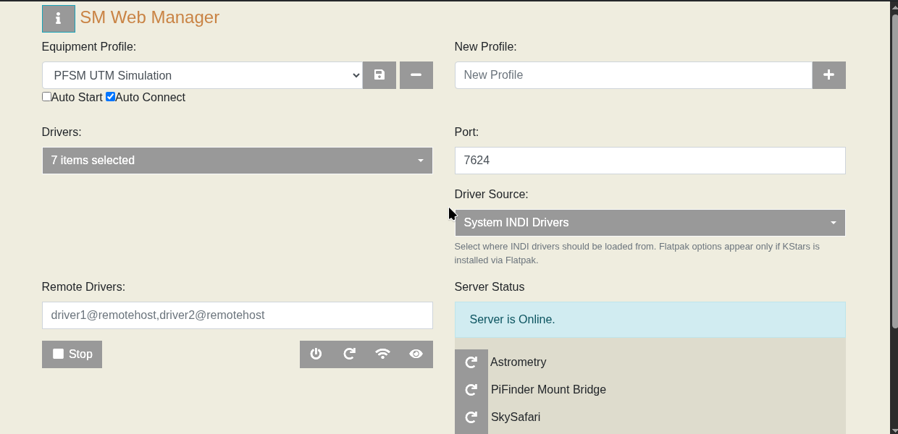</a><br>
<sub>Web Manager: Profil "PFSM UTM Simulation" — Drivers, Port, Driver Source, Server Status</sub>
</td>
<td align="center" width="45%">
<a href="docs/images/pfinder_lx200/webmanager_drivers_list.png">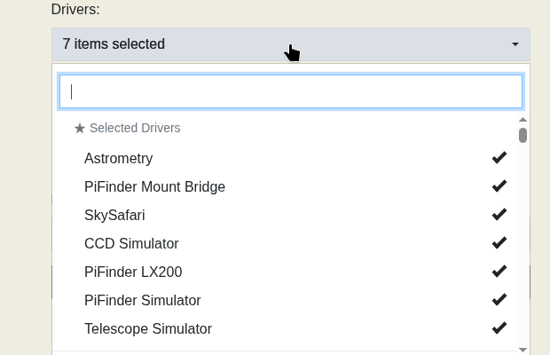</a><br>
<sub>Drivers-Mehrfachauswahl — hier (und nur hier) tauchen die PiFinder-Treiber auf</sub>
</td>
</tr>
<tr>
<td align="center" width="55%">
<a href="docs/images/pfinder_lx200/webmanager_driver_source.png">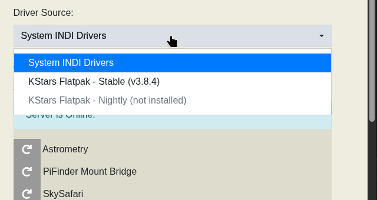</a><br>
<sub>Driver Source: "System INDI Drivers" verwenden; die Flatpak-Kataloge haben die PiFinder-Treiber nicht</sub>
</td>
<td align="center" width="45%">
<a href="docs/images/pfinder_lx200/webmanager_profile.png"></a><br>
<sub>Ein Profil mit echter Mount: PiFinder Mount Bridge + LX200 OnStep + PiFinder LX200, alle online</sub>
</td>
</tr>
</table>

### Schritt 3: INDI Control Panel — Geräte verbinden

In KStars öffnen: **Tools → Devices → INDI Control Panel** (`Strg+I`); es öffnet sich auch von
selbst, sobald das Profil startet. Pro Treiber im Profil gibt es einen Top-Level-Tab:

| Tab | Rolle | Verbinden? |
|---|---|---|
| **PiFinder LX200** | PiFinders gelöste Position als INDI-Teleskop | Ja — die Kern-Integration |
| **PiFinder Mount Bridge** | Koppelt PiFinder an eine echte Mount | Nur mit motorisierter Mount |
| Treiber deiner Mount (z.B. *LX200 OnStep*) | Die echte Mount | Wie für diese Mount üblich |
| *PiFinder Simulator*, *Telescope Simulator*, *SkySafari*, … | Optionale Test-/Bridge-Treiber | Siehe [Simulator-Guide](Readme_PiFinder_Simulator.md) und [Schritt 5](#schritt-5-skysafari-anbinden) |

#### PiFinder LX200

1. Untertab **Connection**: Connection Mode **Network**, Connection Type **TCP**, Server-Adresse
   `127.0.0.1` Port **`4030`** → **Set**.
2. Untertab **Main Control** → **Connect**. *On Set* zeigt dann nur **Track / Slew**, kein Sync
   (siehe [Warum kein `TELESCOPE_CAN_SYNC`?](#warum-kein-telescope_can_sync)); *Eq. Coordinates*
   zeigt die live gelöste Position.

Die Untertabs **Options**, **Motion Control**, **Site Management** und **Guide** stammen aus der
LX200-Basisklasse. Sie werden angezeigt, sind aber wirkungslos: PiFinder hat keinen Motor und
bezieht Zeit und Standort aus seinem eigenen GPS (der Treiber loggt `updateTime called, ignoring`
/ `updateLocation called, ignoring`).

<table>
<tr>
<td align="center" width="50%">
<a href="docs/images/pfinder_lx200/indi_control_panel_tabs_PiFinder_LX200_connection.png">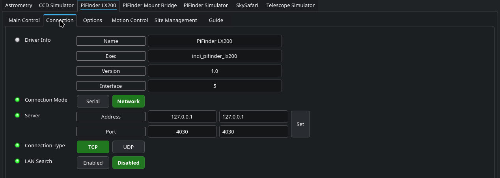</a><br>
<sub>PiFinder LX200 → Connection: Network / TCP, 127.0.0.1 : 4030</sub>
</td>
<td align="center" width="50%">
<a href="docs/images/pfinder_lx200/indi_control_panel_tabs_PiFinder_LX200_main.png"></a><br>
<sub>PiFinder LX200 → Main Control: nur Track / Slew, kein Sync</sub>
</td>
</tr>
</table>

#### Deine echte Mount

So verbinden, wie du es für diesen Treiber gewohnt bist — Serial-Port oder TCP, dann **Connect**.
Hier gibt es nichts PiFinder-Spezifisches.

#### PiFinder Mount Bridge

1. Untertab **Options** → **Active devices**: `PiFinder` auf den Gerätenamen von PiFinder LX200
   setzen und `Mount` auf den Gerätenamen deiner Mount (z.B. *PiFinder LX200* / *LX200 OnStep*).
   Die Zeile **Settings** darüber richtet den eingebetteten Client der Bridge auf den lokalen
   `indiserver` aus — bei `localhost` : `7624` belassen.
2. Untertab **Main Control** → **Connect**, dann **Coupling** auf den gewünschten Modus setzen
   ([Kopplungsgrad-Dial](#die-mount-bridge-kopplungsgrad-dial)). Dieser Tab trägt außerdem die
   One-Shot-Trigger, die Drift-Schwelle und den Live-Drift-Status, den Multi-Point-Alignment-Lauf
   und die Rückfrage bei unerklärter Neupositionierung — siehe die
   [Property-Referenz](#property-referenz-pifinder-mount-bridge).
3. Untertab **Shadow Sync**: spiegelt jedes an die Mount gesendete Kommando der Bridge auf ein
   zweites, nicht steuerndes Gerät (Vorgabe *PiFinder Simulator*), damit ein simulierter PiFinder
   einer echten Mount folgen kann. Wird automatisch scharfgeschaltet, sobald das Shadow-Gerät
   vorhanden ist; nur für die Simulator-Setups relevant.

<table>
<tr>
<td align="center" width="33%">
<a href="docs/images/pfinder_lx200/indi_control_panel_tabs_PiFinder_Mount_Bridge_main.png">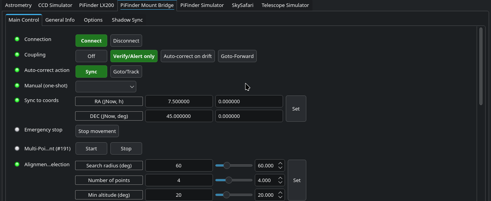</a><br>
<sub>Mount Bridge → Main Control: Coupling, Korrektur-Aktion, Trigger, Alignment</sub>
</td>
<td align="center" width="33%">
<a href="docs/images/pfinder_lx200/indi_control_panel_tabs_PiFinder_Mount_Bridge_options.png">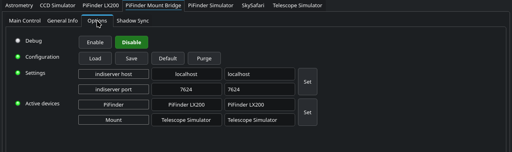</a><br>
<sub>Mount Bridge → Options: Active devices + indiserver-Settings</sub>
</td>
<td align="center" width="33%">
<a href="docs/images/pfinder_lx200/indi_control_panel_tabs_PiFinder_Mount_Bridge_shadow.png">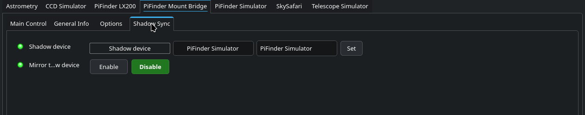</a><br>
<sub>Mount Bridge → Shadow Sync: Kommandos auf ein nicht steuerndes Gerät spiegeln</sub>
</td>
</tr>
</table>

### Schritt 4: KStars/Ekos (Remote-Modus)

**Kritisch: das Ekos-Profil muss den Modus "Remote Host" verwenden, nicht "Local".** StellarMate-App
und Flatpak-KStars haben ihre **eigenen, unabhängigen Treiber-Kataloge**, die nicht live
`/usr/share/indi/drivers.xml` lesen — im Modus **Local** versucht Ekos, Treiber selbst aus diesem
lokalen Katalog zu starten, und findet unsere selbstgebauten Treiber dort nie. Im Modus
**Remote Host** startet oder sucht Ekos lokal überhaupt nichts: es ist rein ein Netzwerk-Client des
`indiserver`, den der Web-Manager bereits gestartet hat — welchen Treiber-Katalog Ekos selbst hat,
spielt dabei keine Rolle.

**Im Ekos-Tab** (Tools → Ekos, `Strg+K`):

1. **1. Select Profile** — dein Profil im Dropdown wählen. Die Buttons daneben: **+** neu,
   **✏** bearbeiten, **✗** löschen, **⛶** als Standard, **🪄** Assistent.
2. **✏ bearbeiten** öffnet den **Profil-Editor**:
   - **Modus: Remote Host** (nicht "Local"!), Host `localhost`, Port **`7624`** — der
     `indiserver`-Port aus dem Web-Manager-Profil.
   - **Auto Connect** an: alle Geräte verbinden, sobald Ekos startet.
   - **INDI Web Manager** (Checkbox + Port `8624`) — optional. Angehakt wirken Ekos' eigene
     Start/Stop-Buttons auf das *entfernte* Web-Manager-Profil, und **Scan** findet die Box im
     Netzwerk. Ohne Haken ist Ekos reiner Netzwerk-Client eines `indiserver`, den du woanders
     startest (Web Manager oder Control Center).
   - **Select Devices** — im Remote-Host-Modus listet das nur Treiber, die Ekos selbst starten
     würde; für ein PiFinder-Setup kann es praktisch leer bleiben (die PiFinder-Treiber sind
     **nicht** hier und müssen es nicht sein — sie laufen unter dem Web Manager). **Save** klicken.
3. **2. Start & Stop Ekos** — der **▶ / ■**-Button startet/stoppt die Session. Beim Start
   erscheint jedes Gerät, das der entfernte Server bereits verbunden hat, in den Modulen
   Mount / Capture / … und im INDI Control Panel.
4. **3. Connect & Disconnect Devices** — erzwingt einen Reconnect aller Geräte, ohne Ekos neu zu starten.

<table>
<tr>
<td align="center" width="60%">
<a href="docs/images/pfinder_lx200/ekos_select_profile.png">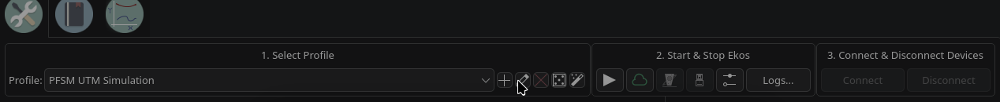</a><br>
<sub>Ekos: Select Profile → Start &amp; Stop Ekos → Connect &amp; Disconnect Devices (Session gestoppt)</sub>
</td>
<td align="center" width="40%">
<a href="docs/images/pfinder_lx200/ekos_profile_editor.png">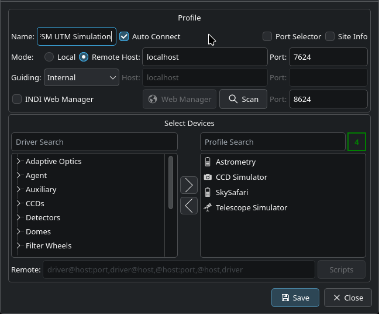</a><br>
<sub>Profil-Editor: Modus "Remote Host", localhost:7624, Auto Connect</sub>
</td>
</tr>
</table>

Rechtsklick auf einen Stern zeigt beide Geräte als getrennte Ziele im Kontextmenü — die roten
Fadenkreuze markieren, wo PiFinder aktuell "hinsieht" und wo die Mount tatsächlich steht (hier
absichtlich weit auseinander, zur Illustration). Das Untermenü "PiFinder LX200" aufgeklappt zeigt
nur **Goto / Abort / Find Telescope**, kein Sync (siehe
[Warum kein TELESCOPE_CAN_SYNC?](#warum-kein-telescope_can_sync)). Die vollständige
Himmelskarten-Ansicht und alle Rechtsklick-Operationen behandelt
[Readme_PiFinder_in_KStars_de.md](Readme_PiFinder_in_KStars_de.md). Klick auf ein Vorschaubild
öffnet den Screenshot in voller Größe:

<table>
<tr>
<td align="center" width="50%">
<a href="docs/images/pfinder_lx200/kstars_context_menu_both_mount_and_pifinder.png"></a><br>
<sub>Himmelskarte: PiFinder und Mount als getrennte Ziel-Geräte im Kontextmenü</sub>
</td>
<td align="center" width="50%">
<a href="docs/images/pfinder_lx200/kstars_context_menu_PiFinder_LX200.png">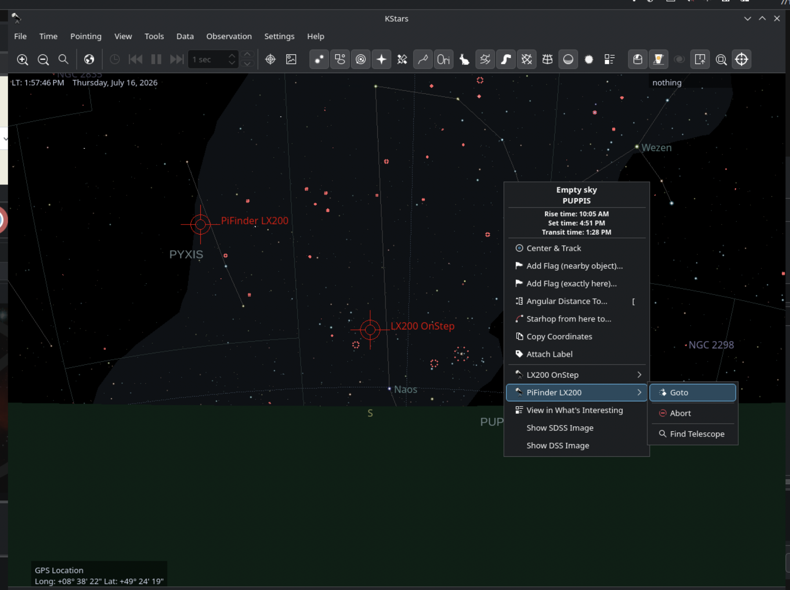</a><br>
<sub>Untermenü "PiFinder LX200": nur Goto, Abort, Find Telescope</sub>
</td>
</tr>
</table>

### Schritt 5: SkySafari anbinden

SkySafari verbindet sich **nicht** direkt auf Port 7624, sondern über den mitgelieferten Treiber
**"SkySafari"** (`indi_skysafari`), der als eigene LX200-Bridge auf Port **9624** lauscht:

- Treiber "SkySafari" ebenfalls zum Profil hinzufügen und starten
- Tab "SkySafari" → Options → **Active devices → Telescope** auf **"PiFinder LX200"** stellen
  (Standard ist oft "Telescope Simulator"!). Nach dem Ändern: SkySafari-Treiber kurz
  trennen/neu verbinden.
- In der SkySafari-App: Server-IP der StellarMate-Box eintragen, **Port 9624**

SkySafari braucht selbst kein PiFinder-spezifisches Profil — es spricht generisches LX200 zum
`indi_skysafari`-Treiber, der (via `ACTIVE_DEVICES` → Telescope) auf "PiFinder LX200" zeigt.

Kompletter Verbindungsstack zur Übersicht:

```
SkySafari-App ──(LX200, Port 9624)──> indi_skysafari ──(INDI, snoopt ACTIVE_TELESCOPE)──┐
                                                                                          ↓
KStars/Ekos (Remote, Port 7624) ─────────────(INDI-Protokoll)───────────────────> PiFinder LX200
                                                                                          │
                                                                                   (LX200, Port 4030)
                                                                                          ↓
                                                                                  PiFinder pos_server.py
```

<table>
<tr>
<td align="center">
<a href="docs/images/pfinder_lx200/skysafari_ip_port_Meade_LXClassic.png">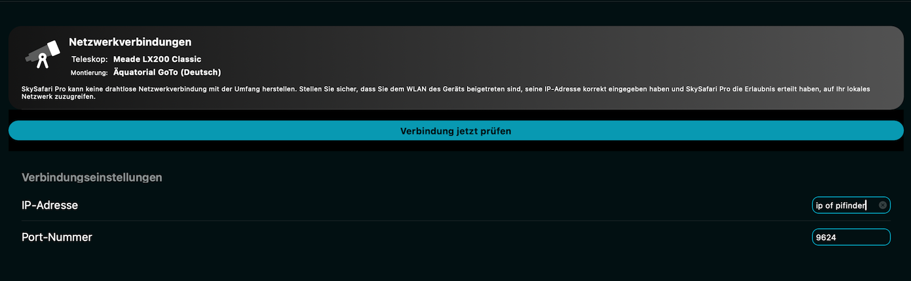</a><br>
<sub>SkySafari Netzwerkverbindungen: Teleskop-Auswahl (LX200-kompatibel), IP-Adresse und Port-Nummer 9624</sub>
</td>
</tr>
</table>

---

## Technische Referenz

### LX200-Kommandos: PiFinder LX200 ↔ PiFinder-eigener Server

Der Treiber spricht mit PiFinders eigenem `pos_server.py` (Port 4030) über eine kleine, feste
Teilmenge des LX200-Protokolls — dieselben Befehle, die PiFinders bestehende SkySafari-Unterstützung
bereits nutzt:

| Kommando | Richtung | Zweck | Treiber-Code |
|---|---|---|---|
| `#:GR#` | Treiber → PiFinder | Aktuelle Rektaszension abfragen (HH:MM:SS) | `ReadScopeStatus()` |
| `#:GD#` | Treiber → PiFinder | Aktuelle Deklination abfragen (+/-DD*MM'SS) | `ReadScopeStatus()` |
| `:Sr<RA>#` | Treiber → PiFinder | Ziel-RA setzen (Teil eines Push-to/GoTo) | `Goto()` |
| `:Sd<DEC>#` | Treiber → PiFinder | Ziel-DEC setzen — löst auf PiFinder-Seite `handle_goto_command()` aus, sobald beide Koordinaten gesetzt sind | `Goto()` |

**Kein Sync-Kommando** (`:CM#` o.ä.) wird je gesendet — es gibt auf PiFinder-Seite nichts zu
synchronisieren (siehe unten).

**Polling:** `ReadScopeStatus()` wird von der INDI-Basisklasse regelmäßig aufgerufen (Standard alle
1000ms) und fragt bei jedem Zyklus `:GR#`/`:GD#` frisch ab.

**Wichtiger Performance-Fix:** PiFinder terminiert jede Antwort mit `#` und sendet danach nichts
mehr. Ein naives `tty_read()` würde bis zum vollen Timeout (mehrere Sekunden) blockieren, statt
sofort nach dem `#` zurückzukehren — das verursachte in einer früheren Treiberversion 6-10 Sekunden
Lag pro Positions-Update. Behoben durch `tty_nread_section(fd, response, max_len, '#', timeout,
&nbytes_read)`, das exakt bis zum Terminator liest.

### Was passiert bei einem GoTo auf "PiFinder LX200"?

Wichtig zu verstehen, weil es keine Slew-Animation gibt: `Goto()` schickt `:Sr#`/`:Sd#` an PiFinders
eigenen Server, der daraus ein neues **Push-to-Ziel** registriert (dieselbe Mechanik wie ein
SkySafari-Push-to, oder eine manuelle Objektauswahl direkt am PiFinder). PiFinders eigene gemeldete
Position (`:GR#`/`:GD#`) ändert sich davon **nicht** — die kommt unabhängig aus dem Live-Plate-Solve.
`TrackState` wird sofort auf `SCOPE_IDLE` gesetzt (nie `SLEWING`), weil physisch nichts passiert,
solange keine Mount Bridge angeschlossen ist.

### Warum kein `TELESCOPE_CAN_SYNC`?

Sync bedeutet normalerweise "korrigiere dein internes Positionsmodell auf diesen Wert". PiFinder hat
kein solches Modell — es meldet bei jedem Frame die frisch gesolvte Ist-Position, es gibt nichts zu
korrigieren. Ein "Sync" auf PiFinders Position zurückzumelden ergibt aber sehr wohl Sinn — das ist
genau die Aufgabe der **Mount Bridge** (Sync/Goto *an die Mount*, nicht an PiFinder).

### Property-Referenz: PiFinder LX200

Standard-`INDI::Telescope`-Properties, die dieser Treiber tatsächlich nutzt/aktiviert (Auswahl,
nicht erschöpfend — Details siehe `LX200Telescope`/`INDI::Telescope` in libindi):

| Property | Typ | Zweck |
|---|---|---|
| `CONNECTION` | Switch | Connect/Disconnect |
| `DEVICE_ADDRESS` | Text | TCP-Zieladresse/Port (Standard `127.0.0.1:4030`) |
| `EQUATORIAL_EOD_COORD` | Number (RO für reine Anzeige, wird bei Goto beschrieben) | Aktuelle RA/DEC |
| `TARGET_EOD_COORD` | Number (von der Basisklasse selbst verwaltet) | Zuletzt kommandiertes Goto-Ziel — **das** ist die Property, die die Mount Bridge snoopt, um neue Push-to-Anfragen zu erkennen (siehe unten) |
| `ON_COORD_SET` | Switch | `TRACK` / `SLEW` (beide laufen über `Goto()`); kein `SYNC` |
| `TELESCOPE_ABORT_MOTION` | Switch | Abort (no-op-artig, da kein Motor, aber Teil der Basis-Capability) |

### Property-Referenz: PiFinder Mount Bridge

**Bedienelemente** (auf dem Untertab Main Control, sofern nicht anders vermerkt):

| Property | Typ | Zweck |
|---|---|---|
| `BRIDGE_SETTINGS` | Text *(Options)* | `indiserver` Host/Port für den eingebetteten Client (Standard `localhost:7624`) |
| `ACTIVE_DEVICES` | Text *(Options)* | Welches PiFinder- und Mount-Gerät gesnoopt wird |
| `SHADOW_DEVICE_NAME` / `SHADOW_SYNC` | Text / Switch *(Shadow Sync)* | Zweites, nicht steuerndes Gerät, auf das Mount-Kommandos gespiegelt werden, plus An/Aus |
| `BRIDGE_MODE` | Switch (1oM) | Coupling: `MODE_OFF` / `MODE_VERIFY_ALERT` / `MODE_AUTO_CORRECT` / `MODE_GOTO_FORWARD` — siehe [Kopplungsgrad-Dial](#die-mount-bridge-kopplungsgrad-dial) |
| `CORRECTION_ACTION` | Switch (1oM) | Was Auto-Correct bei Drift tut: `ACTION_SYNC` oder `ACTION_GOTO` (Goto/Track) |
| `MANUAL_TRIGGER` | Switch (≤1) | One-Shot, jeder Modus: `TRIGGER_SYNC_NOW`, `TRIGGER_GOTO_NOW`, `TRIGGER_GOTO_HELD` (gehaltenes Originalziel erneut senden), `TRIGGER_ALIGN_HELD`, `TRIGGER_SYNC_TO_COORDS` |
| `SYNC_TO_COORDS` | Number | RA/DEC (JNow) für `TRIGGER_SYNC_TO_COORDS` |
| `ABORT_MOUNT` | Switch | Not-Stopp — sendet einen Abort an die Mount |
| `MULTI_POINT_ALIGN` | Switch (≤1) | Start / Stop eines automatisierten Multi-Point-Alignment-Laufs ([#191](https://github.com/apos/PiFinder_Stellarmate/issues/191)) |
| `ALIGN_CONFIG` / `ALIGN_DIRECTION` | Number / Switch (1oM) | Suchradius, Punktzahl, Mindesthöhe dieses Laufs; bevorzugte Himmelsregion (Any/N/E/S/W) |
| `REPOSITION_CONFIRM` | Switch (≤1) | Antwort auf die Rückfrage bei unerklärter Neupositionierung: neue Position übernehmen oder aufs gehaltene Ziel zurück |
| `DRIFT_THRESHOLD` | Number | Drift darüber (Bogenminuten, Default 5.0) löst Alarm / Korrektur aus |
| `MAX_SYNC_DRIFT` | Number | Sicherheitsgrenze: ein Auto-Sync oberhalb (Bogenminuten, Default 120) wird verweigert |
| `SOLVE_FRESHNESS` | Number | Maximales Solve-Alter (s, Default 5), auf das eine Auto-Korrektur reagiert |

**Nur-Lese-Status:**

| Property | Zeigt |
|---|---|
| `DRIFT_STATUS` | Aktuelle Winkeldistanz PiFinder↔Mount (Bogenminuten) |
| `MOUNT_HORIZON_STATUS` | Mount-Höhe (Grad); die Drift-Berechnung friert ein, solange die Mount unter dem Horizont steht |
| `TARGET_SOURCE` (+ `…_AGE`, `CORRECTION_AGE`) | Ob die Bridge gerade PiFinder oder der Mount folgt, und wie lange seit dieser Änderung / dem letzten selbst gesendeten Kommando |
| `ORIGINAL_TARGET` (+ `…_DRIFT`) | J2000-RA/DEC des letzten wirklich neuen GoTo-Ziels und die aktuelle Drift davon |
| `ALIGN_PROGRESS` | Multi-Point-Lauf: aktueller Punkt / gesamt / verifiziert |
| `MOUNT_REJECT` | Gefüllt, wenn die Mount ein Goto/Sync ablehnt (Achsen- oder Höhengrenze) |
| `PIFINDER_ORIENTATION` | PiFinders eigener Mount-Typ / Screen-Direction, vom PiFinder-Gerät gesnoopt |

An die Mount sendet die Bridge **ausschließlich** generische INDI-Standard-Properties —
`EQUATORIAL_EOD_COORD` (Ziel-RA/DEC) + `ON_COORD_SET` (`SYNC` oder `TRACK`), nie ein
mount-spezifisches Kommando. Das ist der Kern, der sie für jede INDI-Mount generisch macht.

### In der Praxis: welche Bedienelemente du tatsächlich anfasst

Die Tabellen oben sind die volle Oberfläche. Im Alltag bleibt eine Handvoll - im Screenshot unten
jeweils rot markiert, mit einem realistischen Beispielwert:

| Wo | Bedienelement | Beispiel | Wann |
|---|---|---|---|
| PiFinder LX200 → Connection | Network / TCP, Server + Port | `127.0.0.1` : `4030` (die Defaults - selten zu ändern) | Einmal, beim Setup |
| PiFinder LX200 → Main Control | **Connect** | - | Jede Session (oder Auto Connect erledigt es) |
| Mount Bridge → Options | **Configuration** | Nach jeder Änderung unten **Save** klicken | Nach jeder Änderung, die einen Neustart überstehen soll (gilt für jeden Treiber, nicht nur diesen) |
| Mount Bridge → Options | **Active devices** | PiFinder = `PiFinder LX200`, Mount = Gerätename deiner Mount (z. B. `LX200 OnStep`) | Einmal, beim Setup |
| Mount Bridge → Main Control | **Connect**, dann **Coupling** | `Verify/Alert only` zum sicheren Start; `Goto-Forward` für volles Push-to-treibt-die-Mount | Jede Session — Coupling ist der eine Regler, den du bewusst änderst |
| Mount Bridge → Main Control | **Drift Threshold** | `5.0` arcmin (Default) | Selten — Drift-Alarm enger / weiter stellen |
| Mount Bridge → Main Control | **Manual (one-shot)** | `Sync Now` oder `Goto Held Target` aus dem Dropdown wählen | Recovery nach einem Stoß oder einem abgelehnten Slew |

Jeder markierte Ausschnitt unten verlinkt auf den **vollen, unbearbeiteten Desktop-Screenshot**, aus
dem er stammt - ganzer Bildschirm, echte INDI-Log-Meldungen inklusive, nicht nur das Panel isoliert.
Der Ausschnitt ist nur ein Hinweis, kein Ersatz dafür, das Ganze zu sehen (alle vollen Screenshots
sind auch in der [Screenshot-Referenz](#screenshot-referenz) katalogisiert).

<table>
<tr>
<td align="center" width="33%">
<a href="docs/images/pfinder_lx200/indi_control_panel_full_PiFinder_LX200_connection.png">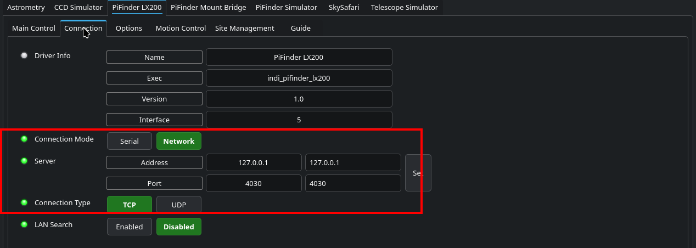</a><br>
<sub>PiFinder LX200 → Connection <em>(klick für Vollbild)</em></sub>
</td>
<td align="center" width="33%">
<a href="docs/images/pfinder_lx200/indi_control_panel_full_PiFinder_LX200_main.png"></a><br>
<sub>PiFinder LX200 → Main Control <em>(klick für Vollbild)</em></sub>
</td>
<td align="center" width="33%">
<a href="docs/images/pfinder_lx200/indi_control_panel_full_PiFinder_Mount_Bridge_options.png"></a><br>
<sub>Mount Bridge → Options → Configuration <em>(klick für Vollbild)</em></sub>
</td>
</tr>
<tr>
<td align="center" width="33%">
<a href="docs/images/pfinder_lx200/indi_control_panel_full_PiFinder_Mount_Bridge_options.png">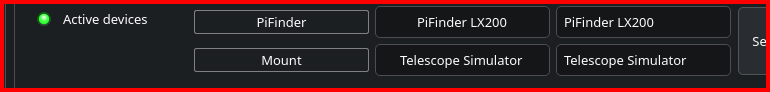</a><br>
<sub>Mount Bridge → Options → Active devices <em>(klick für Vollbild)</em></sub>
</td>
<td align="center" width="33%">
<a href="docs/images/pfinder_lx200/indi_control_panel_full_PiFinder_Mount_Bridge_main_1.png"></a><br>
<sub>Mount Bridge → Main Control → Connect / Coupling <em>(klick für Vollbild)</em></sub>
</td>
<td align="center" width="33%">
<a href="docs/images/pfinder_lx200/indi_control_panel_full_PiFinder_Mount_Bridge_main_2.png"></a><br>
<sub>Mount Bridge → Main Control → Drift Threshold <em>(klick für Vollbild, gescrollt)</em></sub>
</td>
</tr>
<tr>
<td align="center" width="33%">
<a href="docs/images/pfinder_lx200/indi_control_panel_full_PiFinder_Mount_Bridge_main_1.png"></a><br>
<sub>Mount Bridge → Main Control → Manual (one-shot) <em>(klick für Vollbild)</em></sub>
</td>
</tr>
</table>

Alles andere ist Nur-Lese-Status oder ein geerbtes Basisklassen-Element ohne Wirkung für PiFinder
(siehe [Schritt 3](#schritt-3-indi-control-panel--geräte-verbinden)).

**Kann man Properties im INDI Control Panel gruppieren oder umsortieren?** Nein. Das Layout ist
pro Treiber fest: ein Tab pro Gerät, dann die Property-Gruppen des Treibers als Untertabs (*Main
Control*, *Connection*, *Options*, …). Es gibt keine Möglichkeit, eigene Gruppen zu bilden, Zeilen
auszublenden oder umzuordnen. Zwei Dinge mildern das: **Options → Configuration → Save** lässt
einen Treiber mit deinen Werten wiederkommen, und **Ekos** zeigt die paar mittendrin relevanten
Properties in seinen eigenen Modul-GUIs (Mount, Capture, Focus, Align), sodass das rohe Panel
während eines Laufs selten nötig ist.

### Datenfluss: Auto-Correct / Verify-Alert (Drift-Polling)

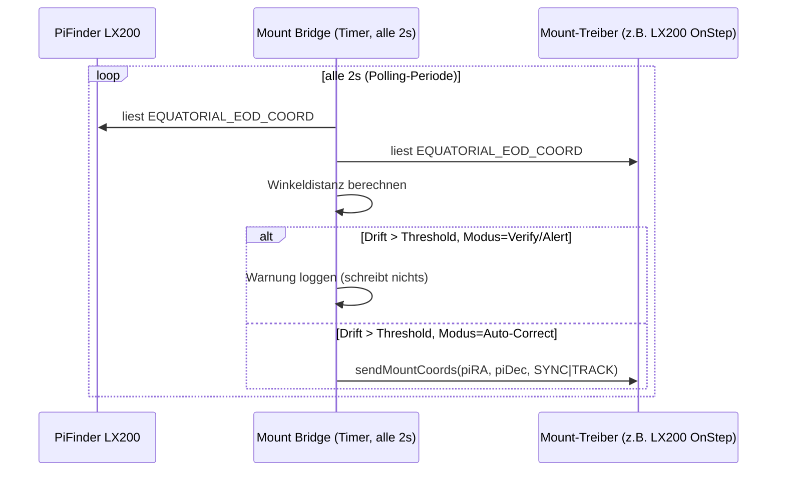
```mermaid
sequenceDiagram
    participant PF as PiFinder LX200
    participant BR as Mount Bridge (Timer, alle 2s)
    participant MT as Mount-Treiber (z.B. LX200 OnStep)

    loop alle 2s (Polling-Periode)
        BR->>PF: liest EQUATORIAL_EOD_COORD
        BR->>MT: liest EQUATORIAL_EOD_COORD
        BR->>BR: Winkeldistanz berechnen
        alt Drift > Threshold, Modus=Verify/Alert
            BR->>BR: Warnung loggen (schreibt nichts)
        else Drift > Threshold, Modus=Auto-Correct
            BR->>MT: sendMountCoords(piRA, piDec, SYNC|TRACK)
        end
    end
```

### Datenfluss: Goto-Forward (event-basiert)

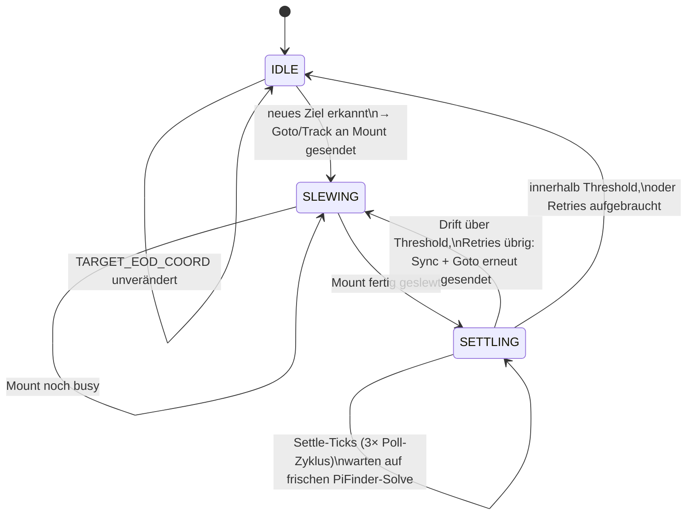
```mermaid
stateDiagram-v2
    [*] --> IDLE
    IDLE --> IDLE: TARGET_EOD_COORD unverändert
    IDLE --> SLEWING: neues Ziel erkannt\n→ Goto/Track an Mount gesendet
    SLEWING --> SLEWING: Mount noch busy
    SLEWING --> SETTLING: Mount fertig geslewt
    SETTLING --> SETTLING: Settle-Ticks (3× Poll-Zyklus)\nwarten auf frischen PiFinder-Solve
    SETTLING --> SLEWING: Drift über Threshold,\nRetries übrig: Sync + Goto erneut gesendet
    SETTLING --> IDLE: innerhalb Threshold,\noder Retries aufgebraucht
```

Warum ein Settle-Delay? PiFinder braucht nach einer physischen Bewegung der Montierung (auf der es
befestigt ist) einen Moment, um neu zu solven — die Bridge wartet 3 Poll-Zyklen (Standard: 6
Sekunden bei 2s-Polling), bevor sie die "Ist"-Position als verlässlich behandelt.

Warum **Sync gefolgt von einem erneuten Goto**, nicht nur ein Sync? Die Mount ist durch den
vorherigen Goto bereits physisch angekommen, eine verbleibende Abweichung ist meist ein leicht
falsches Mount-Modell an dieser Himmelsposition, kein verpasster Slew - ein reiner Sync würde die
Mount-Koordinaten nur umbenennen, ohne die Mount tatsächlich näher ans Ziel zu bringen. Der Sync
korrigiert zuerst das Modell mit PiFinders präziserem Solve, der anschließende erneute Goto
(profitiert jetzt vom korrigierten Modell) sollte näher landen. Das wiederholt sich - erneut
prüfen, bei weiterer Überschreitung wieder Sync + Goto - bis zu `MAX_SETTLE_RETRIES` (3) Versuche,
bevor aufgegeben und eine Warnung geloggt wird, damit ein wirklich verrauschter Solve nicht endlos
gejagt wird.

Die Bridge snoopt `TARGET_EOD_COORD` statt einer eigenen Property, weil `INDI::Telescope`
(Basisklasse jedes LX200-artigen Treibers, inkl. `PiFinder LX200`) sie bei jedem erfolgreichen
`Goto()`-Aufruf automatisch veröffentlicht (siehe `inditelescope.cpp`, `ISNewNumber()`), unabhängig
davon, ob der Treiber einen Motor hat. Eine eigene Property würde diese nur duplizieren — und mit
ihr kollidieren.

---

## Code, Deployment & Strategien

### Warum ein Standalone-Build statt Fat-Binary/INDI-Source-Checkout?

Frühere Iterationen dieses Projekts basierten auf einem Fork des kompletten `indi`-Quellbaums
(fat-binary-Ansatz, ~13,5 MB Binary mit Dutzenden fremden Mount-Treibern mitkompiliert, kompletter
INDI-Vollbuild bei jeder Änderung). Der aktuelle Ansatz verlinkt stattdessen direkt gegen das
bereits installierte System-`libindi` (`libindilx200.so`, `libindidriver.so` — auf jedem
StellarMate-Gerät vorhanden):

- **Binärgröße**: 13,5 MB → **80 KB**
- **Build-Zeit**: kompletter INDI-Baum → **Sekunden** (nur eine `.cpp`-Datei)
- **Keine `indi-source`-Abhängigkeit** — nur System-Header/-Libs (`pkg-config libindi`)
- **Kein Konflikt mit `pacman`** — überschreibt `/usr/bin/indi_lx200generic` nicht, das dem
  System-Paket gehört

Voraussetzung dafür: die API der modernen `LX200Telescope`-Basisklasse ist zur alten
`LX200Generic` nahezu identisch (gleiche Methodennamen), die Portierung war daher mechanisch.

### Warum zwei getrennte Treiber statt einem?

- **PiFinder LX200** deckt die Rolle ab, die in *jedem* Szenario gleich ist — egal ob eine
  motorisierte Mount existiert oder nicht. Bleibt minimal, ändert sich unabhängig vom Rest.
- **PiFinder Mount Bridge** ist der **einzige** Baustein, der überhaupt weiß, dass es (optional)
  eine zweite, echte Mount gibt. Getrennt deploybar, getrennt aktivierbar, kein Einfluss auf den
  Kern-Anwendungsfall (reines Push-to), wenn nicht gebraucht.
- Beide sind komplett unabhängig buildbar (`bin/build_indi_driver.sh` /
  `bin/build_indi_bridge.sh`), keine Abhängigkeit zwischeneinander im Build.

### Build-System

Beide Treiber nutzen ein minimales `CMakeLists.txt` gegen `pkg-config libindi`, kein Custom-Loader,
kein `main()` — jeder Treiber instanziiert sich selbst über ein einzelnes globales
`std::unique_ptr<...>` (Vorbild: `telescope_simulator.cpp` aus dem INDI-Baum, das Standard-Pattern
für jeden Einzeltreiber). Build-Skripte (`bin/build_indi_driver.sh`, `bin/build_indi_bridge.sh`)
konfigurieren, bauen, installieren nach `/usr/bin/`, und tragen den Treiber (falls nötig) in
`/usr/share/indi/drivers.xml` ein.

### Testing-Strategie

Stufenweise, vom sichersten zum realistischsten Test:

1. **Fake-LX200-Server** (`test_tools/fake_pifinder_lx200.py`): simuliert PiFinders Server auf Port
   4031 mit einer Demo-Tour (Vega → Sheliak → Sulafat → M57) — testet den Treiber ganz ohne
   physisches PiFinder-Gerät.
2. **`indi_simulator_telescope`**: testet die Mount-Bridge-Logik (Snooping, Sync/Goto-Weiterleitung,
   Drift-Berechnung) gegen eine simulierte Mount, ohne physische Bewegung/Risiko.
3. **Reale Hardware** (echtes PiFinder + echte EQ5/OnStepX): finale Verifikation aller Modi
   (Sync, Goto, Goto-Forward) mit tatsächlicher, sichtbarer Mount-Bewegung.

### Implementierungs-Fallstricke

- Der Treiber-Binary-Name muss zum Namen in `drivers.xml` passen, sonst lädt er nicht.
- PiFinders LX200-Antworten mit `tty_nread_section()` lesen, nicht `tty_read()` — Letzteres bringt
  6-10 s Lag pro Positions-Update.
- Keine eigene `TARGET_*`-Property zum Weiterleiten von Goto-Zielen anlegen — `INDI::Telescope`
  veröffentlicht bereits `TARGET_EOD_COORD` (Elemente `RA`/`DEC`); die snoopen.
- `PiFinderMountBridge::ISGetProperties()` darf `loadConfig()` nicht bei jeder Client-Verbindung
  aufrufen — das würde den aktuellen Coupling-Modus bei jedem `indi_getprop` oder Control-Panel-
  Neu-Öffnen mit dem zuletzt gespeicherten überschreiben. Ein `m_configLoaded`-Flag begrenzt es auf
  den ersten Aufruf.

---

## Bekannte Einschränkungen & Troubleshooting

- **StellarMate-App und Flatpak-KStars haben eigene, getrennte Treiber-Kataloge**, die nicht live
  `/usr/share/indi/drivers.xml` lesen. Nach jedem Neu-Bau/jeder Versionsänderung eines Treibers:
  `systemctl --user restart stellarmatewebmanager.service` (aus der GUI/VNC-Session, nicht SSH).
  Für KStars: **Remote-Modus** verwenden (siehe [Schritt 4](#schritt-4-kstarsekos-remote-modus))
  statt im lokalen Geräte-Baum zu suchen.
- **`LOGF_INFO`/`LOG_ERROR` der Treiber erscheinen nicht** im servereigenen Log
  (`/tmp/indiserver.log`, wenn über den Web-Manager gestartet) — sie werden aber korrekt als
  INDI-Message an verbundene Clients gesendet und sind im INDI Control Panel (unterer
  Log-Bereich) sichtbar.
- **Pi 5**: Diese INDI-Integration wurde nur auf Pi 4 real-hardware-getestet. Kein bekannter Grund,
  warum es auf Pi 5 anders sein sollte, aber unverifiziert.
- **Goto-Forward setzt eine feste Settle-Zeit** (3 Poll-Zyklen, Standard 6s) voraus, bevor es
  PiFinders Solve als "frisch" behandelt. Bei sehr langsamem Plate-Solving (schwaches Sichtfeld,
  wenige Sterne) kann das zu kurz sein — in dem Fall zeigt `DRIFT_STATUS` ggf. kurzzeitig einen noch
  nicht konvergierten Wert.
- **Kein automatisches GoTo-Weiterreichen ohne Mount Bridge im Modus "Goto-Forward"**: reines
  Push-to (nur "PiFinder LX200", keine Bridge) bewegt nie eine echte Mount — das ist beabsichtigt.

---

## Versionskompatibilität

Die PiFinder- / StellarMate-OS- / Raspberry-Pi-Testmatrix wird an einer Stelle gepflegt — der
[Versionskompatibilitäts-Tabelle in README.md](README.md#version-compatibility). INDI-spezifische
Details für diesen Treiber:

| Komponente | Version |
|---|---|
| libindi | 2.2.2 (Systempaket) |
| Getestete Mount / Treiber | Skywatcher EQ5 + OnStepX, `indi_lx200_OnStep` 1.27 |

---

## Screenshot-Referenz

Jeder Screenshot in diesem Dokument, gruppiert nach Herkunft - plus die vollen Desktop-Screenshots
des INDI Control Panel für `PiFinder Simulator`/`Telescope Simulator` (unten), da die in derselben
Session wie die Tabs dieses Dokuments aufgenommen wurden. Die ausführliche Einrichtung und das
KStars-Rechtsklick-Verhalten stehen weiterhin in
[Readme_PiFinder_Simulator.md](Readme_PiFinder_Simulator.md) und
[Readme_PiFinder_in_KStars_de.md](Readme_PiFinder_in_KStars_de.md), hier nicht dupliziert.

**Die praktisch relevanten Felder, markiert** (auch inline gezeigt in
[In der Praxis: welche Bedienelemente du tatsächlich anfasst](#in-der-praxis-welche-bedienelemente-du-tatsächlich-anfasst))

| Screenshot | Zeigt |
|---|---|
|  | PiFinder LX200 → Connection: Network / TCP, Server + Port |
|  | PiFinder LX200 → Main Control: Connect |
|  | Mount Bridge → Options: Configuration (Load/Save/Default/Purge) |
|  | Mount Bridge → Options: Active devices |
|  | Mount Bridge → Main Control: Connect + Coupling |
|  | Mount Bridge → Main Control: Drift Threshold |
|  | Mount Bridge → Main Control: Manual (one-shot) |

**Web Manager** (`http://<pi-adresse>:8624`)

| Screenshot | Zeigt |
|---|---|
| <a href="docs/images/pfinder_lx200/webmanager_overview.png"></a> | Profil "PFSM UTM Simulation" — Drivers, Port, Driver Source, Server Status |
| <a href="docs/images/pfinder_lx200/webmanager_drivers_list.png"></a> | Drivers-Mehrfachauswahl — wo die PiFinder-Treiber auftauchen |
| <a href="docs/images/pfinder_lx200/webmanager_driver_source.png"></a> | Driver Source auf "System INDI Drivers" gesetzt |
| <a href="docs/images/pfinder_lx200/webmanager_profile.png"></a> | Ein Real-Mount-Profil: PiFinder Mount Bridge + LX200 OnStep + PiFinder LX200, alle online |

**Ekos**

| Screenshot | Zeigt |
|---|---|
| <a href="docs/images/pfinder_lx200/ekos_select_profile.png"></a> | Select Profile → Start/Stop Ekos → Connect/Disconnect Devices |
| <a href="docs/images/pfinder_lx200/ekos_profile_editor.png"></a> | Profile Editor: Mode "Remote Host", `localhost:7624`, Auto Connect |

**INDI Control Panel — PiFinder-LX200-Tab (enger Zuschnitt)**

| Screenshot | Zeigt |
|---|---|
| <a href="docs/images/pfinder_lx200/indi_control_panel_tabs_PiFinder_LX200_connection.png"></a> | Connection-Subtab: Network / TCP, `127.0.0.1:4030` |
| <a href="docs/images/pfinder_lx200/indi_control_panel_tabs_PiFinder_LX200_main.png"></a> | Main-Control-Subtab: nur Track / Slew, kein Sync |

**INDI Control Panel — PiFinder-Mount-Bridge-Tab (enger Zuschnitt)**

| Screenshot | Zeigt |
|---|---|
| <a href="docs/images/pfinder_lx200/indi_control_panel_tabs_PiFinder_Mount_Bridge_main.png"></a> | Main-Control-Subtab: Coupling, Correction Action, manuelle Trigger, Alignment |
| <a href="docs/images/pfinder_lx200/indi_control_panel_tabs_PiFinder_Mount_Bridge_options.png"></a> | Options-Subtab: Active Devices + indiserver Settings |
| <a href="docs/images/pfinder_lx200/indi_control_panel_tabs_PiFinder_Mount_Bridge_shadow.png"></a> | Shadow-Sync-Subtab: spiegelt Kommandos auf ein nicht-steuerndes Gerät |

**INDI Control Panel — voller Desktop, jeder Tab, echte INDI-Log-Meldungen inklusive**

Ganzer Bildschirm (Ubuntu-Desktop, Taskleiste, das echte KStars-Fenster), mit der Meldungszeile
unten links, die den echten Live-Output zum Aufnahmezeitpunkt zeigt - kein inszenierter Idealzustand.
`PiFinder Simulator` und `Telescope Simulator` sind hier mit dabei, da sie Teil derselben INDI
Control Panel Session waren, auch wenn ihre eigentliche Dokumentation in
[Readme_PiFinder_Simulator.md](Readme_PiFinder_Simulator.md) steht.

| Screenshot | Zeigt |
|---|---|
| <a href="docs/images/pfinder_lx200/indi_control_panel_full_PiFinder_LX200_connection.png">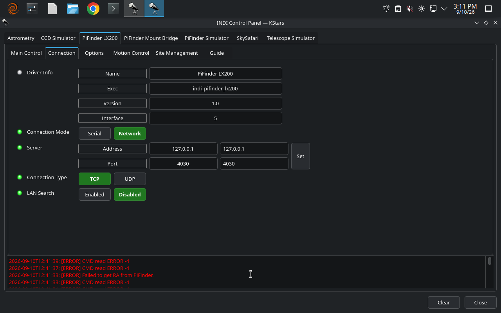</a> | PiFinder LX200 → Connection - Log zeigt eine echte `CMD read ERROR -4` / `Failed to get RA from PiFinder`-Episode |
| <a href="docs/images/pfinder_lx200/indi_control_panel_full_PiFinder_LX200_main.png">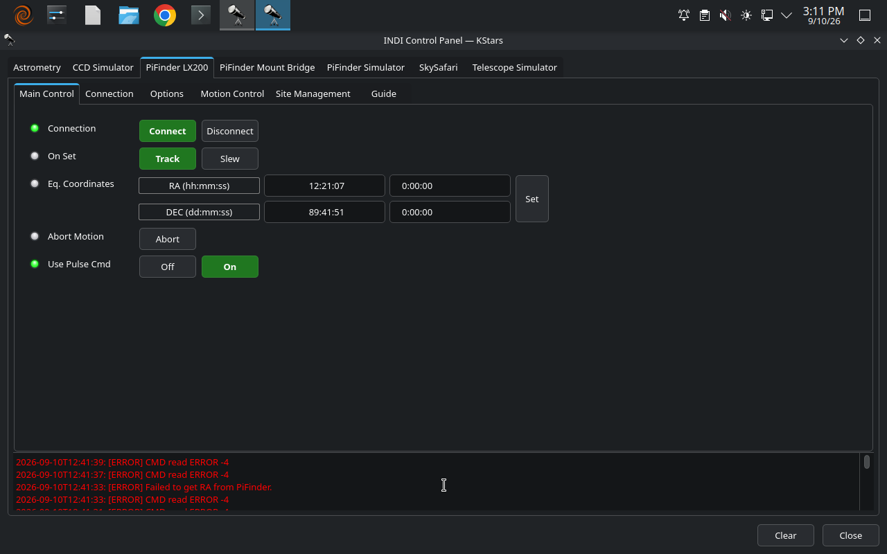</a> | PiFinder LX200 → Main Control |
| <a href="docs/images/pfinder_lx200/indi_control_panel_full_PiFinder_Mount_Bridge_main_1.png">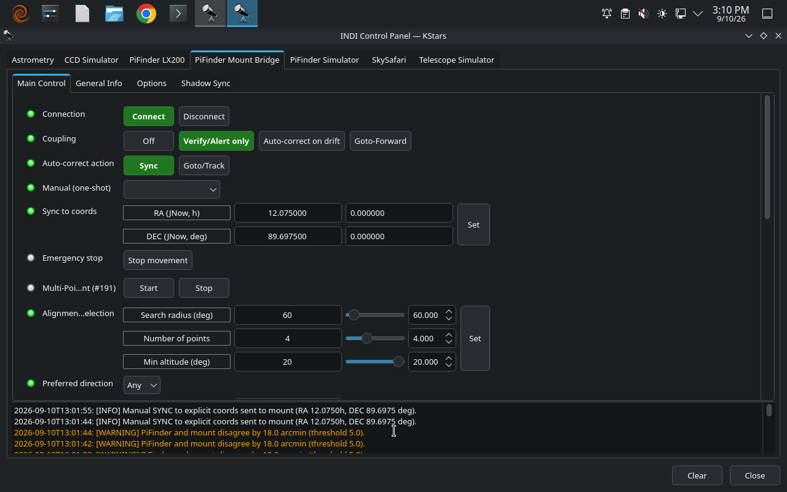</a> | Mount Bridge → Main Control, oben (Connection, Coupling, Manual one-shot, Multi-Point Alignment) |
| <a href="docs/images/pfinder_lx200/indi_control_panel_full_PiFinder_Mount_Bridge_main_2.png">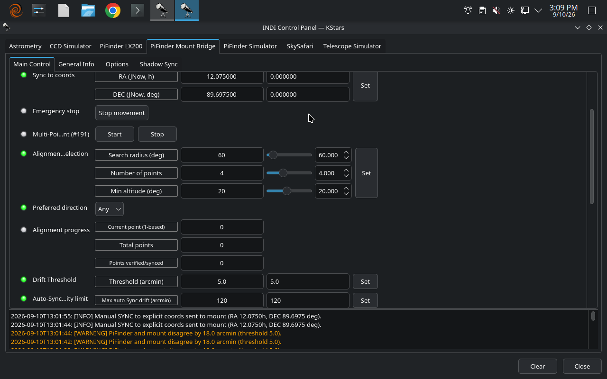</a> | Mount Bridge → Main Control, gescrollt (Drift Threshold, Auto-Sync limit, Status) - Log zeigt eine echte Drift-Warnung |
| <a href="docs/images/pfinder_lx200/indi_control_panel_full_PiFinder_Mount_Bridge_options.png">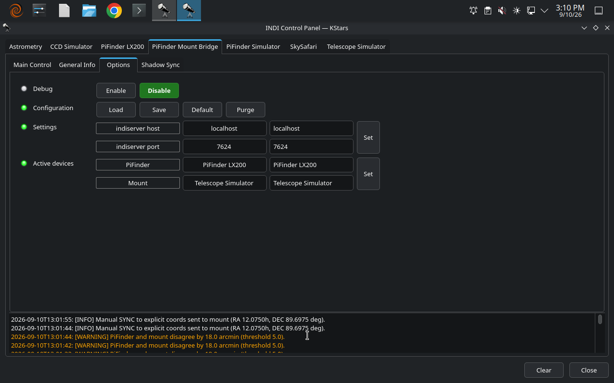</a> | Mount Bridge → Options |
| <a href="docs/images/pfinder_lx200/indi_control_panel_full_PiFinder_Mount_Bridge_shadow.png">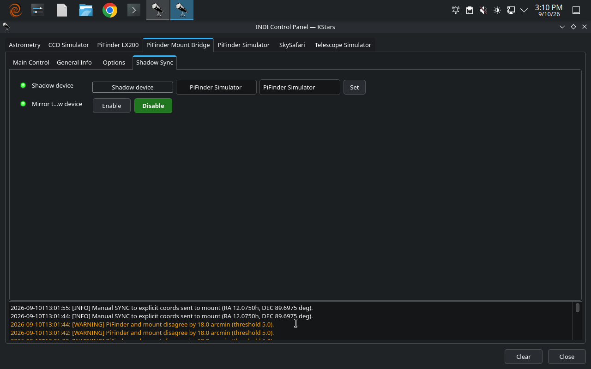</a> | Mount Bridge → Shadow Sync |
| <a href="docs/images/pfinder_simulator/indi_control_panel_full_PiFinder_Simulator_main.png">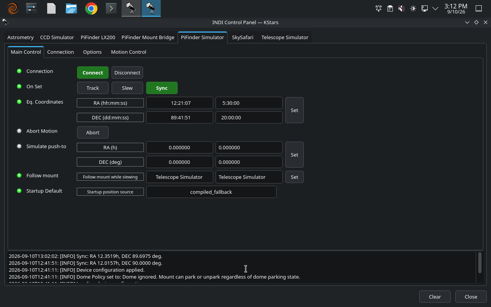</a> | PiFinder Simulator → Main Control |
| <a href="docs/images/pfinder_simulator/indi_control_panel_full_Telescope_Simulator_main.png">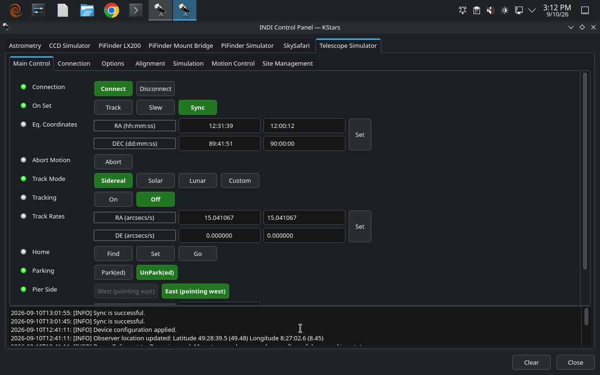</a> | Telescope Simulator → Main Control |

**KStars-Himmelskarte**

| Screenshot | Zeigt |
|---|---|
| <a href="docs/images/pfinder_lx200/kstars_context_menu_both_mount_and_pifinder.png"></a> | PiFinder und Mount als getrennte Zielgeräte im Rechtsklick-Kontextmenü |
| <a href="docs/images/pfinder_lx200/kstars_context_menu_PiFinder_LX200.png"></a> | "PiFinder LX200"-Untermenü: nur Goto, Abort, Find Telescope |

**SkySafari**

| Screenshot | Zeigt |
|---|---|
| <a href="docs/images/pfinder_lx200/skysafari_ip_port_Meade_LXClassic.png"></a> | Netzwerkverbindungs-Einstellungen: Teleskoptyp, IP-Adresse, Port `9624` |

---

<p align="center">
  <br>
  © github.com/apos 2026<br>
  <em>Unofficial community project, not affiliated with StellarMate or PiFinder.</em>
</p>
