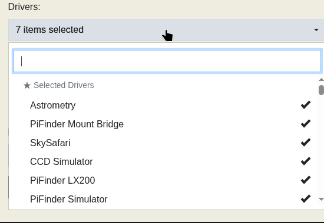
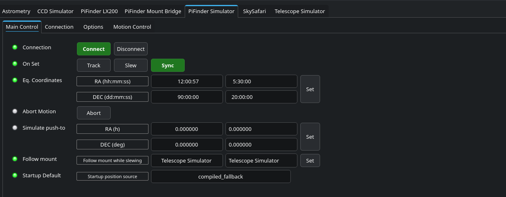
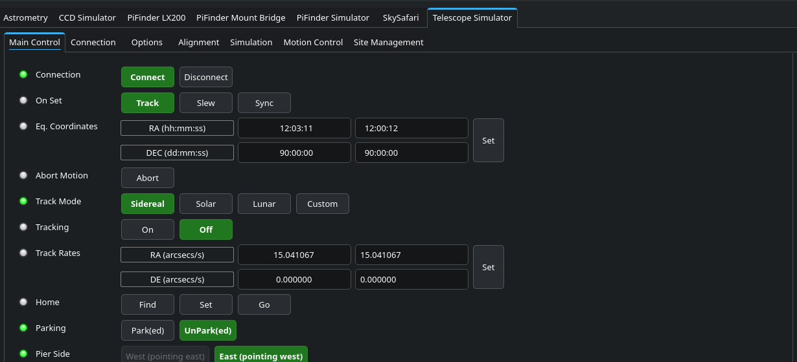

# PiFinder Simulator - Testing Mount Bridge Without a Real Mount or Clear Sky

## Quickstart

**What it can do:**
- Simulates PiFinder's position exactly and deterministically - no real sky, no real PiFinder hardware needed.
- Injects that position as a real solve into PiFinder (`/api/fake_solve`), so Mount Bridge reacts exactly as it would in real operation.
- Can optionally follow the mount automatically (`FOLLOW_MOUNT_DEVICE`, [#239](https://github.com/apos/PiFinder_Stellarmate/pull/239)) - simulating a PiFinder rigidly mounted to the telescope, including dead-reckoning during slews.
- Runs against the stock INDI Telescope Simulator as its mount counterpart - no real mount needed.

**What it can't do:**
- No real camera solving, no field-of-view/optics simulation.
- No noise/realistic solve latency of its own - at most that comes from the Truth Injector's interval, not the simulator itself.
- Deliberately does NOT appear as a mount candidate in the Control Center (same as "PiFinder LX200").
- No setup convenience (manual Sync/RA-Dec entry needed) - see [#176](https://github.com/apos/PiFinder_Stellarmate/issues/176).

**Use cases:**
- Root-cause debugging of Mount Bridge logic without a clear sky.
- Deliberately triggering Reposition Detection (Fall 1-4) with exact, reproducible values.
- Stress tests (fast tracking toggling, repeated PushTos) independent of weather/time of day.
- Regression testing before every fix deploy, before testing against real hardware.

See [Installation & Illustrated Guide](#installation--illustrated-guide) below to actually set it up.
For what KStars shows for this device and the mount, and what the right-click Goto/Sync operations
do, see [Readme_PiFinder_in_KStars.md](Readme_PiFinder_in_KStars.md).

## Table of Contents

- [Basic Functionality (Overview)](#basic-functionality-overview)
- [The Two Building Blocks](#the-two-building-blocks)
- [Installation & Illustrated Guide](#installation--illustrated-guide)
- [Technical Reference](#technical-reference)
- [Code, Deployment & Strategy](#code-deployment--strategy)
- [Known Limitations & Troubleshooting](#known-limitations--troubleshooting)
- [Related Issues](#related-issues)
- [Screenshot Reference](#screenshot-reference)

## Basic Functionality (Overview)

Mount Bridge's Auto-correct and Verify/Alert modes exist to catch a **mount's** own belief about
where it's pointing diverging from PiFinder's independent, plate-solved truth. Testing that
properly needs two things that can genuinely disagree with each other - a mount side, and a
PiFinder side, moving independently.

The mount side is already solved: the stock INDI Telescope Simulator, unmodified, stands in for a
real mount - it can be Synced or sent a GoTo just like a real one, with no physical consequences.

The PiFinder side had no equivalent. PiFinder's own reported position ordinarily comes from a real
camera solve - there was no way to pin it to an exact, known value for a test, short of pointing an
actual PiFinder at an actual star. **PiFinder Simulator** fills that gap: a small, purpose-built
INDI device holding a precisely settable RA/Dec, injected into PiFinder as a real (if synthetic)
solve via a small companion tool. Sync the mount deliberately right or wrong against it, and
Verify/Alert or Auto-correct have something genuine to react to - without a mount, without a sky.

## The Two Building Blocks

### 1. PiFinder Simulator (`indi_pifinder_simulator`)

A deliberately minimal `INDI::Telescope` device - not a copy of the stock Telescope Simulator's
source (which isn't available locally on this Arch Linux ARM target anyway, only the SDK headers).
It supports exactly what's needed and nothing more:

- `Sync`/`Goto` set the held RA/Dec immediately - no simulated slew time, no drift of its own.
- `ReadScopeStatus()` reports back exactly that value, unchanged, until it's set again.
- `CONNECTION_NONE` - a pure in-memory value holder, nothing to open a serial/TCP port to.

Named **"PiFinder Simulator"**, deliberately distinct from "Telescope Simulator", so both can sit in
the same EKOS profile at once without colliding in device-selection lists (Mount Bridge's own Mount
picker also excludes it by name, the same way it already excludes "PiFinder LX200" - see
[Known Limitations](#known-limitations--troubleshooting)).

### 2. Truth Injector (`test_tools/pifinder_truth_injector.py`)

A small Python script - not an INDI driver - that closes the loop between the simulator and
PiFinder's own software:

1. Polls "PiFinder Simulator"'s `EQUATORIAL_EOD_COORD` (via the `indi_getprop` CLI) on a fixed
   interval (default 2s).
2. Converts RA from INDI's hours convention to the degrees PiFinder's API expects.
3. POSTs it to PiFinder's existing `/api/fake_solve` endpoint (built for #106's dead-reckoning
   simulation work, reused here unmodified).

Injecting on every cycle - even when the value hasn't changed - is the point: it keeps PiFinder's
`last_solve_success` timestamp fresh, exactly like a real camera re-solving the same star field
over and over, so Mount Bridge's `SolveFreshnessMaxAgeNP` gate never lapses and blocks the test.

Deliberately kept as a standalone test tool, not built into Mount Bridge itself - test
infrastructure has no business permanently living in production driver code.

## Installation & Illustrated Guide

### Prerequisites

- `PiFinder_Stellarmate` cloned, `indi_pifinder_bridge`/`indi_pifinder` already built and working
  (see [Readme_PiFinder_LX200.md](Readme_PiFinder_LX200.md)).
- PiFinder itself running (real hardware or fake mode) and reachable at its usual HTTP port.

### Step 1: Build and install the driver

```bash
cd ~/PiFinder_Stellarmate
bash bin/build_indi_simulator.sh
```

Stops any already-running instance first (avoids "Text file busy"), builds against the system's
`libindi` headers (no INDI source checkout needed - same pattern as the other two drivers), installs
to `/usr/bin/indi_pifinder_simulator`, and registers a `drivers.xml` entry under `Telescopes` if not
already present.

Restart the StellarMate Web Manager afterward so it picks up the new entry in its driver catalog
(from a GUI/VNC session, not plain SSH):

```bash
systemctl --user restart stellarmatewebmanager.service
```

### Step 2: Add "PiFinder Simulator" to your EKOS profile

**Use the Web Manager's own profile editor** (`localhost:8624` in the Control Center's setup
checklist), not EKOS's own device picker inside KStars - the latter caches its own driver catalog
and won't show custom drivers reliably. In the Drivers dropdown, search "PiFinder" and check
**PiFinder Simulator** alongside whatever else is already in the profile (PiFinder LX200, Mount
Bridge, your real mount driver).

<table>
<tr>
<td align="center">
<a href="docs/images/pfinder_simulator/webmanager_drivers_pifinder_simulator.png"></a><br>
<sub>Web Manager Drivers dropdown: "PiFinder Simulator" checked alongside the other profile drivers</sub>
</td>
</tr>
</table>

### Step 3: Connect and set a starting position

Start the profile, connect everything as usual. In the INDI Control Panel, open the "PiFinder
Simulator" tab:

1. Set **On Set** to **Sync** (not Track/Slew - Sync just records the position, no motion semantics
   apply to this device anyway, but keeping it explicit avoids surprises).
2. Enter an RA/Dec of your choice in the **Eq. Coordinates** fields and click **einstellen**/**Set**.

<table>
<tr>
<td align="center" width="50%">
<a href="docs/images/pfinder_simulator/indi_control_panel_full_PiFinder_Simulator_main.png"></a><br>
<sub>PiFinder Simulator → Main Control: On Set, Eq. Coordinates, Simulate push-to, Follow mount <em>(click for full desktop screenshot with INDI log)</em></sub>
</td>
<td align="center" width="50%">
<a href="docs/images/pfinder_simulator/indi_control_panel_full_Telescope_Simulator_main.png"></a><br>
<sub>Telescope Simulator → Main Control: the stock mount stand-in's full mount menu (Track, Park, Pier Side, ...) <em>(click for full desktop screenshot with INDI log)</em></sub>
</td>
</tr>
</table>

`FOLLOW_MOUNT_DEVICE` (§ [Technical Reference](#technical-reference) below) shows up here as **Follow
mount** - already pointed at "Telescope Simulator" in the screenshot above, since this INDI device
uses the same name for both its label and value fields.

### Step 4: Start the injector

```bash
cd ~/PiFinder_Stellarmate
python3 test_tools/pifinder_truth_injector.py
```

Defaults assume `localhost:7624` for INDI and `localhost:8080` for PiFinder - override with
`--indi-host`/`--indi-port`/`--pifinder-host`/`--pifinder-port` if your setup differs. Leave it
running for the duration of the test session; `Ctrl-C` to stop.

### Step 5: Test

With the mount side (real mount, or the stock Telescope Simulator) synced deliberately right or
wrong relative to the injected position, pick a Coupling mode in the Control Center and observe.
See [Readme_ControlCenter.md](Readme_ControlCenter.md) for what each mode is supposed to do.

## Technical Reference

### Property reference: PiFinder Simulator

| Property | Type | Notes |
|---|---|---|
| `CONNECTION` | Switch | Always succeeds - no real link to open |
| `EQUATORIAL_EOD_COORD` | Number (RA hours, DEC degrees) | Current held position |
| `ON_COORD_SET` | Switch (`SYNC`/`SLEW`/`TRACK`) | All three behave identically - see below |
| `TELESCOPE_ABORT_MOTION` | Switch | Inherited from `INDI::Telescope`, effectively a no-op (nothing is ever moving) |
| `FOLLOW_MOUNT_DEVICE` | Text | INDI device name to dead-reckon from, or empty - see below |

### Mount-following (`FOLLOW_MOUNT_DEVICE`)

`FOLLOW_MOUNT_DEVICE` set to a mount's INDI device name dead-reckons the simulator's position along
with that mount's own slews, the way a real, rigidly-mounted PiFinder's IMU would. Left empty (the
default), the simulator's position only ever changes when explicitly Synced/GoTo'd - independent of
any mount - which is what Verify/Alert and Auto-correct-Sync deliberate-misalignment testing need: a
mount-initiated GoTo does not get followed, and Auto-correct pulls the mount back toward the fixed
position instead of refining a small residual, exactly the disagreement those modes exist to catch.

### Why Sync and Goto behave identically

A real telescope simulator distinguishes Sync (instant, no motion) from Goto/Track (simulated
slew). This device has no motion to simulate in the first place - whichever `ON_COORD_SET` option
is selected, the requested RA/Dec just becomes the new held value immediately. The distinction is
kept in the property (rather than collapsing to a single "Set" action) purely so the device still
looks and behaves like an ordinary INDI telescope to any client that expects one.

### Data flow: simulator → PiFinder → Mount Bridge

```
PiFinder Simulator (EQUATORIAL_EOD_COORD)
        |  polled every ~2s
        v
pifinder_truth_injector.py
        |  POST /api/fake_solve {ra_deg, dec_deg}  (JNow, converted from hours)
        v
PiFinder's own solver/integrator (fake_solve_active=true, solve_source: CAM)
        |  reported like any other real solve
        v
"PiFinder LX200" INDI device (EQUATORIAL_EOD_COORD)
        |  watched by Mount Bridge's internal INDI client, same as always
        v
PiFinder Mount Bridge (drift computation, Coupling modes)
```

Mount Bridge never talks to "PiFinder Simulator" directly - it only ever watches "PiFinder LX200",
exactly as it does in real operation. The simulator and injector together just make sure that
device reports a value under test control instead of a real camera's.

## Code, Deployment & Strategy

### Why not a copy of the stock Telescope Simulator's source?

Considered and rejected. The stock simulator's actual source (`telescope_simulator.cpp`) isn't
present on this Arch Linux ARM target - only the installed binary and the SDK headers - so a
literal copy would mean fetching and adapting upstream source for capabilities (simulated slew
time, park, alignment-error modeling) this use case doesn't need. A new, lean driver against the
same `INDI::Telescope` base class covers the actual requirement (precisely place PiFinder wherever
a test needs it) with far less code to build and maintain, in keeping with this project's general
preference for trimming to what's actually used (see `Readme_PiFinder_LX200.md`'s "Why no
`TELESCOPE_CAN_SYNC`?" for the same philosophy applied to the LX200 driver).

### Why a separate device from "PiFinder LX200"?

"PiFinder LX200" already exists and already implements `INDI::Telescope` to report PiFinder's
*real* position over the LX200 protocol. Reusing it for synthetic test positions would mean either
a special test-mode flag baked into production driver code, or fighting its existing live-data path
(reads from `pos_server.py`, not something a test can just override). A second, dedicated device
with no such responsibility is simpler on both fronts.

### Why a separate injector script instead of built into Mount Bridge?

Mount Bridge's job is coupling PiFinder and a mount - not generating test data. Folding the
injection loop into the driver would mean production code permanently carrying test-only logic,
and a driver restart/rebuild cycle every time the injector needs a tweak. A standalone script has
neither cost, and can be started/stopped independently of whether Mount Bridge is even running.

### Build system

Same standalone-against-system-`libindi` pattern as `indi_pifinder`/`indi_pifinder_bridge` (see
`Readme_PiFinder_LX200.md`'s own section on this) - no INDI source checkout, no full INDI build.

### Testing strategy

Smoke-tested standalone against a throwaway `indiserver` instance on a test port (Connect, Sync,
Goto, position-holds-steady) before any integration testing. Full Coupling-mode sweep (Manual Sync,
Auto-correct Sync, Verify/Alert, both Goto-capable modes) live-verified against the simulator
alongside a real mount - see the linked issues below for individual results.

## Known Limitations & Troubleshooting

**"PiFinder Simulator" won't appear as a Mount candidate in the Control Center**, by design -
excluded the same way "PiFinder LX200" already is (both implement `INDI::Telescope`, neither is
ever the thing being corrected). If it did show up, that's a regression - see `webmanager_client.py`'s
`other_profile_drivers()`.

**Manual setup is fiddly** (On Set → Sync, remembering to restore Track afterward, typing raw
RA/Dec) - a dedicated "Setup Simulator" button plus a curated bright-object picker is tracked in
[#176](https://github.com/apos/PiFinder_Stellarmate/issues/176), not yet built.

**On-device PushTo (PiFinder's own catalog/menu, not KStars) isn't a valid trigger for
Goto-Forward testing yet**, independent of the simulator - see
[#171](https://github.com/apos/PiFinder_Stellarmate/issues/171).

## Related Issues

- [#164](https://github.com/apos/PiFinder_Stellarmate/issues/164) - original concept/problem statement
- [#170](https://github.com/apos/PiFinder_Stellarmate/issues/170) - Auto-correct (Goto & Track) convergence fix, verified using this simulator
- [#171](https://github.com/apos/PiFinder_Stellarmate/issues/171), [#176](https://github.com/apos/PiFinder_Stellarmate/issues/176), [#177](https://github.com/apos/PiFinder_Stellarmate/issues/177), [#178](https://github.com/apos/PiFinder_Stellarmate/issues/178) - open follow-ups
- [#179](https://github.com/apos/PiFinder_Stellarmate/issues/179) - emergency stop button, found necessary while testing with this simulator

## Screenshot Reference

Every screenshot in this document, grouped by where it comes from. `PiFinder LX200` and `PiFinder
Mount Bridge` are covered in [Readme_PiFinder_LX200.md](Readme_PiFinder_LX200.md#screenshot-reference)
instead, not duplicated here.

**Web Manager** (`http://<pi-address>:8624`)

| Screenshot | Shows |
|---|---|
| <a href="docs/images/pfinder_simulator/webmanager_drivers_pifinder_simulator.png"></a> | Drivers dropdown: "PiFinder Simulator" checked alongside the other profile drivers |

**INDI Control Panel — PiFinder Simulator tab (close crop)**

| Screenshot | Shows |
|---|---|
| <a href="docs/images/pfinder_simulator/indi_control_panel_tabs_PiFinder_Simulator_main.png"></a> | Main Control subtab: On Set, Eq. Coordinates, Simulate push-to, Follow mount |

**INDI Control Panel — Telescope Simulator tab (close crop)**

| Screenshot | Shows |
|---|---|
| <a href="docs/images/pfinder_simulator/indi_control_panel_tabs_Telescope_Simulator_main.png"></a> | Main Control subtab: the stock mount stand-in's full mount menu (Track Mode, Tracking, Track Rates, Home, Parking, Pier Side) |

**INDI Control Panel — full desktop, real INDI log messages included**

Whole-screen captures (Ubuntu desktop, taskbar, the actual KStars window), message log included -
taken in the same session as [Readme_PiFinder_LX200.md](Readme_PiFinder_LX200.md#screenshot-reference)'s
own full-desktop set.

| Screenshot | Shows |
|---|---|
| <a href="docs/images/pfinder_simulator/indi_control_panel_full_PiFinder_Simulator_main.png"></a> | PiFinder Simulator → Main Control |
| <a href="docs/images/pfinder_simulator/indi_control_panel_full_Telescope_Simulator_main.png"></a> | Telescope Simulator → Main Control |
</content>
