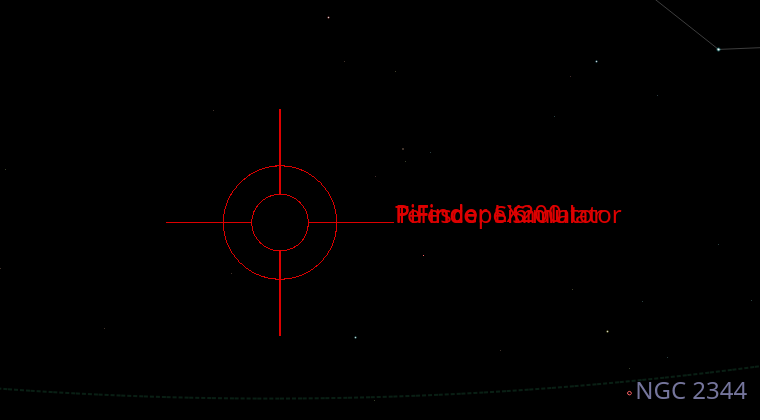
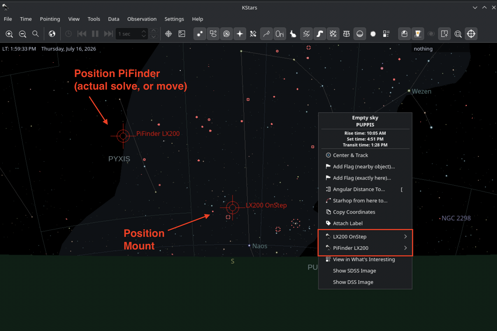
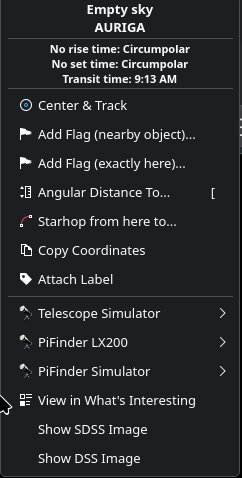
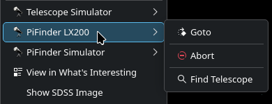
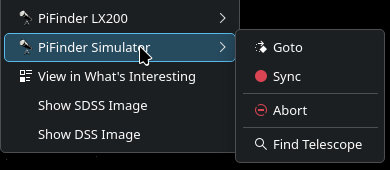
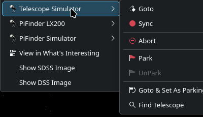

# PiFinder in KStars — Himmelskarten-Ansicht & Rechtsklick-Operationen

*[English version](Readme_PiFinder_in_KStars.md)*

> **Umfang:** was KStars zeigt, sobald **PiFinder LX200** und/oder **PiFinder Simulator**
> verbunden sind, und was die Rechtsklick-Operationen Goto / Sync / … mit dem jeweiligen Gerät machen.
>
> - Geräte verbinden: [Readme_PiFinder_LX200.md](Readme_PiFinder_LX200.md)
> - Das Mount-Bridge- / Injected-Solve-Testrig: [Readme_PiFinder_Simulator.md](Readme_PiFinder_Simulator.md)

---

## Inhaltsverzeichnis

1. [Die beiden Geräte in KStars](#die-beiden-geräte-in-kstars)
2. [Wie KStars sie darstellt](#wie-kstars-sie-darstellt)
3. [Rechtsklick-Operationen](#rechtsklick-operationen)
4. [Typische Abläufe](#typische-abläufe)
5. [Siehe auch](#siehe-auch)

---

## Die beiden Geräte in KStars

| Gerät | Repräsentiert | Kontextmenü-Einträge |
|---|---|---|
| **PiFinder LX200** (`indi_pifinder_lx200`) | PiFinders live gelöste Position (echte Hardware) | Goto, Abort, Find Telescope — **kein Sync** |
| **PiFinder Simulator** (`indi_pifinder_simulator`) | Ein von Hand gesetzter Platzhalter dafür (hardwarefreies Testen) | Goto, **Sync**, Abort, Find Telescope |

Beide sind `INDI::Telescope`-Geräte, also behandelt KStars sie wie jede Montierung: ein Marker auf
der Himmelskarte, ein Untermenü in jedem Himmelskarten-Rechtsklick und eine Zeile im
Ekos-**Mount**-Modul. Keines steuert einen Motor — PiFinder hat keinen, und der Simulator hält
nur einen Wert.

Der **Telescope Simulator** (Stock-INDI, nicht Teil dieses Projekts) steht meist daneben als
*Montierungs*-Platzhalter, wenn keine echte Montierung da ist.

## Wie KStars sie darstellt

- **Himmelskarten-Marker** — ein rotes **Fadenkreuz mit Doppelkreis** an der aktuellen RA/DEC des
  Geräts, live aktualisiert (etwa einmal pro Sekunde bei PiFinder LX200; im Truth-Injector-
  Intervall beim Simulator). Der Kreis hat eine feste Bildschirmgröße, kein echtes Sichtfeld.
- **Label** — der Gerätename neben dem Marker. Zeigen PiFinder und Montierung auf dieselbe
  Stelle, **überlappen** ihre Marker und Labels — das ist der normale "sie stimmen überein"-
  Zustand, kein Fehler.
- Ein **durchgezogenes** Fadenkreuz heißt, das Gerät meldet Tracking; ein **gestrichelter /
  gepunkteter** Kreis heißt idle / kein Tracking (der Stock Telescope Simulator zeigt das, bis er
  zum Tracken angewiesen wird).

<table>
<tr>
<td align="center" width="50%">
 
PiFinder LX200, PiFinder Simulator und die Montierung auf derselben RA/DEC — ein Marker, drei gestapelte Labels
</td>
<td align="center" width="50%">
 
PiFinder und Montierung zeigen woanders hin — zwei getrennte Fadenkreuze (hier absichtlich weit auseinander)
</td>
</tr>
</table>

In **Ekos → Mount** erscheint PiFinder LX200 im Teleskop-Dropdown mit RA/DEC, Az/Alt und einer
Tracking-Anzeige. Seine Slew-/Park-Bedienelemente sind wirkungslos (nichts zu bewegen).

## Rechtsklick-Operationen

Rechtsklick irgendwo auf die Himmelskarte. Das Kontextmenü listet **ein Untermenü pro verbundenem
INDI-Teleskop** — hier *Telescope Simulator*, *PiFinder LX200*, *PiFinder Simulator*. Jedes
Untermenü wirkt auf **dieses** Gerät, mit der **angeklickten Himmelsposition** als Ziel.

<table>
<tr>
<td align="center" width="40%">
 
Ein Untermenü pro verbundenem Teleskop-Gerät
</td>
<td align="center" width="60%">
 
PiFinder LX200: Goto, Abort, Find Telescope — kein Sync
</td>
</tr>
</table>

### PiFinder LX200 — Goto / Abort / Find Telescope

| Eintrag | Wirkung |
|---|---|
| **Goto** | Sendet die angeklickte RA/DEC an PiFinder als **Push-to-Ziel** — identisch zur Objektwahl auf PiFinders eigenem Display oder einem SkySafari-Push-to. PiFinder zeigt Push-to-Pfeile dorthin. Der Marker springt **nicht**: PiFinders gemeldete Position kommt weiter vom Live-Solve, und der Track-State bleibt idle — nichts bewegt sich physisch. |
| **Abort** | Löscht das Push-to-Ziel. (Kein Motor zu stoppen.) |
| **Find Telescope** | Zentriert die Himmelskarte auf den Marker. Nur-Lesen. |

**Warum kein Sync:** PiFinder hat nichts zu synchronisieren — es meldet bei jedem Frame die frisch
gesolvte Ist-Position. Um eine Korrektur auf eine gekoppelte *Montierung* zu schieben, dient die
Mount Bridge, nicht dieses Menü — siehe
[Readme_PiFinder_LX200.md → Kopplungsgrad-Dial](Readme_PiFinder_LX200.md#die-mount-bridge-kopplungsgrad-dial).

### PiFinder Simulator — Goto / Sync / Abort / Find Telescope

<table>
<tr>
<td align="center">
 
PiFinder Simulator: Goto und Sync setzen beide nur die gehaltene Position
</td>
</tr>
</table>

Der Simulator hält eine setzbare RA/DEC. **Goto und Sync tun hier dasselbe** — beide setzen die
gehaltene Position sofort auf die angeklickten Koordinaten, ohne Slew und ohne Bewegungsmodell.
Die Unterscheidung bleibt nur, damit sich das Gerät für jeden Client wie ein normales Teleskop
verhält. Läuft der Truth Injector, wird diese neue Position innerhalb eines Zyklus als Solve in
PiFinder injiziert, und alles danach (der Marker von PiFinder LX200, der Mount-Bridge-Drift)
reagiert, als wäre ein echter Solve dort gelandet. So platziert man "PiFinder" genau dort, wo ein
Test es braucht. Der Simulator kann außerdem **den Slews einer Montierung per Dead-Reckoning
folgen** — siehe
[Readme_PiFinder_Simulator.md → Mount-following](Readme_PiFinder_Simulator.md#mount-following-follow_mount_device).

### Telescope Simulator — der Montierungs-Platzhalter

<table>
<tr>
<td align="center">
 
Telescope Simulator: ein volles Montierungs-Menü — Goto, Sync, Park/UnPark
</td>
</tr>
</table>

Der Stock-INDI-Montierungssimulator, als Montierungsseite verwendet, wenn keine echte da ist.
Volles Montierungs-Menü: **Goto** (simulierter Slew), **Sync**, **Park / UnPark**, **Goto & Set As
Parking Position**. Sync ihn bewusst richtig oder falsch gegen die PiFinder-Position, damit
Verify/Alert oder Auto-Correct etwas zum Reagieren haben. Das Untermenü einer echten Montierung
sieht ähnlich aus.

## Typische Abläufe

- **Visuelles Push-to, echter PiFinder, keine Montierung** — Rechtsklick aufs Ziel →
  *PiFinder LX200 → Goto* → den Pfeilen auf PiFinders Display folgen.
- **Visuelles Push-to mit gekoppelter Montierung** — gleicher Klick; mit der Mount Bridge in
  *Goto-Forward* slewt die Montierung ebenfalls dorthin. Siehe
  [Kopplungsgrad-Dial](Readme_PiFinder_LX200.md#die-mount-bridge-kopplungsgrad-dial).
- **Hardwarefreier Test** — *PiFinder Simulator → Sync*, um PiFinder zu platzieren,
  *Telescope Simulator → Sync*, um die Montierung zu platzieren (übereinstimmend oder nicht), dann
  die Mount Bridge beobachten. Volles Setup in
  [Readme_PiFinder_Simulator.md](Readme_PiFinder_Simulator.md).

## Siehe auch

- [Readme_PiFinder_LX200.md](Readme_PiFinder_LX200.md) — Geräte verbinden, das INDI Control Panel, die Mount Bridge und ihre Coupling-Modi
- [Readme_PiFinder_Simulator.md](Readme_PiFinder_Simulator.md) — der PiFinder Simulator + Truth-Injector-Testrig
- [Readme_ControlCenter.md](Readme_ControlCenter.md) — das Control Center, das das gesamte Simulations-Setup steuert
- [README.md](README.md)
