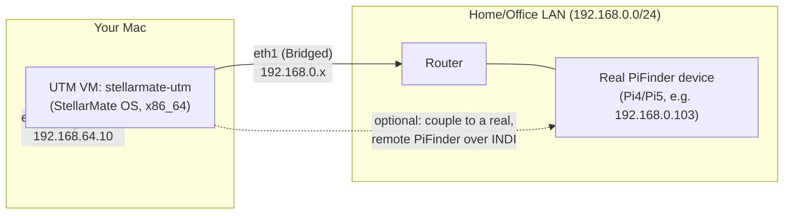

# x86 Dev/Simulator Machine on UTM — Setup Guide

## Overview

This document describes how to turn a StellarMate OS **x86_64** image, running as a **UTM**
virtual machine on a Mac, into a full **Control-host development and simulator machine** for
PiFinder_Stellarmate — no physical PiFinder hardware required.

**What this machine is for:** developing and testing the Control Center GUI, the setup/patch
scripts, and the INDI Mount Bridge coupling logic against the **PiFinder Simulator** and
**Injected Solve** (see `docs/concepts/pifinder_fake_solve_simulation.md`), without needing a real
Raspberry Pi, camera, or telescope.

**What this machine is *not* for:** real plate-solving. PiFinder itself stays built and optimized
for the Pi — this VM does not replace real hardware, it lets you iterate on everything *around*
PiFinder without needing it plugged in. See "Known Limitations" below for exactly what doesn't
work here and why that's fine for this use case.



## Prerequisites

- A UTM VM already running **StellarMate OS x86_64** (this guide does not cover installing StellarMate
  OS itself — it starts from an already-booted, already-accessible x86 StellarMate machine).
- SSH access to that VM (this guide assumes you're working over SSH, as you would with a headless
  Pi).
- A GitHub Personal Access Token (classic, scope at least `repo`) for `apos/PiFinder_Stellarmate`
  if you intend to push branches/open PRs from this machine.

## 1. Network: two NICs, not one

**Do not reconfigure the VM's existing network adapter** if you're connected to it over SSH — doing
so will sever that connection, with no guarantee you'll be able to reconnect at the same address.
Instead, add a **second, independent** network adapter and leave the first one untouched:

1. In UTM, stop the VM.
2. VM Settings → Network → **add a new device** (don't edit the existing one).
3. Set the new device's Network Mode to **Bridge (Advanced)**, Bridged Interface: your Mac's active
   physical interface (Wi-Fi or Ethernet — whichever one is actually on the LAN you want to reach).
4. Start the VM again. The existing adapter (Shared/NAT, e.g. `192.168.64.10`) keeps working exactly
   as before; the new one (`eth1` or similar) now exists but has no IP yet.
5. Configure a static IP on the new interface via NetworkManager (adjust to your own LAN/gateway):

   ```bash
   nmcli connection add type ethernet ifname eth1 con-name eth1-lan \
     ipv4.method manual ipv4.addresses <STATIC_IP>/24 \
     ipv4.gateway <GATEWAY_IP> ipv4.dns <GATEWAY_IP> \
     connection.autoconnect yes
   nmcli connection up eth1-lan
   ```

   Verify with `nmcli device status` (both interfaces should show `connected` simultaneously) and a
   `ping` to something else on that LAN.

This gives the VM a real presence on your LAN (for reaching an actual PiFinder device over INDI, or
just for normal internet/package-manager access) while keeping the original SSH connection alive
throughout.

## 2. Fix the package manager (device-local, not part of this repo)

The StellarMate OS x86 image this was tested against ships `/etc/pacman.conf` with `[core]`/
`[extra]`/`[alarm]` hardcoded to an **ARM-only** mirror
(`http://mirror.archlinuxarm.org/aarch64/...`) — presumably inherited from the Pi image build
process. On a real x86_64 machine this makes every `pacman -S` fail with *"package architecture is
not valid"*.

**Fix**: point `[core]`/`[extra]` at the already-present, correctly-generated
`/etc/pacman.d/mirrorlist` instead, and drop `[alarm]` entirely (Arch Linux ARM-only, no x86_64
equivalent):

```bash
sudo python3 - <<'EOF'
p = "/etc/pacman.conf"
s = open(p, encoding="utf-8").read()
s = s.replace(
    '# [core]\n# Include = /etc/pacman.d/mirrorlist',
    '[core]\nInclude = /etc/pacman.d/mirrorlist',
)
s = s.replace(
    '# [extra]\n# Include = /etc/pacman.d/mirrorlist',
    '[extra]\nInclude = /etc/pacman.d/mirrorlist',
)
import re
s = re.sub(
    r"\n\[core\]\nSigLevel = Optional TrustAll\nServer = http://mirror\.archlinuxarm\.org/aarch64/core\n"
    r"\n\[extra\]\nSigLevel = Optional TrustAll\nServer = http://mirror\.archlinuxarm\.org/aarch64/extra\n"
    r"\n\[alarm\]\nSigLevel = Optional TrustAll\nServer = http://mirror\.archlinuxarm\.org/aarch64/alarm\n",
    "\n", s,
)
open(p, "w", encoding="utf-8").write(s)
EOF
sudo pacman -Syy
```

Verify with `grep -n archlinuxarm /etc/pacman.conf` — it should print nothing.

**Known open issue**: this file reverted to the broken state at least once during initial setup, for
a reason not yet root-caused (neither `pifinder_stellarmate_setup.sh` nor `pifinder_pre_start.sh`
touch it, and no `.pacsave` was involved). If package installs suddenly start failing with
*"architecture is not valid"* again after this was already fixed, re-check and re-apply this step.

## 3. Initialize the pacman keyring

Also commonly missing on a fresh image:

```bash
sudo pacman-key --init
sudo pacman-key --populate archlinux
sudo pacman-key --recv-keys 320758E60CC6CF30A2B69EA1856A39ADD7E519F4 --keyserver keyserver.ubuntu.com
sudo pacman-key --lsign-key 320758E60CC6CF30A2B69EA1856A39ADD7E519F4
```

The `recv-keys`/`lsign-key` step imports and trusts the `smos` repo's own signing key (StellarMate's
custom package repo) — without it, `smos` package lookups fail with *"key ... is unknown"* even
after the keyring itself is initialized.

## 4. Clone PiFinder_Stellarmate — `dev`, not `main`

`main` only gets fast-forwarded on an explicit release cut and lags significantly behind active
development. Always work from `dev`:

```bash
git clone https://github.com/apos/PiFinder_Stellarmate.git
cd PiFinder_Stellarmate
git checkout dev
```

**As of this writing**, the x86 compatibility fixes described below live on
[PR #233](https://github.com/apos/PiFinder_Stellarmate/pull/233) (branch
`fix/x86-non-pi-setup-compat`), not yet merged into `dev`. Until it merges, check that branch out
instead:

```bash
git checkout fix/x86-non-pi-setup-compat
```

Once #233 is merged, plain `dev` will already contain all of this.

## 5. What PR #233 actually fixes (background, no action needed once it's checked out)

Running `pifinder_stellarmate_setup.sh --mode=full` unmodified on x86 hits several places that
unconditionally assumed real Raspberry Pi hardware:

- The script hard-`exit 1`'d when neither `/boot/firmware/config.txt` nor `/boot/config.txt` exists
  (never true on x86) — the whole install aborted before ever reaching the INDI driver build.
- Twelve `should_apply_patch()` calls in `patch_PiFinder_installation_files.sh` were gated on Pi
  model `P4|P5`, even though the patches themselves (numpy/pandas/skyfield version pins for
  Python 3.13+, the `tetra3.py`→`main.py` rename fix, a Python 3.11+ dataclass fix, the `all_ips`
  network feature, etc.) have nothing to do with Pi hardware. This silently left `skyfield`/`pandas`
  uninstalled and the `tetra3` import broken — `pifinder.service` crash-looped with
  `ModuleNotFoundError: No module named 'tetra3.tetra3'`.
- `imu_pi.py`/`keyboard_pi.py`/`displays.py` crashed the whole PiFinder process instead of falling
  back when their hardware backend isn't available (adafruit-blinka's `import board` raises
  `NotImplementedError("Board not supported GENERIC_LINUX_PC")` on any non-Pi machine) — the same
  class of bug `camera_pi.py`'s existing `CameraDebug` fallback already solved for the camera, just
  never needed for IMU/keyboard/display before.
- The setup script left the Control Center disabled/stopped on a fresh install, with no indication
  of where to reach it.

None of this requires action on your part beyond having the fixed branch checked out — it's
background for anyone debugging a future x86 issue that looks similar.

## 6. Run the setup script

```bash
bash pifinder_stellarmate_setup.sh
```

This clones PiFinder itself, applies all patches, builds the venv, builds and installs all three
INDI drivers (PiFinder LX200, PiFinder Mount Bridge, PiFinder Simulator), and — as of PR #233 —
enables and starts the Control Center automatically, printing every reachable URL at the end:

```
  Control Center reachable at:
    http://<eth0-ip>:8765/
    http://<eth1-ip>:8765/
  Login: any username, password = your stellarmate system password
```

The script auto-re-execs itself into the venv once created (no manual `source .../activate` step
needed). On x86, expect to see `Hardware: Not a Pi (e.g. x86 Control host)` in the final summary and
`✅ No critical warnings — setup completed cleanly.`

For `--action=reinstall`/`--action=update` (non-interactive, e.g. from the Control Center's own
"Install or Update" buttons) see the script's own `--help`-equivalent header comment.

## 7. Make the INDI drivers visible in the StellarMate Web Manager

The Web Manager reads `/usr/share/indi/drivers.xml` only once, at its own startup. A freshly
installed driver won't show up in its profile editor until it's restarted:

```bash
systemctl --user restart stellarmatewebmanager.service
```

(On real Pi hardware this is documented as needing a real GUI/VNC session, not SSH — on this x86
image, running it directly over SSH worked without issue. If it doesn't for you, fall back to
restarting it from the desktop session.)

## 8. GitHub CLI (`gh`) — optional, only if you'll push from this machine

```bash
sudo pacman -S github-cli
```

Authenticate with a Personal Access Token:

```bash
git remote set-url origin "https://<YOUR_TOKEN>@github.com/apos/PiFinder_Stellarmate.git"
echo "<YOUR_TOKEN>" | gh auth login --with-token
```

If you ever need `gh project` commands (adding issues/PRs to the GitHub Projects board), the token
also needs the `project`/`read:project` scope, which a classic PAT usually doesn't have by default:

```bash
gh auth refresh -s project,read:project
```

This opens an interactive browser-based device-flow confirmation — it has to be completed by a
human in a real browser, not scriptable.

## 9. Fix VM standby/suspend freezing (Linux guest, not PiFinder-specific)

Unrelated to PiFinder itself, but likely to bite you on any QEMU/UTM Linux desktop guest: if the
machine's screen goes idle, KDE Plasma can freeze completely (reachable up to the login screen, but
input stops working after that), forcing a hard VM reset. Real hardware suspend doesn't work
meaningfully inside a VM anyway, so the fix is to disable it entirely rather than debug it:

```bash
sudo systemctl mask sleep.target suspend.target hibernate.target hybrid-sleep.target
```

If KDE's own power settings (`~/.config/powerdevilrc`) already show `AutoSuspendAction=0` and
`TurnOffDisplayWhenIdle=false` (check first — they may already be correctly disabled) but the
freeze still happens, the cause is X11's own DPMS timers, independent of KDE. Disable those too:

```bash
sudo tee /etc/X11/xorg.conf.d/10-disable-dpms.conf > /dev/null <<'EOF'
Section "Extensions"
    Option "DPMS" "Disable"
EndSection

Section "ServerFlags"
    Option "StandbyTime" "0"
    Option "SuspendTime" "0"
    Option "OffTime" "0"
    Option "BlankTime" "0"
EndSection
EOF
```

**This needs a logout/reboot to take effect** (it configures the X server, which only reads this at
startup). Use UTM's own **Pause** feature (not guest-OS suspend) if you want to stop the VM without
shutting it down — that actually works, since it's the hypervisor freezing/resuming the whole VM
from outside, not the guest OS trying to power-manage virtual hardware that doesn't really exist.

## Known Limitations

- **No real plate-solving.** `~/PiFinder/bin/cedar-detect-server` only ships as an ARM binary — on
  x86 it fails to launch (`Exec format error`, caught, no crash) and `solve_state` stays `null`
  forever. This is by design for this use case (Injected Solve replaces it); tracked as a
  low-priority backlog item in
  [issue #234](https://github.com/apos/PiFinder_Stellarmate/issues/234) if a real x86_64 build is
  ever wanted.
- **Injected Solve / PiFinder Simulator end-to-end workflow is not yet fully verified on this
  machine.** The INDI drivers build and the Control Center reaches PiFinder's API, but a live test
  session left `PiFinder LX200.CONNECTION` disconnected and `fake_solve_active: false` — reconnecting
  the driver and confirming a re-seed actually activates Injected Solve is still open. Don't assume
  this half of the setup works until it's been walked through end-to-end again.
- **PR #233's hardware-fallback patches are unverified on real Pi hardware.** They're purely
  additive (new `except`/fallback branches around existing working code), but a real Pi4/Pi5 smoke
  test is recommended before merging past `dev` into `main`.

## References

- [PR #233](https://github.com/apos/PiFinder_Stellarmate/pull/233) — the x86 compatibility fixes
  this guide depends on.
- [Issue #234](https://github.com/apos/PiFinder_Stellarmate/issues/234) — cedar-detect-server x86_64
  build (backlog, low priority).
- `docs/concepts/pifinder_fake_solve_simulation.md` — the Injected Solve mechanism this machine is
  meant to exercise.
- `Readme_ControlCenter.md`, `Readme_PiFinder_LX200.md` — general Control Center / INDI driver
  reference, not x86-specific.
