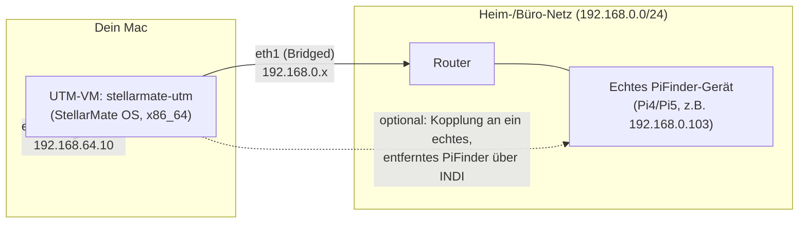

# x86-Entwicklungs-/Simulator-Maschine auf UTM — Einrichtungsanleitung

## Überblick

Dieses Dokument beschreibt, wie ein StellarMate-OS-**x86_64**-Image, das als **UTM**-VM auf einem
Mac läuft, zu einer vollwertigen **Control-host-Entwicklungs- und Simulator-Maschine** für
PiFinder_Stellarmate wird — ganz ohne physische PiFinder-Hardware.

**Wofür diese Maschine gedacht ist:** Entwicklung und Test der Control-Center-GUI, der Setup-/
Patch-Skripte und der INDI-Mount-Bridge-Kopplungslogik gegen den **PiFinder Simulator** und
**Injected Solve** (siehe `docs/concepts/pifinder_fake_solve_simulation.md`) — ohne echten
Raspberry Pi, Kamera oder Teleskop.

**Wofür diese Maschine *nicht* gedacht ist:** echtes Plate-Solving. PiFinder selbst bleibt für den
Pi gebaut und optimiert — diese VM ersetzt keine echte Hardware, sondern erlaubt es, an allem
*drumherum* zu arbeiten, ohne dass PiFinder tatsächlich angeschlossen sein muss. Siehe "Bekannte
Einschränkungen" unten für eine ehrliche Auflistung dessen, was hier nicht funktioniert und warum
das für diesen Zweck unproblematisch ist.



## Voraussetzungen

- Eine bereits laufende UTM-VM mit **StellarMate OS x86_64** (diese Anleitung deckt nicht die
  Installation von StellarMate OS selbst ab — sie setzt bei einer bereits gebooteten, bereits
  erreichbaren x86-StellarMate-Maschine auf).
- SSH-Zugriff auf diese VM (diese Anleitung geht davon aus, dass per SSH gearbeitet wird, genau wie
  bei einem headless Pi).
- Ein GitHub Personal Access Token (klassisch, mindestens Scope `repo`) für
  `apos/PiFinder_Stellarmate`, falls von dieser Maschine aus gepusht/PRs geöffnet werden sollen.

## 1. Netzwerk: zwei Netzwerkgeräte, nicht eines

**Das bestehende Netzwerkgerät der VM nicht umkonfigurieren**, falls die Verbindung gerade per SSH
darüber läuft — das würde diese Verbindung kappen, ohne Garantie, sich unter derselben Adresse
wieder verbinden zu können. Stattdessen ein **zweites, eigenständiges** Netzwerkgerät hinzufügen und
das bestehende unangetastet lassen:

1. In UTM die VM stoppen.
2. VM-Einstellungen → Network → **ein neues Gerät hinzufügen** (nicht das bestehende bearbeiten).
3. Für das neue Gerät den Netzwerkmodus auf **Bridge (erweitert)** stellen, Bridged Interface: das
   tatsächlich aktive physische Interface des Macs (WLAN oder Ethernet — je nachdem, worüber das
   Ziel-LAN erreichbar ist).
4. VM wieder starten. Das bestehende Gerät (Shared/NAT, z. B. `192.168.64.10`) funktioniert
   unverändert weiter; das neue (`eth1` o. ä.) existiert jetzt, hat aber noch keine IP.
5. Statische IP auf dem neuen Interface über NetworkManager einrichten (an das eigene Netz/Gateway
   anpassen):

   ```bash
   nmcli connection add type ethernet ifname eth1 con-name eth1-lan \
     ipv4.method manual ipv4.addresses <STATISCHE_IP>/24 \
     ipv4.gateway <GATEWAY_IP> ipv4.dns <GATEWAY_IP> \
     connection.autoconnect yes
   nmcli connection up eth1-lan
   ```

   Prüfen mit `nmcli device status` (beide Interfaces sollten gleichzeitig `connected` zeigen) und
   einem `ping` auf ein anderes Gerät in diesem Netz.

Damit hat die VM eine echte Präsenz im eigenen LAN (um ein echtes PiFinder-Gerät über INDI zu
erreichen, oder einfach für normalen Internet-/Paketmanager-Zugriff), während die ursprüngliche
SSH-Verbindung die ganze Zeit über bestehen bleibt.

## 2. Paketmanager-Zugriff (seit PR #257 automatisch)

Auf einem frisch aufgesetzten Image ist StellarMates eigene "Atomic Updates"-Sperre standardmäßig
aktiv — nur das `[smos]`-Repo ist erreichbar, `[core]`/`[extra]` bleiben in `/etc/pacman.conf`
auskommentiert, bis die Sperre gelöst wird. Die "Installing system packages"-Phase in
`pifinder_stellarmate_setup.sh` erkennt das jetzt (über dieselbe `bin/os_detect.sh`-Abstraktion, die
der `--mode=indi_only`-Pfad bereits nutzte) und entsperrt/sperrt automatisch um ihre eigenen
`pacman -S`-Aufrufe herum — hier ist kein manueller Schritt mehr nötig.

**Root Cause des bisher ungeklärten "pacman.conf springt von selbst auf einen ARM-Mirror
zurück"-Rätsels** (dieser Abschnitt beschrieb früher einen manuellen Fix genau dafür, Ursache als
unbekannt vermerkt): Es war nie das x86-Basis-Image, `pifinder_pre_start.sh` oder ein externer
Prozess. Es war der **eigene** `[core]`/`[extra]`/`[alarm]` → `mirror.archlinuxarm.org/aarch64/...`-
Fallback-Block genau dieser Phase (gedacht für echte ARM-Pi-Hardware, wo StellarMates
Atomic-Updates-Sperre typischerweise schon in einer früheren Session dauerhaft gelöst wurde) — der
bei jedem erneuten Sperren (das `[core]`/`[extra]` wieder auskommentiert, wodurch die
"füge hinzu, falls fehlend"-Bedingung dieses Fallbacks erneut zutrifft) einen **ARM**-Mirror auf
dieser **x86_64**-Maschine neu angehängt hat. [PR
#257](https://github.com/apos/PiFinder_Stellarmate/pull/257) schränkt diesen Fallback auf `uname -m
!= x86_64` ein — er kann hier also gar nicht mehr feuern.

Falls `pacman -S` trotzdem noch mit "package architecture is not valid" fehlschlägt (z. B. ein
Überbleibsel aus einem `dev`-Checkout von vor diesem Fix), auf eine verbliebene
`archlinuxarm.org`-Zeile in `/etc/pacman.conf` prüfen:

```bash
grep -n archlinuxarm /etc/pacman.conf
```

Sollte auf einem sauberen, aktuellen `dev`-Checkout nichts ausgeben.

## 3. Pacman-Keyring

Auf einem frischen SMOS-2.3.0-x86-Image (2026-09) nicht als notwendig beobachtet — sowohl der
`pacman-key --init`-Schritt als auch der `smos`-Signierschlüssel waren bereits von Haus aus in
Ordnung, und die automatische Entsperrung der vorherigen Sektion hat `smos`/`core`/`extra`/`alarm`
ohne Probleme synchronisiert. Trotzdem hier griffbereit, falls bei einem anderen Image-Build ein
Keyring-Fehler auftritt:

```bash
sudo pacman-key --init
sudo pacman-key --populate archlinux
sudo pacman-key --recv-keys 320758E60CC6CF30A2B69EA1856A39ADD7E519F4 --keyserver keyserver.ubuntu.com
sudo pacman-key --lsign-key 320758E60CC6CF30A2B69EA1856A39ADD7E519F4
```

Der `recv-keys`/`lsign-key`-Schritt importiert und vertraut dem eigenen Signierschlüssel des
`smos`-Repos (StellarMates eigenes Paket-Repo) — ohne ihn schlagen `smos`-Paketabfragen mit "key ...
is unknown" fehl, auch nachdem der Keyring selbst initialisiert wurde.

## 4. PiFinder_Stellarmate klonen — `dev`, nicht `main`

`main` wird nur bei einem expliziten Release-Cut per Fast-Forward aktualisiert und liegt deutlich
hinter der aktiven Entwicklung zurück. Immer von `dev` aus arbeiten:

```bash
git clone https://github.com/apos/PiFinder_Stellarmate.git
cd PiFinder_Stellarmate
git checkout dev
```

`dev` enthält bereits alles, worauf diese Anleitung aufbaut, inklusive der im nächsten Abschnitt
beschriebenen x86-Kompatibilitätsbehandlung.

## 5. Warum das Setup-Skript auf x86 funktioniert (Hintergrund, keine Aktion nötig)

`pifinder_stellarmate_setup.sh --mode=full` ohne eigene Kompatibilitätsbehandlung auf x86 laufen zu
lassen, würde an mehreren Stellen auf Annahmen treffen, die echte Raspberry-Pi-Hardware voraussetzen
— behoben in
[PR #233](https://github.com/apos/PiFinder_Stellarmate/pull/233):

- Das Skript brach mit `exit 1` ab, wenn weder `/boot/firmware/config.txt` noch `/boot/config.txt`
  existiert (auf x86 nie der Fall) — der gesamte Rest des Skripts (INDI-Build, Services) lief nie.
- Zwölf `should_apply_patch()`-Aufrufe in `patch_PiFinder_installation_files.sh` waren auf das
  Pi-Modell `P4|P5` gegated, obwohl die Patches selbst (numpy/pandas/skyfield-Versionspins für
  Python 3.13+, der `tetra3.py`→`main.py`-Rename-Fix, ein Python-3.11-Dataclass-Fix, das
  `all_ips`-Netzwerk-Feature usw.) nichts mit Pi-Hardware zu tun haben. Das ließ `skyfield`/`pandas`
  lautlos uninstalliert und den `tetra3`-Import kaputt — `pifinder.service` crash-loopte mit
  `ModuleNotFoundError: No module named 'tetra3.tetra3'`.
- `imu_pi.py`/`keyboard_pi.py`/`displays.py` rissen den kompletten PiFinder-Prozess mit, statt
  gracefully zu degradieren, wenn ihr Hardware-Backend nicht verfügbar ist (adafruit-blinkas `import
  board` wirft auf jeder Nicht-Pi-Maschine `NotImplementedError("Board not supported
  GENERIC_LINUX_PC")`) — dieselbe Fehlerklasse, die `camera_pi.py`s bestehender
  `CameraDebug`-Fallback für die Kamera schon löst, nur für IMU/Tastatur/Display bisher nie
  gebraucht.
- Das Setup-Skript ließ das Control Center nach einer Frischinstallation deaktiviert/gestoppt
  zurück, ohne Hinweis, wo es erreichbar wäre.

Nichts davon braucht eigenes Zutun — das ist Hintergrund für den Fall, dass später ein ähnlich
aussehendes x86-Problem auftaucht.

## 6. Setup-Skript ausführen

```bash
bash pifinder_stellarmate_setup.sh
```

Das klont PiFinder selbst, wendet alle Patches an, baut die venv, baut und installiert alle drei
INDI-Treiber (PiFinder LX200, PiFinder Mount Bridge, PiFinder Simulator) und aktiviert und startet
automatisch das Control Center, mit Ausgabe aller erreichbaren URLs am Ende:

```
  Control Center reachable at:
    http://<eth0-ip>:8765/
    http://<eth1-ip>:8765/
  Login: any username, password = your stellarmate system password
```

**Bei einer frischen venv stoppt sich das Skript nach deren Erstellung selbst** und gibt den
genauen Aktivierungsbefehl aus — ein `source` innerhalb der eigenen Subshell des Skripts kann die
äußere Shell nicht beeinflussen, dieser eine manuelle Schritt lässt sich nicht automatisieren. Den
ausgegebenen Befehl ausführen, dann `bash pifinder_stellarmate_setup.sh` in der jetzt aktivierten
venv erneut ausführen, um fortzufahren:

```bash
source ~/PiFinder/python/.venv/bin/activate
bash pifinder_stellarmate_setup.sh
```

Auf x86 zeigt die Abschluss-Zusammenfassung erwartungsgemäß `Hardware: Not a Pi (e.g. x86 Control
host)` und `✅ No critical warnings — setup completed cleanly.`

Für `--action=reinstall`/`--action=update` (nicht-interaktiv, z. B. von den "Install or
Update"-Buttons des Control Centers) siehe den entsprechenden Kommentar-Header im Skript selbst.

## 7. INDI-Treiber im StellarMate Web Manager sichtbar machen

Der Web Manager liest `/usr/share/indi/drivers.xml` nur einmal, beim eigenen Start. Ein frisch
installierter Treiber taucht im Profil-Editor erst nach einem Neustart auf:

```bash
systemctl --user restart stellarmatewebmanager.service
```

(Auf echter Pi-Hardware ist dokumentiert, dass dafür eine echte GUI/VNC-Sitzung nötig ist, nicht
SSH — auf diesem x86-Image funktionierte der direkte Aufruf über SSH problemlos. Falls nicht, als
Fallback aus der Desktop-Sitzung heraus neu starten.)

## 8. GitHub CLI (`gh`) — optional, nur falls von dieser Maschine aus gepusht wird

```bash
sudo pacman -S github-cli
```

Mit einem Personal Access Token authentifizieren:

```bash
git remote set-url origin "https://<DEIN_TOKEN>@github.com/apos/PiFinder_Stellarmate.git"
echo "<DEIN_TOKEN>" | gh auth login --with-token
```

Werden jemals `gh project`-Befehle gebraucht (Issues/PRs zum GitHub-Projects-Board hinzufügen),
braucht der Token zusätzlich den Scope `project`/`read:project`, den ein klassisches PAT
standardmäßig meist nicht hat:

```bash
gh auth refresh -s project,read:project
```

Das öffnet einen interaktiven, browserbasierten Device-Flow — der muss von einem Menschen in einem
echten Browser bestätigt werden, nicht skriptierbar.

## 9. VM-Standby/Suspend-Einfrieren beheben (Linux-Gast, nicht PiFinder-spezifisch)

Unabhängig von PiFinder selbst, aber vermutlich auf jedem QEMU/UTM-Linux-Desktop-Gast relevant: Wenn
der Bildschirm in den Ruhezustand geht, kann KDE Plasma komplett einfrieren (bis zum Login-Bildschirm
erreichbar, aber Eingaben funktionieren danach nicht mehr) — erzwingt einen harten VM-Reset. Echter
Hardware-Suspend funktioniert innerhalb einer VM ohnehin nicht sinnvoll, daher der Fix: komplett
deaktivieren statt debuggen:

```bash
sudo systemctl mask sleep.target suspend.target hibernate.target hybrid-sleep.target
```

Zeigen KDEs eigene Energieeinstellungen (`~/.config/powerdevilrc`) bereits `AutoSuspendAction=0` und
`TurnOffDisplayWhenIdle=false` (vorher prüfen — könnten schon korrekt deaktiviert sein), das
Einfrieren tritt aber trotzdem auf, liegt die Ursache an X11s eigenen DPMS-Timern, unabhängig von
KDE. Auch diese deaktivieren:

```bash
sudo tee /etc/X11/xorg.conf.d/10-disable-dpms.conf > /dev/null <<'EOF'
Section "Extensions"
    Option "DPMS" "Disable"
EndSection

Section "ServerFlags"
    Option "StandbyTime" "0"
    Option "SuspendTime" "0"
    Option "OffTime" "0"
    Option "BlankTime" "0"
EndSection
EOF
```

**Das braucht einen Logout/Reboot, um zu greifen** (der X-Server liest das nur beim eigenen Start).
Für ein Pausieren der VM ohne Herunterfahren UTMs eigene **Pause**-Funktion nutzen (nicht
Gast-OS-Suspend) — das funktioniert tatsächlich, da dabei der Hypervisor die ganze VM von außen
einfriert/wieder aufweckt, statt dass das Gast-OS versucht, virtuelle Hardware zu verwalten, die es
so gar nicht gibt.

## Bekannte Einschränkungen

- **Kein echtes Plate-Solving.** `~/PiFinder/bin/cedar-detect-server` liegt nur als ARM-Binary vor —
  auf x86 scheitert der Start (`Exec format error`, abgefangen, kein Absturz), `solve_state` bleibt
  dauerhaft `null`. Das ist für diesen Anwendungsfall so gewollt (Injected Solve ersetzt es);
  vorgemerkt als Backlog-Punkt niedriger Priorität in
  [Issue #234](https://github.com/apos/PiFinder_Stellarmate/issues/234), falls jemals ein echter
  x86_64-Build gewünscht wird.
- **Injected-Solve-/PiFinder-Simulator-Workflow ist auf dieser Maschine Ende-zu-Ende verifiziert.**
  Eine Zielposition auf dem `PiFinder Simulator`-INDI-Gerät gesetzt und
  `python3 test_tools/pifinder_truth_injector.py --indi-device "PiFinder Simulator" --interval 2.0`
  gestartet hat `/api/status` korrekt auf `fake_solve_active: true, solve_source: "CAM"` gebracht,
  und Mount Bridges `MODE_GOTO_FORWARD`-Kopplungsmodus hat den `Telescope Simulator` bis auf ~24'
  RA / ~1.5' Dec an das injizierte Ziel geslewt. **Hinweis zur Testmethodik, kein Bug**: Lässt man
  den Injector dauerhaft auf einem unveränderten Ziel laufen, wächst der von PiFinder gemeldete
  Drift-Wert mit der Zeit (IMU-Anker-Blending akkumuliert bei wiederholter Injektion derselben
  Position), obwohl der Mount das Ziel bereits erreicht hat und korrekt stehen geblieben ist. Mount
  Bridges `MaxSyncDriftNP`-Sicherheitsgrenze (Standard 120') verweigert dabei korrekt, dieser
  künstlichen Drift zu folgen. Für einen sauberen Test entweder einen einzelnen, präzise getimten
  `/api/fake_solve`-Aufruf statt eines dauerhaften unveränderten Injector-Loops bevorzugen, oder ein
  ausreichend großes Intervall bzw. ein sich leicht bewegendes Ziel verwenden, wie bei einem echten
  nachgeführten Objekt.
- **Goto-Forward/Auto-Correct brauchen zwingend eine aktive, frische PiFinder-Solve, um überhaupt
  etwas zu tun.** Da es auf x86 keinen echten Kamera-Solver gibt (s.o.), muss diese Solve vom
  Truth-Injector kommen. Läuft der Injector nicht, hält Mount Bridge jeden GOTO korrekt zurück (sie
  synct immer erst auf PiFinders aktuelle Position, bevor sie weiterleitet — s.
  `syncMountToPiFinderPosition()` —, und das braucht eine frische Solve), statt blind zu feuern; ein
  GOTO, das gesendet wird während der Injector aus ist, bleibt einfach wartend liegen und wird
  automatisch nachgeholt, sobald wieder eine frische Solve verfügbar ist. Auf echter Pi-Hardware
  liefert die Kamera das durchgehend — hier auf dieser VM ist es wichtig: den Truth-Injector während
  des gesamten Tests von Goto-Forward/Auto-Correct laufen lassen.
- **Die x86-/Nicht-Pi-Hardware-Fallback-Patches** (`imu_pi.py`/`keyboard_pi.py`/`displays.py`
  degradieren statt abzustürzen, wenn ihr Hardware-Backend nicht verfügbar ist — s.
  [PR #233](https://github.com/apos/PiFinder_Stellarmate/pull/233)) **sind rein additiv** (neue
  `except`-/Fallback-Zweige um bestehenden, funktionierenden Code herum), aber auf echter
  Pi-Hardware nicht verifiziert — ein echter Pi4/Pi5-Rauchtest wird empfohlen, bevor ein `dev`-Stand
  mit diesen Änderungen nach `main` befördert wird.

## Bezug

- [PR #233](https://github.com/apos/PiFinder_Stellarmate/pull/233) — die x86-Kompatibilitätsfixes,
  auf denen diese Anleitung aufbaut.
- [Issue #234](https://github.com/apos/PiFinder_Stellarmate/issues/234) — cedar-detect-server
  x86_64-Build (Backlog, niedrige Priorität).
- `docs/concepts/pifinder_fake_solve_simulation.md` — der Injected-Solve-Mechanismus, für den diese
  Maschine gedacht ist.
- `Readme_ControlCenter.md`, `Readme_PiFinder_LX200.md` — allgemeine Control-Center-/
  INDI-Treiber-Referenz, nicht x86-spezifisch.
