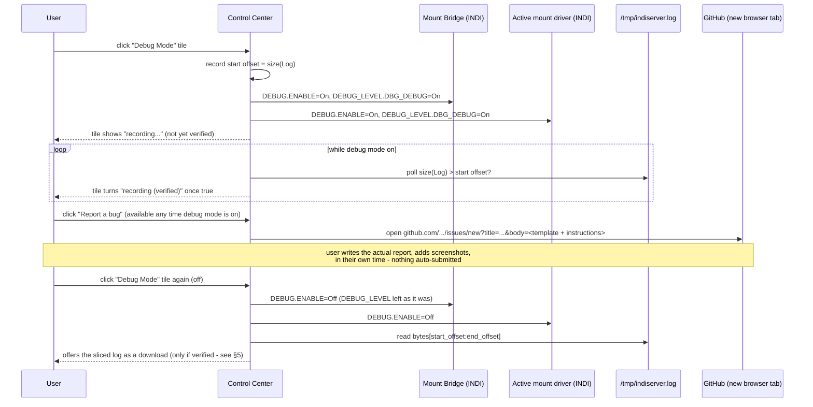

# Concept: One-click Debug Mode + Bug Report workflow

> **Status: concept only, not yet implemented.**

## 1. Problem

Diagnosing a live, hard-to-reproduce issue today means manually enabling INDI's own per-device
`DEBUG` property (via the INDI Control Panel or `indi_getprop`/`indi_setprop`), reproducing the
problem, then somehow finding and extracting the relevant slice of indiserver's own log - all
before it's forgotten which timestamp mattered - and finally writing up a GitHub issue by hand with
no log attached at all, or with a manually-copied fragment. Direct feedback (2026-09-27): turn this
into one guided flow - a single switch that starts logging, a way to trigger a GitHub issue while
it's fresh, and the actual log handed over automatically once debug mode is turned back off.

## 2. Desired workflow (User, 2026-09-27, verbatim)

> Bug-Modus an → Logging startet → Github Bug/Issue öffnet sich (der User kann Screenshots, Text
> usw. einfügen) → Bug-Modus ausschalten → die Logs werden automatisch angehängt → Der User
> entscheidet, was er mit dem Issue macht.

Plus one hard requirement: **the debug mode must be "verified"** - it must be provable that logging
actually produced non-empty output before the flow treats it as having captured anything, not just
that the toggle was clicked.

## 3. What already exists (verified live, 2026-09-27)

This is not a green field - two load-bearing pieces are already in place:

- **indiserver's own combined stdout+stderr already goes to a file today**, unconditionally, not
  just when something is wrong: on this Pi5, indiserver (started by `stellarmatewebmanager`) has fd
  1/2 both redirected to `/tmp/indiserver.log` (confirmed via `ls -la /proc/<indiserver-pid>/fd`).
  Every driver's `LOG_*`/`LOGF_*` output already lands there today, growing for the lifetime of that
  indiserver process (200k+ lines observed after less than a day of a real session) - this project
  does not need to invent a new log sink, only a way to slice out "everything appended since I
  turned debug mode on."
- **Per-device `DEBUG`/`DEBUG_LEVEL` are standard INDI properties**, already present on every
  driver including ours (confirmed live via `indi_getprop`):
  ```
  PiFinder Mount Bridge.DEBUG.ENABLE=Off / .DISABLE=On
  LX200 OnStep.DEBUG.ENABLE=On / .DISABLE=Off
  <device>.DEBUG_LEVEL.DBG_ERROR / .DBG_WARNING / .DBG_SESSION / .DBG_DEBUG (/ .DBG_EXTRA_1/2) = On/Off
  ```
  `DEBUG.ENABLE=On` + `DEBUG_LEVEL.DBG_DEBUG=On` is exactly the combination that makes a device's
  `LOGF_DEBUG()`/`DEBUGFDEVICE()` calls (already used throughout `pifinder_mount_bridge.cpp`, see
  e.g. the freshness-cooldown instrumentation) actually emit anything at all - today these calls are
  silently suppressed because `DEBUG_LEVEL.DBG_DEBUG` defaults off. Toggling these two switches via
  `set_switch()` (already used elsewhere in `indi_client.py`, e.g. `REPOSITION_CONFIRM`) needs no
  new INDI plumbing.
- **What does not exist yet**: any UI for this, any code that remembers a "since when" marker into
  `/tmp/indiserver.log`, any log-slicing/verification logic, and any GitHub-issue prefill flow. All
  net-new for this concept.

## 4. Scope: which device(s) get DEBUG turned on

"Our own drivers, but also the currently active mount" (User) means, concretely:

- **Always**: `PiFinder Mount Bridge` (this project's own driver - by far the most likely source of
  a bug worth reporting).
- **The currently active mount device** - read the same way `_optical_train_snapshot_and_enter_sim()`
  already does (server.py, #519/#523): Mount Bridge's own `ACTIVE_DEVICES.ACTIVE_MOUNT` element, not
  a hardcoded assumption. Whatever that names right now (`LX200 OnStep`, `Telescope Simulator`, ...)
  gets `DEBUG`/`DEBUG_LEVEL` toggled alongside Mount Bridge.
- **Not in scope for v1**: `PiFinder LX200`/`PiFinder Simulator` - possible follow-up, not requested.

## 5. Verifying debug mode actually produced something

Cheap and exact, given §3's finding: record `len(open("/tmp/indiserver.log", "rb").read())` (byte
offset, not line count - line-splitting a 200k-line file on every poll would be wasteful) at the
moment debug mode is switched on. "Verified" = the current file size is strictly greater than that
recorded offset. No new mechanism needed beyond a stored offset and a stat() call.

## 6. Architecture



Two independently-clickable actions, not one linear button, matching the user's own phrasing
("Bug-Modus an" / "Github Issue öffnet sich" / "Bug-Modus ausschalten" are three separate clicks,
in that order, with normal reporting/reproduction time in between) - "Report a bug" only needs debug
mode to currently be on; it does not itself stop it.

## 7. The GitHub-attachment gap - and why the workflow is shaped the way it is

GitHub's `issues/new` URL accepts `title`/`body`/`labels` query parameters to prefill an issue - it
has **no parameter for attaching a file**. A body can embed the log as inline text/a fenced code
block, but that's only viable for a short log slice (a URL has practical length limits well under
what even a few seconds of DEBUG-level Mount Bridge logging produces) and GitHub's own web UI
supports dragging a file directly onto the issue body textarea to attach it - which is exactly why
the log is offered as a plain downloadable file rather than something the Control Center tries to
push into GitHub itself: the Control Center cannot attach it on the user's behalf (no GitHub
credentials, and doing so automatically would also cross this project's "never publish without the
user's own explicit action" rule), but it can hand the user a file already sitting in their
Downloads folder, with a one-line instruction ("drag this file into the issue box") right there in
the prefilled body/on the download tile. The user's own explicit final action (writing the report,
attaching the file, clicking Submit) is preserved exactly as asked ("Der User entscheidet, was er
mit dem Issue macht").

## 8. Open questions (not yet resolved - needed before implementation)

- **Log slice bounds and size**: a real observing session's DEBUG-level Mount Bridge output over
  several minutes could be substantial. Cap the offered download at some maximum size (tail-trimmed,
  with a note that it was trimmed) or accept it uncapped? Needs a concrete number, not "reasonable."
- **Auto-timeout safeguard**: should Debug Mode auto-disable itself after some duration (e.g. 15
  minutes) if the user forgets to turn it off, given DEBUG_LEVEL.DBG_DEBUG on a busy driver during
  real tracking is materially more log volume than normal operation? Or is manual-only acceptable
  for v1?
- **indiserver restart mid-session**: the byte-offset approach (§5) breaks if indiserver itself
  restarts while Debug Mode is on (issue #385's own known occasional indiserver instability makes
  this not just a theoretical edge case) - `/tmp/indiserver.log`'s fd is reopened by
  `stellarmatewebmanager` on restart, whether that truncates or appends is unconfirmed and needs
  checking before relying on it. At minimum, detect this (e.g. process start time changed) and
  surface "log was interrupted by an indiserver restart" rather than silently returning a
  wrong/truncated slice.
- **PiFinder's own log** (separate from indiserver's): should a bug report also offer
  `pifinder.service`'s own recent log (already read elsewhere via `journalctl -u pifinder.service`,
  see `server.py`'s existing `LOG_FILE`/journalctl helpers) bundled alongside the INDI log, since a
  Mount Bridge bug often has a PiFinder-side cause? Two files vs. one combined download - not yet
  decided.
- **Where the "Debug Mode" control lives in the UI** - its own new tile (matching the LED-tile
  pattern from PR #529), or folded into an existing diagnostics area? Not yet designed.
- **DEBUG_LEVEL restored to its prior state on Debug-Mode-off, or left on** - probably restore
  (mirrors this project's existing "leave things as they were found" convention, e.g. the optical
  train swap-memory pattern), but not yet decided explicitly.

## 9. Non-goals for v1

- No automatic upload of logs to any third-party host - the user's own drag-and-drop into GitHub's
  own upload mechanism is the only transfer path.
- No log parsing/summarization/redaction - handed over as-is (worth revisiting if a real report ever
  turns out to contain something sensitive, e.g. a location).
- No scope beyond Mount Bridge + the active mount device (§4) in v1.
