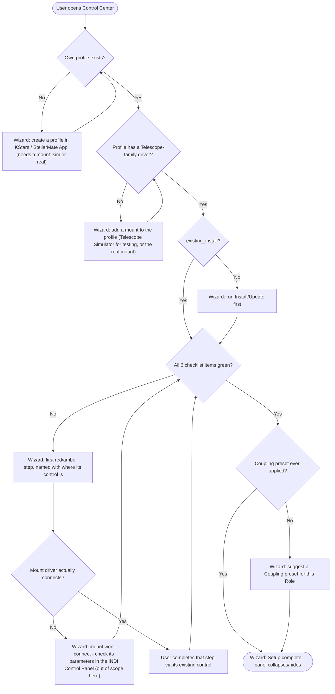

# First-Time Setup Wizard — Concept

> **Status: concept — Phase 1 not started.** Written via this project's `cpt` (concept)
> convention — see `basic-memory/basic-memory/00020_bm-cpt-command-system.md` and
> `00021_bm-documentation-depth-standard.md` for the standard this document follows. Tracked as
> [GitHub issue #265](https://github.com/apos/PiFinder_Stellarmate/issues/265) on
> [Project #15](https://github.com/users/apos/projects/15) — update that issue if this concept is
> promoted, revised, or dropped.
>
> **Revised 2026-09-05** after the first Phase-1 mockup was rejected: a read-only panel that only
> mirrored the existing readiness line added little, and — the substantive gap — it silently assumed
> the user already had a working Ekos equipment profile. The real first-time cliff is *getting that
> profile*, which none of the 6 checklist steps help with. See §2.1 and §8.
>
> Companion to the main [README.md](../../README.md) and
> [Readme_ControlCenter.md](../../Readme_ControlCenter.md). Read
> [`mount_bridge_web_integration.md`](mount_bridge_web_integration.md) first — it owns the
> profile/driver/coupling workflow this wizard sequences, and explicitly puts *profile creation* and
> *the user's own mount-driver connection parameters* out of scope (its §1 non-goal, UC1/UC8). This
> wizard does not change that boundary; it makes the boundary visible to a first-time user instead of
> letting them fall off it (§2.1).

## 1. Basic Functionality (Overview)

The Control Center already exposes every control a working Mount-Bridge setup needs — Role choice, a
6-step Setup checklist, four Coupling presets, Multi-Point Alignment — but no *guided path* through
them, and **no acknowledgement of the one prerequisite that sits before all of them**: a working
Ekos equipment profile.

A first-time user faces two problems, in order:

1. **Before the checklist can mean anything** they need an Ekos profile in KStars that contains at
   least a mount driver (a Telescope Simulator, or their real mount) *and* connects to it. That
   profile is built in KStars' Profile Editor or the StellarMate App — not anywhere in this tile.
   Checklist step 1 ("Profile") only *selects* an already-existing profile and starts its
   `indiserver`; it does nothing for a user who has no profile, or a profile with no mount.
2. **Once a usable profile exists**, the 6 checklist steps have to be done in an order the page's own
   visual layout contradicts (see §3.1 — Role sits above the checklist but the code requires step 1
   first).

The wizard is a thin guidance layer over the existing controls. It does not replace or duplicate any
of them and it does not build profile creation. It **detects which of these two problems the user is
in** and points at the single next thing to do — including "go to KStars / the StellarMate App and
add a mount to your profile", when that is the next thing.

## 2. Use Cases

### 2.1 The prerequisite (new — the reason for this revision)

| # | Starting state | What the wizard should do | Detectable from |
|---|---|---|---|
| UC0a | No equipment profile of the user's own exists (only the read-only `Simulators` default) | Explain that setup needs a profile with at least a mount driver — sim or real — and point to KStars Profile Editor / the StellarMate App to create one. Do **not** start the checklist. | `/api/webmanager/profiles` → own-profile count `0` (already drives `#wm-no-profile-hint`) |
| UC0b | A profile exists but contains no Telescope-family driver | Same guidance, narrowed: "profile *X* has no mount — add a Telescope Simulator (for testing) or your mount driver to it". | **`GET /api/webmanager/other_drivers?profile=X` already** — returns `{drivers: [{label, is_telescope}]}` for any profile, and its server handler (`server.py`) does **not** gate on a running profile (only the client's `refreshWmConnectRow()` does). `drivers.some(d => d.is_telescope)` = has a mount. No new endpoint. |
| UC0c | Profile has a mount driver but it never connects (wrong serial port / TCP host / mount off) | Point at the mount's own connection in the INDI Control Panel — this wizard does not configure mount-driver parameters (out of scope, per the web-integration concept's §1). Name it as a real blocker rather than showing a generic "step 6 not done". | mount driver present in profile, but its `CONNECTION` never reaches `CONNECT` after step 6 |

UC0c is the seam with [`mount_bridge_web_integration.md`](mount_bridge_web_integration.md)'s explicit
non-goal. The wizard's job there is to *name the blocker accurately and send the user to the right
tool*, not to solve it.

### 2.2 The two situations from the issue (unchanged, but now downstream of §2.1)

1. **Fresh install** — Install/Update has been run once; nothing is configured. If §2.1 is satisfied
   (a profile with a mount exists), the goal is "PiFinder is talking to my mount" (or, for a
   PiFinder-only / Control-host role, that role's equivalent end state) in as few manual steps as
   possible. If §2.1 is *not* satisfied, that is the first thing the wizard addresses.
2. **Returning user** — setup existed but something regressed: an SMOS update reset `/etc` state
   (README "SMOS Updates"), a driver was removed in Web Manager, hardware was swapped, or a reboot
   left Ekos not connected. Goal: identify *which* checklist item regressed without re-doing the
   others.

Both 2.2 scenarios read the same underlying state (§4) and are the same flow at different starting
points. §2.1 is the gate in front of that flow.

## 3. Architecture

### 3.1 Context: why a wizard, not just better ordering

Two real ordering problems, not just a discoverability gap:

**A. The prerequisite is invisible.** Nothing on the page says "you need a working profile with a
mount before any of this". `#wm-no-profile-hint` and `#wm-no-mount-hint` exist but are small,
static, and buried inside the collapsed "Setup checklist & diagnostics" section — a first-time user
never sees them until they have already gone looking in the right place.

**B. Role-before-Profile inversion.** Investigated live:

- **On screen**, the Mount Bridge tile shows, top to bottom: Role cards → Mode cards/readiness line
  → Setup checklist (1. Profile … 6. Connect) → Multi-Point Alignment.
- **In code**, `onRoleCardClick()` (`gui_installer/status_page.html`) hard-requires step 1:
  `if (!wmSelectedProfile) { alert('Pick a profile in step 1 first.'); return; }` — a Role click
  before that is a dead end (an alert, no progress).

So the two things closest to "step 0" on the page are in the wrong relative order for a first-time
user reading top-to-bottom. The wizard does not reorder the static page (Role stays the primary
navigation once things are set up, per the design rationale in the code comments) — it presents the
*correct* next action regardless of where that control lives spatially, and it makes the prerequisite
explicit before either.

### 3.2 Building blocks (existing, reused — no new state machine)

The wizard is a **read layer + a "next action" pointer**, not a new source of truth:

| Signal | Where it already lives | Tells the wizard |
|---|---|---|
| own-profile count | `/api/webmanager/profiles` (already excludes the read-only `Simulators`) | **UC0a**: is there any profile to work with at all? |
| Telescope-family driver in profile | `/api/webmanager/other_drivers?profile=X` — **exists today**, works on a stopped profile, returns `is_telescope` per driver | **UC0b**: does the profile have a mount? |
| `existing_install` | `/state` (`PIFINDER_DIR.is_dir()`) | Coarse "PiFinder installed on this device" — role-dependent, not "setup done" |
| `wmSelectedProfile`, `wmServerRunning` | `status_page.html` JS (Web Manager polling) | Step 1 done? |
| `wmKstarsLinked` | same | Step 2 done? |
| `wmHasLx200`, `wmHasBridge`, `wmLx200Remote` | same | Step 3 done? — and, via `deriveProfileRole()`, which Role this implies (`aio` / `host` / `ctrl` / …) |
| `wmActiveMount` | same | Step 4 done? |
| `wmEkosConnected` | same | Step 5 done? |
| per-device `CONNECTION` | `mb-connect-*` button states / `_availableConnectTargets()` | Step 6 done? (and UC0c: mount present but never connects) |
| `lastSolveSource` | same | "Solve" health — shown by `updateSimReadinessLine()` today |
| active Coupling mode | `mb-preset-*` active state | Has a preset ever been applied? |

`updateStepIndicators()` already computes steps 1–6 done/not-done, and `updateSimReadinessLine()`
already renders a 6-item status line from them (its 6th item is "Solve"; the checklist's 6th is
"Connect" — the wizard tracks the checklist's six and treats Solve as a separate health note, matching
the existing readiness line's own comment about not conflating the two). The wizard adds one thing
upstream of all of that: the §2.1 prerequisite check.

### 3.3 Proposed flow

Scenario detection (fresh vs. returning, §2.2) still falls out of the same state at different
starting points. The new part is the `HasProfile` / `HasMount` gate in front, and the
`MountConnects` check that turns a bare "step 6 not done" into an accurate UC0c message.

### 3.4 Where it lives on the page

A new, dismissible panel (`#setup-wizard`) at the **top** of the Mount Bridge tile body, above the
Role cards — the one place Role and the checklist are both reachable, so the wizard can point at the
control the user needs next regardless of which section it lives in, and can show the §2.1
prerequisite message *before* the user ever expands the collapsed checklist. Collapses automatically
once §3.3's `Done` state is reached; a manual dismiss (`localStorage` flag, same pattern as
`toggleCollapsibleSection`) is Phase 3.

Visual language: reuses the existing `.status-dot` vocabulary (`dot-white` / `dot-green` /
`dot-yellow`) and `.group-label` / role-card styling — no new status system (per
`basic-memory/basic-memory/00017_bm-ui-design-anforderung-klar-einheitlich.md`).

## 4. Design Principles

Per `basic-memory/basic-memory/00017_bm-ui-design-anforderung-klar-einheitlich.md`, already
established for this page:

- **No decorative emoji, traffic-light dots only.** Wizard "done" / "next" / "not yet" reuse
  `.status-dot` (`dot-green` / `dot-yellow` / `dot-white`).
- **Label the visible control, not the mechanism.** "Add a mount to your profile", not "no
  Telescope-family driver in `get_profile_labels`".
- **Name the real blocker.** UC0a/UC0b/UC0c each get a specific message — never a generic
  "something's not set up".
- **Tooltips for the technical detail**, keeping the primary wizard text short.
- **The wizard points; the existing control does the work.** Phase 2's "Take me there" scrolls to
  and briefly highlights an existing control — it never performs the action itself, avoiding a
  second action path that could drift from the first (cf. #204/#216's ACTIVE_DEVICES-drift class of
  bug).
- **Functional grouping**: the wizard is its own panel — a cross-cutting layer over Role + checklist
  + Coupling, not a peer of any one tile section.

## 5. Technical Reference

**No new backend surface.** Both §2.1 signals already have endpoints:

- **UC0a**: `GET /api/webmanager/profiles` → own-profile count.
- **UC0b**: `GET /api/webmanager/other_drivers?profile=<name>` → `{drivers: [{label, is_telescope}]}`.
  Verified in `server.py`: the handler calls `webmanager_client.other_profile_drivers()` directly
  with no running-profile check — the "profile must be running" gate is client-side only
  (`refreshWmConnectRow()` needs live connect state for its *own* dropdown; the wizard's has-a-mount
  question doesn't). `is_telescope` = Web Manager driver-catalog family `"Telescopes"`, minus the
  three PiFinder labels; see [`mount_bridge_web_integration.md`](mount_bridge_web_integration.md) §4
  and `other_profile_drivers()`'s docstring for the residual cases it can't resolve.

New client-side surface only:

| Function (proposed) | Responsibility |
|---|---|
| `computeWizardStep()` | Returns the single next actionable item as a tagged union: `{kind: "need_profile"}` \| `{kind: "need_mount", profile}` \| `{kind: "install"}` \| `{kind: "checklist", step: 1..6}` \| `{kind: "mount_wont_connect"}` \| `{kind: "suggest_coupling", role}` \| `null` (done). Same inputs as `updateSimReadinessLine()` plus the two §2.1 signals above. |
| `renderWizardPanel(next)` | Shows/hides `#setup-wizard`; sets its text and (Phase 2) "Take me there" target from `next`. |
| `scrollToAndHighlight(elementId)` (**Phase 2**) | Generic scroll + outline-flash helper. Reusable beyond the wizard. |

`/state`, the existing Web Manager polling, and `updateSimReadinessLine()`'s computation cover
everything else.

## 6. Test Strategy

- **Automated**: none currently — this page has no test harness beyond manual QA (consistent with
  the rest of `gui_installer/`). `computeWizardStep()` is pure enough to unit-test in isolation
  (inputs → tagged-union output) and worth a first small JS test with Phase 1.
- **Manual**:
  1. **No profile** (`Simulators` only) — wizard shows UC0a, does not show a checklist step.
  2. **Profile without a mount** — add an empty own profile in Web Manager; wizard shows UC0b naming
     that profile.
  3. **Profile with Telescope Simulator** (`bin/simulate_fresh_install.sh --mode=fresh` or a real
     reinstall + a sim profile) — wizard advances through steps 1–6 as each completes.
  4. **Mount present, won't connect** — point the mount driver at a bogus port; wizard shows UC0c,
     not a bare "step 6".
  5. **Regression on a configured device** — remove a driver / disconnect Ekos; wizard names *that*
     item.
  6. **Role-before-Profile** (§3.1B) — wizard never suggests a Role card before step 1 is possible.

## 7. Effort / Priority

T-shirt size **S–M** (per `basic-memory/basic-memory/00019_bm-github-project-schema-todo-format`) —
no new state machine and no new backend endpoint; the work is the §2.1 detection logic, the panel,
and careful live verification across UC0a–UC0c and both §2.2 scenarios. Priority **P1**: raised from
live Pi4 testing as real onboarding
friction; not a correctness bug (nothing is broken), but first-time setup is materially harder than
it needs to be, and the prerequisite gap means a fresh user can get stuck before step 1.

## 8. Strategic Roadmap (dependencies made explicit)

Ordered; each numbered item is sized to become its own GitHub sub-issue once implementation is
approved (mirroring `pifinder_fake_solve_simulation.md`'s ordered sub-issue precedent) — not created
yet, per the cpt gate.

1. **Prerequisite detection + guidance** (`computeWizardStep()` covering `need_profile` /
   `need_mount` / `install`, plus the read-only panel). This is the genuinely additive core: it
   addresses UC0a/UC0b, which nothing on the page does today. Depends on nothing new — both signals
   already have endpoints (§5). **This replaces the rejected "read-only status mirror" as Phase 1.**
2. **Checklist step pointer + Role-before-Profile fix** (`computeWizardStep()` covering
   `checklist: 1..6`, and making the wizard's first post-prerequisite message "do step 1, then pick a
   Role"). Depends on (1). Absorbs what little value the original read-only panel had, in service of
   §3.1B.
3. **`mount_wont_connect` (UC0c) detection** — distinguish "step 6 not done" from "mount driver
   present but never connects". Depends on (2); needs the step-6 signal wired first.
4. **`scrollToAndHighlight()` + "Take me there"** — navigation on top of verified-correct step
   detection. Depends on (1)–(3) being right; guiding users faster to the wrong place is worse than
   no navigation.
5. **Dismiss / auto-collapse** (`localStorage`) — depends on the panel content being trustworthy
   (1)–(4).
6. **Coupling-preset suggestion** (§3.3 `SuggestCoupling`) — deliberately last: a separable
   enhancement, not a blocker for the core wizard.

## 9. RAID (Risks, Assumptions, Issues, Dependencies)

| Type | Item |
|---|---|
| Assumption | Profile creation and mount-driver connection parameters stay out of scope (inherited from [`mount_bridge_web_integration.md`](mount_bridge_web_integration.md) §1). Open decision if the user wants the wizard to eventually *embed* profile/mount creation rather than point outward — that is a much larger scope and a separate concept. |
| Risk | `is_telescope` is only as good as each driver's self-declared INDI family (`other_profile_drivers()` docstring, residual cases a & b). A profile with a mislabeled mount driver would read as UC0b incorrectly. Mitigation: the guidance text is soft ("looks like no mount — if you have one, check its driver family"), never a hard block. |
| Issue | `existing_install` is `PIFINDER_DIR.is_dir()` — meaningless for the Control-host role (no local PiFinder). The `install` branch of `computeWizardStep()` must be role-gated. |
| Dependency | The has-a-mount read must work on a stopped profile (a first-time user's profile is typically not running). Confirmed OK: `/api/webmanager/other_drivers`'s HTTP handler does not gate on a running profile — only the client's `refreshWmConnectRow()` does, for its own reasons. `computeWizardStep()` calls the endpoint independently of `wmServerRunning`. |
