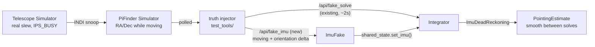

# Concept: Simulated IMU for Full Simulation (fixing discrete PiFinder position jumps)

> **Status: implemented** (`PiFinder/python/PiFinder/imu_fake.py`, `Imu` class, dated 2026-09-01 -
> the code itself cites this document by name).
> Spans two repositories: `PiFinder_Stellarmate` (this repo, test tooling) and `PiFinder`
> (`~/PiFinder`, `imu_fake.py`/`imu_pi.py`/`integrator.py`). Design context:
> `docs/concepts/mount_bridge_reposition_detection.md` §9-10.

## 1. Overview

Full Simulation feeds PiFinder a synthetic camera solve every ~2s via `/api/fake_solve` (see
`test_tools/pifinder_truth_injector.py`). On real hardware, PiFinder's own IMU fills the gap
*between* solves with continuous, high-frequency dead-reckoning (see `PiFinder/python/PiFinder/
integrator.py`'s `ImuDeadReckoning`) - so the reported position stays smooth even though camera
solves land only once every second or so. Full Simulation has no such interpolation: between two
fake-solve injections, PiFinder's reported position sits **completely frozen**, then **jumps
discretely** to the new value at the next injection.

Direct user framing that crystallized the fix (2026-09-01): *"Mount = still -> keinen IMU. Mount
bewegt sich -> IMU (dead reckoning)."* - a real IMU is only informative while the telescope is
actually moving; while it's still, the last solve already is the truth. Full Simulation should model
exactly that, not a step function.

**Why this matters for Mount Bridge**: these discrete jumps are large enough, and arrive fast enough
between polls, that Mount Bridge's own physically-motivated plausibility check
(`MAX_SIDEREAL_DRIFT_ARCMIN_PER_SEC`, see `mount_bridge_reposition_detection.md` §3.2 row 3 vs. 4)
correctly flags them as *implausible for passive motion* - because, in this simulated world, they
genuinely are: nothing smoothly interpolated the movement, so a real jump really did just happen from
Mount Bridge's point of view. §9/§10 of that document fixed two bugs Mount Bridge had in *reacting* to
this; this document addresses the *underlying* input problem those bugs were reacting to in the first
place. Fixing this here should make Mount Bridge's Fall-2/Fall-4 machinery rarely see anything
inherently implausible during ordinary simulated slews at all.

## 2. Root cause, precisely located

`PiFinder/python/PiFinder/imu_pi.py`'s `imu_monitor()` - the actual process `main.py` starts,
regardless of whether real hardware is present - falls back to `imu_fake.Imu` (`PiFinder/python/
PiFinder/imu_fake.py`) when no physical IMU is found (exactly Full Simulation's situation, no
hardware at all):

```python
try:
    imu = Imu()
except Exception as e:
    ...
    from PiFinder.imu_fake import Imu as ImuFake
    imu = ImuFake()
```

The monitor loop keeps running unchanged either way - it calls `imu.update()`, `imu.moving()`,
reads `imu.avg_quat`, and publishes via `shared_state.set_imu(imu_sample)`. Two separate defects in
`ImuFake` combine to mean nothing ever reaches `shared_state` at all, not just a frozen value:

1. **Publishing never starts.** `shared_state.set_imu(imu_sample)` is gated on `imu_calibrated`,
   which only ever becomes `True` once `imu.calibration == 3`. `ImuFake.__init__` sets
   `self.calibration = 0` and nothing ever changes it - `imu_calibrated` never flips, so
   `set_imu()` is **never called** in the fake-IMU path. `shared_state.imu()` returns `None`
   forever, `_valid_imu_anchor()` in `integrator.py` always fails, and the fake-solve injection
   comment in `integrator.py` ("Fake solve injected without a usable IMU anchor... dead-reckoning
   will not track") is really describing "there was never any IMU sample at all," not "it was
   stale."
2. **Even if it published, it would never move.** `ImuFake.update()` is a no-op `sleep(0.1)`.
   `avg_quat` stays fixed at `(1.0, 0.0, 0.0, 0.0)` (identity) and `moving()` always returns `False`
   - there is no mechanism for anything external to tell `ImuFake` "the telescope is currently
   rotating, here's roughly how."

## 3. Design

### 3.1 What "moving" means here

The one piece of ground truth Full Simulation already has, continuously and in real time, is
"PiFinder Simulator"'s own dead-reckoning-follow (PR #239, `indi_pifinder_simulator/
pifinder_simulator.cpp`'s `ISSnoopDevice()`) - it already tracks the real mount's RA/Dec while it's
genuinely slewing (`IPS_BUSY`, and not Mount Bridge's own correction - see `CORRECTION_AGE`
gating, `complete_position_simulator.md`). That is exactly "is the telescope currently moving, and
where is it pointing" - the same signal a real IMU would sense directly, just derived differently.

### 3.2 Architecture



### 3.3 PiFinder-repo changes (`imu_fake.py`)

- `ImuFake.__init__`: set `self.calibration = 3` immediately - there is no real calibration
  procedure for a synthetic IMU to go through; "already calibrated" is the correct simulated state
  from the start, not a defect to fix separately.
- Give `ImuFake` a way to receive external motion updates, mirroring the existing
  `fake_solve_command_queue` pattern in `main.py`/`integrator.py` (`FakeSolve` command objects on a
  queue, drained once per `integrator()` loop iteration - see that file's own comment on why this
  goes through an in-process queue rather than the generic `solver_queue`). A parallel
  `fake_imu_command_queue` (or a single message type carrying both, if simpler) feeding a new
  `FakeImuSample(moving: bool, quat: quaternion)`-shaped command is the same idiom, not a new one.
- `ImuFake.update()` drains that queue: while updates keep arriving, `_moving = True` and
  `avg_quat` reflects the latest received orientation; once updates stop arriving (mount settled -
  the external feeder simply stops sending, no explicit "stopped" message needed, matching "mount
  still -> no IMU" from §1), `_moving` returns to `False` after a short debounce (avoid a single
  missed poll tick flapping `moving` on and off).
- New `/api/fake_imu` endpoint (own web route, same file/pattern as the existing `/api/fake_solve`
  handler) accepting an orientation update and pushing it onto the new queue - the same "small,
  dependency-free HTTP hook for external test tooling" role `/api/fake_solve` already plays.

### 3.4 PiFinder_Stellarmate-repo changes (`test_tools/`)

- Extend `pifinder_truth_injector.py` (or add a sibling script, if keeping the existing one
  single-purpose is preferable - open question, see §5) to also poll whether "PiFinder Simulator"'s
  snooped mount is currently `IPS_BUSY` (already observable via `indi_getprop`/a small INDI client,
  no new capability needed) and, while it is, compute an orientation delta from the RA/Dec change
  since the last sample and POST it to `/api/fake_imu` at a materially faster cadence than
  `/api/fake_solve`'s ~2s (a real IMU samples at tens of Hz - even a modest simulated 5-10 Hz here
  would already be a large fidelity improvement over today's step function, and removes the need to
  also speed up the fake-solve cadence itself, see §5).
- Converting an RA/Dec delta into a plausible orientation quaternion needs the same
  screen-direction/mount-type convention `ImuDeadReckoning`/`pifinder_simulator.cpp` already use
  (see that file's `MOUNT_TYPE`/`SCREEN_DIRECTION` handling) - reuse, don't reinvent.

## 4. ADR: derive simulated IMU motion from the mount, not from a separate synthetic trajectory

**Context**: Full Simulation needs *some* signal to drive `ImuFake` while the mount slews. It could
be a wholly synthetic motion generator (e.g., interpolate linearly between the last two fake-solve
positions) or derived from ground truth already being tracked elsewhere.

**Decision**: derive it from "PiFinder Simulator"'s own live-tracked mount position (§3.1) rather
than inventing a second, independent motion model. The dead-reckoning-follow feature already solves
"know where the mount really is while it's moving" correctly (PR #239); reusing that avoids a second
implementation of the same physical fact that could drift out of sync with the first.

**Consequences**:
- Positive: one source of truth for "is the telescope moving and where" across the whole simulated
  stack, not two. Directly fixes the discrete-jump root cause `mount_bridge_reposition_detection.md`
  §9-10 were reacting to, rather than continuing to patch Mount Bridge's own tolerance for jumps.
- Negative: couples the IMU-simulation feature to "PiFinder Simulator"'s own follow feature being
  correctly configured (`FOLLOW_MOUNT_DEVICE` set, Full Simulation actually targeting "PiFinder
  Simulator") - not a new constraint in practice, since that's already required for any of today's
  Full Simulation testing to be meaningful at all.

## 5. Open questions

1. Exact orientation-delta math (RA/Dec change -> quaternion) - needs the same screen-direction
   convention already used elsewhere in this project; not yet worked out in code.
2. ~~Whether `/api/fake_imu`'s cadence should be independently configurable, and what a reasonable
   default is~~ - **resolved, see §6**: `--poll-interval` defaults to 0.15s (~6.7 Hz), inside the
   5-10 Hz range this section originally suggested.
3. ~~Whether to extend `pifinder_truth_injector.py` in place or add a sibling script~~ - **resolved**:
   implemented as the sibling script `test_tools/pifinder_imu_injector.py`, sharing
   `pifinder_indi_polling.py`'s primitives rather than one importing the other.
4. This is a two-repository change - the `PiFinder` side (§3.3) needs its own PR/review there,
   independent of whatever lands in `PiFinder_Stellarmate` (§3.4). Sequencing/ownership not yet
   decided.

## 6. 2026-09-26 update: the polling *implementation*, not the sampling rate, was the real problem

Live-tested on the Pi5 during an unrelated Issue #385 investigation (indiserver periodic
unresponsiveness / unbounded memory growth - see basic-memory pifinder-stellarmate, 2026-09-26 Pi5
session). `pifinder_imu_injector.py`'s original `--poll-interval` default was `0.0` ("poll as fast as
indi_getprop's own round-trip allows" - see the option's original help text), and both this script and
`pifinder_truth_injector.py` read INDI properties by shelling out to the `indi_getprop` CLI **on every
single poll** - a fresh process fork *and* a fresh TCP connect/handshake/teardown against indiserver
each time, twice per tick for the IMU injector (mount-busy state + position), with no cap on how often
that could happen.

Consequence, confirmed live: with no real sky to point at and the mount left "tracking" for an
extended test session, this uncapped loop measured at roughly 4-5% continuous CPU and produced a
constant, unbounded stream of brand-new indiserver connections (visible in indiserver's own `-v` log
as "Client N: new arrival ... read EOF ... shut down complete" repeating multiple times per second,
indefinitely) - real, continuous load contributing to indiserver's own connection/resource churn, and
plausibly a contributing factor (not confirmed as *the* sole cause) in the broader Issue #385
symptoms observed the same session.

**Fix** (`test_tools/pifinder_indi_polling.py`'s new `PersistentIndiClient`): one long-lived INDI
socket per script, opened once and reused for every read via a scoped `<getProperties device=...
name=.../>` + a small incremental `xml.parsers.expat` parse of just that reply - no process fork, no
repeated TCP handshake, transparent reconnect-on-error so a dropped connection self-heals on the next
call instead of wedging the script. Both `pifinder_imu_injector.py` and `pifinder_truth_injector.py`
now use it. This did **not** change either script's purpose, CLI flags, HTTP endpoints, or math - only
how a property read reaches the wire. `pifinder_imu_injector.py`'s `--poll-interval` default was also
changed from `0.0` to `0.15` (~6.7 Hz, still inside this document's original 5-10 Hz suggestion) - now
that a read is cheap, the interval reflects the *intended* sample rate again instead of an
implementation-accidental one set by indi_getprop's own round-trip time. Live-confirmed after the
change: CPU dropped from the low single digits (measured, see above) to <1%, and indiserver's
connection log went from continuous per-second reconnects to exactly one stable, long-lived connection
per script.

**Scope note**: this section is about the *test tooling*'s efficiency, not the IMU-simulation design
in §1-4, which is unchanged.

## Related

- `mount_bridge_reposition_detection.md` §9 (dual position-source fix), §10 (Fall-4 revert livelock)
- `complete_position_simulator.md` (dead-reckoning-follow feature this reuses, `CORRECTION_AGE`)
- `PiFinder/python/PiFinder/imu_fake.py`, `imu_pi.py`, `integrator.py` (PiFinder repo)
- Live-observed (2026-09-20) during an unrelated Mount Bridge test campaign: dead reckoning worked
  correctly throughout a long Full Simulation session, see
  `test_tools/TF-20260919-full-simulation-coupling-matrix.md`.
