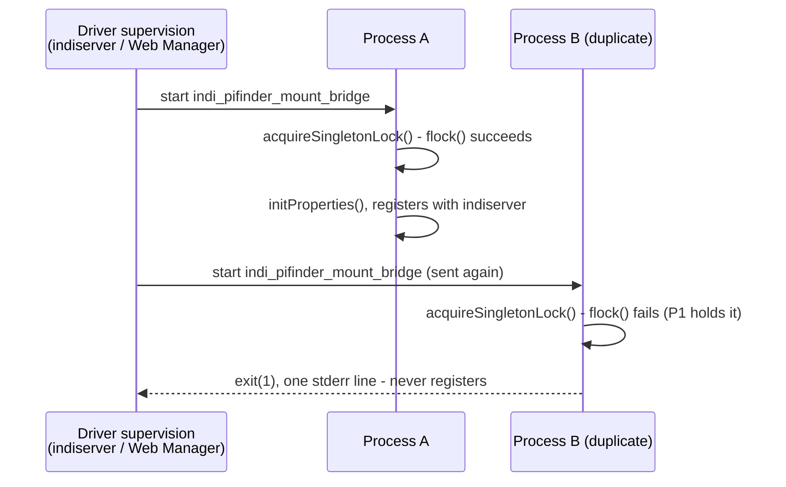

# Concept: Singleton guard against duplicate INDI driver instances

> **Status: implemented for Mount Bridge, not yet for the other two custom drivers.** Tracked as
> [GitHub issue #303](https://github.com/apos/PiFinder_Stellarmate/issues/303) on
> [Project #15](https://github.com/users/apos/projects/15). Extending it to the remaining two
> drivers is tracked as [GitHub issue #306](https://github.com/apos/PiFinder_Stellarmate/issues/306).

## 1. Basic Functionality

`indiserver`'s FIFO `start <driver>` command has no deduplication of its own - it just spawns a
process. Nothing in the INDI server or protocol stops two processes of the same driver executable
from registering as the same device with the same indiserver at once. Found live (2026-09-07,
stellarmate-utm): this device's own driver supervision sent `start indi_pifinder_mount_bridge`
twice in quick succession, producing two genuinely separate "PiFinder Mount Bridge" processes, both
with indiserver as their direct parent (confirmed via `ppid`), both fully registered at once.

This concept adds a guard directly in the driver's own startup path - `acquireSingletonLock()`,
called as the very first thing in the driver's constructor, before any INDI property or network
setup - so a duplicate refuses to start and exits immediately, rather than relying on whatever
spawned it to not ask twice.

## 2. Mechanism

- **`flock()`, not a PID file.** A PID file needs the NEXT process to check whether the recorded
  PID is still alive before trusting it - if the previous process was killed uncleanly (SIGKILL, a
  crash), a stale PID file can wrongly refuse a legitimate restart, and the liveness check itself is
  a second thing to get right (PID reuse by an unrelated process is a real, if rare, failure mode).
  `flock()` sidesteps this entirely: it is an OS-level advisory lock tied to the open file
  descriptor, released automatically by the kernel the instant the holding process exits, crashes,
  or is killed - no manual cleanup, no liveness-checking, no staleness possible.
- **Scoped to the parent process's PID, not one fixed lock path.** The lock file is
  `/tmp/.indi_<driver>_<getppid()>.lock`. Two processes spawned by the *same* indiserver (the actual
  bug found live) share a parent PID and correctly collide. Two processes spawned by *different*
  indiserver instances (e.g. a real profile's indiserver and a separate Fake-Mode test instance on a
  different port, both potentially running "PiFinder Mount Bridge" - see
  `test_tools/fake_mode.sh`) have different parent PIDs and do **not** falsely collide - each gets
  its own single instance.
- **Checked as early as possible.** In the constructor (`PiFinderMountBridge::PiFinderMountBridge()`
  in `indi_pifinder_bridge/pifinder_mount_bridge.cpp`), which runs at static-initialization time via
  the file-scope `static std::unique_ptr<PiFinderMountBridge> pifinder_bridge(new
  PiFinderMountBridge())` every INDI driver of this shape already has - before `initProperties()`,
  before any device registration. A refused duplicate never touches indiserver at all; it just
  writes one line to stderr and calls `exit(1)`.

## 3. Why this, not a fix to the supervisor sending `start` twice

The *cause* of the duplicate `start` (the Web Manager's own driver supervision, based on the
parent-PID evidence) is outside this project's own code and not something this repo controls or can
reliably fix - matching this project's "don't diagnose why every time, guarantee the outcome"
standard. A guard at the one point this
project *does* own - the driver's own startup - makes the outcome (exactly one running instance)
true regardless of how many times, or why, something asks for a second one.

## 4. Applicability to this project's other custom drivers

`indi_pifinder/lx200_pifinder.cpp` (`LX200_PIFINDER`) and
`indi_pifinder_simulator/pifinder_simulator.cpp` (`PiFinderSimulator`) both use the identical
`static std::unique_ptr<T> instance(new T())` + plain-constructor shape Mount Bridge does - the
same `acquireSingletonLock()` function (parameterized by driver name for the lock-file prefix) could
be dropped into each unchanged. **Not yet done** - Mount Bridge was the one with a live, reproduced
duplicate; the other two haven't shown the same symptom, so extending the guard to them is a
candidate follow-up, not an assumed requirement.

## 5. Test Strategy

No automated test (this is INDI-process-lifecycle behavior, consistent with how this project tests
its other driver-level fixes - live verification, not unit tests). Manually verified before deploy
(2026-09-07):

- Two instances launched with the same parent process (matching the live bug): the second is
  refused immediately with a clear stderr message; the first is unaffected.
- Two instances launched with genuinely different parent processes: both start successfully,
  confirming the parent-PID scoping doesn't introduce a false collision.
- Deployed and live-verified on this UTM: the driver process count had been fluctuating between one
  and two under this box's own driver supervision: after deploying, it stays at exactly one.

## 6. Effort / Priority

- **Effort**: XS (extra small) - one self-contained ~40-line function plus a three-line call in an
  existing constructor, no new INDI properties, no GUI changes.
- **Priority**: P2 - a real correctness gap (silent duplicate device registration), not a safety
  issue, not currently blocking other work. Extending to the other two drivers (§4) is lower
  priority still, since neither has shown the symptom live.

## 7. Strategic Roadmap

1. **Done**: Mount Bridge (this concept's original motivating case).
2. **Candidate, not scheduled**: extend the same `acquireSingletonLock()` to `LX200_PIFINDER` and
   `PiFinderSimulator` (§4) - only worth doing proactively if effort allows, since neither has a
   reproduced live symptom; otherwise wait until/if one does.
