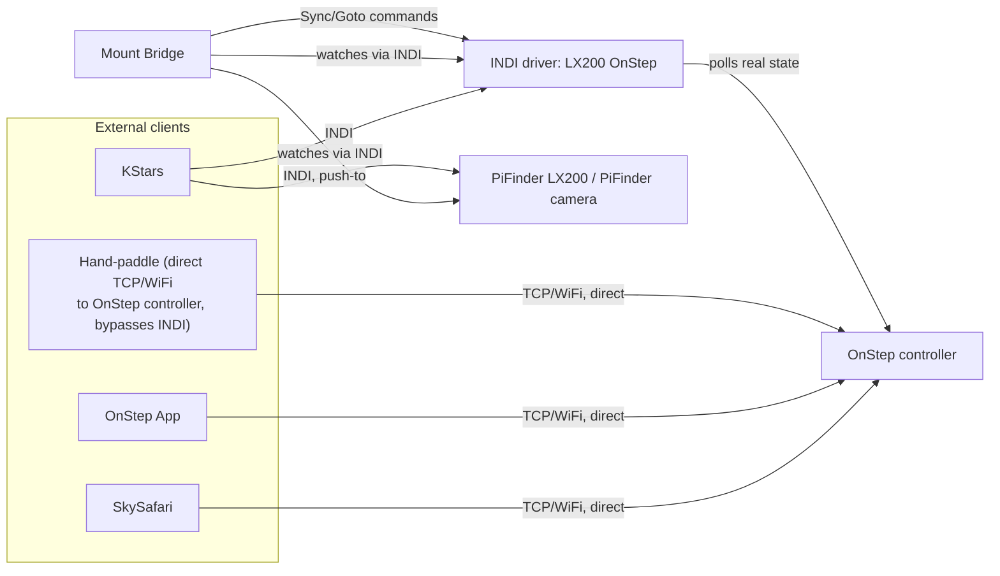

# Concept: Mount Bridge Reposition Detection (Unifying "Follow mount's goto" / "Follow PiFinder's push to")

> **Status: concept — not yet implemented.** Written via this project's `cpt` (concept)
> convention — see `basic-memory/basic-memory/00020_bm-cpt-command-system.md` and
> `00021_bm-documentation-depth-standard.md` for the standard this document follows. Tracked as
> [GitHub issue #178](https://github.com/apos/PiFinder_Stellarmate/issues/178) on
> [Project #15](https://github.com/users/apos/projects/15) — update that issue if this concept is
> promoted, revised, or dropped. Design context: `basic-memory/pifinder-stellarmate/00093`.
>
> **Overlaps with [`pifinder_mount_model_cloud_tracking.md`](pifinder_mount_model_cloud_tracking.md)**
> - found late while writing this, see §8 for how the two relate. Read that document's §4-§5
> before implementing either.

## 1. Overview

Mount Bridge currently exposes two separate Coupling presets that both ultimately do the same
kind of work (forward a new target, then hold it) but only react to one specific trigger each:
**"Follow PiFinder's push to"** (`MODE_GOTO_FORWARD`, reacts only to a PiFinder push-to) and
**"Follow mount's goto"** (`MODE_AUTO_CORRECT` + `CorrectionActionS[ACTION_GOTO]`, reacts only to
drift exceeding Threshold, regardless of cause). Requiring the user to pre-select which side will
initiate a GoTo does not match how these sessions actually unfold: a target might be pushed-to on
PiFinder, then fine-corrected by hand at the eyepiece, then re-centered via SkySafari a few minutes
later — real usage crosses both "sides" freely within the same observing run.

Live testing (2026-08-07/08, see `basic-memory/pifinder-stellarmate/00093`) surfaced the concrete
failure mode this concept fixes: after a PiFinder push-to, deliberate hand-paddle fine-centering
(routine at high magnification) was actively fought by the automatic correction, which pulled the
mount back toward the original catalog coordinate instead of accepting the newly, manually
centered position. The fix generalizes past both existing modes: instead of asking "which side
initiated this," classify **what kind of event just happened** and react accordingly. Once that
classification exists, the two-button split becomes unnecessary - a single mode covers both.

## 2. Use Cases

| # | Trigger | Today's behavior | Wanted behavior |
|---|---|---|---|
| UC1 | Push-to on PiFinder (on-device menu, or KStars Goto on "PiFinder LX200") | Only reacts if `MODE_GOTO_FORWARD` is active | Always forwards to the mount and becomes the new held target |
| UC2 | GoTo commanded on the mount side - KStars on "LX200 OnStep", SkySafari, the OnStep app, or a hand-paddle/handbox connected directly to the OnStep controller over its own TCP/WiFi link (**not** through INDI at all - confirmed live 2026-08-08, IP `192.168.0.142`) | Only reacts if `MODE_AUTO_CORRECT`+Goto is active, and only reactively once drift already exceeds Threshold | Detected as soon as the mount's own `EQUATORIAL_EOD_COORD`/`ON_COORD_SET` change without Mount Bridge itself having issued the command; once settled and confirmed by a fresh PiFinder solve, becomes the new held target |
| UC3 | Ordinary uncorrected sidereal drift (tracking intentionally off, see `00093`) | Corrected in `MODE_GOTO_FORWARD`'s `HOLDING` state (fixed tonight - see `00093` §1) | Unchanged: Sync+re-Goto back to the held target |
| UC4 | Manual repositioning with the mount's clutch open - **a normal, deliberate workflow on friction-clutch mounts** (User's own equipment: an old Lichtenknecker mount built exactly this way, also used occasionally on the EQ-6; historically standard practice, not an edge case), indistinguishable in the data from an unintentional disturbance (bumped, wind, eyepiece caught) - live-observed 2026-08-08 as an *unintentional* instance, ~92° real drift from an eyepiece swap | `MaxSyncDriftNP` already refuses to auto-Sync above its sanity limit (120', see `00093` §2) | **Corrected 2026-08-08** (was: auto-refuse with just a warning): since intentional clutch-repositioning is common and this can't be told apart from an accidental disturbance by data alone, surface a single, low-friction confirmation ("Adopt new position?"). **Yes** -> treated like UC2, new position becomes the held target. **No, or no response within a timeout** -> this was a slip, not intentional - actively Sync+re-Goto the mount back to the still-correct held target (a one-time, explicitly user-authorized override of `MaxSyncDriftNP`'s normal refusal, not a silent bypass of it - without this, the mount would otherwise sit at the wrong position indefinitely, since the sanity cap would keep blocking any *future* automatic correction of the same gap too) |

## 3. Architecture

### 3.1 Context



The key architectural fact this concept relies on (confirmed live 2026-08-08): SkySafari, the
OnStep app, and the physical hand-paddle all talk **directly** to the OnStep controller over its
own TCP/WiFi interface - none of them go through INDI or Mount Bridge. But because the
`LX200 OnStep` INDI driver polls the controller's real, authoritative state, any motion those
clients cause is still visible to Mount Bridge indirectly, as a change to `EQUATORIAL_EOD_COORD`/
`ON_COORD_SET` that Mount Bridge did not itself originate - the driver doesn't need to know *which*
external client caused it, only that it wasn't Mount Bridge's own `sendMountCoords()` call.

The one motion type genuinely invisible at every layer is UC4 (clutch open) - the OTA moves without
driving the motors/encoders at all, so neither OnStep nor its INDI driver ever see it as a change.
It only becomes visible indirectly, as a sudden disagreement between the mount's (now stale) belief
about its own position and PiFinder's independently-solved, physically-true position.

### 3.2 Decision matrix

| # | Observable signal | Magnitude check | Classification | Action |
|---|---|---|---|---|
| 1 | `TARGET_EOD_COORD` (PiFinder) changes | - | PushTo (UC1) | Forward immediately, becomes new held target |
| 2 | Mount's `ON_COORD_SET`/`EQUATORIAL_EOD_COORD` changes, **not** self-originated | - | External mount-side command (UC2) | Wait for settle + a fresh PiFinder solve confirms it, then becomes new held target |
| 3 | No signal, PiFinder-vs-mount disagree | Within the physically possible sidereal drift rate (~0.25-0.3 arcmin/s, measured live) for the elapsed time | Ordinary uncorrected drift (UC3) | Sync+re-Goto back to the held target (today's `HOLDING`, unchanged) |
| 4 | No signal, PiFinder-vs-mount disagree | Exceeds the physically possible drift rate | Deliberate clutch-reposition or accidental disturbance (UC4) - indistinguishable from data alone | Refuse to auto-Sync (`MaxSyncDriftNP` already does this), surface a low-friction "Adopt new position?" confirmation - Yes -> adopt; No/timeout -> actively correct back to the held target |

Row 2 vs. row 4 is the crux of the whole design: both can produce an arbitrarily large, sudden
position disagreement, but only row 2 has **evidence of an intentional command** (something told
the mount to move, even if Mount Bridge doesn't know what). Row 4 has no such evidence - the mount
itself has no idea it moved. That distinction, not the disagreement's size, is what decides
"trust and adopt" vs. "refuse and ask."

### 3.3 Runtime view: classification flow

```mermaid
flowchart TD
    Tick[Timer tick] --> HasTarget{PiFinder TARGET_EOD_COORD changed?}
    HasTarget -- yes --> UC1[UC1: PushTo - forward immediately]
    HasTarget -- no --> SelfCmd{Mount state changed,\nself-originated by Mount Bridge?}
    SelfCmd -- yes --> Ongoing[Our own in-flight correction - wait for isMountSlewing()==false, unchanged from tonight's HOLDING fix]
    SelfCmd -- no, but mount state changed anyway --> UC2[UC2: external mount command - wait settle + fresh solve, adopt new position]
    SelfCmd -- no change observed --> Drift{PiFinder vs mount drift > Threshold?}
    Drift -- no --> Idle[Nothing to do - holding correctly]
    Drift -- yes --> RateCheck{Disagreement within\nphysical drift-rate bound?}
    RateCheck -- yes --> UC3[UC3: ordinary drift - Sync+re-Goto to held target]
    RateCheck -- no --> UC4["UC4: clutch-reposition or accidental disturbance -\nrefuse auto-Sync, ask 'Adopt new position?'"]
    UC4 --> UC4Yes{User response}
    UC4Yes -- yes --> UC4Adopt[Adopt new position as held target]
    UC4Yes -- no / timeout --> UC4Revert[Actively Sync+re-Goto back to the held target]
```

### 3.4 Building blocks: consolidating `ForwardState`/`CorrectState`

Found live 2026-08-08 while designing this: `ForwardState` (`indi_pifinder_bridge/pifinder_mount_bridge.h`,
today's "Follow PiFinder's push to") and `CorrectState` (today's "Follow mount's goto") are two
independently-maintained state machines implementing nearly the same Sync+re-Goto refine loop, with
separate parallel variables (`m_settleRetriesRemaining`/`m_correctSettleRetriesRemaining`,
`m_settleTicksRemaining`/`m_correctSettleTicksRemaining`, ...). Tonight's `HOLDING` refinement (no
artificial settle delay for ongoing corrections, gated on `isMountSlewing()` instead - see `00093`
§1) was applied to `ForwardState::HOLDING` only; `CorrectState` still carries the old fixed-delay
behavior. This concept's implementation is the natural point to merge both into one shared
mechanism (one state enum, one set of retry/settle variables, one `applySlewRateForDrift()`/
`MaxSyncDriftNP` gate - both already shared today) rather than perpetuating two copies.

### 3.5 Cross-cutting concerns

- **Freshness gating (#79 pattern)**: UC2's "adopt new position" step must wait for a genuinely
  fresh PiFinder camera solve before committing, same discipline already used everywhere else in
  Mount Bridge - never adopt a position confirmed only by IMU-interpolated data.
- **`MaxSyncDriftNP` safety cap**: unchanged, still the hard backstop for UC4 - this concept adds a
  *classification* on top of the existing refusal, it doesn't relax the refusal itself.
- **Distinguishing our own commands**: requires Mount Bridge to track "did I just issue this
  `sendMountCoords()` call" (a short in-flight flag/timestamp set at the call site, cleared once
  the resulting slew completes) so an external change can be told apart from our own in-progress
  correction.

## 4. ADR: classify by signal + magnitude, not by which button was pressed

**Context**: the original two-button design (#178, decided 2026-08-07) required the user to
pre-select which side (mount or PiFinder) would initiate GoTos. Live testing showed this doesn't
match real usage, and additionally fights legitimate manual fine-centering.

**Decision**: instead of a mode selector, classify every observed reposition event by (a) whether
an intentional command signal was observed at all, and (b) if not, whether the magnitude of the
resulting disagreement is physically explainable by passive sidereal drift alone. This works
uniformly across PushTo, mount-side GoTo, SkySafari, the OnStep app, and a hand-paddle wired
directly to the OnStep controller (all of which are invisible to Mount Bridge as *distinct*
sources, but all show up as "the mount moved, and I didn't do it") - without needing to know which
one actually happened.

**Consequences**:
- Positive: no manual mode switch to get wrong or forget (same "just works" principle already
  applied to Shadow Sync auto-arming tonight, see `00093` §5's predecessor discussion); a single
  mechanism replaces two GUI presets and two parallel state machines.
- Negative: UC4 (clutch-open) and "a very large but genuine GoTo" (row 2) can only be told apart if
  row 2's command signal was actually observed - if the mount's own state polling has any gap
  (e.g., a dropped INDI connection during the exact window a GoTo was issued), a legitimate GoTo
  could be misclassified as UC4 and require manual confirmation it wouldn't otherwise need. Judged
  an acceptable, safety-conservative trade-off ("ask when unsure" beats "silently trust a
  disturbance").

## 5. Installation / Test

Not yet implemented - no installation/test surface exists yet. Once built, this inherits Mount
Bridge's existing test surface (INDI Control Panel, `indi_getprop`/`indi_setprop`, the Control
Center GUI) rather than introducing a new one.

## 6. Effort / Priority

- **Size**: L (state-machine consolidation + new classification logic + live verification across
  all 4 use cases with real hardware).
- **Priority**: medium (queued, unblocked - #171 merged, no longer a dependency).

## 7. Strategic roadmap

1. **Prerequisite (done)**: #171 (on-device PushTo detection) - merged via
   [PR #182](https://github.com/apos/PiFinder_Stellarmate/pull/182).
2. **This concept's implementation** (not started): consolidate `ForwardState`/`CorrectState` into
   one shared state machine (§3.4), add the "self-originated vs. external" command tracking (§3.5),
   add the drift-rate classification (§3.2 row 3 vs. 4), replace the two-button GUI split with the
   single "GoTo" button + read-only "Following: Mount"/"Following: PiFinder" badge already decided
   2026-08-07 (see the issue's original direction).
3. **Depends on this**: none currently identified - this is the terminal item in the Goto-Forward/
   Auto-Correct-Goto redesign chain that started with #170/#171 tonight.

## 8. Relationship to `pifinder_mount_model_cloud_tracking.md`

Found late while writing this document (should have been checked first, per the `cpt` procedure's
own step 1 - corrected here rather than left as an undisclosed gap). Real, substantive overlap:

- That document's §4 proposes an **Align** command - a Sync variant meaning "here is a verified
  position, incorporate it into your model," explicitly distinct from a plain Sync's "reset your
  current pointing to this." This concept's UC2/UC4 "adopt the new position as the held target"
  step is the same underlying pattern, just in the opposite data-flow direction: that document is
  about the **mount teaching PiFinder** (so PiFinder can keep tracking through cloud gaps using the
  mount's own model as a fallback); this concept is about **Mount Bridge deciding what to hold**
  once an external reposition is confirmed. Both need the same underlying primitive - "a verified
  position update, not a blind reset" - so implementing one should produce a primitive reusable by
  the other, not two independent Align-like mechanisms.
- That document's §5 discusses reusing **#130 ("Mount is source")** for a mount-model role. #130 was
  built, found buggy, and surgically removed (`basic-memory/basic-memory/00089_bm-git-development-workflow.md`
  §2 - a 6-file, ~194-line removal because the feature wasn't isolated cleanly). This concept's UC2
  does **not** revive #130 or make the mount an unconditional position source - it only ever adopts
  a mount-side position after (a) an explicit, attributable command signal (§3.2 row 2) or (b) an
  explicit user confirmation (§3.2 row 4, corrected), never silently or continuously. Worth being
  explicit about this distinction given #130's history, so this isn't mistaken for the same failed
  approach revisited.
- That document's §7 references `complete_position_simulator.md`'s existing settle-detection
  mechanism (movement stops -> a solve lands on the settled position, #106) as a precedent for
  "detect motion has genuinely stopped before trusting a new position." This concept's UC2 needs the
  same kind of settle detection (wait for the mount to actually finish moving, confirmed via
  `isMountSlewing()`, before adopting) - same principle, already implemented once (#106) and once
  more tonight (`isMountSlewing()`-gated `HOLDING`, see `00093` §1), should be the same shared
  primitive a third time here, not a fourth bespoke implementation.

**Practical consequence for sequencing**: before implementing this concept, revisit
`pifinder_mount_model_cloud_tracking.md` and decide whether the "Align" primitive should be built
once, shared by both concepts, rather than implementing this concept's UC2/UC4 adoption logic in a
way that would need to be redone once the cloud-tracking concept is eventually tackled too.

## Related

- [GitHub issue #178](https://github.com/apos/PiFinder_Stellarmate/issues/178)
- `basic-memory/pifinder-stellarmate/00093_goto-forward-holding-architektur-und-solve-kadenz-flaschenhals.md`
- `basic-memory/pifinder-stellarmate/00009_indi-mount-bridge-concept.md` (original Mount Bridge concept)
- [PR #182](https://github.com/apos/PiFinder_Stellarmate/pull/182), [PR #183](https://github.com/apos/PiFinder_Stellarmate/pull/183)
