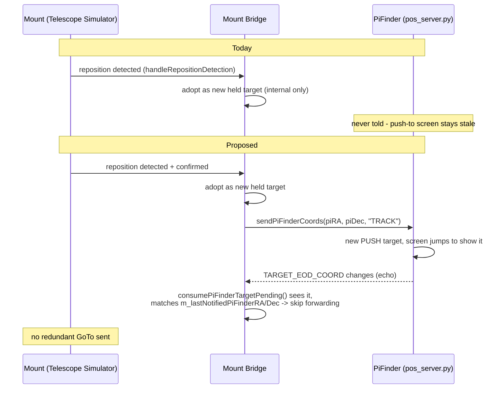

# Concept: Mount Bridge notifies PiFinder of a confirmed external mount reposition

> **Status: concept — not yet implemented.** Written via this project's `cpt` (concept)
> convention — see `basic-memory/basic-memory/00020_bm-cpt-command-system.md` and
> `00021_bm-documentation-depth-standard.md` for the standard this document follows. Tracked as
> [GitHub issue #300](https://github.com/apos/PiFinder_Stellarmate/issues/300) on
> [Project #15](https://github.com/users/apos/projects/15) — update that issue if this concept is
> promoted, revised, or dropped.
>
> **Related, not overlapping**: [`mount_bridge_reposition_detection.md`](mount_bridge_reposition_detection.md)
> (already implemented — `handleRepositionDetection()`) is what this concept builds on: it decides
> *whether* an external mount move is genuine and confirms it. This concept only adds *telling
> PiFinder about it* once that decision is already made. Also **not** the same primitive as
> [`pifinder_mount_model_cloud_tracking.md`](pifinder_mount_model_cloud_tracking.md)'s proposed
> **Align** command, despite the naming coincidence with the existing "Align to Held Target" button
> — that document is about the *mount* teaching *PiFinder's own position belief* (opposite data
> direction, a verified-position primitive that doesn't exist yet). This concept reuses the
> already-built, already-working **push-to** primitive (`sendPiFinderCoords()` /
> `pos_server.py`'s LX200 `:Sr`/`:Sd` handling) to tell PiFinder *what to point at*, exactly what an
> external LX200 client (SkySafari, KStars) already does today. No new PiFinder-side mechanism
> needed for the core feature.

## 1. Basic Functionality

Today, an operator can point the mount two ways while Mount Bridge is running: through PiFinder
(push-to → Mount Bridge forwards a GoTo, "Goto-Forward" mode) or directly on the mount (hand
paddle, SkySafari, the OnStep app, KStars talking straight to the mount driver). Both are already
detected and handled *on the mount side* — `handleRepositionDetection()` tells a genuine external
mount move apart from the Bridge's own commanded motion, waits for it to settle, confirms it with a
fresh PiFinder solve, and adopts it as the new held target.

What's missing: PiFinder itself is never told. Its own on-device push-to screen keeps showing
whatever was last pushed to *it* directly — which can be an unrelated, stale target from earlier in
the session — even though the mount (and Mount Bridge's own internal state) has since moved
somewhere completely different. Found live (2026-09-06/07, stellarmate-utm): a GoTo issued directly
on "Telescope Simulator" in KStars left PiFinder's PUSH screen showing a large offset (`-48.7`/
`+10.6`) against a target from an unrelated earlier test, even though PiFinder's own solved position
had already converged correctly to the new target the mount was actually at.

This concept closes that gap: whenever Mount Bridge adopts a confirmed external reposition as the
new held target, it also pushes those same coordinates to PiFinder via the existing push-to
mechanism — the same one the manual "Align to Held Target" button already uses — so PiFinder's own
display stays truthful without a manual step.

## 2. Use Cases

- **UC1 (the reported case)**: Operator issues a GoTo directly on the mount (KStars → Telescope
  Simulator, or a real mount's own hand controller) while Goto-Forward is active. Mount Bridge
  detects the move, waits for settle, confirms via a fresh PiFinder solve, adopts it as the new held
  target (existing behavior) — **and now also** pushes it to PiFinder, so PiFinder's screen jumps to
  show the new target, exactly as if the operator had push-to'd it from PiFinder directly. This is
  the expected, desired PiFinder behavior for any push-to, confirmed by the project owner — not
  something to suppress.
- **UC2 (large reposition, human-confirmed)**: Same as UC1, but the move was large enough to need
  explicit "Yes, this was intentional" confirmation (`RepositionConfirmSP`) before being adopted —
  once confirmed, same push to PiFinder.
- **UC3 (no held target since restart)**: Mount Bridge restarts with no held target recorded yet; on
  the first confirmed position it falls back to PiFinder's own current position as the "best
  available baseline". Lower-value case (PiFinder is already there), included for consistency.
- **UC4 (the loop-back, must NOT cause a second mount GoTo)**: Immediately after UC1-3 push the new
  target to PiFinder, PiFinder's own `TARGET_EOD_COORD` changes as a direct result — which is
  exactly the signal `consumePiFinderTargetPending()` normally treats as "a human just pushed-to a
  new target, forward it to the mount." Left unhandled, every automatic notification would trigger a
  pointless echo GoTo back to the mount it is already at. Must be recognized and skipped.

## 3. Architecture

### 3.1 Data flow (today vs. proposed)

### 3.2 The echo-suppression guard (UC4)

Store the coordinates at the moment they're pushed to PiFinder (`m_lastNotifiedPiFinderRA/Dec`,
mirroring the existing `m_lastForwardedRA/Dec` pattern already used for the opposite direction). When
`consumePiFinderTargetPending()`'s next-tick check fires in `handleGotoForward()`/
`handleAutoCorrectGoto()`, compare the newly-pending PiFinder target against that stored value
(within a small tolerance, e.g. the existing `DriftThresholdN`-scale comparison already used
elsewhere in this file — not a new constant). A match means "this is our own echo, not a genuine new
push-to from a human or another client" — skip forwarding a GoTo, clear the stored value so it only
suppresses the one expected echo, not any subsequent genuinely new push-to that happens to land on
the same coordinates.

This is a small, self-contained addition to the same file, using the same
"track what we last sent, recognize it coming back" pattern this codebase already applies elsewhere
(`m_lastForwardedRA/Dec` for the Bridge→mount direction). No new INDI property, no new concept beyond
what's already established.

### 3.3 The screen jump (PiFinder side) is *intended*, not a defect

Confirmed with the project owner (2026-09-07): `pos_server.py`'s push-to handling unconditionally
calls `menu_manager.jump_to_label("recent")` (`main.py:923-924`, `menu_manager.py:228-244`, no
guard, no dedup by value) — this is exactly how PiFinder is supposed to behave for a push-to, showing
the operator where the "journey" (goto) goes. This concept relies on that existing behavior rather
than adding a quieter path — building a silent update channel was considered and explicitly rejected
as unnecessary scope for this concept (see §7).

## 4. Building Blocks Reused (not built new)

| Block | Already exists at | Role here |
|---|---|---|
| `handleRepositionDetection()` | `pifinder_mount_bridge.cpp:952-1176` | Decides *whether/when* a reposition is genuine and confirmed — unchanged by this concept |
| `PiFinderBridgeClient::sendPiFinderCoords()` | `pifinder_bridge_client.cpp:355` | The actual push — already built, already used by the manual "Align to Held Target" button |
| `consumePiFinderTargetPending()` | `pifinder_bridge_client.cpp` (per earlier investigation) | Edge-triggered "PiFinder target changed" signal — gains one new comparison (§3.2), not a new mechanism |
| `m_lastForwardedRA/Dec`-style dedup pattern | `pifinder_mount_bridge.cpp` (multiple existing uses) | Precedent this concept's `m_lastNotifiedPiFinderRA/Dec` directly mirrors |

## 5. Technical Reference — call sites to add

| Site | File:line | Context |
|---|---|---|
| UC1 | `pifinder_mount_bridge.cpp:1090` (after `setOriginalTarget(piRA, piDec)`) | Main quiet auto-adopt, moderate external reposition |
| UC2 | `pifinder_mount_bridge.cpp:2790` (after `setOriginalTarget(piRA, piDec)`) | Human-confirmed large reposition (`RepositionConfirmSP`) |
| UC3 | `pifinder_mount_bridge.cpp:1004` (after `setOriginalTarget(piRA, piDec)`) | No-held-target-since-restart fallback |
| UC4 guard | Wherever `consumePiFinderTargetPending()`'s result is currently acted on unconditionally (`handleGotoForward()`'s `HOLDING`/`IDLE` cases, `handleAutoCorrectGoto()`) | Add the match-and-skip check from §3.2 |

Scope: fires only where `handleRepositionDetection()` already runs today — `MODE_GOTO_FORWARD`, and
`MODE_AUTO_CORRECT` with the Goto action selected (`repositionDetectionApplies`,
`pifinder_mount_bridge.cpp:1320-1322`). No new coupling-mode gating needed.

## 6. Design Principles Applied

- **Reuse over invention** (matches this project's established pattern, e.g. `coordinate_pipeline_reference.md`'s epoch/unit conventions reused everywhere rather than re-derived): the push primitive, the dedup pattern, and the settle/confirm logic are all already-built, already-trusted mechanisms — this concept composes them, it does not add a new one.
- **Deterministic correctness over defensive patching** (per this session's established standard): the echo guard is an exact, attributable match against a value the Bridge itself just set — not a heuristic or a time-based debounce that could suppress a genuine new push-to by coincidence.
- **No silent behavior changes to PiFinder's own UI contract** (§3.3): the screen jump is accepted as-is, matching how every other push-to source already behaves — this concept does not special-case Mount-Bridge-originated pushes to look or behave differently on PiFinder's screen.

## 7. Open Questions / Explicitly Out of Scope

- **A quieter, non-screen-jumping PiFinder update channel**: investigated and explicitly rejected for this concept (§3.3) — confirmed as unwanted scope creep by the project owner. If ever needed for an unrelated reason, `UIState.add_recent()` (`state.py:75-76`) exists as a screen-jump-free foundation, but wiring it up would be new PiFinder-side feature work, not touched here.
- **Value-based dedup on PiFinder's own push-to handling** (`pos_server.py`'s `handle_goto_command()` currently rebuilds/resets on every call, even identical resends, per the investigation in this same session) — out of scope; this concept's UC4 guard prevents the *redundant call* from Mount Bridge's side, not PiFinder's own handling of a call it does receive.
- **UC3's value**: PiFinder is already at the position being pushed in that fallback case, so the practical benefit is small (mostly consistency) — kept in scope for completeness, could be dropped without weakening UC1/UC2 if effort needs trimming.

## 8. Test Strategy

- **Automated**: none currently planned — this is INDI-driver-level behavior against live mount/PiFinder state, consistent with how `handleRepositionDetection()` itself was verified (live testing, not unit tests, per its own concept doc and this project's existing test-tooling limits).
- **Manual, live** (mirrors the exact repro that surfaced this gap):
  1. Goto-Forward active, PiFinder and mount already agreeing on some target A.
  2. Issue a GoTo directly on the mount (KStars → Telescope Simulator, bypassing PiFinder) to target B.
  3. Confirm: mount settles at B, PiFinder's own solved position converges to B (existing behavior, unaffected).
  4. **New assertion**: PiFinder's own PUSH screen updates to show B with ~0 offset, without touching the manual "Align to Held Target" button.
  5. **New assertion**: no spurious second GoTo is sent to the mount as a result (watch `LOGF_INFO`/`LOGF_WARN` — should show exactly one adoption log line and one push-to log line, no "forwarded Goto to mount" line triggered by the echo).

## 9. Effort / Priority

- **Effort**: S (small) — three call sites reusing an existing function, one dedup guard following an existing pattern in the same file. No new INDI properties, no PiFinder-side changes, no GUI changes (this is on-device PiFinder screen behavior, not the Control Center web GUI).
- **Priority**: P2 — a real correctness/consistency gap (stale push-to display), not a safety issue (Mount Bridge's own internal state was already correct; only PiFinder's own display was stale) and not currently blocking any other open work.

## 10. Strategic Roadmap

1. **Implement the three push call sites (§5, UC1-3)** — no dependencies, can land first and be tested in isolation using the manual "Align to Held Target" button's existing, already-verified code path as a reference for correctness.
2. **Implement the UC4 echo guard (§3.2)** — depends on (1) existing (nothing to suppress an echo of otherwise); should land in the same change, not deferred, since (1) without this is the known-bad "spurious bounce-back GoTo" behavior this concept exists to avoid.
3. **Live-verify per §8** — depends on (1)+(2) both being present.

No dependency on `pifinder_mount_model_cloud_tracking.md`'s Align primitive (confirmed independent
in the header note) — that concept can proceed or stay parked on its own separate timeline.
