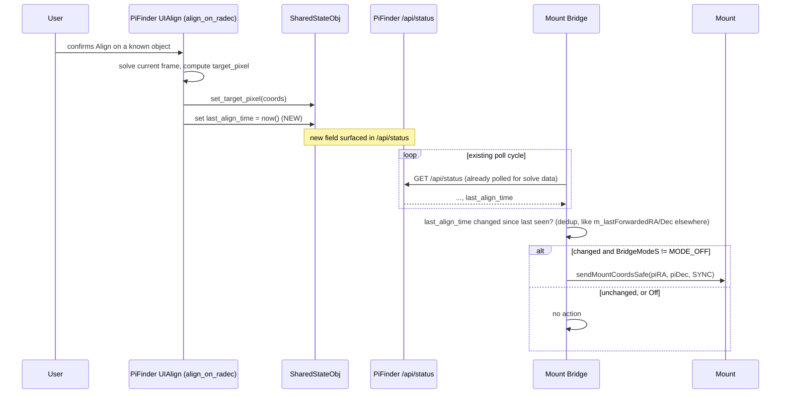

# Concept: Sync mount on a confirmed PiFinder Align, regardless of Coupling mode

> **Status: implemented (branch `feature/313-sync-on-pifinder-align`), pending live verification on
> `stellarmate-pi5`.** Written via this project's `cpt` (concept) convention — see
> `basic-memory/basic-memory/00020_bm-cpt-command-system.md` and `00021_bm-documentation-depth-standard.md`.
> Tracked as [GitHub issue #313](https://github.com/apos/PiFinder_Stellarmate/issues/313) on
> [Project #15](https://github.com/users/apos/projects/15). The two §5 open questions were resolved
> with the project owner on 2026-09-08 (see §5); §9 records what implementation itself turned up.
>
> **Naming coincidence, not the same feature**: [`pifinder_mount_model_cloud_tracking.md`](pifinder_mount_model_cloud_tracking.md)
> §4 also mentions an "Align" (an *LX200 protocol* `:Cx#`-style command an external client could
> send *to* PiFinder, teaching PiFinder's own mount model). This concept is about PiFinder's
> existing **on-device UI screen** "Align" (`ui/align.py`'s `UIAlign`/`align_on_radec()`) — a
> finder-to-scope optical calibration the *user* triggers from PiFinder's own menu, opposite
> direction of data flow, unrelated mechanism. No dependency either way.

## 1. Overview

PiFinder's on-device "Align" menu screen recalibrates `target_pixel` - the pixel offset between
PiFinder's own camera/optical axis and the telescope's true optical axis (`ui/align.py`,
`align_on_radec()`, `SharedStateObj.set_target_pixel()`). The user manually centers a known
catalog object in the telescope's own eyepiece/view, then tells PiFinder "you are looking at
exactly this RA/Dec right now" - PiFinder solves its own current frame and computes the pixel
offset needed to make its own optical axis agree with the scope's.

This is a **deliberate, high-confidence, user-triggered confirmation event**: after a successful
Align, PiFinder's own solved position accurately reflects where the telescope is truly pointed.
Critically, **the telescope has not moved** during this - only PiFinder's own calibration (and,
downstream, its live solve accuracy) improved. The natural, obviously-correct consequence for the
mount is a plain **Sync** (correct the mount's own internal coordinate belief to match this
newly-confirmed truth) - never a GoTo/slew, since the mount is already physically where it needs
to be.

**Live-found gap** (2026-09-07, real observing session, `stellarmate-pi5`): user performed a
PiFinder Align via the on-device menu. PiFinder and the telescope's actual pointing agreed
correctly afterward - but the mount's own position readout (visible in KStars/SkySafari) stayed
wrong ("daneben") until the user manually clicked "Sync mount from PiFinder" in the Control
Center. Root cause: the active Coupling mode at the time was "GoTo" (`MODE_GOTO_FORWARD`), which
only reacts to target/push-to changes (see
[`mount_bridge_reposition_detection.md`](mount_bridge_reposition_detection.md)) - a plain Align
changes no target, so Goto-Forward had nothing to react to. Under "Auto-correct (Sync)" mode the
mount likely would have self-corrected (that mode reacts to any drift over threshold) - but
requiring the user to have pre-selected the "right" Coupling mode before doing an Align is the
actual bug: **a Sync-worthy event happened, and nothing coupling-mode-specific should have gated
it.**

Root design insight from the live discussion that produced this concept: a plain Sync never
conflicts with what any Coupling mode does with the *held target* - it only corrects the mount's
own self-knowledge of where it currently is, which every mode's own drift/reposition math
(`piRA/piDec` vs `mountRA/mountDec`) implicitly assumes is accurate in the first place. A stale
mount self-belief silently corrupts that math regardless of mode. This makes "sync on confirmed
Align" a cross-cutting concern, not a Coupling-mode-specific behavior - it belongs *above*/*outside*
the mode dispatch, not as a fifth mode or a mode-specific option.

## 2. Use Cases

| # | Trigger | Today's behavior | Wanted behavior |
|---|---|---|---|
| UC1 | User performs PiFinder Align (on-device menu) while Coupling is "GoTo" or "Verify/Alert only" | No mount reaction at all - user must manually "Sync mount from PiFinder" | Mount Bridge issues a plain Sync automatically, no user action needed |
| UC2 | Same, while Coupling is "Auto-correct (Sync)" | Already works today, but only *incidentally* (reacts to any drift over threshold, not specifically to the Align event) - could take up to a full poll cycle | Same effective outcome, but explicit/immediate rather than incidental |
| UC3 | Coupling is "Off" (explicitly decoupled) | No mount reaction (correct - decoupled means untouched) | **Unchanged** - Off must stay untouched, matching every other mode's own respect for that state (open question, see §7, on whether Verify/Alert should behave like Off here too) |
| UC4 | PiFinder Align fails/times out (`align_on_radec()` returns `False`) | N/A | No sync signal should fire - only a *successful* Align (a real, confirmed `target_pixel` change) counts |

## 3. Architecture

### 3.1 The missing link: PiFinder doesn't expose "an Align just happened" at all

`target_pixel` is pure internal `SharedStateObj` state (`state.py`), set via
`set_target_pixel()` inside `align_on_radec()` on success. It is **not** currently present in
`/api/status` or any other PiFinder web API surface - confirmed live by inspecting
`state.py`/`web/server.py`. There is no timestamp of "when did this last change" anywhere either.
This is the first thing that needs to exist before Mount Bridge can react to anything.

### 3.2 Data flow (proposed)

### 3.3 PiFinder-side addition (new, via `diffs/*.diff` - never a direct `~/PiFinder` commit)

- Add a `last_align_time` (or similarly named) monotonic/UTC timestamp field to `SharedStateObj`
  (`state.py`), set inside `align_on_radec()` immediately after a successful
  `shared_state.set_target_pixel(target_pixel)` call - mirroring how `target_pixel` itself is
  already stored there.
- Surface it in `/api/status`'s response (wherever that's assembled - needs a fresh look at the
  current upstream source at implementation time, likely `web/server.py` or `main.py`'s status
  aggregation, whichever now owns it after upstream changes since this doc was written).
- This is genuinely new PiFinder-side surface, not just wiring existing data - review size
  accordingly at implementation time (small field addition, but touches upstream files that need
  their own diffs regenerated, per this project's established
  `bin/patch_PiFinder_installation_files.sh` mechanism).

### 3.4 Mount Bridge-side addition

- Poll the new field alongside the routine solve read (wherever PiFinder's `/api/status` is
  already fetched - `httpGetPiFinderFreshCamPosition()`/`getPiFinderTargetRADE()`-adjacent code,
  needs the exact current call site confirmed at implementation time).
- Dedup via a stored last-seen value (`m_lastNotifiedAlignTime`-style, mirroring the
  `m_lastForwardedRA/Dec` / `m_lastNotifiedPiFinderRA/Dec` pattern already established in this
  file for exactly this "track what we last reacted to" shape - see
  [`mount_bridge_reposition_notifies_pifinder.md`](mount_bridge_reposition_notifies_pifinder.md)
  §3.2 for the precedent this should directly copy).
- On a genuine change: `sendMountCoordsSafe(piRA, piDec, "SYNC")` - the single existing collection
  point for outgoing mount coordinate writes with horizon safety (see
  `coordinate_pipeline_reference.md`) - **not** a raw/bypassing write.
- Gate: skip when `BridgeModeS[MODE_OFF]` is on (decoupled). Whether `MODE_VERIFY_ALERT` should
  also be excluded is an open question (§7) - implement the Off-only gate first, verify the
  Verify/Alert question with the project owner before broadening.

## 4. Building Blocks Reused (not built new)

| Block | Already exists at | Role here |
|---|---|---|
| `sendMountCoordsSafe()` | Mount Bridge, single outgoing-coordinate collection point | The actual Sync write - horizon safety comes for free |
| `m_lastForwardedRA/Dec`-style dedup pattern | `pifinder_mount_bridge.cpp` (multiple existing uses, most recently `mount_bridge_reposition_notifies_pifinder.md`'s `m_lastNotifiedPiFinderRA/Dec`) | Precedent this concept's `m_lastNotifiedAlignTime` directly mirrors |
| Existing PiFinder `/api/status` poll | wherever Mount Bridge already reads PiFinder's live solve | Carries the new field piggy-backed, no new poll loop needed |
| `diffs/*.diff` + `bin/patch_PiFinder_installation_files.sh` | established project mechanism | How the PiFinder-side field addition gets applied/reapplied, never a direct upstream commit |

## 5. Open Questions — resolved 2026-09-08

- **Should `MODE_VERIFY_ALERT` be excluded too, alongside `MODE_OFF`?** → **No — Verify/Alert
  syncs on an Align.** Only `MODE_OFF` (explicitly decoupled) is excluded. Rationale from the
  owner discussion: the trigger is a deliberate user calibration, not automation reacting to poll
  noise, and a Sync corrects exactly the mount self-knowledge Verify/Alert's own drift alerts
  depend on being accurate. It is surfaced as a visible `INFO` log line there ("Verify/Alert
  normally never writes the mount; a deliberate Align is the one exception"), matching that mode's
  "tell me, don't act silently" character.
- **Unconditional sync, or only above some minimum drift?** → **Unconditional.** No threshold. A
  successful Align is rare and deliberate; at ~0 drift the Sync is a harmless no-op write, and a
  threshold would add a constant and config surface nobody asked for. Matches the manual "Sync
  mount from PiFinder" button, which also syncs unconditionally.
- **Where exactly does `/api/status` get assembled upstream today?** → `api_extensions.py`,
  `@app.route("/api/status")` (the `data` dict at ~line 200, alongside `debug_solve` /
  `fake_solve_active`). Confirmed against the live 2.6.3 source.
- **Failure/timeout handling** → confirmed: `httpGetPiFinderAlignEvent()` returns false (acts on
  nothing) on any HTTP/parse failure or a null/absent field, same fail-closed shape as the other
  `httpGetPiFinder*` readers. A brief post-restart gap just means "retry next tick".

## 6. Test Strategy

- **Manual, live** (mirrors the exact repro that surfaced this gap):
  1. Coupling set to "GoTo" (not Auto-correct) - the mode that today does nothing on an Align.
  2. Deliberately introduce some small mount self-belief drift (e.g. a prior manual nudge or
     accumulated tracking error).
  3. Perform a PiFinder Align via the on-device menu on a known object, confirm success.
  4. **New assertion**: mount's own coordinate readout (KStars/SkySafari) updates to match
     PiFinder's newly-confirmed position within one poll cycle, with **no slew** (verify via the
     mount's own `_STATE` staying `Ok`, never `Busy`) - a Sync, not a GoTo.
  5. Repeat with Coupling "Off" - **must not** react at all.
  6. Repeat with Coupling "Verify/Alert only" - outcome depends on §7's open question; document
     whichever behavior is decided as the explicit expected result before calling this done.

## 7. Effort / Priority

- **Effort**: M - touches two codebases (a genuinely new PiFinder-side `/api/status` field via the
  diffs mechanism, plus Mount Bridge C++ changes: new poll read, dedup state, one new call site).
  Larger than a typical single-file INDI driver fix because of the PiFinder-side piece.
- **Priority**: real, live-observed usability gap during actual observing (not a safety issue - a
  manual "Sync mount from PiFinder" workaround already exists and was used successfully) -
  reasonable to pick up in a future session once the open questions in §7 have owner input.

## 8. Strategic Roadmap

1. ~~Resolve the §5 open questions with the project owner.~~ Done 2026-09-08.
2. ~~PiFinder-side: `last_align_time` (+ `_ra` / `_dec`) on `SharedStateObj` + `/api/status`.~~
   Done — `diffs/state_py.diff`, `diffs/api_extensions_py.diff`, `diffs/align_py.diff` (new),
   `diffs/test_last_align_stamp_py.diff` (new, regression test).
3. ~~Mount Bridge-side: poll read, dedup, `sendMountCoordsSafe()` call site.~~ Done —
   `handlePiFinderAlignSync()` / `httpGetPiFinderAlignEvent()`.
4. **Live-verify on `stellarmate-pi5`** per §6 — the outstanding step. On x86 UTM the Mount
   Bridge side can be exercised in isolation with `test_tools/align_sync_test.py` (mocks
   `/api/status`, watches the linked mount over INDI); the PiFinder side is covered by the
   `pytest` in step 2 and needs a real on-device Align to verify end to end.

## 9. Implementation notes (what building it turned up)

- **Only one stamp site, not "both".** An earlier plan was to stamp every `set_target_pixel()`
  writer. Reading the code, there are three: `align_on_radec()` (real plate-solve calibration —
  the one that matters), `UIAlign.key_number(1)` ("reset reticle to center" — a *blind* reset with
  no sky solve), and `align_daytime.py::_save_alignment()` (manual daylight calibration, no RA/Dec
  at all). Syncing the mount off either of the latter two would push PiFinder's *uncorrected*
  guess (or a daytime terrestrial pointing) to the mount. So the stamp lives inside
  `align_on_radec()` only — which also means both real entry points (the Align screen's
  `key_square()` and `object_details.py`'s "align on this object") are covered for free, since
  both call it.
- **Sync to the asserted target, not the post-align solve.** The Mount Bridge syncs to
  `last_align_ra`/`last_align_dec` (the catalog coords the user centred), not to PiFinder's
  subsequent `/api/status` solved position. No dependence on a fresh solve still being available a
  poll-cycle later (a cloud right after the Align), no sidereal drift across the gap.
- **Unit + epoch.** `/api/status` reports the align RA/Dec in **degrees, J2000** (same as
  `solution.RA/Dec`). `httpGetPiFinderAlignEvent()` converts to **hours, JNow** at the source —
  `/15` then `INDI::J2000toObserved()` — exactly mirroring `httpGetPiFinderFreshCamPosition()`
  (whose own comments record the runaway-slew and perpetual-drift bugs that skipping either
  conversion caused).
- **Deferral, not just dedup.** Beyond the `m_lastAlignSyncTime` timestamp dedup (first sighting
  adopted silently so a pre-existing Align doesn't fire on every reconnect), the Sync is deferred
  while the mount is slewing (`isMountSlewing()` — a SYNC mid-slew is unsafe on many mounts, and
  an in-flight GoTo establishes position anyway) or while the bridge's own Multi-Point Alignment
  run is active (`m_alignState`). Both bounded by `ALIGN_SYNC_RETRY_MAX_SEC` (45 s) → give up with
  a warning rather than retry forever.
