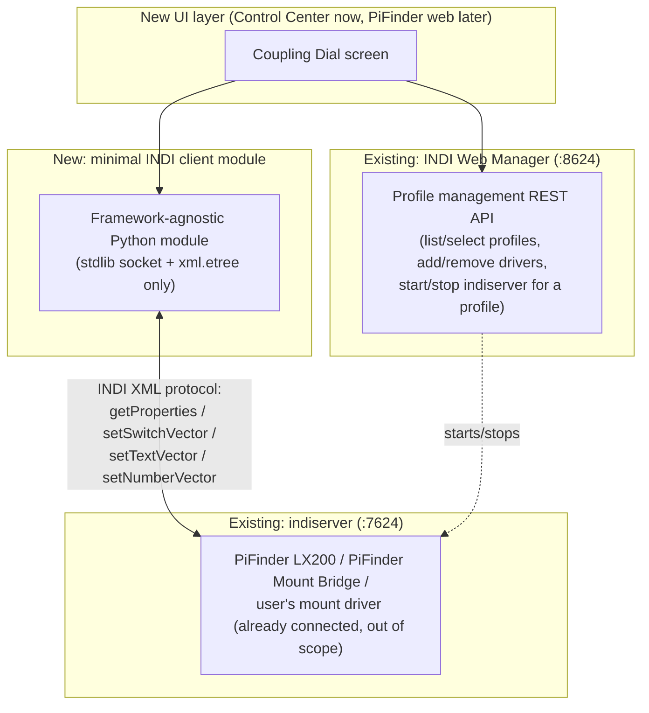

# Concept: Mount Bridge Web Integration (Coupling Dial Without the INDI Control Panel)

> **Status: concept — not yet implemented.** Written via this project's `cpt` (concept)
> convention — see `basic-memory/basic-memory/00020_bm-cpt-command-system.md` and
> `00021_bm-documentation-depth-standard.md` for the standard this document follows. Tracked as a
> GitHub issue with the `concept` label on [Project #15](https://github.com/users/apos/projects/15)
> — update that issue if this concept is promoted, revised, or dropped.

## 1. Overview

Today, coupling PiFinder to a real mount via the PiFinder Mount Bridge requires driving two
separate tools by hand: the INDI Web Manager (create an Equipment Profile, add the right drivers,
start it) and the raw INDI Control Panel (connect each device, set Active Devices, pick a Coupling
mode) — see [Readme_PiFinder_LX200.md, Steps 2–3](../../Readme_PiFinder_LX200.md#step-2-create-an-equipment-profile-in-the-web-manager)
for the current manual walkthrough. Both require INDI-specific knowledge (property names, device
tabs, TCP connection details) that has nothing to do with PiFinder itself.

**Goal**: fold the parts of that workflow that are always the same for any PiFinder+mount setup
into a single, purpose-built web UI — reachable one click at a time, using PiFinder's own
terminology ("Verify/Alert only", "Auto-correct on drift", "Goto-Forward") instead of raw INDI
property names. The INDI Control Panel stays fully available and untouched for anything advanced;
it just stops being *required* for the common path.

**Explicit non-goal**: connecting the user's own real mount driver. Every mount driver has
different connection parameters (serial port, baud rate, TCP host/port, mount-specific quirks) —
generalizing that is a much bigger, lower-value problem than this concept solves, and INDI drivers
already persist their own connection config (`IUSaveConfig`) once set up once through any INDI
client. **The user remains responsible for connecting their own mount** (via the Control Panel, once,
same as today) — this concept assumes that's already done and its config already saved.

## 2. Use Cases

Refined from the original requirements discussion; UC1–UC7 are in scope, UC8 is explicitly excluded.

| # | Use case | Scope |
|---|---|---|
| UC1 | Prerequisite: an Equipment Profile already exists (created once via Web Manager, out of scope to build) | Assumed, not built |
| UC2 | Start/stop the **selected profile** (i.e. the `indiserver` instance for it) and show its live state: which profile is active, which drivers are currently loaded | In scope |
| UC3 | Select an existing profile from a list (read-only selection — no profile creation/rename/general editing) | In scope |
| UC4 | Add or remove **only** PiFinder LX200 and/or PiFinder Mount Bridge to/from the selected profile — no other driver-list editing | In scope |
| UC5 | List the profile's other loaded drivers (excluding the two above) and let the user pick which one is "the mount" for Active Devices — queried live, not hardcoded | In scope |
| UC6 | One-click presets for the three Coupling modes (Verify/Alert only, Auto-correct on drift, Goto-Forward), each setting every INDI property that mode actually needs (see §4) | In scope |
| UC7 | Detect whether a mount driver is present/selected at all, and disable Auto-Correct/Goto-Forward presets (which need one) if not — Verify/Alert-only still needs a mount too (drift is PiFinder-vs-mount), so effectively all three presets require UC5 to be satisfied first | In scope |
| UC8 | Configuring the *user's own mount driver's* connection parameters (serial/TCP/baud) | **Out of scope** — see non-goal above |

## 3. Architecture

Three existing systems this integrates, plus one new component:

**Why a hand-rolled INDI client instead of `PyIndi`** (INDI's official Python bindings): `PyIndi` is
a compiled SWIG C++ binding — packaging it has historically been a pain point on non-Debian
targets, and `gui_installer/server.py` is deliberately **stdlib-only** today (see
[Readme_ControlCenter.md, Architecture](../../Readme_ControlCenter.md#architecture)) specifically
because it has to work with nothing but the bare system Python. Adding a compiled dependency here
would break that property, and would need re-verifying on every future target platform (Arch/SMOS
today, whatever PiFinder's own web interface's Python environment is if this gets ported there
later — see §7). A minimal, purpose-built client — only the handful of INDI XML messages this
feature actually needs, not a general-purpose library — keeps the same stdlib-only guarantee and
bounds the amount of protocol surface that needs to be gotten right (see §10 for the risk this
still carries).

**Web Manager's own REST API only covers profile management** (list profiles, which drivers a
profile has, start/stop the `indiserver` instance for a profile) — it does **not** expose reading
or writing a running driver's properties. That's exactly what the raw INDI Control Panel does, and
exactly the gap the new INDI client module fills. This is the one piece of new engineering this
concept actually requires; everything else (profile listing/selection/start-stop, driver
add/remove) is a thin wrapper around Web Manager's existing API.

## 4. Technical Reference

Verified directly against `indi_pifinder_bridge/pifinder_mount_bridge.cpp`/`.h` in this repo (not
guessed) on 2026-07-20:

| INDI property (device: `PiFinder Mount Bridge`) | Type | Elements | Purpose |
|---|---|---|---|
| `ACTIVE_DEVICES` | Text vector | `ACTIVE_PIFINDER` (default `"PiFinder LX200"`), `ACTIVE_MOUNT` (default empty) | UC5 writes `ACTIVE_MOUNT` to the device name the user picked |
| `BRIDGE_MODE` (label "Coupling") | Switch vector (one-of) | `MODE_OFF` (default ON), `MODE_VERIFY_ALERT`, `MODE_AUTO_CORRECT`, `MODE_GOTO_FORWARD` | UC6's three presets each set exactly one of these ON |
| `CORRECTION_ACTION` | Switch vector (one-of) | `ACTION_SYNC` (default ON), `ACTION_GOTO` | Only meaningful under `MODE_AUTO_CORRECT` — decides Sync vs. Goto/Track when drift exceeds threshold |
| `DRIFT_THRESHOLD` | Number vector | `THRESHOLD_ARCMIN` (default `5`, range 0.1–600) | Used by both `MODE_VERIFY_ALERT` (alert sensitivity) and `MODE_AUTO_CORRECT` (correction trigger) — **not** used by `MODE_GOTO_FORWARD` at all |
| `DRIFT_STATUS` (read-only) | Number vector | `DRIFT_ARCMIN` | Current live drift — worth surfacing in the UI status row, not just written to |
| `BRIDGE_SETTINGS` | Text vector | `INDISERVER_HOST` (default `localhost`), `INDISERVER_PORT` (default `7624`) | The Mount Bridge driver's own client connection back to `indiserver` — normally never needs touching |

Plus the INDI-core-standard `CONNECTION` switch vector (`CONNECT`/`DISCONNECT` elements) — present
on every INDI driver, including PiFinder LX200, Mount Bridge, and whatever the user's mount driver
is — this is what UC5/UC6's "connect" steps actually trigger, and is the one piece of the
"connect a device" workflow that generalizes cleanly across any driver, unlike its own
driver-specific connection *parameters* (§1's explicit non-goal).

**Which preset sets what** (derived directly from the driver's `TimerHit()` logic, not assumed):

| Preset | `BRIDGE_MODE` | `DRIFT_THRESHOLD` | `CORRECTION_ACTION` |
|---|---|---|---|
| Verify/Alert only | `MODE_VERIFY_ALERT` | set (sensible default, e.g. driver's own `5` arcmin) | not relevant |
| Auto-correct on drift | `MODE_AUTO_CORRECT` | set | set (default: `ACTION_SYNC`, matching the driver's own default) |
| Goto-Forward | `MODE_GOTO_FORWARD` | not relevant | not relevant |

**Web Manager REST endpoints needed** (profile list/select/drivers/start-stop) — the exact paths
need confirming against Web Manager's own live `/docs` (Swagger UI) before implementation; not
re-verified today, only the INDI-protocol side above was checked against this repo's actual driver
source.

## 5. Design Principles

Extends the existing Control Center, not a new app — every principle in
[Readme_ControlCenter.md, Design Principles](../../Readme_ControlCenter.md#design-principles)
carries over unchanged (dot-status rows, traffic-light semantics, verify-against-real-state, confirm
before destructive actions, context-aware labels). One new principle this feature adds:

- **One click = one named outcome, not one property.** Buttons are labeled "Verify/Alert only" /
  "Auto-correct on drift" / "Goto-Forward" — the same names already used in
  [Readme_PiFinder_LX200.md](../../Readme_PiFinder_LX200.md#the-mount-bridge-coupling-dial) and on
  the INDI Control Panel itself — never raw property/element names like `MODE_AUTO_CORRECT`.
- **Sensible defaults, not hidden values.** Advanced values (drift threshold, correction action)
  get the driver's own defaults pre-filled and are always visible/adjustable next to the preset
  buttons, never silently applied out of sight — matches the driver's own philosophy of persisting
  user-set values (`IUSaveConfig`) rather than resetting them.

## 6. Workflow

1. **Select a profile** (UC3) from a dropdown of existing profiles (Web Manager API) — read-only
   list, no create/edit here.
2. **Start/stop** the profile (UC2) — status row shows live state: running/stopped, which drivers
   are loaded.
3. **Add/remove PiFinder LX200 / PiFinder Mount Bridge** (UC4) — two independent toggles, scoped to
   only these two drivers.
4. Once the profile is running with both PiFinder drivers loaded: **pick the mount** (UC5) from a
   live-queried list of the profile's *other* drivers.
5. **Connect** PiFinder LX200, the Mount Bridge, and (if not already connected) the selected mount
   driver — generic `CONNECTION.CONNECT`, per device.
6. **One-click preset** (UC6): pick Verify/Alert only, Auto-correct on drift, or Goto-Forward.
   Auto-correct additionally shows the (pre-filled, editable) threshold and Sync/Goto choice right
   next to its button. Presets needing a mount are disabled (UC7) until step 4 has a mount selected
   and connected.
7. Live status row surfaces `DRIFT_STATUS` once coupled, so the user can see it's actually working
   without opening the Control Panel.

## 7. Portability Strategy (Control Center Now, PiFinder Web Interface Later)

Per explicit instruction: **build this in the Control Center first, but architected so the same
logic ports to PiFinder's own web interface later without rewriting it.**

Concretely: the INDI client module and all business logic (which properties to set for which
preset, how to enumerate "other" drivers, connection-state tracking) live in a single,
**framework-agnostic Python module** — no import of `http.server` (Control Center's framework) or
`bottle` (PiFinder's own web framework, per its `server.py`). Each web layer gets only a thin
adapter: Control Center's `Handler` class calls the module's functions and returns JSON, exactly
like its existing `_camera_hardware_present()`-style helpers already do; a future PiFinder-side
port would need only an equivalent thin `bottle` route layer calling the *same* module, unchanged.
UI markup/JS is **not** shared between the two — Control Center's `status_page.html` and PiFinder's
own templates are different enough that duplicating the (small) frontend per surface is more
practical than sharing it.

## 8. Installation / Dependencies

**No new system packages** — the stdlib-only INDI client (§3) is the whole point of this choice.
Depends on: Web Manager already running, a profile already existing with PiFinder LX200 (+ Mount
Bridge, + the user's own mount driver) already added and the mount driver's own connection already
configured once (§1's non-goal) — i.e., depends on Steps 1–2 of
[Readme_PiFinder_LX200.md](../../Readme_PiFinder_LX200.md) already being done at least once,
same as today.

## 9. Test Strategy

- The INDI client module is the one piece worth unit-testing in isolation (mock TCP responses,
  verify correct XML generated for each preset) — `gui_installer/` currently has **zero** automated
  test coverage (see [Readme_ControlCenter.md, Development & Testing](../../Readme_ControlCenter.md#development--testing));
  this feature is a reasonable first candidate to break that pattern, since it's more logic-heavy
  than the existing pure status/toggle endpoints.
- Live/manual verification: same approach already used for the Mount Bridge driver itself — against
  `indi_simulator_telescope` first (no real mount needed), then a real mount, per
  [Readme_PiFinder_LX200.md's own testing strategy](../../Readme_PiFinder_LX200.md#testing-strategy).

## 10. Known Risks / Open Questions

- **Hand-rolled INDI protocol parsing** needs to handle partial TCP reads and multiple devices'
  interleaved property updates correctly. Mitigation: keep the client deliberately narrow (only the
  properties in §4, not a general-purpose INDI client) to bound how much protocol surface needs to
  be right.
- **Distinguishing "which driver is a mount"** in UC5's dropdown: INDI doesn't generically expose a
  driver's device class through simple property introspection. Simplest, safest option for a first
  version: list every non-PiFinder device in the profile and trust the user to pick correctly,
  rather than trying to auto-detect "is this a telescope driver."
- **Web Manager REST paths** (§4) need live confirmation against `/docs` before coding — not done
  as part of this concept pass.

## 11. Effort & Priority

Per this project's [GitHub-Projects schema](../../Readme_ControlCenter.md) convention
(`basic-memory/basic-memory/00019_bm-github-project-schema-todo-format.md`): **Priority P2, Size
L** — substantial (a new protocol client plus a multi-step UI flow), but bounded by the explicit
non-goal (§1) keeping it well short of a general INDI client or profile editor.

## 12. Strategic Sequencing

Given the current state — INDI side (drivers, Web Manager) already fully working, Control Center
already has the hardware-checklist/Solve-Simulation-proxy pattern this naturally extends — a phased
build is lower-risk than one large change:

1. **Phase 1 — read-only status**: query profile drivers, running state, current `ACTIVE_DEVICES`
   and `BRIDGE_MODE`, no writes yet. Validates the INDI client module's read path cheaply before
   any control logic depends on it.
2. **Phase 2 — profile driver add/remove** (UC4): pure Web Manager REST calls, no raw INDI needed
   yet — independent of Phase 1's INDI client.
3. **Phase 3 — Active Devices + Connect** (UC5, part of UC6): first real INDI property *writes*.
4. **Phase 4 — the three one-click presets** (UC6/UC7 complete): builds directly on Phase 3.
5. **Phase 5 (stretch, separate decision)** — port the framework-agnostic module into PiFinder's own
   web interface (§7).

Each phase is a reasonable standalone GitHub issue/sub-issue under a parent "Mount Bridge Web
Integration" issue, consistent with this project's existing parent/sub-issue pattern (see
`basic-memory/pifinder-stellarmate/00041_pifinder-update-sh-veraltet-und-kaputt.md` for the
precedent).
