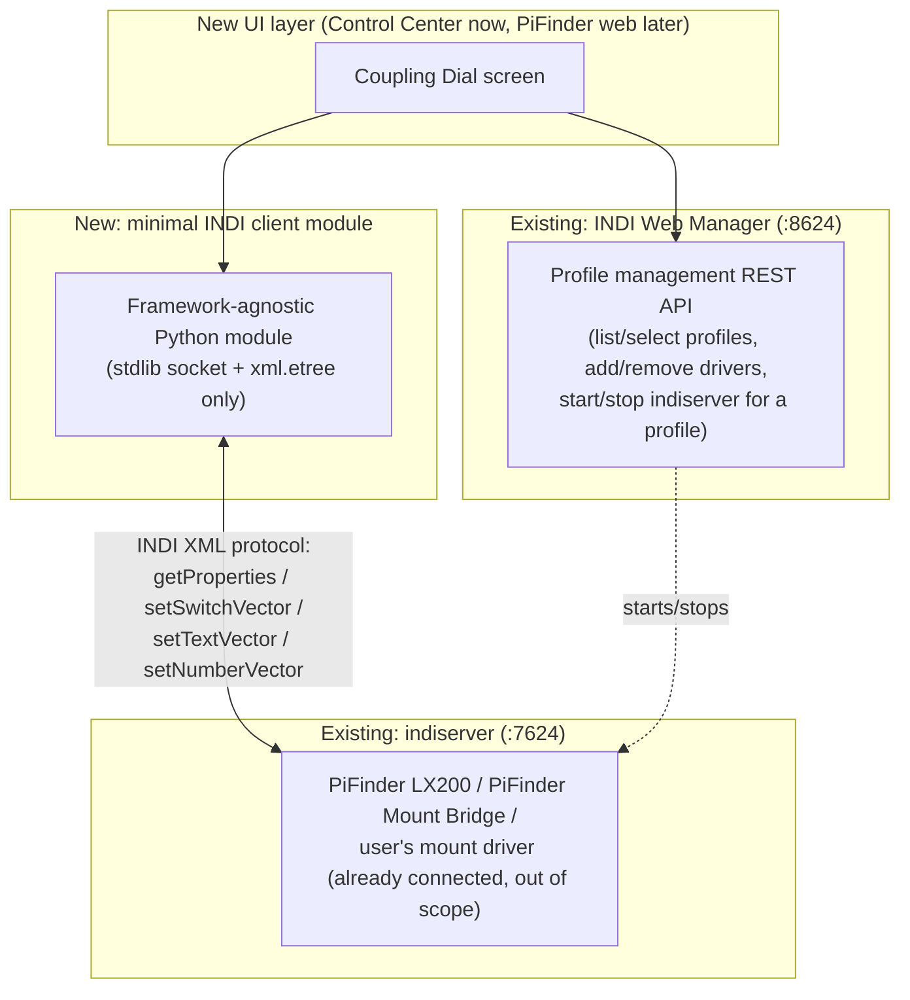

# Concept: Mount Bridge Web Integration (Coupling Dial Without the INDI Control Panel)

> **Status: concept — not yet implemented.** Written via this project's `cpt` (concept)
> convention — see `basic-memory/basic-memory/00020_bm-cpt-command-system.md` and
> `00021_bm-documentation-depth-standard.md` for the standard this document follows. Tracked as a
> GitHub issue with the `concept` label on [Project #15](https://github.com/users/apos/projects/15)
> — update that issue if this concept is promoted, revised, or dropped.

## 1. Overview

Today, coupling PiFinder to a real mount via the PiFinder Mount Bridge requires driving two
separate tools by hand: the INDI Web Manager (create an Equipment Profile, add the right drivers,
start it) and the raw INDI Control Panel (connect each device, set Active Devices, pick a Coupling
mode) — see [Readme_PiFinder_LX200.md, Steps 2–3](../../Readme_PiFinder_LX200.md#step-2-create-an-equipment-profile-in-the-web-manager)
for the current manual walkthrough. Both require INDI-specific knowledge (property names, device
tabs, TCP connection details) that has nothing to do with PiFinder itself.

**Goal**: fold the parts of that workflow that are always the same for any PiFinder+mount setup
into a single, purpose-built web UI — reachable one click at a time, using PiFinder's own
terminology ("Verify/Alert only", "Auto-correct on drift", "Goto-Forward") instead of raw INDI
property names. The INDI Control Panel stays fully available and untouched for anything advanced;
it just stops being *required* for the common path.

**Explicit non-goal**: connecting the user's own real mount driver. Every mount driver has
different connection parameters (serial port, baud rate, TCP host/port, mount-specific quirks) —
generalizing that is a much bigger, lower-value problem than this concept solves, and INDI drivers
already persist their own connection config (`IUSaveConfig`) once set up once through any INDI
client. **The user remains responsible for connecting their own mount** (via the Control Panel, once,
same as today) — this concept assumes that's already done and its config already saved.

## 2. Use Cases

Refined from the original requirements discussion; UC1–UC7 are in scope, UC8 is explicitly excluded.

| # | Use case | Scope |
|---|---|---|
| UC1 | Prerequisite: an Equipment Profile already exists (created once via Web Manager, out of scope to build) | Assumed, not built |
| UC2 | Start/stop the **selected profile** (i.e. the `indiserver` instance for it) and show its live state: which profile is active, which drivers are currently loaded | In scope |
| UC3 | Select an existing profile from a list (read-only selection — no profile creation/rename/general editing) | In scope |
| UC4 | Add or remove **only** PiFinder LX200 and/or PiFinder Mount Bridge to/from the selected profile — no other driver-list editing | In scope |
| UC5 | List the profile's other loaded drivers (excluding the two above) and let the user pick which one is "the mount" for Active Devices — queried live, not hardcoded | In scope |
| UC6 | One-click presets for the three Coupling modes (Verify/Alert only, Auto-correct on drift, Goto-Forward), each setting every INDI property that mode actually needs (see §4) | In scope |
| UC7 | Detect whether a mount driver is present/selected at all, and disable Auto-Correct/Goto-Forward presets (which need one) if not — Verify/Alert-only still needs a mount too (drift is PiFinder-vs-mount), so effectively all three presets require UC5 to be satisfied first | In scope |
| UC8 | Configuring the *user's own mount driver's* connection parameters (serial/TCP/baud) | **Out of scope** — see non-goal above |

## 3. Architecture

Three existing systems this integrates, plus one new component:

```mermaid
flowchart TB
    subgraph "New UI layer (Control Center now, PiFinder web later)"
        UI["Coupling Dial screen"]
    end
    subgraph "Existing: INDI Web Manager (:8624)"
        WM["Profile management REST API<br/>(list/select profiles, add/remove drivers,<br/>start/stop indiserver for a profile)"]
    end
    subgraph "New: minimal INDI client module"
        IC["Framework-agnostic Python module<br/>(stdlib socket + xml.etree only)"]
    end
    subgraph "Existing: indiserver (:7624)"
        IS["PiFinder LX200 / PiFinder Mount Bridge /<br/>user's mount driver (already connected, out of scope)"]
    end
    UI --> WM
    UI --> IC
    IC <-->|"INDI XML protocol:<br/>getProperties / setSwitchVector /<br/>setTextVector / setNumberVector"| IS
    WM -.starts/stops.-> IS
```

**Why a hand-rolled INDI client instead of `PyIndi`** (INDI's official Python bindings): `PyIndi` is
a compiled SWIG C++ binding — packaging it has historically been a pain point on non-Debian
targets, and `gui_installer/server.py` is deliberately **stdlib-only** today (see
[Readme_ControlCenter.md, Architecture](../../Readme_ControlCenter.md#architecture)) specifically
because it has to work with nothing but the bare system Python. Adding a compiled dependency here
would break that property, and would need re-verifying on every future target platform (Arch/SMOS
today, whatever PiFinder's own web interface's Python environment is if this gets ported there
later — see §7). A minimal, purpose-built client — only the handful of INDI XML messages this
feature actually needs, not a general-purpose library — keeps the same stdlib-only guarantee and
bounds the amount of protocol surface that needs to be gotten right (see §10 for the risk this
still carries).

**Web Manager's own REST API only covers profile management** (list profiles, which drivers a
profile has, start/stop the `indiserver` instance for a profile) — it does **not** expose reading
or writing a running driver's properties. That's exactly what the raw INDI Control Panel does, and
exactly the gap the new INDI client module fills. This is the one piece of new engineering this
concept actually requires; everything else (profile listing/selection/start-stop, driver
add/remove) is a thin wrapper around Web Manager's existing API.

## 4. Technical Reference

Verified directly against `indi_pifinder_bridge/pifinder_mount_bridge.cpp`/`.h` in this repo (not
guessed) on 2026-07-20:

| INDI property (device: `PiFinder Mount Bridge`) | Type | Elements | Purpose |
|---|---|---|---|
| `ACTIVE_DEVICES` | Text vector | `ACTIVE_PIFINDER` (default `"PiFinder LX200"`), `ACTIVE_MOUNT` (default empty) | UC5 writes `ACTIVE_MOUNT` to the device name the user picked |
| `BRIDGE_MODE` (label "Coupling") | Switch vector (one-of) | `MODE_OFF` (default ON), `MODE_VERIFY_ALERT`, `MODE_AUTO_CORRECT`, `MODE_GOTO_FORWARD` | UC6's three presets each set exactly one of these ON |
| `CORRECTION_ACTION` | Switch vector (one-of) | `ACTION_SYNC` (default ON), `ACTION_GOTO` | Only meaningful under `MODE_AUTO_CORRECT` — decides Sync vs. Goto/Track when drift exceeds threshold |
| `DRIFT_THRESHOLD` | Number vector | `THRESHOLD_ARCMIN` (default `5`, range 0.1–600) | Used by both `MODE_VERIFY_ALERT` (alert sensitivity) and `MODE_AUTO_CORRECT` (correction trigger) — **not** used by `MODE_GOTO_FORWARD` at all |
| `DRIFT_STATUS` (read-only) | Number vector | `DRIFT_ARCMIN` | Current live drift — worth surfacing in the UI status row, not just written to |
| `BRIDGE_SETTINGS` | Text vector | `INDISERVER_HOST` (default `localhost`), `INDISERVER_PORT` (default `7624`) | The Mount Bridge driver's own client connection back to `indiserver` — normally never needs touching |

Plus the INDI-core-standard `CONNECTION` switch vector (`CONNECT`/`DISCONNECT` elements) — present
on every INDI driver, including PiFinder LX200, Mount Bridge, and whatever the user's mount driver
is — this is what UC5/UC6's "connect" steps actually trigger, and is the one piece of the
"connect a device" workflow that generalizes cleanly across any driver, unlike its own
driver-specific connection *parameters* (§1's explicit non-goal).

**Which preset sets what** (derived directly from the driver's `TimerHit()` logic, not assumed):

| Preset | `BRIDGE_MODE` | `DRIFT_THRESHOLD` | `CORRECTION_ACTION` |
|---|---|---|---|
| Verify/Alert only | `MODE_VERIFY_ALERT` | set (sensible default, e.g. driver's own `5` arcmin) | not relevant |
| Auto-correct on drift | `MODE_AUTO_CORRECT` | set | set (default: `ACTION_SYNC`, matching the driver's own default) |
| Goto-Forward | `MODE_GOTO_FORWARD` | not relevant | not relevant |

**Web Manager REST endpoints** — verified live against the actual running Web Manager's own
OpenAPI schema (`/openapi.json`) on 2026-07-20, not guessed:

| Endpoint | Purpose |
|---|---|
| `GET /api/profiles/` | List profiles (UC3) |
| `GET /api/profiles/{name}/labels` | Which drivers a profile has |
| `POST /api/profiles/{name}/drivers` | Add drivers to a profile — body: `[{"label": "..."}]`. **Confirmed additive** (existing drivers stay) despite one earlier, non-reproducing test suggesting otherwise — retested twice, consistently additive, matching its own OpenAPI description. |
| `GET /api/server/status` | Whether a profile is currently running, and which one |
| `POST /api/server/start/{profile}` | Start `indiserver` for a profile (UC2) |
| `POST /api/server/stop` | Stop the running `indiserver` (UC2) |
| `GET /api/drivers` | Full driver catalog — confirmed `PiFinder LX200` (family `Telescopes`) and `PiFinder Mount Bridge` (family `Auxiliary`) are both registered correctly |

**Resolved for Phase 2 (driver *removal*, UC4's other half)**: `POST /api/profiles/{name}/drivers`
is a **full replace** of the profile's driver list, confirmed two ways — reading the open-source
reference this is based on (`github.com/knro/indiwebmanager`'s `Database.save_profile_drivers()`:
`DELETE FROM driver WHERE profile=?` then re-inserting exactly the given list), and a clean live
test (posting a list missing one previously-present stock driver correctly removed it). So in
principle, "add" and "remove" are the same read-modify-write operation against one endpoint — fetch
current labels, add/drop the one that matters, POST the full list back.

**However — a StellarMate-specific quirk, found and reproduced live, not present in the reference
implementation's logic**: once `PiFinder LX200` has been part of a profile, a later replace call
that excludes it does **not** actually remove it — reproduced 3 times from a guaranteed-clean
profile (delete + recreate immediately before each attempt), while removing a stock driver (e.g.
`Focuser Simulator`) the same way works correctly every time. Root cause unknown —
`stellarmatewebmanager` is a closed, PyArmor-obfuscated fork, not something this project can debug
by reading its source, and no further reverse-engineering was attempted. **Workaround implemented
and verified live**: removal never tries to update a profile in place — it deletes the whole
profile and recreates it (same name/port/autostart/autoconnect/driver_source, fetched first)
with the trimmed driver list from scratch. Heavier than the endpoint this was meant to use, but
reliable. See `gui_installer/webmanager_client.py`'s module docstring for the full writeup.

**Also confirmed live**: `BRIDGE_MODE`/`CORRECTION_ACTION`/`DRIFT_THRESHOLD`/`DRIFT_STATUS` are
only defined by the driver once it's actually connected (`updateProperties()` in
`pifinder_mount_bridge.cpp` only calls `defineProperty()` for these after `DefaultDevice::updateProperties()`,
which INDI only calls on connect) — confirmed both by reading the source and by querying a live,
disconnected instance, which correctly returned only `CONNECTION`/`DRIVER_INFO`/`DEBUG`/
`CONFIG_PROCESS`/`BRIDGE_SETTINGS`/`ACTIVE_DEVICES`, none of the coupling-related properties. This
means Phase 4 (setting `BRIDGE_MODE`) is *not just organizationally* dependent on Phase 3 (Connect)
— the properties it needs to write **do not exist at all** until the device is connected.

## 5. Design Principles

Extends the existing Control Center, not a new app — every principle in
[Readme_ControlCenter.md, Design Principles](../../Readme_ControlCenter.md#design-principles)
carries over unchanged (dot-status rows, traffic-light semantics, verify-against-real-state, confirm
before destructive actions, context-aware labels). One new principle this feature adds:

- **One click = one named outcome, not one property.** Buttons are labeled "Verify/Alert only" /
  "Auto-correct on drift" / "Goto-Forward" — the same names already used in
  [Readme_PiFinder_LX200.md](../../Readme_PiFinder_LX200.md#the-mount-bridge-coupling-dial) and on
  the INDI Control Panel itself — never raw property/element names like `MODE_AUTO_CORRECT`.
- **Sensible defaults, not hidden values.** Advanced values (drift threshold, correction action)
  get the driver's own defaults pre-filled and are always visible/adjustable next to the preset
  buttons, never silently applied out of sight — matches the driver's own philosophy of persisting
  user-set values (`IUSaveConfig`) rather than resetting them.

## 6. Workflow

1. **Select a profile** (UC3) from a dropdown of existing profiles (Web Manager API) — read-only
   list, no create/edit here.
2. **Start/stop** the profile (UC2) — status row shows live state: running/stopped, which drivers
   are loaded.
3. **Add/remove PiFinder LX200 / PiFinder Mount Bridge** (UC4) — two independent toggles, scoped to
   only these two drivers.
4. Once the profile is running with both PiFinder drivers loaded: **pick the mount** (UC5) from a
   live-queried list of the profile's *other* drivers.
5. **Connect** PiFinder LX200, the Mount Bridge, and (if not already connected) the selected mount
   driver — generic `CONNECTION.CONNECT`, per device.
6. **One-click preset** (UC6): pick Verify/Alert only, Auto-correct on drift, or Goto-Forward.
   Auto-correct additionally shows the (pre-filled, editable) threshold and Sync/Goto choice right
   next to its button. Presets needing a mount are disabled (UC7) until step 4 has a mount selected
   and connected.
7. Live status row surfaces `DRIFT_STATUS` once coupled, so the user can see it's actually working
   without opening the Control Panel.

### 6.1 UX refinement round (live user feedback, 2026-07-25)

After Phases 1–4 were all live and testable together, hands-on use surfaced four UX issues, all
addressed:

- **Own tile, not buried in the hardware checklist**: everything from the Mount Bridge status line
  down through the Coupling row moved out of `#hw-status` into a dedicated `#mount-bridge-tile`,
  full-width below the existing tile row.
- **Unambiguous button labels**: "Connect LX200" renamed to "Connect PiFinder LX200" - there are
  many INDI drivers with "LX200" in the name (e.g. "LX200 OnStep"), so the generic short form was
  genuinely ambiguous once a real mount driver is also visible in the same tile.
- **Short, plain-language tooltips**: the original tooltips explained *why* (phase numbers, doc
  references, INDI property names) - useful for `cpt`-style documentation, wrong for an end-user
  hover hint. Replaced with one short, plain sentence per row (e.g. "Choose how PiFinder and the
  mount stay in sync." instead of a paragraph about UC6/UC7 and INDI internals).
- **A connection diagram**: three small nodes (PiFinder → Bridge → Mount) with colored dots for
  each device's own live connection state, and an arrow between each pair that reflects what the
  Bridge is currently doing rather than a literal read/write distinction:
  - Off: grey dots, no arrow (`⋯`)
  - Verify/Alert only: blue `↔` both sides ("watching for drift, never moves the mount")
  - Auto-correct on drift: blue `↔` on the PiFinder side always; the mount-side arrow turns solid
    orage `→` specifically when `drift_arcmin` currently exceeds the threshold (i.e. a correction is
    actually happening right now), blue `↔` otherwise
  - Goto-Forward: solid green `→` both sides ("forwarding goto commands straight to the mount")

  A one-line caption under the diagram spells out the same state in plain language. This maps
  directly onto the driver's own documented behavior (see
  [Readme_PiFinder_LX200.md's Data flow diagrams](../../Readme_PiFinder_LX200.md#data-flow-auto-correct--verify-alert-drift-polling))
  rather than being a generic "connected/not connected" indicator - the goal was to actually show
  *what's influencing what*, per the original ask ("was mit was verbunden ist und was, was
  ansteuert").

Backend change needed for this: `mount_bridge_status()` now also queries the linked PiFinder/mount
devices' own `CONNECTION` state (two extra short, targeted `get_properties()` calls, only when
`active_pifinder`/`active_mount` are actually set) - previously it only reported Mount Bridge's own
properties.

### 6.2 Action log + parser crash fix (live user feedback, 2026-07-25)

Further live testing surfaced two more items in one round:

- **No visibility into what the tile was doing** ("schwierig, dem ganzen zu folgen"). Fixed with a
  small log panel (`#mb-log`) inside the tile: every user-triggered action (driver add/remove, link
  mount, connect, coupling preset) now writes an attempt + result line to a server-side buffer
  (`server.py`'s `_mb_lines`/`_mb_log()`, same pattern as the existing Hardware Test log), polled by
  the frontend (`GET /api/mount_bridge_log`) both on an interval and immediately after each action.
  `/api/mount_bridge_status`'s own poll also now logs a line whenever the reported `running` state
  *changes*, so a transient drop is visible even without the user having clicked anything.
- **Root cause of the reported "tile flips to not-loaded, then jumps back" bug**: while adding this
  logging, live testing turned up a real, reproducible crash in `indi_client.py`'s XML callback -
  `start_element()` raised `KeyError: 'elements'` intermittently (roughly 1 in 10-50 calls) when
  querying an actively-polling, already-connected device. Confirmed via `journalctl` (the crash was
  actually happening in production, not just hypothetically) and reproduced directly against the
  real module and the real running `indiserver` multiple times. An uncaught exception here crashes
  the whole HTTP request handling it, which the frontend's existing `catch` block then renders as
  the fully-degraded/disconnected state described - this is almost certainly what the user saw,
  independent of anything to do with the Mount dropdown itself (which has no event handler attached
  at all). The exact byte-level trigger wasn't pinned down despite two isolated reproductions, but
  the fix is a minimal, safe guard: if an unexpected `def*` element arrives while the parser's
  `current` vector-in-progress state doesn't have an `"elements"` key yet, drop that one element
  instead of crashing (every other property in the same response still parses normally). Re-verified
  with 300 queries (150 iterations x 2 real, connected devices) against the live instance after the
  fix: zero errors, versus a reliable crash within 2-8 calls before it.

### 6.3 UX polish round: 5-step checklist, Autoconnect, help page (2026-07-25/26)

Extended live-testing round with real EQ-5/OnStep hardware. Highlights (full detail in
basic-memory `pifinder-stellarmate/00053`):

- **Real bug found and fixed, unrelated to this feature's own code**: `gui_installer/pam_auth.py`
  called `pam_acct_mgmt()` after a successful `pam_authenticate()`, which fails on this system
  with a privilege error regardless of password correctness - every login was silently rejected
  after actually succeeding. Fixed by dropping that call; `verify_password()` now returns based on
  `pam_authenticate()` alone. Confirmed via journal comparison (a deliberately wrong password
  fails cleanly at the `auth` phase; real attempts reached the `account` phase, proving the
  password itself was right). A related failed-auth rate limiter was added to `server.py`'s
  `_require_auth()` (see its own docstring) after two iterations that each had their own false-
  positive bug.
- **KStars Link is now its own numbered step** ("2. KStars Link") - Drivers/Mount/Connect shifted
  to 3/4/5, five steps total.
- **Green-when-active button color scheme**, applied consistently: driver add/remove buttons,
  Connect buttons (become "Disconnect X"), Link/Unlink Mount, profile Start/Stop, KStars Recheck,
  "Connect all" (becomes "Disconnect all"), and the active Coupling preset.
- **Autoconnect mode**: clicking a Coupling preset before steps 1-5 are finished now runs the
  automatable parts (start profile, add both PiFinder drivers) automatically, pauses with a
  visible inline prompt for the one step needing human judgment (picking the mount), then resumes
  on its own once that's done - connects everything and applies the originally-requested mode.
  KStars Link is deliberately never auto-fixed, consistent with never writing to KStars' database.
- **Large color-coded drift readout** (top-right of the tile): green/yellow/red against the
  configured threshold and an assumed 0.5&deg; field-of-view limit (generic placeholder, not a
  measured value).
- **New `gui_installer/help.html`** (own route, same auth) with a small (i) icon next to every
  heading/step on the main page, linking to the matching section.
- Various layout fixes: Install/Update/Cancel merged into one "Install or Update" tile;
  Reboot/Shutdown moved next to the Mode switch; Terminal moved to the left column (was leaving a
  large empty gap there); minimal responsive layout added (viewport meta tag was missing
  entirely) - phones and tablet-portrait collapse to one column, tablet-landscape/large-tablet/PC
  keep the existing two-column split, which already scales with window width.

### 6.4 Ekos-connected hard gate (2026-07-26)

Resolved the open item from 6.3: Ekos itself (KStars' own INDI client, distinct from indiserver
simply running with devices connected via this tile's own Web-Manager/INDI-client path) must be
connected for a Coupling command to actually reach the session the user - or the StellarMate App,
understood to piggyback on Ekos - is observing through. Confirmed live: Ekos's own D-Bus property
`org.kde.kstars.Ekos.indiStatus` read `0` (Idle) while several devices were already connected
through this tile.

**Explicit decision** (asked, not assumed): hard gate, not a soft warning - Coupling presets and
Autoconnect now also require Ekos to report connected, exactly like needing a mount linked.
`_ekos_indi_status()` in `server.py` reads this via `qdbus6 org.kde.kstars /KStars/Ekos
org.kde.kstars.Ekos.indiStatus` (Idle=0/Pending=1/Success=2/Error=3, KStars' own enum) - read-only,
never calls Ekos's own `connectDevices()`/`disconnectDevices()` D-Bus methods even though they
exist, since driving a GUI the user may be actively looking at without being asked crosses a line
this project has held to elsewhere (see the KStars-DB-is-read-only note in 6.3). "KStars isn't
running at all" is its own distinct state (D-Bus name unregistered), not an error.

This also prompted a broader process note from the user, worth recording verbatim in spirit:
Mount Bridge's UI has so far reported mostly at a *technical* level (property names, driver
states) - correct and necessary, but the *use case* (what the user is actually trying to do -
"Auto-correct on drift", "get my mount synced to what I'm pointing at") needs to be equally
front-and-center, not just the technical substrate underneath it. Concretely, this shapes the
bar for what "done" means going forward: features need to satisfy the use case itself, the GUI
requirements (technically correct *and* visually clear/appropriate), and the internal
process/edge-cases - verified deliberately, not just exercised once live and moved past. Slower,
more rigorous, better-documented iteration is the explicit priority over speed from here.

### 6.5 Icon-first status row + PFSM page refocus (2026-07-26)

Direct follow-up to 6.4's process note: applied the same "use case over technical substrate"
lens to the tile's own top status area and to PiFinder's own `/smos` page.

**Mount Bridge diagram**: the three text-label nodes (PiFinder/Bridge/Mount) plus a separate,
absolute-positioned drift badge read as cluttered per live feedback. Replaced with icon-first
nodes - hand-drawn inline SVG (no Tabler webfont in the real project, that's only available in
the `mcp__visualize` mockup sandbox used to iterate the design with the user first): a stylized
Telrad circle for PiFinder, two overlapping circles for the Bridge, a simple telescope silhouette
for the Mount. Connection state now lives on the icon's own color (`currentColor` + a
`.mb-icon-connected`/`.mb-icon-disconnected` class) instead of a separate status dot. The drift
number stays at its original large size, moved to sit directly beside the Bridge icon (the one
number the user actually needs at a glance) rather than in a corner badge - confirmed via two
rounds of mockup iteration (Option B chosen, then re-rendered with the drift number kept large
per explicit request instead of shrunk into a badge).

**PiFinder's own `/smos` page**: same shift in emphasis - the page opened on Web Manager setup
instructions (a once-per-install chore) before the Control Center status (what's actually
checked day to day). Restructured into one prominent card for "PFSM Control Center" (compact
inline thumbnail + live status + start/stop, no scrolling required) with the Web Manager steps
demoted into a collapsed, click-to-expand card below. Renamed the nav entry from "INDI Drivers"
to "PFSM" (user wants this as the project's short-form name going forward). Worth remembering
for future edits here: `smos.html` deploys via `src_pifinder/` (see 6.3/§10), but `base.html`
(where the nav link lives) is a genuine upstream file patched via `diffs/base_html.diff` - editing
only the live checkout would have silently reverted on the next install/update. Verified the
patch still applies cleanly with a reverse-then-forward round-trip test against the live file
rather than needing the pristine upstream original.

### 6.6 Icon-color bug fix, PFSM Start-button visibility, Coupling control resize (2026-07-26)

Live testing of 6.5's icon-first diagram surfaced a real bug, not just a style preference: the
PiFinder/Bridge/Mount icons stayed grey regardless of actual connection state. Root cause -
`setMbNodeDot()` sets `el.className = '...'` to toggle the connected/disconnected color class,
which worked fine on the old `` but silently no-ops on the new `<svg>`
elements, since `SVGElement.className` is a read-only `SVGAnimatedString` (distinct from the
plain-string `className` every HTML element has). Fixed by switching to
`el.setAttribute('class', ...)`, which works uniformly for both element types. Worth remembering
generally: any future icon/indicator work using inline `<svg>` must use `setAttribute`/`classList`,
never plain `.className =`.

Two more live-feedback rounds on the same tile:
- **PFSM page's Start/Stop button**: per request, no longer shown at all while the wizard is
  running (its Cancel button is the intended way to stop it from within the wizard itself, not
  this page) - only appears, as "Start Setup Wizard", while it's not running. Moved from beside
  the status text to directly under the thumbnail image.
- **Coupling control**: the three preset buttons are the tile's actual central control (per the
  user's own framing) and read as too small/cramped, with the "Coupling:" label squeezed inline
  to their left. Iterated three mockup options with the user (segmented full-width row / choice
  cards with descriptions / same layout just bigger) - picked the full-width segmented option:
  "Coupling" now sits on its own label line (with the help icon beside it), the three buttons
  below share the tile's full width equally at a larger size (new `.mb-coupling-btn` class,
  distinct from the generic `.ql-small-btn` used elsewhere in the tile).

### 6.7 Checklist column alignment + Install/Update tile consolidation and column swap (2026-07-26)

Two more layout requests, both about visual consistency rather than new capability:

**1.-5. checklist column alignment**: the five step labels ("1. Profile:" vs "2. KStars Link:"
vs "5. Connect:") differ in length, which pushed each row's dropdown/buttons to a different x
position - looked ragged. Fixed by wrapping each row's label + help-icon in a new
`.mb-row-lead` span given a fixed `flex: 0 0 8.6rem` width (rows themselves get a new
`.mb-step-row` class, `display:flex; flex-wrap:wrap`), so every row's actual content (dropdown,
status text, buttons) now starts at the same x regardless of label length.

**Left/right column swap**: the page's left column (header image, path/subtitle, Install/Update
choices, status badge, Terminal) was the most important thing at first use, but fades in
importance once set up - while Quick Links/Mode & Power/Mount Bridge (the right column) are what
gets checked day to day. Consolidated the whole left-column content into one proper card
(`#install-tile`, same `background/border/border-radius` recipe as the other tiles, with
"Install or Update" as its actual heading - the two `showChoices()` branches no longer render
their own nested `<h3>`/card wrapper now that the outer tile provides it), then swapped which
column holds what: `#install-tile` (+ Terminal) now lives in `.right-col` (60% width - more
room for the terminal), while `#top-tiles-row` + `#mount-bridge-tile` now live in `.left-col`
(40%). No changes needed to the responsive breakpoints themselves (§6.3) - since mobile stacking
order follows DOM order and `.left-col`'s content now renders first, Quick Links/Mode/Mount
Bridge stack above the Install routine on phones, matching the "install moves further down"
expectation, for free.

### 6.8 Real bug: profile-restart auto-heal silently dropped the Mount Bridge link (2026-07-26)

Found via live use, not a design request: switching the Correction dropdown and clicking a
Coupling preset before Connect (step 5) had fully succeeded made step 4 ("Link telescope mount")
appear to flap - linked, then unlinked, then linked again a few seconds later, visible in the
tile's own log (`12:34:35 linking... done` / `12:34:57 status changed: running=False
active_mount=None` / `12:35:04 linking... done`).

Root cause: `/api/mount_bridge_connect`'s existing auto-heal (§10 - restart the profile once and
retry if a device comes back "not currently defined", i.e. added to the profile after indiserver
was last started) restarts *indiserver itself*, which kills and respawns every driver process in
the profile - including Mount Bridge. That wipes its `ACTIVE_DEVICES` link as a side effect,
regardless of which specific device the connect call was actually for. Nothing re-established the
link afterward except the unrelated 30s periodic poll's own auto-detect
(`refreshWmConnectRow()`/`00055_mount-treiber-auto-erkennung-per-driver-family`) - which does
work, but not for up to 30 seconds, during which the tile genuinely shows "not coupled" even
though the user had already linked it moments earlier. Confirmed via `indi_client.mount_bridge_status()`
called directly (bypassing the web layer) that it does settle correctly on its own - this was a
real but self-healing race, not a permanent hang.

Fixed at the source: the connect handler now snapshots Mount Bridge's own `active_mount`/
`active_pifinder` *before* triggering the restart, and immediately re-applies
`set_mount_bridge_active_devices()` right after the restart+retry succeeds, rather than leaving
it to the next unrelated poll. Naturally a no-op when Mount Bridge itself is the device that
needed restarting (nothing was linked before, so nothing to restore).

## 7. Portability Strategy (Control Center Now, PiFinder Web Interface Later)

Per explicit instruction: **build this in the Control Center first, but architected so the same
logic ports to PiFinder's own web interface later without rewriting it.**

Concretely: the INDI client module and all business logic (which properties to set for which
preset, how to enumerate "other" drivers, connection-state tracking) live in a single,
**framework-agnostic Python module** — no import of `http.server` (Control Center's framework) or
`bottle` (PiFinder's own web framework, per its `server.py`). Each web layer gets only a thin
adapter: Control Center's `Handler` class calls the module's functions and returns JSON, exactly
like its existing `_camera_hardware_present()`-style helpers already do; a future PiFinder-side
port would need only an equivalent thin `bottle` route layer calling the *same* module, unchanged.
UI markup/JS is **not** shared between the two — Control Center's `status_page.html` and PiFinder's
own templates are different enough that duplicating the (small) frontend per surface is more
practical than sharing it.

## 8. Installation / Dependencies

**No new system packages** — the stdlib-only INDI client (§3) is the whole point of this choice.
Depends on: Web Manager already running, a profile already existing with PiFinder LX200 (+ Mount
Bridge, + the user's own mount driver) already added and the mount driver's own connection already
configured once (§1's non-goal) — i.e., depends on Steps 1–2 of
[Readme_PiFinder_LX200.md](../../Readme_PiFinder_LX200.md) already being done at least once,
same as today.

## 9. Test Strategy

- The INDI client module is the one piece worth unit-testing in isolation (mock TCP responses,
  verify correct XML generated for each preset) — `gui_installer/` currently has **zero** automated
  test coverage (see [Readme_ControlCenter.md, Development & Testing](../../Readme_ControlCenter.md#development--testing));
  this feature is a reasonable first candidate to break that pattern, since it's more logic-heavy
  than the existing pure status/toggle endpoints.
- Live/manual verification: same approach already used for the Mount Bridge driver itself — against
  `indi_simulator_telescope` first (no real mount needed), then a real mount, per
  [Readme_PiFinder_LX200.md's own testing strategy](../../Readme_PiFinder_LX200.md#testing-strategy).

## 10. Known Risks / Open Questions

- **Hand-rolled INDI protocol parsing** needs to handle partial TCP reads and multiple devices'
  interleaved property updates correctly. Mitigation: keep the client deliberately narrow (only the
  properties in §4, not a general-purpose INDI client) to bound how much protocol surface needs to
  be right. Update: the trickiest part of this (indiserver's multi-root XML stream vs. a strict
  single-document parser) is resolved and verified live in Phase 1's implementation — see
  `gui_installer/indi_client.py`'s own docstring for the synthetic-wrapper-root technique used.
  **Second update (Phase 4)**: a related but distinct bug was found and fixed - the original read
  loop stopped on a *silence* timeout, which hangs indefinitely against an already-connected device
  continuously broadcasting updates (reproduced live: 120+ second hang). Fixed with a hard
  wall-clock read deadline instead - see Phase 4's entry in §12 for the full writeup.
- ~~Distinguishing "which driver is a mount"~~ — resolved 2026-07-26: while a *running device's own*
  INDI properties don't self-declare a device class, Web Manager's own driver **catalog** (`GET
  /api/drivers`) does - each entry has a `family` field ("Telescopes", "CCDs", "Auxiliary", etc.,
  verified live: 96 of 285 catalog entries are "Telescopes"). `other_profile_drivers()` now flags
  `is_telescope` per candidate; when exactly one profile driver is family "Telescopes", the mount
  dropdown auto-selects and auto-links it instead of asking the user. Known exception: "PiFinder
  LX200" is *also* family "Telescopes" (it implements `INDI::Telescope` to emulate an LX200 mount)
  - already excluded by label alongside PiFinder Mount Bridge, so this needs no special case.
  Residual cases that still fall back to manual selection: more than one Telescope-family driver in
  the profile (can't tell which is genuinely in use), or a third-party driver whose own INDI
  skeleton mislabels its family. The auto-link only fires while nothing is currently linked -
  a user's own manual choice (or a later manual override) is never overwritten, since linking
  anything (auto or manual) stops the auto-detect from running again until explicitly unlinked.
- ~~Removing a single driver from a profile~~ — resolved in Phase 2 (see §4 and §12's Phase 2
  entry): the endpoint *is* a full replace, but a StellarMate-specific quirk meant removing
  `PiFinder LX200` specifically didn't work via in-place replace - worked around with a
  delete-and-recreate-the-profile fallback, verified live.
- ~~Web Manager REST paths need live confirmation~~ — done, see §4 (verified against the live
  `/openapi.json` on 2026-07-20).

## 11. Effort & Priority

Per this project's [GitHub-Projects schema](../../Readme_ControlCenter.md) convention
(`basic-memory/basic-memory/00019_bm-github-project-schema-todo-format.md`): **Priority low, Size
L** — substantial (a new protocol client plus a multi-step UI flow), but bounded by the explicit
non-goal (§1) keeping it well short of a general INDI client or profile editor. (Priority field
naming updated 2026-07-20: the board's Priority options were renamed from `P0`/`P1`/`P2` to
`high`/`medium`/`low` — same three tiers, same underlying option IDs, just relabeled.)

## 12. Strategic Sequencing

Given the current state — INDI side (drivers, Web Manager) already fully working, Control Center
already has the hardware-checklist/Solve-Simulation-proxy pattern this naturally extends — a phased
build is lower-risk than one large change:

1. **Phase 1 — read-only status**: query profile drivers, running state, current `ACTIVE_DEVICES`
   and `BRIDGE_MODE`, no writes yet. Validates the INDI client module's read path cheaply before
   any control logic depends on it.
2. **Phase 2 — profile driver add/remove** (UC4): pure Web Manager REST calls, no raw INDI needed
   yet — independent of Phase 1's INDI client.
3. **Phase 3 — Active Devices + Connect** (UC5, part of UC6): first real INDI property *writes*.
   **Done and verified live (2026-07-25)**: `indi_client.py` gained `set_switch()`/`set_text()`/
   `connect_device()`/`set_mount_bridge_active_devices()`. Full cycle tested end-to-end against a
   real `indiserver` (Simulators profile, `Telescope Simulator` standing in for a real mount):
   connected `Telescope Simulator`, connected `PiFinder LX200`, set Mount Bridge's `ACTIVE_DEVICES`
   to `("PiFinder LX200", "Telescope Simulator")`, connected `PiFinder Mount Bridge` — afterward
   `mount_bridge_status()` correctly showed `coupling_mode: "MODE_OFF"` and `drift_arcmin: 0.0`
   (both `null` before connect, confirming §4's earlier finding). New UI: a "Mount" dropdown (UC5,
   live-queried from the profile's other drivers) plus three Connect buttons, all disabled unless
   the selected profile's `indiserver` is actually running.
4. **Phase 4 — the three one-click presets** (UC6/UC7 complete): builds directly on Phase 3.
   **Done and verified live (2026-07-25)**. `indi_client.py` gained `set_number()` and
   `set_coupling_mode()` (sets `DRIFT_THRESHOLD`/`CORRECTION_ACTION` *before* `BRIDGE_MODE` itself,
   so there's no window where coupling is active with stale supporting values). New UI: three preset
   buttons (Verify/Alert only, Auto-correct on drift, Goto-Forward) plus an editable
   threshold/Sync-or-Goto pair pre-filled with the driver's own defaults, all disabled until a mount
   is selected and Mount Bridge is actually connected (UC7). Full live test cycled through all three
   presets against a real `indiserver` and confirmed via `get_properties()` afterward: Verify/Alert
   set `THRESHOLD_ARCMIN` correctly; Auto-Correct set both `THRESHOLD_ARCMIN` and
   `CORRECTION_ACTION` (`ACTION_GOTO`) correctly; Goto-Forward left the still-set threshold from the
   previous preset **untouched**, exactly matching §4's reference table.

   **A real bug was found and fixed while testing this phase**, in `indi_client.py`'s
   `get_properties()` (used by every phase, not just this one): the original read loop stopped
   reading once the socket had ~`timeout` seconds of *silence* - which works fine for a
   disconnected/idle device, but a **connected** device (the normal case from Phase 3 onward)
   continuously broadcasts periodic property updates (e.g. a connected mount's coordinates), so the
   connection never goes quiet and the old loop hung indefinitely. Reproduced live: a single
   `get_properties()` call against an already-connected `Telescope Simulator` hung for 120+ seconds
   before being killed. Fixed by switching to a hard wall-clock read deadline (stop after `timeout`
   seconds total, regardless of how much traffic keeps arriving) instead of a silence-based one -
   verified the fix returns in exactly the requested timeout against the same connected device that
   triggered the bug.
5. **Phase 5 (stretch, separate decision)** — port the framework-agnostic module into PiFinder's own
   web interface (§7).

Each phase is a reasonable standalone GitHub issue/sub-issue under a parent "Mount Bridge Web
Integration" issue, consistent with this project's existing parent/sub-issue pattern (see
`basic-memory/pifinder-stellarmate/00041_pifinder-update-sh-veraltet-und-kaputt.md` for the
precedent).
