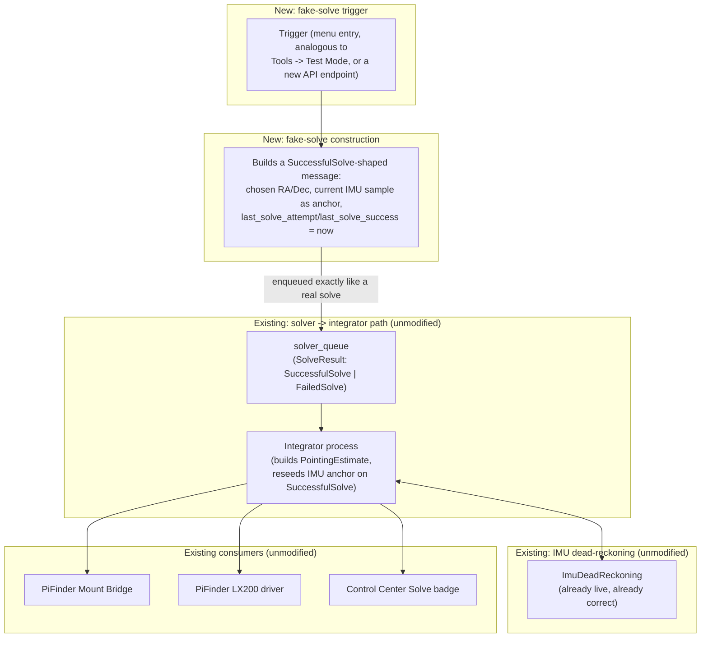
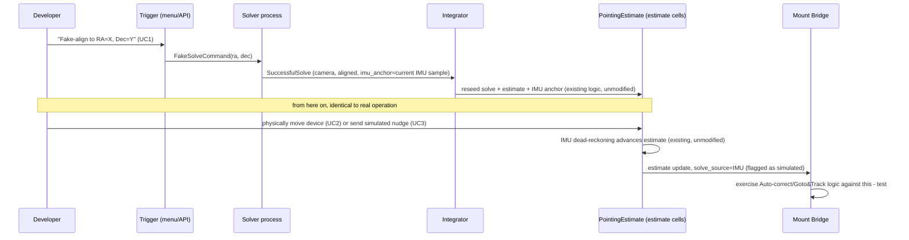

# Concept: PiFinder Fake-Solve Simulation (Safe, Weather-Independent Mount Bridge Testing)

> **Status: concept — not yet implemented.** Written via this project's `cpt` (concept)
> convention — see `basic-memory/basic-memory/00020_bm-cpt-command-system.md` and
> `00021_bm-documentation-depth-standard.md` for the standard this document follows. Tracked as
> [GitHub issue #106](https://github.com/apos/PiFinder_Stellarmate/issues/106) (`concept` +
> `pifinder` labels) on [Project #15](https://github.com/users/apos/projects/15) — update that
> issue if this concept is promoted, revised, or dropped.

## 1. Overview

Testing Mount Bridge behavior (Auto-correct Sync/Goto&Track, drift thresholds, solve-freshness
gating) currently requires a real, clear night sky and a physically mounted telescope. That's how
[#79](https://github.com/apos/PiFinder_Stellarmate/issues/79) (Auto-correct chasing a stale/IMU
position) and [#107](https://github.com/apos/PiFinder_Stellarmate/issues/107) (`pos_server.py`
serving a fake `+00*00'01` placeholder when no solve exists) were found and confirmed — both times
live, at night, on an actual EQ-6, with real physical-safety constraints (cable wrap, balcony
railing) that needed active monitoring during testing. That's not a repeatable or safe way to
iterate on a fix.

The existing "Solve Simulation" (`debug_solve` toggle, itself an upstream-relevant patch — see
`docs/upstream_patch_inventory.md` §1.1) feeds the *solver* a static test image on a loop. That's
the right tool for testing the solver itself (does plate-solving work on a known image), but it's
the wrong tool here: the image never changes, so it can't simulate a telescope actually moving, and
testing Mount Bridge doesn't need a solved *image* at all — it needs a solved *position*.

**Goal**: let a developer (or an automated test) inject one fake "solve" — an RA/Dec plus a
timestamp — directly into the same place a real camera solve lands, exactly once, as a one-time
calibration (the same pattern classic Alt-Az mounts use for star alignment: "point at a known
reference, confirm, done"). From that single seed, PiFinder's own **already-correct, already-live**
IMU dead-reckoning (`ImuDeadReckoning`, `integrator.py`) takes over and keeps extrapolating exactly
as it does for a real solve — moving the device by hand, or (see UC3) simulated keypresses, drives
the same estimate downstream consumers (Mount Bridge, the PiFinder LX200 driver, the Solve badge)
already read today. No new position-tracking math is needed — only a new way to seed it.

**Explicit non-goal**: rendering a realistic, GSC-based star field for the solver to actually solve
against. That's a different, heavier problem (see §7) that the existing Solve Simulation already
addresses for the solver's own testing needs — this concept is purely about feeding a valid
*position* for everything downstream of the solver.

## 2. Use Cases

| # | Use case | Scope |
|---|---|---|
| UC1 | One-time "fake alignment": developer supplies an RA/Dec (or picks a known reference, e.g. "pointing at Polaris" or an arbitrary chosen star/coordinate), the system seeds `pointing.camera.solve`/`pointing.aligned.solve` and the IMU anchor exactly as a real `SuccessfulSolve` would | In scope |
| UC2 | After UC1, physically moving the device by hand drives the real, already-working IMU dead-reckoning — lets a developer act out a mount's motion at a desk | In scope |
| UC3 | Alternative to UC2 for a fully deskbound/rig-mounted setup: keyboard or API-driven simulated position nudges (small RA/Dec or angular deltas), for when physically handling the device isn't practical | In scope |
| UC4 | Reproduce and verify fixes for #79 (solve-freshness gating in Mount Bridge) and #107 (`pos_server.py`'s no-solve placeholder) entirely indoors, on demand, repeatably | In scope — the actual motivation for this concept |
| UC5 | Rendering a realistic, dynamically-changing star field for the *solver* itself to plate-solve | **Out of scope** — see non-goal above and §7 for the heavier alternative that *would* cover this |

## 3. Architecture

The only genuinely new component is the trigger + fake-solve construction. Everything downstream
of `solver_queue` is existing, already-tested code, touched not at all — the entire value of this
design is that it doesn't add a second, parallel "simulated position" system that could itself
diverge from real behavior; it feeds the *one* real pipeline a synthetic input.

## 4. Technical Reference

**Verified** (read directly from `~/PiFinder/python/PiFinder/types/positioning.py` and
`docs/ax/positioning/CONTEXT.md` on 2026-08-02):

| Concept | Detail |
|---|---|
| `SuccessfulSolve` | The `SolveResult` variant carrying solve-truth: flat `camera`/`aligned` `Pointing`s, `Optional` IMU anchor, `last_solve_attempt`/`last_solve_success` (the solved frame's `exposure_end`), `SolveDiagnostics`, `AlignmentResult`. The integrator fans this into both `solve` and `estimate` cells and reseeds the dead-reckoner. |
| `solver_queue` | One-way `multiprocessing.Queue`, solver → integrator, carries a `SolveResult` on every attempt. |
| `ImuDeadReckoning` (`PiFinder/pointing_model/imu_dead_reckoning.py`) | `solve(camera, aligned, q_x2imu)` captures the reference frame at each successful solve; `predict(q_x2imu)` dead-reckons forward from the latest IMU sample. This is the exact machinery UC2/UC3 rely on, unmodified. |
| `IMU_MOVED_ANG_THRESHOLD` | 0.06° deadband — below this, no dead-reckoning update publishes at all. Relevant to UC3's design: simulated nudges need to exceed this to actually move the published estimate. |

**Verified against `solver.py`/`integrator.py` directly** (resolved via
[#109](https://github.com/apos/PiFinder_Stellarmate/issues/109), 2026-08-02, read against
`apos/PiFinder`'s `release` branch in an isolated clone, not the live production checkout):

- **Injection mechanism**: `solver.py`'s `solver()` already contains the exact precedent needed —
  it drains `align_command_queue` inside its own loop via `isinstance()` dispatch
  (`AlignOnRaDec`/`AlignCancel`/`ReloadSqmCalibration`), and is the sole process that ever calls
  `solver_queue.put(...)` (confirmed: no other code calls `.put()` on it). Design: add a new
  `FakeSolve(ra, dec)` command dataclass alongside `AlignOnRaDec` in `types/positioning.py`, and a
  new `elif isinstance(command, FakeSolve):` branch in the same dispatch loop (`solver.py`, the
  `while True: command = align_command_queue.get(...)` loop) that builds a `SuccessfulSolve`
  directly — skipping centroid extraction/tetra3 entirely — using `shared_state.imu()` for the
  anchor and `time.time()` for `last_solve_attempt`/`last_solve_success`, then calls
  `solver_queue.put(solve_result)`, identical in shape to the real success path (`solver.py:631`).
- **IMU anchor with no real sample yet**: already fully handled by existing code, no new logic
  needed. `integrator.py`'s `_apply_successful_solve()` explicitly handles `imu_anchor=None`
  (falls back to a NaN quaternion for the dead-reckoner's `idr.solve()` call). The only
  consequence: `_advance_with_imu()` won't activate until a real IMU sample exists (an explicit
  `estimate.imu_anchor is not None` gate in `integrator.py`) — a minor, unlikely-in-practice edge
  case since the IMU process samples continuously and independently of solve state.

## 5. Design Principles

- **Reuse the real pipeline, don't build a parallel one.** The entire risk this concept exists to
  avoid (a simulation that behaves subtly differently from reality, hiding the real bug) is
  avoided by injecting at the earliest possible point (`solver_queue`) and changing nothing
  downstream.
- **Follow the established `diffs/` patching convention** ([[00004_setup-mechanism]] /
  `docs/upstream_patch_inventory.md`), not a standalone fork feature developed in isolation. The
  existing `debug_solve` feature (itself an upstream-PR candidate, `docs/upstream_patch_inventory.md`
  §1.1) is the direct precedent to follow: a `SharedStateObj` flag, a direct `ui_command`
  trigger path in `main.py`, and a `POST` API endpoint in `api_extensions.py`.
- **Never confusable with a real solve.** Every consumer that reads `solve_source`/the estimate
  must be able to tell a fake-injected position apart from a real `CAM` solve — mirroring the
  suffix pattern the Solve badge already uses for `debug_solve` (`"(simulated image)"`). This
  concept needs an equivalent, explicit "this position is simulated" signal threaded through to
  the same places, not just a bare RA/Dec that looks identical to the real thing. Directly relevant
  given #107: a synthetic position that looks exactly like a real one is precisely the failure mode
  already found once.
- **Discoverable, not a hidden backdoor.** Reachable via a documented menu entry / API endpoint,
  matching how `debug_solve` is already exposed via "Tools → Test Mode" plus the Control Center's
  own toggle — not an undocumented debug-only code path.

## 6. Workflow

## 7. Relationship to the Existing Solve Simulation, and the Heavier Alternative

This concept is deliberately positioned as a **second, complementary** simulation mode alongside
the existing `debug_solve` toggle, not a replacement:

| | Existing "Solve Simulation" (`debug_solve`) | This concept (fake-solve injection) |
|---|---|---|
| Feeds | A static test image, to the real solver | A synthetic position, past the solver |
| Tests | The solver pipeline itself (plate-solving works on a known image) | Everything downstream of a solve (Mount Bridge, LX200 emulation, Solve badge) |
| Realism | Solves the same fixed image every time | Real IMU dead-reckoning drives realistic, continuous motion after the initial seed |

A heavier third option exists and was considered: pulling frames from KStars/Ekos' own CCD
Simulator (GSC-based, already visible as an INDI device tab in this project's setup) into
PiFinder's existing fake/debug camera hook, so the *real solver* runs against a realistic,
dynamically-changing sky. That would be more end-to-end faithful (exercises the actual solve
algorithm, not just position injection) but needs substantially more new code (an INDI CCD client,
frame format conversion, FOV/pointing coupling to a simulated or real telescope) for no additional
coverage of the actual bugs (#79, #107) this concept exists to fix — both live purely in the
"trust a reported position without checking it's genuinely backed by a solve" layer, which fake-solve
injection already exercises directly. Recommended: build this (lightweight) concept first; revisit
the CCD-Simulator approach only if a concrete future need requires testing the solver itself under
realistic dynamic conditions, which neither #79 nor #107 do.

## 8. Installation / Dependencies

Ships the same way `debug_solve` does — as `diffs/*.diff` file(s) against upstream PiFinder,
applied by `bin/patch_PiFinder_installation_files.sh` (see [[00004_setup-mechanism]]). Concretely,
likely touches:

- `PiFinder/integrator.py` or a new command queue module (the fake-solve command path — exact
  shape depends on resolving the open question in §4).
- `PiFinder/state.py` (a `debug_position_simulation` or similar flag, mirroring `debug_solve`'s
  existing pattern, so consumers can tell a fake position apart from real).
- `PiFinder/main.py` (a new `ui_command` case, mirroring `toggle_debug_solve`).
- `PiFinder/api_extensions.py` (a new endpoint, mirroring `POST /api/debug_solve`).
- `PiFinder/ui/menu_structure.py` (a discoverable menu entry, likely near the existing Test Mode
  entry).

No new external dependencies. Once implemented, gets its own entry in
`docs/upstream_patch_inventory.md` §1 (potentially-relevant-to-upstream, following the `debug_solve`
precedent exactly) and a ready-to-file template in `docs/upstream_pr_templates.md`, per
[[basic-memory/00018_bm-upstream-pr-strategy]].

## 9. Test Strategy

- **Baseline verification** (per [[basic-memory/00018_bm-upstream-pr-strategy]]): before writing
  any patch, confirm in a fresh, isolated worktree off `apos/PiFinder`'s `release` branch (the
  branch that actually matches this project's pinned `version.txt` — currently `2.6.0` — see
  [[00085_pifinder-version-pinning-release-vs-main]]) that the injection point behaves as
  documented in §4, not as assumed.
- **Functional verification**: `py_compile`/lint at minimum; live functional testing via the
  `pifinder-remote` skill (headless PiFinder instance, driven via simulated keypresses, state read
  back via its API) to actually prove a fake-aligned position dead-reckons correctly under
  simulated movement — not just that it compiles.
- **Once implemented, use it immediately for**:
  - A repeatable indoor test case for #79 (Auto-correct must never fire based on an estimate whose
    `solve_source` reflects IMU-only progression past some age threshold — reproduce by fake-aligning,
    then waiting/nudging without ever re-triggering a "real" solve).
  - A repeatable indoor test case for #107 (`pos_server.py` must only ever report a position once
    `has_pointing()` is genuinely true — verify the placeholder disappears once a fake-but-valid
    solve has been injected, and reappears correctly if the simulation is reset to "no solve yet").

## 10. Known Risks / Open Questions

- ~~Injection mechanism unverified~~ — **resolved**, see §4 and
  [#109](https://github.com/apos/PiFinder_Stellarmate/issues/109).
- **Consistent "this is simulated" signal**: if any one consumer (Mount Bridge, the PiFinder LX200
  driver, `pos_server.py`, the Solve badge) fails to check the simulated-position flag, this
  concept re-creates exactly the class of bug it exists to help fix (#107: a value that looks real
  but isn't, silently acted upon). Needs an explicit checklist of every consumer to update, not an
  assumption that setting one flag suffices everywhere.
- **Upstream-relevance not yet decided**: likely a genuinely useful capability for anyone
  integrating PiFinder with external hardware (same reasoning as `debug_solve`'s own upstream case),
  but not confirmed against `brickbots/PiFinder`'s current `main` — per
  [[basic-memory/00018_bm-upstream-pr-strategy]], this must be freshly baseline-verified in an
  isolated worktree before any PR is even drafted, regardless of how obvious it seems from this
  concept's vantage point.
- **IMU-anchor-not-yet-available edge case** (see §4) needs a concrete decision, not left implicit.

## 11. Effort & Priority

**Size: M** — the core mechanism reuses existing, working code end-to-end; the new surface area
(one command path, one flag, one menu entry, one API endpoint) is small, but crosses a
multi-process boundary that needs care and the unresolved question in §4 could push this toward
**L** depending on the answer.

**Priority: high** — matches #79 and #107's own priority on [Project #15](https://github.com/users/apos/projects/15);
this concept exists specifically to unblock safe, repeatable iteration on both.

## 12. Strategic Sequencing

1. ~~Read `integrator.py`/`solver.py` properly~~ — **done**, see §4 and
   [#109](https://github.com/apos/PiFinder_Stellarmate/issues/109).
2. **Isolated worktree off `apos/PiFinder`'s `release` branch** (2.6.0), baseline-verify current
   `solver_queue`/integrator behavior matches this document's assumptions.
3. **Implement** the fake-solve injection + trigger, as `diffs/*.diff` file(s), following the
   `debug_solve` precedent's file-by-file shape exactly (§8).
4. **Functionally verify** via the `pifinder-remote` skill — prove a fake-aligned position
   dead-reckons correctly under simulated movement, and that every consumer's "simulated" signal is
   consistent (§10).
5. **Deploy locally** via `bin/patch_PiFinder_installation_files.sh`, use it immediately to
   reproduce and verify fixes for #79 and #107 indoors.
6. **Once stable**, add the `docs/upstream_patch_inventory.md` §1 entry +
   `docs/upstream_pr_templates.md` template, and only then — after an explicit approval gate, per
   [[basic-memory/00018_bm-upstream-pr-strategy]] — draft and open the actual upstream PR against
   `brickbots/PiFinder`'s `main`.
