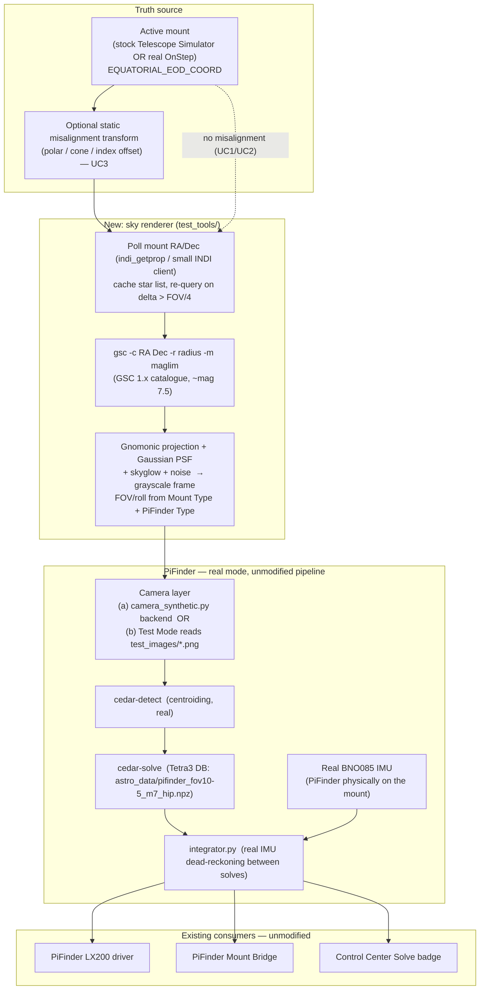
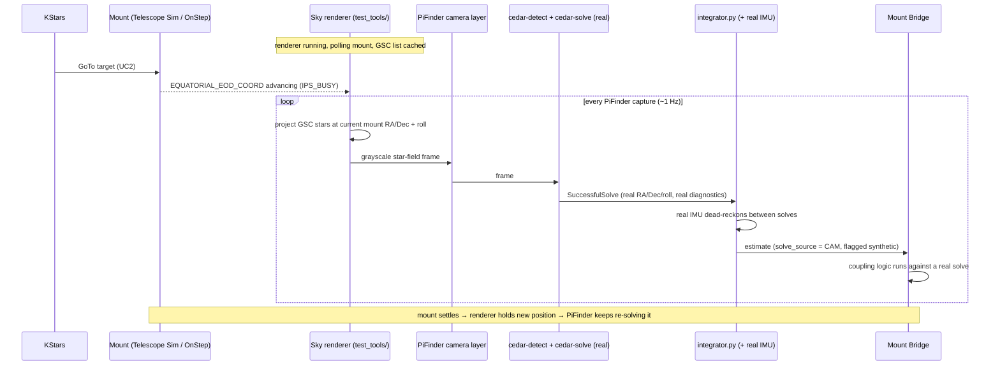

# Concept: PiFinder Realmode Sky Simulation (synthetic GSC image → the real solver runs)

> **Status: concept — not yet implemented.** Written via this project's `cpt` (concept)
> convention — see `basic-memory/basic-memory/00020_bm-cpt-command-system.md` and
> `00021_bm-documentation-depth-standard.md` for the standard this document follows. The entire
> `docs/concepts/` folder was read first per that convention. Design context:
> `basic-memory/pifinder-stellarmate/00129_synthetic-image-injection-realmode-solver-simulation-2026-09-10`.
> Tracked as [GitHub issue #344](https://github.com/apos/PiFinder_Stellarmate/issues/344)
> (`concept` + `pifinder` labels) on [Project #15](https://github.com/users/apos/projects/15).
> This concept is the image-layer sibling of [#164](https://github.com/apos/PiFinder_Stellarmate/issues/164)'s
> Option B ("a real sky-truth mode inside PiFinder"); update #344 if this concept is promoted,
> revised, or dropped.

## 1. Overview

Every position-simulation mechanism this project has built so far — Fake-Solve / Injected Solve
(#106, [`pifinder_fake_solve_simulation.md`](pifinder_fake_solve_simulation.md)), the
GUI-controllable position simulator (#164,
[`complete_position_simulator.md`](complete_position_simulator.md)), `PiFinder Simulator`
(`indi_pifinder_simulator`, #239), the simulated IMU
([`full_simulation_imu_dead_reckoning.md`](full_simulation_imu_dead_reckoning.md)) — injects a
synthetic **position** (`RA/Dec` + timestamp) at or past `solver_queue`, and **bypasses PiFinder's
actual plate solver entirely**. `solve_source` reads `CAM`, but `cedar-detect` (centroiding) and
`cedar-solve` (the Tetra3-derived lost-in-space solver) never run. That is the correct, minimal
design for testing everything *downstream* of a solve (Mount Bridge, LX200 emulation, the Solve
badge) — it is deliberately not a test of the solve itself.

`pifinder_fake_solve_simulation.md` §7 names the alternative and defers it:

> "pulling frames from KStars/Ekos' own CCD Simulator (GSC-based …) into PiFinder's existing
> fake/debug camera hook, so the *real solver* runs against a realistic, dynamically-changing
> sky … Recommended: build this (lightweight) concept first; revisit the CCD-Simulator approach
> only if a concrete future need requires testing the solver itself under realistic dynamic
> conditions."

**This concept is that revisit.** The concrete need (User, 2026-09-10): a **daytime / indoor**
way to exercise PiFinder's **real mode with the solver actually running** — PiFinder physically
bolted to the mount, real IMU, real `cedar-detect`/`cedar-solve`, real `integrator.py`, real LX200
output, real Mount Bridge, real GoTo. The only synthetic element is the photons: a star-field image
rendered from a real star catalogue (GSC) at wherever the mount currently points, substituted for
the camera frame each capture cycle.

The user's framing: *"Ich will ja nicht Cedar testen, sondern brauche einfach eine Simulation
unter Tags. Zusammen mit dem schon existierenden PF Sim und PF LX200 wäre das eine Bereicherung."*
The solve only has to work *in principle* — the value is that the whole real pipeline runs, not
that the solver is under test.

### Why this is a strict fidelity gain over Fake-Solve

| | Fake-Solve family (#106/#164/#177) | Realmode Sky Simulation (this concept) |
|---|---|---|
| Injection point | `solver_queue` / `/api/fake_solve` / `/api/fake_imu` | PiFinder's camera frame (before `cedar-detect`) |
| Solver runs? | No — skipped | **Yes** — `cedar-detect` + `cedar-solve` on every capture |
| IMU dead-reckoning | needs `imu_fake.py` fixes + `/api/fake_imu` feeder (`full_simulation_imu_dead_reckoning.md`) to interpolate between injections | **real IMU** — PiFinder is on the mount, the IMU genuinely rotates during a slew; `full_simulation_imu_dead_reckoning.md` is largely moot for this setup |
| Solve rate | assumed constant / not modelled (`simulation_fidelity_and_pifinder_orientation.md` §3 flags this as an unmeasured gap) | the **real** solver at its **real** rate under real Pi load — the gap disappears because nothing is modelled |
| Failure modes exercised | none (no solver) | real centroiding/matching, real "too few stars", real RMSE, real auto-exposure feedback loop |
| #177 dead-reckoning-follow gap | central open problem (in-memory simulator can't follow a mount GoTo) | **dissolves** — a real IMU on a real slewing mount follows physically; the rendered field follows the mount truth |

## 2. Use Cases

| # | Use case | Scope |
|---|---|---|
| UC1 | **Daytime/indoor real-mode smoke test.** PiFinder on the mount (or bench), camera capped. Mount = stock Telescope Simulator or a real OnStep on the bench. Renderer substitutes the camera frame from the mount's current `RA/Dec`. PiFinder solves it for real, reports position via LX200, Mount Bridge couples. Verify the whole pipeline runs end-to-end without a night sky. | In scope — the motivation |
| UC2 | **GoTo-Forward / "Follow mount's goto" with a real solver.** Issue a GoTo (from KStars against `PiFinder LX200`, or mount-side). Mount slews → IMU rotates → rendered field tracks the mount → PiFinder re-solves the moving field → PiFinder position tracks the target. Exercises #178's auto-detecting GoTo mode against real solves. | In scope |
| UC3 | **Verify/Alert + Auto-correct with a real solver.** Renderer applies a configurable static misalignment transform (`render_center = mount_pos ∘ misalignment`: polar error, cone error, index offset). PiFinder's real solve then genuinely disagrees with the mount's reported position by a controlled amount — the independent-truth divergence #164 §8 says these modes need, now with a real solve behind it. | In scope |
| UC4 | **Ekos "switch to guiding" / Focus / Align against a coherent simulated sky.** The stock `indi_simulator_ccd` (+ the same GSC install) serves Ekos' main/guide camera; the renderer serves PiFinder. Both read the same mount. One simulated sky across the whole rig — test the guiding hand-off, Ekos plate-solve align, autofocus runs. | In scope |
| UC5 | **Solver robustness / regression testing of `cedar-solve` itself** (distortion models, magnitude limits, FOV-hint sensitivity). | **Out of scope** — that is cedar-solve's own `tests/` + `tools/synthstars.py` job (see §7); this concept only needs "solves in principle". |
| UC6 | Realistic modelling of solve-rate degradation under CPU/thermal load, or of an f/1.4-vs-f/2.0 lens' effect on solve success. | **Out of scope as an explicit model** — but partially *obtained for free*, since the real solver runs under real Pi load (`simulation_fidelity_and_pifinder_orientation.md` §3). |

## 3. Architecture

The only genuinely new component is the **renderer** (a `test_tools/` script, sibling to
`pifinder_truth_injector.py`) plus a small camera-side hook. Everything from `cedar-detect`
onward is existing, already-tested PiFinder code, touched not at all — same design principle as
`pifinder_fake_solve_simulation.md` §5 ("reuse the real pipeline, don't build a parallel one"),
applied one layer earlier: this feeds the *one* real pipeline a synthetic **image** instead of a
synthetic **position**, so even the solver is real behaviour under test.

## 4. Technical Reference

### 4.1 The renderer — reuse INDI's, don't write a new one *(verified against `indilib/indi` master, `drivers/ccd/sky_renderer.cpp`, 2026-09-10)*

INDI's stock CCD Simulator already contains exactly this renderer (`SkyRenderer`, standalone, no
`INDI::CCD` base class). Its GSC path:

| Element | Detail |
|---|---|
| Catalogue call | `popen("gsc -c %8.6f %+8.6f -r %4.1f -m 0 %4.2f -n 3000")` — RA/Dec J2000 deg, radius arcmin (half chip diagonal), faint-mag limit, ≤3000 stars |
| Projection | gnomonic / TAN (Handbook of Astronomical Image Processing eqs. 9.1/9.2); stars behind the tangent plane (`denom ≤ 0`) dropped |
| Pixel scale | `(pixelSize_µm / focal_length_mm) × 206.3` arcsec/px per axis |
| Star flux | `flux(mag) = 10^((limitingMag − mag)·k/2.5)`, `k = 2.5·log10(maxVal)/(limitingMag − saturationMag)`; `totalFlux = flux · exposure_s` |
| PSF | 2-D Gaussian, `σ` from `seeing` (arcsec FWHM, default 3.5); sub-pixel centred (indilib/indi#2465) |
| Background | `flux(skyGlow)` (default 19.5 mag) × exposure + radial vignette |
| Noise | `pixel += bias + (random() % maxNoise)` — uniform, **not** Poisson shot noise (cf. cedar's `synthstars.py`, which does model Poisson + read noise) |

Two integration routes for *this* project:

- **Route R1 — drive the stock `indi_simulator_ccd`.** Run it in the Ekos/INDI profile snooping
  the mount, trigger an exposure per PiFinder capture cycle, pull the FITS BLOB, convert to the
  grayscale array PiFinder's camera layer expects. Pro: zero new rendering code, maintained
  upstream, and it is the *same* renderer that serves Ekos (UC4). Con: INDI exposure + BLOB
  round-trip latency per frame; FITS→PiFinder format/resolution conversion; couples the PiFinder
  test path to a running `indiserver`.
- **Route R2 — a small standalone renderer in `test_tools/`.** ~150 lines: `gsc` call (or a
  bundled bright-star file, §4.4) → numpy gnomonic projection → Gaussian PSFs → noise → PNG.
  Pro: no INDI dependency in the PiFinder image path, full control of cadence and format,
  trivially matches PiFinder's resolution/FOV. Con: a second implementation of the same physics
  (mitigated by copying INDI's formulas verbatim, above).

### 4.2 PiFinder camera-side hook *(verified against `brickbots/PiFinder` `release`: `python/PiFinder/camera_debug.py`, `camera_interface.py`, 2026-09-10)*

| Fact | Detail |
|---|---|
| Camera contract | Every backend implements `CameraInterface`; the generic `get_image_loop()` (`camera_interface.py`) calls `capture() -> PIL.Image`, pastes it into `camera_image` shared memory for the solver process. Backends: `camera_pi.py`, `camera_debug.py`, `camera_none.py`. |
| `capture()` has state | `get_image_loop()` stores `self.shared_state` explicitly *"for access by capture() methods"* — a synthetic backend's `capture()` can read `shared_state.imu()`, `shared_state.solution()`. |
| Existing "Test Mode" | The loop already has a `test_mode_on` branch: `Image.open(<root>/test_images/pifinder_debug_02.png)` every capture, `time.sleep(0.2)`. **Blanks the frame if the IMU moved >0.01 rad during the fake exposure** (`pointing_diff` check) so the solver doesn't report a stale solve. |
| FOV gate | `optical_train_known()` — `camera_debug` returns `False` (recorded frames, no real optics) → solver gets **no FOV gate**. A synthetic backend that renders at a *known* FOV should return `True` and declare the sensor + FOV so `cedar-solve` gets its FOV hint (see PiFinder ADR 0027/0029). |
| Solver DB | `astro_data/pifinder_fov10-5_m7_hip.npz` — the Tetra3 pattern DB is built for **~10.5° FOV, mag 7, Hipparcos**. Render FOV ≈ 10.5°, stars to mag ≈ 7.5 → reliably solvable. |
| Solve image size | `capture_bias()` returns `512×512`; exact solve-path resolution to confirm against `~/PiFinder` `solver.py`/`camera_interface.py`. |

Two hook options:

- **Route H-a — `camera_synthetic.py` backend** (sibling to `camera_debug.py`), selected by config
  / a `--camera synthetic` flag. `capture()` renders (or fetches from the renderer) a frame for
  the current mount truth. `optical_train_known()` → `True` with the real FOV. **Cleanest, PR-able
  upstream** (same rationale as `debug_solve`). Requires PiFinder to accept the backend.
- **Route H-b — external renderer overwrites `test_images/pifinder_debug_02.png`** at ~2 Hz from
  mount truth; enable Test Mode. **Zero PiFinder code change**, pure `test_tools/` glue — exactly
  the `pifinder_truth_injector.py` pattern. Limitation: the blank-on-IMU-motion guard means no
  solves land *during* a slew (arguably realistic — a real cam smears during a fast slew — but it
  loses UC2 coverage mid-motion). Good for a same-day proof of concept.

### 4.3 Truth source & the orientation transform *(partly verified — see `simulation_fidelity_and_pifinder_orientation.md` §6)*

- **Truth = the active mount's `EQUATORIAL_EOD_COORD`** (stock Telescope Simulator or real
  OnStep), read the same way `PiFinder Simulator`'s `ISSnoopDevice()` already reads it (#239).
  Not the in-memory `PiFinder Simulator` — the render must move *with the physical mount* so the
  real IMU and the rendered field stay consistent.
- **Roll / field orientation** must come from **Mount Type** (`Alt/Az` vs `Equatorial` — already
  auto-synced from the mount's `TELESCOPE_MOUNT_TYPE`, `00017_mount-type-auto-sync`) **and
  PiFinder Type** (`Left`/`Right`/`Straight`/`Flat v2`/`Flat v3`/`AS Bloom` — a manual physical
  fact, no INDI source). `simulation_fidelity_and_pifinder_orientation.md` §6 spells out that both
  jointly define the "IMU-measured rotation → sky" transform; the renderer needs the same
  convention for its PSF-field roll, or `cedar-solve` still solves (it is roll-invariant) but the
  `integrator.py` roll fusion is wrong. **Reuse** `imu_dead_reckoning.py` /
  `pifinder_simulator.cpp`'s existing `MOUNT_TYPE`/`SCREEN_DIRECTION` handling — do not reinvent.
- **UC3 misalignment**: a static transform composed onto the mount position before rendering.
  Independent, controlled divergence — the property #164 §8/§9 require.

### 4.4 GSC vs. a bundled catalogue

| | GSC (`gsc` tool + GSC 1.x data) | Bundled bright-star file (Hipparcos/Yale BSC, mag ≤ 7) |
|---|---|---|
| Size / install | ~1 GB, `gsc` binary + data from CDS; fiddly on Arch/current SMOS (INDI forum: "hours of lost time") | few hundred KB, ships in the repo |
| Depth | mag ~15, ~0.3″ astrometry | mag ~7, matches the Tetra3 DB catalogue exactly |
| Ecosystem fit | **same install serves the stock `indi_simulator_ccd`** → one catalogue for PiFinder *and* Ekos (UC4) — the User's main argument for GSC | PiFinder-only |
| Recommendation | **primary** if UC4 (Ekos guiding switch) matters | fallback / bootstrap if GSC install blocks progress |

## 5. Design Principles

- **Reuse the real pipeline, one layer earlier.** `pifinder_fake_solve_simulation.md` §5 injects
  at `solver_queue`; this injects at the camera frame. Same principle (no parallel system that can
  diverge from reality), stricter application (the solver is now real behaviour too).
- **Reuse INDI's renderer and catalogue tooling**, don't grow a bespoke star-field engine — copy
  the projection/flux/PSF formulas verbatim from `sky_renderer.cpp` (§4.1) if Route R2.
- **Reuse the existing orientation convention** (`MOUNT_TYPE`/`SCREEN_DIRECTION` from
  `imu_dead_reckoning.py` / `pifinder_simulator.cpp`) for the render roll — the transform is
  already solved once, don't solve it a second time (`simulation_fidelity` §6).
- **Never confusable with a real observation.** Same requirement as `debug_solve`'s
  `"(simulated image)"` badge suffix: a synthetic-frame solve must be distinguishable downstream
  from a real-sky solve. Route H-a should thread a `synthetic_sky` flag; Route H-b already
  inherits Test Mode's own signalling.
- **Test tooling stays out of production code.** The renderer is a `test_tools/` script (Route
  H-b) or an opt-in `--camera synthetic` backend (Route H-a), never a default path — same
  separation the `cpt` convention and #164 both insist on.
- **Discoverable, not a backdoor.** If it grows a Control Center control (§6), it mirrors the
  existing "Setup Simulator" button pattern (#176), not a hidden toggle.

## 6. Workflow

## 7. Relationship to existing concepts

| Concept doc / issue | Relationship |
|---|---|
| `pifinder_fake_solve_simulation.md` (#106) | This is the "heavier alternative" its §7 defers. **Complementary, not a replacement** — Fake-Solve stays the right tool for pure downstream tests (#79/#107); this is for when the solver must be in the loop. |
| `complete_position_simulator.md` (#164) | Image-layer sibling of #164's **Option B** ("a real sky-truth mode inside PiFinder"). #164 B holds a fixed RA/Dec *as* a solve; this produces a *frame* the real solver turns into that solve. #164 §9's "three movement sources" model still applies — this concept just makes source #2 (real mount slew) drive a real image instead of an interpolated fake solve. |
| `full_simulation_imu_dead_reckoning.md` (#177-adjacent) | **Largely mooted for the PiFinder-on-mount setup** — `imu_fake.py` and `/api/fake_imu` exist to interpolate between fake solves with no real IMU; here the IMU is real and moves with the mount. Still needed for the *headless, no-hardware* Full-Simulation path, which this concept does not cover. |
| `simulation_fidelity_and_pifinder_orientation.md` | §3 (unmodelled solve rate) — **resolved by construction** here (real solver, real rate). §6 (Mount Type + PiFinder Type feed the transform) — **directly load-bearing**: the renderer needs both for its field roll (§4.3). |
| #178 (unified auto-detecting GoTo mode) | UC2 exercises #178's detection logic against real solves rather than fake-solve injections. |
| #148 (solver oversubscribes a shared Pi 4 CPU) | Running the real solver + KStars + this renderer on one Pi 4 will hit exactly #148. Route R2 / H-b keep the renderer cheap; a Pi 5 test box side-steps it. |
| cedar-solve `tools/synthstars.py` | Upstream's own synthetic-frame generator (Gaia DR3, Poisson+read noise, FITS+PNG+JSON ground truth). Reference model for Route R2's noise handling; also the right tool for UC5 (which this concept excludes). |

## 8. Installation / Dependencies

- **GSC** (Route with GSC): `gsc` binary + GSC 1.x data on the test box, `GSCDAT` set. Verify with
  `gsc -c <ra> <dec> -r 400 -m 8` before building anything. Same install the stock
  `indi_simulator_ccd` uses — do it once, both benefit.
- **Route R2 / H-b** (recommended first): a `test_tools/pifinder_sky_renderer.py` — deps
  `numpy`, `astropy` (WCS/projection) or hand-rolled gnomonic, `pillow`. No PiFinder-core change.
  Ships in this repo, not as a `diffs/*.diff`.
- **Route H-a** (`camera_synthetic.py`): ships as `diffs/*.diff` against upstream PiFinder,
  applied by `bin/patch_PiFinder_installation_files.sh` (see `00004_setup-mechanism`). Likely
  touches `PiFinder/camera_synthetic.py` (new), the camera-selection site (`main.py` / config /
  `--camera`), `PiFinder/state.py` (a `synthetic_sky` flag mirroring `debug_solve`), the Solve
  badge. Gets an `docs/upstream_patch_inventory.md` §1 entry following the `debug_solve` precedent.
- **Route R1** (drive stock `indi_simulator_ccd`): an INDI client in `test_tools/` (`pyindi-client`
  or raw XML), FITS→grayscale conversion, exposure-per-capture trigger. No PiFinder-core change,
  but a running `indiserver` becomes a test dependency.

## 9. Test Strategy

- **Baseline-verify against `~/PiFinder`** (standard local SMOS development per
  `00004_setup-mechanism`, *not* the upstream-PR process): confirm the camera-selection site, the
  solve-path image resolution, and `optical_train_known()`'s effect on the FOV gate behave as §4.2
  documents — before writing a patch.
- **Renderer unit check**: render a known field (e.g. M45), run it through a standalone
  `cedar-solve` call, assert the solved RA/Dec matches the render centre within a few arcmin.
- **Functional (Route H-b, fastest path to signal)**: renderer → `test_images/pifinder_debug_02.png`
  from the Telescope Simulator's position, static pointing, Test Mode on; confirm via
  `/api/status` / the `pifinder-remote` skill that a real `CAM` solve lands and matches.
- **UC2**: Telescope Simulator GoTo, confirm PiFinder's reported position tracks the target and
  Mount Bridge's auto-detecting GoTo mode (#178) behaves.
- **UC3**: dial in a 10′ polar-error transform, confirm Verify/Alert crosses threshold and
  Auto-correct fires against a *real* solve.
- **UC4**: stock `indi_simulator_ccd` + same GSC as Ekos camera; run an Ekos Align + a guiding
  hand-off; confirm both simulated skies agree.
- Honest gap statement: this does **not** validate `cedar-solve` robustness (distortion, faint
  limits) — that is UC5 / `synthstars.py` territory, explicitly out of scope.

## 10. Known Risks / Open Questions

- **Roll/orientation transform (§4.3)** is the hard part. Wrong roll → solves still succeed but
  `integrator.py` roll fusion is off, and UC2/UC3 conclusions become unreliable. Needs the
  Mount-Type + PiFinder-Type convention pinned down against `imu_dead_reckoning.py` first.
- **Latency budget**: render + (GSC query or cache hit) must stay well under the solve cadence
  (~1 s, see `00093`). Cache the star list; re-query only on pointing delta > FOV/4. Route R1's
  INDI round-trip may not fit.
- **CPU on a shared Pi 4** (#148): real solver + KStars + renderer. Prefer a Pi 5 test box, or
  Route R2/H-b to keep the renderer light.
- **"Synthetic" signalling** must reach every downstream consumer (Mount Bridge, LX200,
  `pos_server.py`, Solve badge) — same checklist discipline `pifinder_fake_solve_simulation.md`
  §10 calls for. A synthetic solve that looks exactly like a real one is the #107 failure mode.
- **GSC install friction** on current SMOS/Arch — may block; the bundled-catalogue fallback
  (§4.4) exists for exactly that.
- **Route choice not yet made** — R1 vs R2 for the renderer, H-a vs H-b for the hook. §12
  sequences a decision, it does not pre-make it.
- **Two-repo change if Route H-a** — the `camera_synthetic.py` side is a `~/PiFinder` patch
  (`diffs/`), the renderer is this repo. Independent review paths.

## 11. Effort & Priority

**Size: L.** Route R2 + H-b as a proof of concept is **M** on its own (a standalone renderer +
the `test_images` swap, no core changes). Getting to a *trustworthy* simulation — correct roll
transform, UC2/UC3 verified, "synthetic" signalling threaded through, GSC installed — is **L**.
Route H-a (`camera_synthetic.py` upstream) or R1 (INDI client) push individual slices further.

**Priority: medium.** Below the active Mount Bridge correctness work, but a real enabler: it
removes the night-sky dependency for the one class of testing Fake-Solve structurally cannot cover
(anything where the solver must be in the loop), and it is the natural substrate for UC4 (Ekos
guiding-switch testing) which has no other home. Sequence it after #164's Option B / the #177
dead-reckoning-follow work settles, since it reuses that truth-source plumbing.

## 12. Strategic Sequencing

1. **Verify GSC** on the test box (`gsc -c … -m 8` returns a sane star list). If it blocks →
   bundled bright-star file (§4.4) instead, do not stall. *(unblocked, XS)*
2. **Baseline-verify** the camera-selection site + solve-path resolution + FOV-gate behaviour
   against `~/PiFinder` (§9). *(blocks 3; S)*
3. **Route R2 + H-b proof of concept**: standalone `test_tools/pifinder_sky_renderer.py` →
   `test_images/pifinder_debug_02.png` from the Telescope Simulator's position, static pointing,
   Test Mode on. First real synthetic-frame `CAM` solve. *(depends on 1+2; M)*
4. **Roll/orientation calibration** (§4.3, §10) against one known real solve — the gate for any
   UC2/UC3 conclusion being trustworthy. *(depends on 3; M, highest-risk item)*
5. **UC2** (mount GoTo, PiFinder tracks) then **UC3** (injected misalignment, Auto-correct fires
   against a real solve). *(depends on 4)*
6. **Decide Route H-a vs stay on H-b.** If the PoC proves valuable and the blank-on-slew
   limitation bites → `camera_synthetic.py` backend + `diffs/` patch + `upstream_patch_inventory`
   entry. *(depends on 3–5)*
7. **UC4**: wire the stock `indi_simulator_ccd` (same GSC) as the Ekos camera, test the guiding
   hand-off / Ekos align. *(depends on 1; independent of 3–6)*
8. **Optional Control Center integration** — "Setup Sky Sim" start/stop + target picker, mirroring
   the #176 "Setup Simulator" button. *(depends on 5)*
