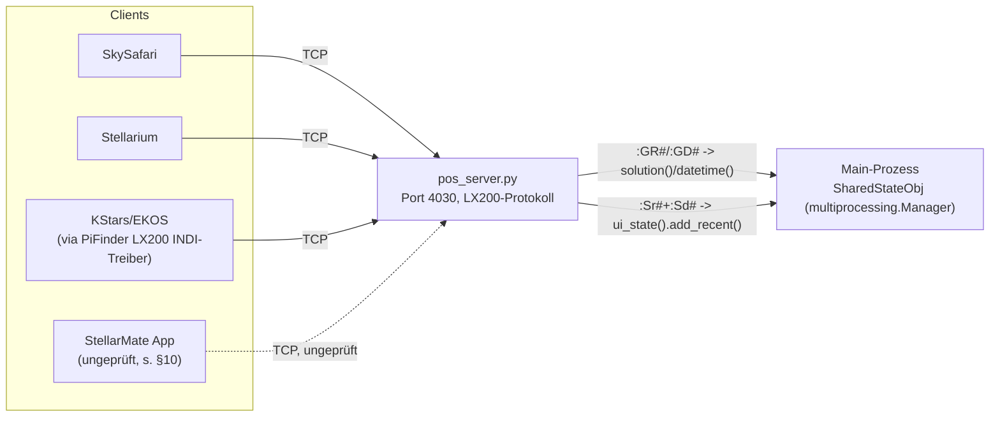
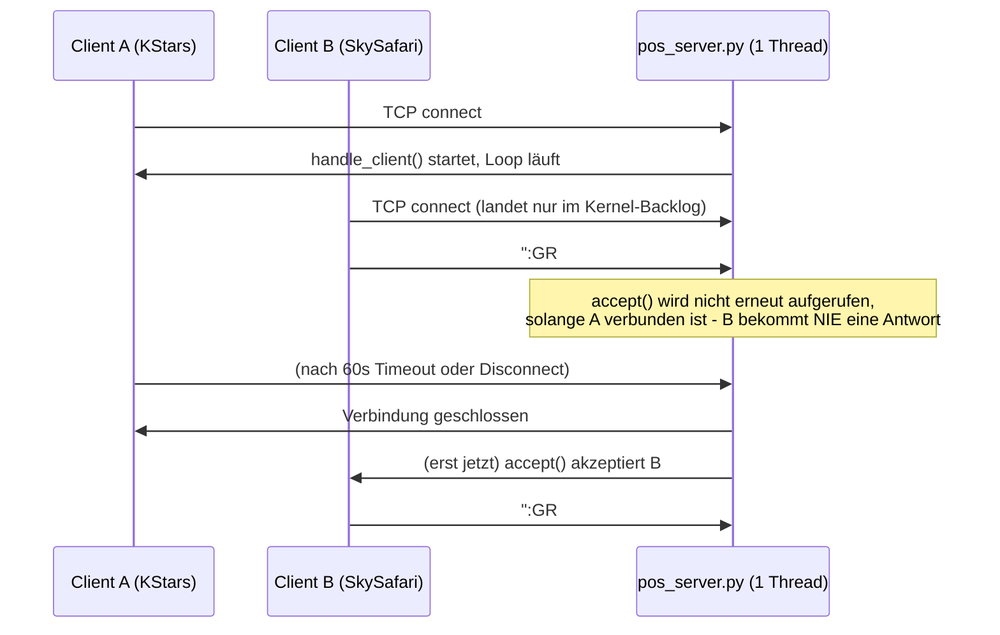
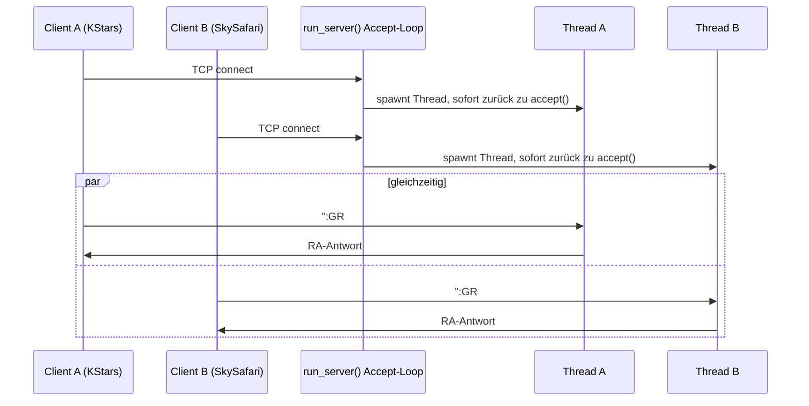

# Concept: `pos_server.py` multi-client architecture

## 1. Grundlagen — was dieser Server ist und wofür

`PiFinder/python/PiFinder/pos_server.py` (Port 4030, TCP) ist PiFinders eigener LX200-Protokoll-Server:
er lässt beliebige Planetariumssoftware PiFinder als generisches "Teleskop" ansprechen — Position
auslesen (`:GR#`/`:GD#`), PushTo/GoTo-Ziele senden (`:Sr#`/`:Sd#`), Standort/Uhrzeit abgleichen.
Laut Dateikopfkommentar explizit für SkySafari (iOS/iPadOS) gebaut, wird aber von mehreren,
tatsächlich unabhängigen Client-Typen gleichzeitig angesprochen:

| Client | Wie er andockt |
|---|---|
| **SkySafari** (iOS/iPadOS) | direkt per LX200/TCP gegen Port 4030 |
| **Stellarium** | direkt per LX200/TCP gegen Port 4030 (sendet zusätzlich das ACK-Byte, s. `is_stellarium`) |
| **KStars/EKOS** | indirekt — der eigene `PiFinder LX200`-INDI-Treiber (`indi_pifinder_lx200`, PiFinder_Stellarmate) verbindet sich SEINERSEITS als Client gegen Port 4030 und veröffentlicht das Ergebnis als INDI-Property; Mount Bridge liest wiederum von diesem Treiber |
| **StellarMate-App (SMOS)** | potenziell ebenfalls direkt per LX200/TCP gegen Port 4030, falls sie (wie viele mobile Astro-Apps) generische Meade/LX200-Netzwerkziele unterstützt — nicht abschließend verifiziert, s. offene Frage in §10 |

**Kernpunkt, der dieses Konzept auslöst**: das sind keine sich gegenseitig ausschließenden
Betriebsmodi, sondern **potenziell gleichzeitig aktive Verbindungen** — genau das vom User
benannte Szenario: *"Wir haben das auch noch wo anders: Client SkySafari, Client KStars, Client
SMate App. Alle würden darauf zugreifen. Entscheidend ist ja, dass mehrere Clients darauf
zugreifen."*

## 2. Eventualitäten bei gleichzeitigem Zugriff — vollständig, nicht nur die drei genannten Apps

Das Requirement ist nicht "drei bestimmte Apps unterstützen", sondern **jede Form von
Nebenläufigkeit auf diesem Server muss sicher sein**. Systematisch durchgegangen, nicht nur die
augenfälligen Fälle:

| # | Eventualität | Tritt heute (Single-Client) wie auf? | Mit dem Fix in §5-§7 |
|---|---|---|---|
| 1 | 3 verschiedene Client-Typen gleichzeitig verbunden (SkySafari + Stellarium + KStars via `PiFinder LX200`) | nur der zuerst verbundene wird bedient, alle anderen bekommen keine Antwort (s. §3 live-Beleg) | alle drei parallel bedient, siehe §4.3 |
| 2 | **Derselbe** Client reconnected, ohne die alte Verbindung sauber zu schließen (App-Neustart, WLAN-Aussetzer) — die alte Verbindung hängt bis zu 60s im Socket-Timeout | die neue Verbindung wird bis zu 60s lang gar nicht bedient, obwohl es "nur" ein Client ist, keine drei | neue Verbindung bekommt sofort einen eigenen Thread, unabhängig davon ob die alte noch ausläuft |
| 3 | Zwei Clients senden **gleichzeitig einen Goto** (`:Sr#`+`:Sd#`) | nicht möglich (nur einer ist überhaupt verbunden) — aber sobald mehrere verbunden sein können, ist das ohne Fix der exakte Mechanismus aus [[00108_upstream-bug-pos-server-sr-result-stale-global-2026-09-03]] (RA von Client A + Dec von Client B verschmelzen) | pro Verbindung isolierter `sr_result` (thread-local) — kann nicht mehr passieren |
| 4 | Ein Client ist Stellarium (ACK gesendet), ein anderer zeitgleich verbunden ist es nicht | nicht möglich (Single-Client) — mit einfachem `threading` ohne weitere Vorkehrung würde der zweite Client fälschlich `is_stellarium=True` sehen | thread-local `is_stellarium`, jede Verbindung sieht nur ihren eigenen Wert |
| 5 | Zwei Clients pushen gleichzeitig ein Ziel (`handle_goto_command`) — `sequence`-Zähler für die `object_id` | nicht möglich (Single-Client) | `threading.Lock()` um Inkrement+Read; `ra`/`dec`/`comp_ra`/`comp_dec` sind Stack-lokale Variablen je Aufruf, ohnehin nie geteilt — kein zusätzlicher Schutz nötig |
| 6 | Viele kurzlebige Verbindungen hintereinander (ein fehlerhafter Client in einer Reconnect-Schleife) | jede wartet einfach in der Kernel-Backlog-Queue, keine Ressourcen-Eskalation, aber auch keine bedient | jede bekommt einen Thread + ggf. eine eigene Manager-Verbindung (s. §10) — begrenzt durch sauberes Schließen (`finally: client_socket.close()`), aber ohne hartes Obergrenzen-Limit, s. §10 |
| 7 | Ein Client sendet fehlerhafte/kaputte Daten, die einen Handler zum Werfen bringen, während andere Clients verbunden sind | nicht möglich (Single-Client) — aber naiv mit `threading` würde eine unbehandelte Exception nur den einen Thread beenden UND den Socket lecken, ohne die anderen zu stören (das wäre schon kein Regressions-Risiko) | zusätzlich per `try/except/finally` (§7) sauber geschlossen und geloggt, statt lautlos zu lecken |
| 8 | Prozess wird beendet (Service-Neustart), während mehrere Clients mitten in einer Anfrage stecken | nicht möglich (Single-Client, höchstens einer betroffen) | Daemon-Threads sterben mit dem Prozess — ein Client kann eine abgeschnittene/unvollständige Antwort sehen, exakt dasselbe Verhalten wie ein heutiger Verbindungsabbruch durch Service-Neustart (kein neues Risiko, nur jetzt potenziell mehrere Clients gleichzeitig statt einem) |

Zeilen 3-5 sind der eigentliche Kern des Requirements: **nicht nur "mehrere dürfen gleichzeitig
lesen"**, sondern **"mehrere dürfen gleichzeitig schreiben/interagieren, ohne sich gegenseitig zu
korrumpieren"** — das ist der Grund, warum §5-§7 unten den kompletten geteilten Zustand einzeln
durchgehen (nicht nur pauschal "Threading hinzufügen"), und warum §6 als Tabelle geführt wird, die
jede einzelne Ressource explizit als sicher oder unsicher einstuft, statt das pauschal zu behaupten.

## 3. Problem — live gefunden, nicht hypothetisch

Heute (2026-09-05, PiFinder_Stellarmate Mount-Bridge-Livetest am echten OnStep-Mount) beim Versuch,
PiFinders aktuelle Position per einer eigenen, zweiten Testverbindung direkt abzufragen, während
`PiFinder LX200`s eigener INDI-Treiber bereits verbunden war:

```
TimeoutError: timed out
```

Ursache, per Code bestätigt (`setup_server_socket()`/`run_server()`):

```python
server_socket.listen(1)
...
while True:
    client_socket, address = server_socket.accept()
    logger.debug("New connection from %s", address)
    handle_client(client_socket, shared_state)   # <- blockiert INLINE im accept-Loop
```

`run_server()` ruft `handle_client()` **synchron im selben Loop** auf, der auch `accept()`
aufruft. Solange ein Client verbunden bleibt (bis zu 60s Timeout oder Disconnect), wird `accept()`
schlicht nicht erneut aufgerufen — jede weitere TCP-Verbindung landet zwar im Kernel-Backlog
(`listen(1)`, ein Slot), bekommt aber **keine Antwort auf irgendein gesendetes Kommando**, bis der
aktuelle Client die Verbindung beendet. Aus Client-Sicht: eine erfolgreiche TCP-Handshake, dann
Stille — exakt das oben beobachtete `TimeoutError`.

### Verhältnis zu bereits bekannten, verwandten Bugs

| # | Bug | Verhältnis zu diesem Konzept |
|---|---|---|
| [[00108_upstream-bug-pos-server-sr-result-stale-global-2026-09-03]] | `sr_result`-Modul-Global wird nie zurückgesetzt und ist nicht pro Verbindung getrennt | **Wird durch dieses Konzept vollständig mitgelöst** — die Notiz selbst schlägt bereits "besser: pro Verbindung/Session state" als Fix vor, genau das, was hier umgesetzt wird. Notiz kann nach Umsetzung geschlossen werden (s. [[00087_bm-bugfix-notiz-sofort-loeschen-bei-issue-abschluss]]) |
| Issue [#118](https://github.com/apos/PiFinder_Stellarmate/issues/118) | `PiFinder LX200`-Treiber erkennt eine tote TCP-Verbindung zu `pos_server.py` nicht (`CONNECTION=On` lügt) | **Verwandt, aber orthogonal** — #118 ist ein Erkennungsproblem auf Client-Seite nach einem Server-Neustart; dieses Konzept ist ein Kapazitätsproblem auf Server-Seite bei mehreren *gleichzeitig* lebenden Verbindungen. Beide Fixes schließen sich nicht gegenseitig ein |
| Heutiger `_call_with_timeout()`-Fix (s. `pos_server.py`-Kommentar ab Zeile 33) | begrenzt die Wartezeit auf `shared_state.solution()`/`.datetime()` pro Request | **Bleibt bestehen, löst aber NICHT dieses Problem** — er verkürzt nur, wie lange EIN bereits verbundener Client warten muss, wenn der Manager-Prozess langsam ist. Er ändert nichts daran, dass ein zweiter Client währenddessen komplett ignoriert wird, weil `accept()` gar nicht erst aufgerufen wird |

## 4. Architektur

### 4.1 Kontext (arc42 Kontextsicht)



### 4.2 Laufzeitsicht — heute (Single-Client, blockierend)



### 4.3 Laufzeitsicht — Vorschlag (Thread pro Verbindung)



## 5. Design-Entscheidung (ADR-Stil)

**Kontext**: mehrere echte, unabhängige Clients (SkySafari, Stellarium, KStars via eigenem
LX200-Treiber, potenziell die StellarMate-App) müssen PiFinders Position gleichzeitig lesen können,
ohne sich gegenseitig zu blockieren. Der Server ist aktuell strikt single-connection.

**Entscheidung**: `run_server()`s Accept-Loop startet pro akzeptierter Verbindung einen eigenen
`daemon=True`-Thread (`threading.Thread(target=handle_client, ...)`) statt `handle_client()` inline
aufzurufen. `listen(1)` → `listen(5)` (Backlog-Puffer für kurze Verbindungsspitzen).

**Konsequenzen — was das an geteiltem Zustand berührt** (Grund, warum das beim ersten
Timeout-Fix bewusst NICHT sofort mitgemacht wurde, s. Session-Historie): jede bisher als
Modul-Global gehaltene, pro-Verbindung gedachte Variable wird zur echten Race Condition, sobald
zwei Threads gleichzeitig laufen. Lösung: `threading.local()` für alles, was laut Kommentar im
Code ohnehin "stirbt mit der Connection" gedacht war — dieselbe Reset-Semantik wie bisher, nur
jetzt pro Thread statt pro Prozess:

```python
_session = threading.local()

def _reset_session_state():
    """Per-connection state - thread-local, weil jede Verbindung jetzt ihren
    eigenen handle_client()-Thread bekommt (s. docs/concepts/
    pos_server_multi_client_architecture.md). Ersetzt die bisherigen
    Modul-Globals is_stellarium/stellarium_latitude/stellarium_longitude/
    sr_result 1:1 in ihrer Reset-Semantik - nur nicht mehr crossverbindungs-
    weit geteilt."""
    _session.is_stellarium = False
    _session.stellarium_latitude = ""
    _session.stellarium_longitude = ""
    _session.sr_result = None
```

## 6. Concurrency-Sicherheits-Referenz — jede geteilte Ressource einzeln geprüft

Rigoros geprüft statt pauschal behauptet (genau die Art Nachweis, die für den ersten
Timeout-Fix in dieser Session bereits eingefordert wurde):

| Ressource | Heute (Modul-Global) | Race bei 2 Threads? | Fix |
|---|---|---|---|
| `is_stellarium` | ja, `global` | **Ja** — Client A (Stellarium) setzt es, Client B (SkySafari) liest plötzlich `True` und bekommt falsche `:D#`/`:Q#`-Antworten | → `_session.is_stellarium` (thread-local) |
| `stellarium_latitude`/`_longitude` | ja, `global` | **Ja** — ein Client sieht den vom anderen Client gesetzten Standort | → `_session.stellarium_latitude`/`_longitude` |
| `sr_result` | ja, `global`, laut [[00108_upstream-bug-pos-server-sr-result-stale-global-2026-09-03]] nie zurückgesetzt | **Ja, bereits heute als Einzel-Client-Bug bekannt** — mit 2 Threads zusätzlich verschärft: Client A's `:Sr#` kann mit Client B's `:Sd#` zu einem Goto verschmelzen, den keiner der beiden je so gesendet hat | → `_session.sr_result`, per Verbindung isoliert — löst 00108 strukturell, nicht nur kosmetisch |
| `sequence` (Goto-Zähler) | ja, `global`, `+= 1` ohne Lock | **Ja, aber selten relevant** (nur bei zwei zeitgleichen Goto-Pushes) — `+=` ist trotz GIL nicht atomar (LOAD/ADD/STORE als getrennte Bytecodes) | `threading.Lock()` um Inkrement+Read |
| `ui_queue` (`multiprocessing.Queue`) | geteilt | **Nein** — für genau diesen Zweck gebaut, intern threadsicher | keine Änderung nötig |
| `shared_state` (Manager-Proxy) | geteilt, ein Objekt für alle Aufrufer | **Nein** — `multiprocessing.managers.BaseProxy` hält pro aufrufendem Thread automatisch eine eigene Verbindung zum Manager-Prozess (`self._tls`, CPython-intern) | keine Änderung nötig, aber s. §10 zur Verbindungsanzahl |
| `_state_executor` (heutiger Timeout-Fix, `ThreadPoolExecutor(max_workers=2)`) | geteilt | **Kein Race, aber Kapazitätsrisiko** — bei 3+ gleichzeitigen Clients würde der Pool selbst zum Nadelöhr | `max_workers` 2 → 8 |
| `client_socket` je Verbindung | lokal, ein Objekt pro `handle_client()`-Aufruf | **Nein**, bereits pro Verbindung isoliert | keine Änderung |
| `logger`/`logging` | geteilt | **Nein** — Python-`logging` ist intern threadsicher | keine Änderung |

## 7. Fehler-Isolation

Bisher propagierte eine unerwartete Exception in `handle_client()` (etwas außerhalb der schon
behandelten `socket.timeout`/`ConnectionResetError`) bis zu `run_server()`s äußerem `try/except`
hoch — das riss den **gesamten** Server-Loop ab (Neustart nach 5s, aber währenddessen: alle
Clients getrennt). Mit Thread-pro-Verbindung würde eine unbehandelte Exception ansonsten nur den
Thread beenden, aber **den Socket nie schließen** (Leak) und den Traceback nur an Pythons
Default-Excepthook für Threads durchreichen, nicht an unseren Logger. Deshalb zusätzlich:

```python
def handle_client(client_socket, shared_state):
    _reset_session_state()
    client_socket.settimeout(60)
    client_socket.setsockopt(socket.SOL_SOCKET, socket.SO_KEEPALIVE, 1)
    try:
        while True:
            ...  # wie bisher
    except Exception:
        logger.exception("Unexpected error handling client - closing this connection only.")
    finally:
        client_socket.close()
```

Ergebnis: ein fehlerhafter Client trennt nur sich selbst, alle anderen Verbindungen und der Server
insgesamt laufen unbeeinflusst weiter — vorher war "ein Client crasht" gleichbedeutend mit "alle
Clients werden für 5s getrennt".

## 8. API-/Protokoll-Referenz (unverändert durch dieses Konzept, zur Vollständigkeit)

| Kommando | Handler | Bedeutung |
|---|---|---|
| `:GR#` | `get_telescope_ra` | aktuelle RA lesen |
| `:GD#` | `get_telescope_dec` | aktuelle Dec lesen |
| `:D#` | `get_distance_bars` | Slew-Fortschritt (PiFinder slewt nie selbst) |
| `:Sr<RA>#` | `parse_sr_command` | RA für bevorstehenden Goto merken (jetzt: pro Verbindung) |
| `:Sd<Dec>#` | `parse_sd_command` | Dec setzen + Goto auslösen (verbraucht das gemerkte `:Sr#`) |
| `:Q#` | `abort_slew` | Slew abbrechen (No-Op, PiFinder slewt nie) |
| `:St#`/`:Sg#` | `set_latitude`/`set_longitude` | Standort vom Client übernehmen (nur zum Echo, jetzt: pro Verbindung) |
| `:Gt#`/`:Gg#` | `get_latitude`/`get_longitude` | Standort zurückgeben |
| `:GC#`/`:GL#`/`:GG#` | Datum/Zeit/UTC-Offset lesen | unverändert, liest `shared_state.local_datetime()` |
| ACK (`\x06`) | `handle_frame` | markiert die Verbindung als Stellarium (jetzt: pro Verbindung, nicht global) |

## 9. Testplan

Kein automatisierter Test existiert aktuell für `pos_server.py` (`python/tests/` hat keine
`test_pos_server*`-Datei). Konkrete, exakte Schritte statt vager Ziele (s.
[[00025_bm-testplaene-brauchen-exakte-schritte-nicht-vage-ziele]]):

### Manuell (sofort nach Umsetzung, ohne laufenden Live-Test zu stören)

1. `pifinder.service` neu starten (bereits akzeptierte Disruption, s. heutiger erster Fix).
2. Zwei parallele rohe Socket-Verbindungen aus zwei Terminals öffnen:
   ```bash
   python3 -c "
   import socket, time
   s = socket.create_connection(('127.0.0.1', 4030), timeout=5)
   for _ in range(5):
       s.sendall(b':GR#'); print('A RA:', s.recv(64)); time.sleep(1)
   "
   ```
   (zweites Terminal identisch, aber `print('B RA:', ...)`) — **Erwartung**: beide bekommen
   innerhalb von ~1s Antworten, keines wartet auf das Ende des anderen.
3. Cross-Contamination-Test: Terminal A sendet das Stellarium-ACK-Byte (`\x06`) und danach `:D#`
   (erwartet `""`, weil `is_stellarium` gesetzt ist); Terminal B (ohne ACK) sendet ebenfalls `:D#`
   zeitgleich (erwartet `\x7f`, weil B's `is_stellarium` **nicht** gesetzt sein darf). Bekommt B
   fälschlich `""`, ist die Thread-Local-Trennung kaputt.
4. Goto-Interleaving-Test (deckt 00108 ab): Terminal A sendet nur `:Sr12:00:00#` (kein `:Sd#`
   danach), Terminal B sendet unabhängig `:Sd+45*00:00#`. **Erwartung**: B bekommt `"0"` (kein
   `sr_result` in seinem eigenen Session-State) — NICHT einen Goto zu RA 12h/Dec 45° aus A's Rest.
5. Fehler-Isolations-Test: einer der beiden Clients sendet bewusst kaputte Daten (z. B. rohe
   Binärdaten statt eines Frames), die einen Handler zum Werfen bringen (falls reproduzierbar) —
   **Erwartung**: nur diese eine Verbindung bricht ab, `journalctl -u pifinder.service` zeigt den
   Traceback über `logger.exception(...)`, der andere Client bleibt unbeeinträchtigt verbunden.

### Automatisiert (Vorschlag, nicht Teil dieses Konzepts' unmittelbarem Scope)

Ein `python/tests/test_pos_server.py` mit `pytest -m integration`, das `run_server()` mit einem
Fake-`shared_state` in einem Hintergrund-Thread startet und Schritte 2-4 oben als echte
Assertions nachbildet — sinnvoller Folgeauftrag, da dieses Modul aktuell komplett ungetestet ist.

## 10. Risiken / offene Fragen

- **Manager-Verbindungen pro Thread**: jeder neue Client-Thread öffnet beim ersten
  `shared_state`-Aufruf automatisch eine eigene Verbindung zum Manager-Prozess (s. §6). Bei den
  hier realistischen 2-4 gleichzeitigen Clients unkritisch; bei sehr vielen kurzlebigen
  Verbindungen (denkbar bei einem fehlerhaften Client, der in einer Schleife reconnected) würden
  Verbindungen/Threads akkumulieren, solange sie nicht sauber geschlossen werden — durch `finally:
  client_socket.close()` (§6) und Daemon-Threads (sterben mit dem Prozess) begrenzt, aber kein
  hartes Limit auf gleichzeitige Verbindungen vorgesehen. Für den aktuellen Use Case (eine
  Handvoll bekannter Client-Typen) nicht blockierend, aber als bewusste Grenze festgehalten.
- **StellarMate-App als echter direkter LX200-Client** — ob die SMOS-App tatsächlich eine
  generische LX200/Meade-Netzwerkverbindung gegen einen beliebigen Host:Port unterstützt, ist
  NICHT verifiziert (s. [[00036_stellarmate-app-integration-optionsvergleich]] — dort ging es um
  REST-API/EKOS-Integration, nicht um diesen konkreten Protokoll-Pfad). Ändert nichts an der
  Notwendigkeit des Fixes (KStars + SkySafari allein reichen bereits als Beleg für "mehrere
  gleichzeitige Clients"), aber sollte vor einer Doku-Aussage "SMate App funktioniert damit"
  live verifiziert werden.
- **Log-Interleaving**: mit mehreren Threads können Log-Zeilen verschiedener Verbindungen
  zeitlich verschränkt erscheinen (kosmetisch, `logging` selbst ist zeilenweise atomar) — für die
  Fehlersuche hilfreich wäre ein Thread-Name mit Client-Adresse im Log-Format, aktuell nicht
  Teil des Formats.
- **Nicht Teil dieses Konzepts**: eine echte root-cause-Behebung, warum der Manager-Prozess
  gelegentlich langsam antwortet (s. heutiger `_call_with_timeout()`-Kommentar) — dieses Konzept
  behandelt ausschließlich die Kapazitätsfrage "mehrere Clients gleichzeitig", nicht die
  Latenzfrage.

## 11. Strategische Umsetzung

Abhängigkeiten: 1 muss vor 2 stehen (Kern-Threading zuerst, dann Tests dagegen); 3 ist unabhängig
und kann parallel/danach passieren.

| # | Schritt | Aufwand | Priorität | Abhängigkeit |
|---|---|---|---|---|
| 1 | `run_server()`/`handle_client()`/geteilter State wie in §5-§7 beschrieben umsetzen | S | P0 | keine |
| 2 | Manuelle Testschritte aus §9 durchführen, Ergebnis dokumentieren | XS | P0 | 1 |
| 3 | [[00108_upstream-bug-pos-server-sr-result-stale-global-2026-09-03]] als gelöst schließen (Notiz löschen, s. [[00087_bm-bugfix-notiz-sofort-loeschen-bei-issue-abschluss]]) | XS | P1 | 1, 2 erfolgreich |
| 4 | `python/tests/test_pos_server.py` (automatisierter Integrationstest, §9) | M | P2 | 1 |
| 5 | Log-Format um Thread-/Client-Kennung ergänzen | XS | P2 | 1 |
| 6 | StellarMate-App als direkten LX200-Client live verifizieren | XS | P2 | keine (unabhängig) |

**Freigabe-Gate**: dieses Dokument ist reine Konzeption (s.
[[00020_bm-cpt-command-system]] Schritt 5) — Schritt 1 (die eigentliche Code-Änderung) läuft nach
Freigabe im normalen Feature-Branch-+-PR-Workflow gegen das PiFinder-Repo (`main`, s. dessen
eigenes `CLAUDE.md`), mit anschließender Diff-Extraktion nach PiFinder_Stellarmate wie beim
`_call_with_timeout()`-Fix zuvor in dieser Session.

## 12. Bezug

- [[00108_upstream-bug-pos-server-sr-result-stale-global-2026-09-03]] — der Bug, den dieses
  Konzept strukturell mitlöst.
- Issue [#118](https://github.com/apos/PiFinder_Stellarmate/issues/118) — verwandtes, aber
  orthogonales Problem (tote Verbindung wird nicht erkannt).
- [[00020_bm-cpt-command-system]] / [[00021_bm-documentation-depth-standard]] — Format-Vorgabe
  für dieses Dokument.
- [[00025_bm-testplaene-brauchen-exakte-schritte-nicht-vage-ziele]] — Format-Vorgabe für §9.
- `PiFinder/python/PiFinder/pos_server.py` — die Datei, die dieses Konzept betrifft.
