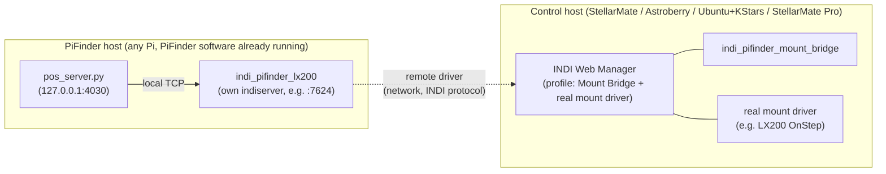

# Concept: PiFinder as a Separate Device, Mount Bridge on a Remote Control Host

## Status

**Concept - not implemented, but the control-host half's key open question is now resolved
(2026-07-28, verified live against a real StellarMate Web Manager - see Requirements and Known
Risks below).** Written up after a design discussion (2026-07-26) about supporting
PiFinder hardware that never runs StellarMate at all - it just exposes its own solved position
over the network, while a separate, more capable computer does the actual mount coupling.

## 1. Overview

Today, this project assumes PiFinder and the Mount Bridge coupling logic live on the *same*
machine (a StellarMate Pi running both PiFinder and, optionally, `indi_pifinder_mount_bridge`
against a locally-running mount driver). That's unnecessarily heavy for a real, common setup:
PiFinder on a weaker, dedicated Pi (e.g. Pi4/2GB) purely as a finder/push-to aid, while the actual
imaging/EAA/mount-control work happens on a separate, stronger machine - a StellarMate/Astroberry
Pi, a StellarMate Pro, or a plain Linux Intel box running KStars/Ekos. Many fixed observatory
setups already have a dedicated mount-control computer this way.

INDI already has a first-class mechanism for exactly this: **remote drivers**. A driver process
doesn't have to run on the same `indiserver` instance that uses it - `indiserver` can proxy a
driver that's actually running on a different host's `indiserver`, transparently, over TCP/IP. This
concept applies that mechanism to split PiFinder LX200 (must run near PiFinder, since it talks to
PiFinder's own local position server) from Mount Bridge (should run near the mount, since it needs
low-latency access to both PiFinder's *and* the mount's INDI properties).

## 2. Use Cases

- A PiFinder owner with a Pi4/2GB unit that can't comfortably also run a full StellarMate/KStars
  stack - PiFinder just needs to expose its position, nothing else.
- A fixed observatory with an existing, dedicated mount-control computer (any INDI-capable Linux
  box) - couple PiFinder to it without touching that computer's existing setup beyond adding two
  small driver entries.
- A StellarMate Pro (or equivalent) with no PiFinder hardware attached at all, coupling to a
  PiFinder that lives on a completely separate, cheaper Pi.
- Anyone on Astroberry or stock Ubuntu+KStars/Ekos wanting the same one-click Coupling-preset UX
  this project already built for StellarMate, without adopting StellarMate itself.

## 3. Architecture

- **PiFinder host**: runs PiFinder as usual (unmodified), plus a small, standalone `indiserver`
  process serving just `indi_pifinder_lx200`, listening on the LAN. No Web Manager needed here -
  one driver, one fixed port, started by a systemd unit at boot. No Mount Bridge, no real mount
  driver, no PiFinder-application patching by this project at all - PiFinder itself is assumed
  already installed and running, by whatever means the user chose.
- **Control host**: runs the *actual* INDI Web Manager, with the profile containing
  `indi_pifinder_mount_bridge` and the real mount driver as normal local drivers, plus one *remote*
  driver entry pointing at `<pifinder-host-ip>:<pifinder-port>` for PiFinder LX200. From Mount
  Bridge's point of view, PiFinder LX200 is just another INDI device - the remote-driver mechanism
  makes the network hop invisible to it.
- The Control Center's Mount Bridge tile (this project's existing UI) can run on the control host
  exactly as it does today - `indi_client.py`/`webmanager_client.py` already have zero dependency
  on PiFinder's own Python code, only on INDI/Web-Manager network calls, so nothing there changes.

## 4. Requirements

### PiFinder host
- PiFinder itself already installed and running (any distribution) - out of scope for this
  project to install.
- On StellarMate specifically (today's only real target - a Pi running the *full* install, real
  PiFinder hardware attached), this can reuse the existing Web Manager + Mount Bridge tile's own
  "INDI Web Manager" setup checklist (steps 1-3: Profile, KStars Link, Drivers) almost unchanged -
  see R-PF1 below. On a non-StellarMate PiFinder host (stock Raspberry Pi OS/Debian, no Web
  Manager), the original plan still applies: a minimal standalone `indiserver -v -p <port>
  indi_pifinder_lx200` systemd service, no Web Manager needed - see the existing draft howto,
  [`docs/draft/stock_debian_pifinder_mount_howto.md`](../draft/stock_debian_pifinder_mount_howto.md)
  (from issue #37), for the apt repo/package steps already researched for that case.
- The chosen port reachable from the control host's LAN (firewall/network consideration, not just
  a config value) - StellarMate's own `indiserver` already binds `0.0.0.0`, not just localhost
  (live-verified 2026-07-28, `ss -tlnp` showed `LISTEN 0.0.0.0:7624`), so nothing extra needs
  configuring there beyond the firewall itself.

**R-PF1 (new, StellarMate PiFinder-host case only): a dedicated "PiFinder Host Setup" tile in the
Control Center**, next to the existing Mount Bridge tile - the same "INDI Web Manager" checklist
pattern (Profile / KStars Link / Drivers) but scoped to just steps 1-3, and only ever toggling
`PiFinder LX200` (never Mount Bridge - that has no business running on this host in the split
architecture). Must also **prominently display this device's own LAN IP address** - live-verified
2026-07-28 that a user setting this up needs to *copy that IP to the other machine*, and hunting
for it themselves (`ip addr`, router admin page, ...) is real friction this project can remove for
free (`gui_installer/server.py` already has `_get_all_ips()`, used today for the remote-links
tile - same source, new place to show it). The port practically never needs to be user-facing here
(defaults to 7624, StellarMate's own Web Manager profile already shows/lets you change it) - the IP
is the one piece of information the user actually needs handed to them.

### Control host
- Resolved, live-verified 2026-07-28 against a real StellarMate Web Manager (was an open question
  before): **StellarMate's own Web Manager profile editor has a first-class "Remote Drivers" text
  field** (`driver_label@host:port`, comma-separated for multiple), and the underlying REST API
  models it explicitly too - `POST /api/profiles/{profile}/drivers` accepts entries shaped like
  `{"label": "PiFinder LX200", "remote": "@<host>:<port>"}` (`ProfileDriver` schema, confirmed via
  the Web Manager's own `/openapi.json`) alongside plain local `{"label": ...}` entries for Mount
  Bridge and the real mount driver in the same profile. No manual `drivers.xml`/profile-JSON
  surgery needed, and the KStars Ekos Profile Editor fallback mentioned below is no longer the only
  path - StellarMate's own Web Manager UI/API already covers it directly.
  - Manual path (works today, no new code needed): type `PiFinder LX200@<pifinder-host-ip>:7624`
    into the Mount Bridge profile's own "Remote Drivers" field in Web Manager.
  - Fallback if a non-StellarMate control host's Web Manager doesn't expose this: KStars' own Ekos
    Profile Editor lets you add a remote driver by host:port directly, in every version researched
    so far.

**R-CH1 (new): a Control Center workflow on the control host to add/update the remote PiFinder
entry without leaving this project's own UI** - an IP (+ optional port, default 7624) input, wired
through `webmanager_client.py`'s existing `set_profile_drivers()`/`_set_driver_membership()`
machinery (already used for local PiFinder LX200/Mount Bridge membership toggling today - just
needs the `remote` field threaded through as an optional argument) rather than sending the user to
Web Manager's own page to hand-type the `label@host:port` string themselves. Natural home: extend
the Mount Bridge tile's existing step 3 "Drivers" row, since this is the same underlying
"is PiFinder LX200 in this profile" toggle, just choosing *how* (local vs. a given remote address)
instead of only on/off.
- Build and install `indi_pifinder_mount_bridge` (same build script as today, already portable to
  any distro with `libindi-dev` present - see concept doc 2 for the apt/pacman abstraction this
  still needs).
- Optionally, this project's Control Center (Mount Bridge tile only) for the same one-click
  Coupling UX - see concept doc 2 for how a lighter, non-StellarMate install of just that piece
  would work.

### Both roles
**R-HELP1 (new): `help.html` needs its own section for this whole split-host setup**, and both new
UI pieces (R-PF1, R-CH1) need an explicit pointer to it (an info-icon link, same pattern as every
other setup step already uses) - direct feedback (2026-07-28) that a feature like this is
unusable without the user being told, in the UI itself, that a guide exists and where to find it,
not just documented somewhere in the repo they'd have to already know to look for.

## 5. Design Principles

- **PiFinder host stays minimal and untouched.** This project should never patch or manage
  PiFinder's own application code on a host where it isn't also doing the full StellarMate install
  - only the one small driver + its service.
- **No new protocol.** Reuse INDI's own remote-driver mechanism exactly as designed - don't invent
  a custom network bridge or tunnel.
- **Security is the user's network, not ours to solve here.** INDI has no built-in authentication;
  exposing `indi_pifinder_lx200` on the LAN means anyone on that network can query (and, if they
  also reach the Mount Bridge/mount devices, potentially command) it. Acceptable for a typical
  home/observatory LAN, same trust model INDI itself already assumes everywhere else - call this
  out explicitly in user-facing docs rather than silently assuming it away.

## 6. Test Strategy

- Unit-testable pieces: none really new here beyond concept doc 2's OS-abstraction work - this
  concept is mostly about *how the pieces are wired together*, not new script logic.
- Needs live, cross-machine verification once built: two real machines (or two VMs) on the same
  LAN, PiFinder host + control host, confirming the remote-driver hop actually works end-to-end -
  can't be verified on a single Pi the way most of this project's work has been so far.

## 7. Known Risks / Open Questions

- ~~Remote-driver UX varies by Web Manager.~~ **Resolved 2026-07-28** - StellarMate's own Web
  Manager supports it natively (see Requirements, Control host). Still genuinely open for
  non-StellarMate Web Managers (Astroberry, plain `indiwebmanager`) - not yet checked against those.
- **Physical test hardware for the split scenario now exists** (2026-07-28: two real Pis on the
  same LAN, one full PiFinder install, one running this session's new `--mode=indi_only` path) -
  no longer a hypothetical. The actual cross-machine remote-driver hop itself is still unverified
  end-to-end pending R-PF1/R-CH1 (the two-sided UI hasn't been built yet); the manual path (typing
  `label@host:port` directly into Web Manager's Remote Drivers field) is what would need to be
  tried first to verify the mechanism itself, ahead of building UI around it.
- **PiFinder version/protocol drift**: `pos_server.py`'s LX200 subset and its fixed port (4030) are
  assumed stable across "any PiFinder install" - true for the current upstream, but not guarded
  against future changes the way this project already guards its own installer against.
- **Network reliability**: this project already found (2026-07-26 live testing) that
  `indi_pifinder_lx200` has no reconnect logic if its connection to `pos_server.py` drops (see
  basic-memory `pifinder-stellarmate/00075`) - a real network hop (not just localhost) makes that
  kind of drop *more* likely, not less, so that gap matters more here than it did before.

## 8. Effort & Priority

Medium effort for the PiFinder-host side (mostly already drafted in issue #37, needs an automated
installer wrapped around it rather than a manual howto). Higher effort/uncertainty for the control-host
Web-Manager-remote-driver UX question, which needs research against real StellarMate/Astroberry
Web Manager UIs before it can be scoped precisely.

## Related

Issue #37 (stock Debian PiFinder howto - the PiFinder-host half of this is largely that issue,
reframed as an automated install rather than a manual walkthrough). See concept doc
[`setup_indi_only_install_mode.md`](setup_indi_only_install_mode.md) for how the installer itself
would be structured, and [`setup_script_test_suite.md`](setup_script_test_suite.md) for testing
the new logic this requires.
