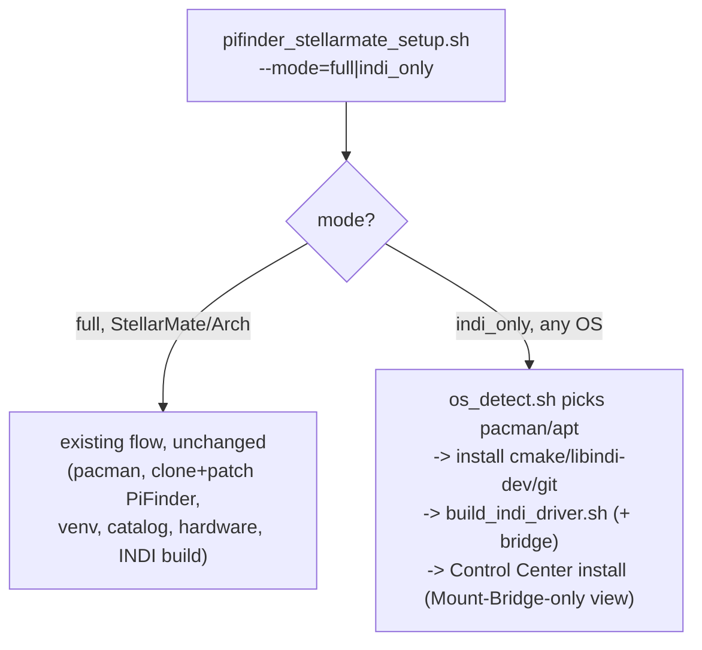

# Concept: An "INDI-Only" Install Mode, One Shared Setup Codebase

## Status

**Concept - not implemented.** Written up after a design discussion (2026-07-26) weighing a
dedicated separate installer/GUI against extending the existing one. Decision leans toward one
shared codebase, per explicit preference: "ich würde ungern zwei verschiedene Setup-Versionen
pflegen" (would rather not maintain two different setup versions).

## 1. Overview

Two things are being conflated at first glance, and need separating:

1. **Skipping PiFinder's own clone/patch/venv/star-catalog/hardware-service steps** when the goal
   is only to build and run the INDI drivers (+ optionally the Control Center) - this part is
   easy, a mode flag with an early branch.
2. **Running on a distribution this project has never targeted before** (Astroberry, stock
   Raspberry Pi OS, plain Ubuntu) - this is the actually hard part, and exists *independently* of
   (1). Even a from-scratch full StellarMate-style install on Astroberry would hit this same wall.

`pifinder_stellarmate_setup.sh` is deeply StellarMate/Arch-specific today: `pacman` throughout,
StellarMate-specific hardware/udev/GPIO group setup, SMOS version checks. None of that applies on
Debian-family systems. The good news: the actual Python side of this project
(`gui_installer/*.py`) is **already** portable - confirmed zero PiFinder-specific or third-party
imports beyond stdlib, so the Control Center itself runs unmodified on any OS with Python 3. The
work is entirely in the *installer*, not the web app it installs.

## 2. Requirements

### R1: A distinct install mode, not just a hidden side effect

A new explicit choice (alongside today's Reinstall/Update), e.g. **"INDI drivers + Control Center
only"**, in both entry points (`--mode=indi_only` flag for the terminal script, a corresponding
option in `gui_installer`'s Install/Update tile) - matching the existing `--action=`/`--branch=`
flag pattern rather than introducing a different mechanism.

### R2: OS/package-manager abstraction, scoped narrowly

Only the actual package-installation calls need abstracting - not a full OS-abstraction framework.
Concretely: a small `bin/os_detect.sh` (or similar) that identifies `pacman` vs `apt` (and maybe
`dnf`, though no current use case calls for it) and exposes a couple of thin wrapper functions
(`os_install_packages "pkg1" "pkg2" ...`) used everywhere a package needs installing. StellarMate's
own full install keeps using `pacman` calls as today (no regression risk to the existing, tested
path) - the abstraction is *additive*, used only by the new INDI-only mode's package list
(`cmake`, `build-essential`/`base-devel`, `libindi-dev`/`libindi`, `git`).

### R3: Skip everything PiFinder-application-specific

In INDI-only mode, skip: PiFinder git clone/patch, Python venv + `pip install`, star catalog
download, hardware group/udev setup, PiFinder's own systemd services (`pifinder.service` etc).
Keep: INDI package install (R2), `build_indi_driver.sh`/`build_indi_bridge.sh` (already portable,
confirmed - see below), Control Center install/service setup.

### R4: Control Center in INDI-only mode shows only what applies

If the Control Center is installed in this mode, tiles that assume PiFinder itself is installed
(Mode & Power, Quick Links, hardware tests) need to be hidden or replaced with something that makes
sense for "PiFinder isn't installed here" - likely just the Mount Bridge tile plus a minimal
Install/Update tile for this project's own updates. Needs its own small design pass once the
install-mode plumbing exists - not a blocker for R1-R3.

## 3. Architecture / Implementation Concept

- `build_indi_driver.sh`/`build_indi_bridge.sh` already don't call any package manager themselves
  (verified - they assume `cmake`/`libindi` are already present, installed elsewhere) - so they
  need **zero changes** to work identically in either mode. All the new work is in *what installs
  the packages they assume*, and in the new mode's control flow deciding which steps to run.
- The existing `--action=`/`--branch=` flags stay as they are; `--mode=` is a new, independent flag
  (default `full`, so every existing invocation - terminal or GUI-driven - is unaffected).

## 4. Design Principles

- **Additive, not a rewrite.** The existing StellarMate/Arch path must not change behavior or risk
  regressions - this is exactly the kind of high-value, high-traffic path this project has spent
  this whole session hardening (branch picker, git exit-code checks). New logic sits beside it.
- **Narrow abstraction, not a framework.** Resist the urge to build a general "supports any Linux"
  abstraction layer speculatively - only abstract the concrete packages the INDI-only path actually
  needs, expand later if a real second OS-specific need appears.
- **One script, one CHANGELOG, one release cadence** - matches the explicit "don't maintain two
  setup versions" preference, and keeps this session's established release-workflow discipline
  (see basic-memory `00027`/`00074`) applying to this new mode automatically, not as a fork to
  separately track.

## 5. Test Strategy

See [`setup_script_test_suite.md`](setup_script_test_suite.md) - this concept is exactly the kind
of new, previously-nonexistent pure logic (OS detection, mode branching) that should get unit tests
from the day it's written, not retrofitted later.

## 6. Known Risks / Open Questions

- **No real Astroberry/Ubuntu test hardware available yet** - the apt-side package names/repo setup
  are researched (issue #37's draft) but not run end-to-end on real hardware. Treat as design-only
  until physically verified.
- **Package name drift across distros/versions** - `libindi-dev` availability/version varies by
  Debian/Ubuntu release; Astroberry's own repo (not stock Debian) is the researched path for
  Raspberry Pi OS specifically, per issue #37 - a plain Ubuntu Intel box may need yet another repo
  source, not yet researched at all.
- **Scope creep risk on R4** - deciding exactly which Control Center tiles/behaviors make sense
  with no PiFinder installed is a real design question on its own, easy to underestimate.
- **Testing burden still increases even with one script** - more code paths through the same file
  means more combinations someone eventually needs to exercise live, even if unit tests catch the
  pure-logic regressions.

## 7. Effort & Priority

R1-R3 (mode flag, OS abstraction, skip logic) are a well-scoped, moderate effort - most of the hard
research (package names, build-script portability) is already done via issue #37's draft. R4 (which
Control Center tiles apply) is a separate, smaller design pass that can follow once R1-R3 exist and
someone can actually click through the result.

## Related

[`remote_indi_coupling_split_host.md`](remote_indi_coupling_split_host.md) (the use case this
mode primarily serves), [`setup_script_test_suite.md`](setup_script_test_suite.md), issue #37.
