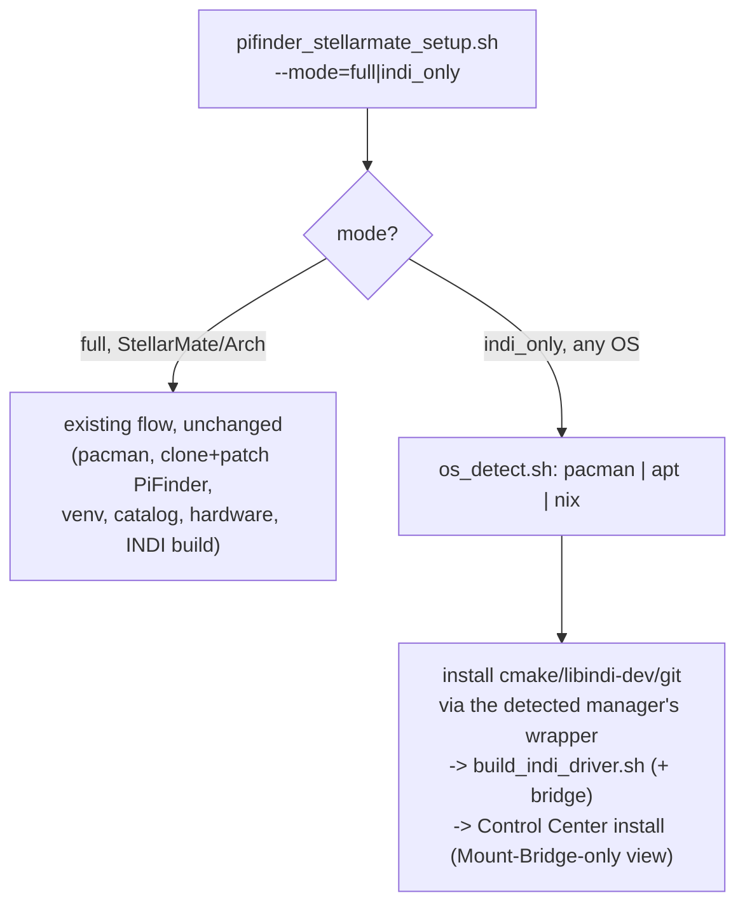

# Concept: An "INDI-Only" Install Mode, One Shared Setup Codebase

## Status

**Concept - not implemented.** Written up after a design discussion (2026-07-26) weighing a
dedicated separate installer/GUI against extending the existing one. Decision leans toward one
shared codebase, per explicit preference: "ich würde ungern zwei verschiedene Setup-Versionen
pflegen" (would rather not maintain two different setup versions).

**R2's pacman case is partially implemented** on `feature/os-detect-package-manager-abstraction`
(`bin/os_detect.sh`) - the pure/apt/nix dispatch table plus the StellarMate-specific Atomic Updates
precondition below (live-verified on real hardware, 2026-07-28). R1/R3/R4 are still unimplemented.

## 1. Overview

Two things are being conflated at first glance, and need separating:

1. **Skipping PiFinder's own clone/patch/venv/star-catalog/hardware-service steps** when the goal
   is only to build and run the INDI drivers (+ optionally the Control Center) - this part is
   easy, a mode flag with an early branch.
2. **Running on a distribution this project has never targeted before** (Astroberry, stock
   Raspberry Pi OS, plain Ubuntu) - this is the actually hard part, and exists *independently* of
   (1). Even a from-scratch full StellarMate-style install on Astroberry would hit this same wall.

`pifinder_stellarmate_setup.sh` is deeply StellarMate/Arch-specific today: `pacman` throughout,
StellarMate-specific hardware/udev/GPIO group setup, SMOS version checks. **None of the hardware/
udev/GPIO work is relevant to this mode on *any* platform - not because it would need porting, but
because there is no PiFinder hardware attached at all in this scenario.** GPIO group membership,
camera/IMU udev rules, boot-time config - all of it exists purely to make PiFinder's own physical
sensors work, and none of that applies when this host's only job is running an INDI driver and a
web page. So this isn't "StellarMate-specific work we need to reimplement per OS" - it's simply
**skipped entirely**, on every OS, in this mode. The only things this mode actually needs, on any
of Arch/Debian/Ubuntu/NixOS, are: a C++ toolchain + `libindi` dev headers to compile against, and a
Python 3 interpreter to run the Control Center. The Python side of this project
(`gui_installer/*.py`) is **already** portable - confirmed zero PiFinder-specific or third-party
imports beyond stdlib, so it runs unmodified anywhere Python 3 exists. The work is entirely in the
*installer's package-install step*, nothing else.

## 2. Requirements

### R1: A distinct install mode, not just a hidden side effect

A new explicit choice (alongside today's Reinstall/Update), e.g. **"INDI drivers + Control Center
only"**, in both entry points (`--mode=indi_only` flag for the terminal script, a corresponding
option in `gui_installer`'s Install/Update tile) - matching the existing `--action=`/`--branch=`
flag pattern rather than introducing a different mechanism.

### R2: OS/package-manager abstraction, scoped narrowly - but planned for four managers from day one

Only the actual package-installation calls need abstracting - not a full OS-abstraction framework.
Concretely: a small `bin/os_detect.sh` (or similar) that identifies the package manager and exposes
a couple of thin wrapper functions (`os_install_packages "pkg1" "pkg2" ...`) used everywhere a
package needs installing. StellarMate's own full install keeps using `pacman` calls as today (no
regression risk to the existing, tested path) - the abstraction is *additive*, used only by the new
INDI-only mode's package list (`cmake`, `build-essential`/`base-devel`, `libindi-dev`/`libindi`,
`git`).

**Target set, decided up front rather than added ad hoc**: `pacman` (Arch/StellarMate - the one
actually tested, since it's the only hardware available right now), `apt` (Debian/Ubuntu/
Astroberry), and **Nix** (NixOS - added explicitly because PiFinder v4 itself is expected to be
NixOS-based, per direct instruction, making this a real near-term target, not a speculative one).
Arch is *not* treated as a special case bolted onto an apt-first design - the abstraction's
dispatch table has all of pacman/apt/nix as first-class entries from the start, so the shape it
takes doesn't quietly assume a Debian-centric world.

**Nix needs its own subsection, not just another table row** - it works differently enough from
apt/pacman to call out explicitly:
- Nix has two usable modes: an **imperative** one that works on *any* Linux with the Nix package
  manager installed, not just NixOS (`nix profile install nixpkgs#cmake`, or an ephemeral
  `nix shell nixpkgs#cmake nixpkgs#libindi`), and NixOS's own **declarative** one (add packages to
  `/etc/nixos/configuration.nix`'s `environment.systemPackages`, then `nixos-rebuild switch`).
  Programmatically editing a user's existing `configuration.nix` safely (without clobbering
  whatever's already there) is a materially harder problem than an apt/pacman one-liner - so the
  imperative mode (treating Nix like "yet another package manager we shell out to", the same shape
  as the pacman/apt wrappers) is the pragmatic choice for this installer, not the "proper" NixOS
  declarative approach.
- **Not yet verified**: whether `libindi`/`libindi-dev` actually exists in `nixpkgs`, and under what
  package name/attribute path. Needs checking against the real nixpkgs package search before this
  is more than a plausible plan.

**Newly discovered, load-bearing precondition for the pacman case (live-verified on real
StellarMate hardware, 2026-07-28): StellarMate blocks direct pacman access by default.**
`/etc/pacman.conf` ships with `[core]`/`[extra]`/`[alarm]` - where `cmake`/`git`/`libindi-dev`/
`base-devel` actually live - commented out; only StellarMate's own `[smos]` repo is active. This is
StellarMate's own **"Atomic Updates"** protection (`sudo /etc/stellarmate/atomic-updates.sh
--status`), not a bug or a config drift on this particular Pi. Unlocking it
(`atomic-updates.sh --disable`) is gated behind a manually-typed `YES` confirmation and an explicit
warning: it voids the StellarMate warranty, may destabilize the system, and disables StellarMate's
own delta-update mechanism - the user's own informed call, never something this installer may
invoke silently on their behalf. `os_install_packages()`'s pacman branch therefore checks
StellarMate's own state file (`/etc/stellarmate/.root-access-state`) first and, if the lock is
still on, refuses cleanly with the exact official unlock command rather than surfacing pacman's raw
"target not found" errors to someone with no Linux/pacman background.

A second, separate wrinkle compounds this: even once unlocked, the pacman GPG keyring itself resets
after every SMOS system update (StellarMate ships each OS version as its own btrfs subvolume/
snapshot - `/etc/pacman.d/gnupg` isn't preserved across that switch), so "target not found" can
recur on a system that was working fine before its last StellarMate update. StellarMate's own
`reset-factory-common.sh` has a `reset_pacman_keys()` function for exactly this
(`pacman-key --init && pacman-key --populate && pacman -Sy`) - `os_install_packages()` runs the
same remedy unconditionally (safe no-op if already fine) once the Atomic Updates lock is confirmed
off. This never needs to touch `[smos]`'s own signing key (unrelated to any package this mode
installs) - see basic-memory `pifinder-stellarmate/00016` for the full incident history on the
Pi5 dev machine.

**Explicitly not planned for right now: Flatpak/Snap.** Worth naming why, since they came up in the
original discussion: those are end-user *application* distribution/sandboxing formats, not sources
of `-dev` headers to compile against - you can't straightforwardly link a CMake build against a
library shipped inside a Flatpak sandbox. They'd only become relevant if this project ever needed
to *distribute a pre-built driver binary* to end users without compiling locally, which is a
different problem than the one R2 solves. Not ruled out forever, just not the same kind of "package
manager" this abstraction is for.

**Is there existing prior art for this kind of abstraction, instead of building it from scratch?**
Yes, worth naming explicitly rather than assuming reinvention is the only option:
- **Ansible's `package`/`ansible.builtin.package` module** is the most mature, widely-used answer to
  exactly this problem - it auto-detects the underlying package manager (apt/dnf/pacman/zypper/...)
  and dispatches accordingly. The tradeoff: adopting it means taking on Python+Ansible as a new
  installer dependency and moving to a declarative-playbook model, a bigger shift than this
  project's current minimal-dependency, plain-bash-plus-stdlib-Python philosophy justifies for what
  is, in scope, a handful of packages.
- **Nix itself as a *uniform* layer** is a more strategically interesting alternative worth flagging
  seriously (not just for NixOS - Nix the package manager installs cleanly alongside pacman/apt on
  any Linux distro, and `nixpkgs` package names/behavior are then *identical* regardless of the
  underlying OS). That would let this project skip the whole "map a generic name to N different
  per-distro package names" problem entirely, for every current and future target - genuinely
  appealing given PiFinder v4's own direction. The cost: it adds a new bootstrap dependency (Nix
  itself) on hosts that don't already have it (StellarMate/Astroberry today), which is exactly the
  kind of new prerequisite this concept is trying to avoid imposing casually. Recorded here as a
  serious option to revisit once NixOS support is a concrete, time-tested need - not adopted now.
- **Recommendation for now**: build the small, purpose-built dispatch table (pacman/apt/nix, three
  cases) rather than adopting Ansible or requiring Nix as a bootstrap dependency - designed so
  adding a fourth manager later (`dnf`/`zypper`/`apk`) is "add one more case", the same shape
  Ansible's own module list already proves works well as a pattern, without adopting Ansible
  itself.

### R3: Skip everything PiFinder-application-specific

In INDI-only mode, skip: PiFinder git clone/patch, Python venv + `pip install`, star catalog
download, hardware group/udev setup, PiFinder's own systemd services (`pifinder.service` etc).
Keep: INDI package install (R2), `build_indi_driver.sh`/`build_indi_bridge.sh` (already portable,
confirmed - see below), Control Center install/service setup.

### R4: Control Center in INDI-only mode shows only what applies

If the Control Center is installed in this mode, tiles that assume PiFinder itself is installed
(Mode & Power, Quick Links, hardware tests) need to be hidden or replaced with something that makes
sense for "PiFinder isn't installed here" - likely just the Mount Bridge tile plus a minimal
Install/Update tile for this project's own updates. Needs its own small design pass once the
install-mode plumbing exists - not a blocker for R1-R3.

## 3. Architecture / Implementation Concept

- `build_indi_driver.sh`/`build_indi_bridge.sh` already don't call any package manager themselves
  (verified - they assume `cmake`/`libindi` are already present, installed elsewhere) - so they
  need **zero changes** to work identically in either mode. All the new work is in *what installs
  the packages they assume*, and in the new mode's control flow deciding which steps to run.
- The existing `--action=`/`--branch=` flags stay as they are; `--mode=` is a new, independent flag
  (default `full`, so every existing invocation - terminal or GUI-driven - is unaffected).

## 4. Design Principles

- **Additive, not a rewrite.** The existing StellarMate/Arch path must not change behavior or risk
  regressions - this is exactly the kind of high-value, high-traffic path this project has spent
  this whole session hardening (branch picker, git exit-code checks). New logic sits beside it.
- **Narrow abstraction, not a framework - but plan the dispatch table for pacman/apt/nix from the
  start, not just the one platform tested today.** Resist building a general "supports any Linux"
  framework speculatively, but don't under-design either: Nix is included now, not deferred until
  "a real need appears", because PiFinder v4's own NixOS direction makes it a known near-term need
  rather than speculation. Only abstract the concrete packages this mode actually installs (four:
  `cmake`, `build-essential`/`base-devel`, `libindi-dev`/`libindi`, `git`) - breadth of *managers*
  is planned in, breadth of *packages* stays minimal.
- **One script, one CHANGELOG, one release cadence** - matches the explicit "don't maintain two
  setup versions" preference, and keeps this session's established release-workflow discipline
  (see basic-memory `00027`/`00074`) applying to this new mode automatically, not as a fork to
  separately track.

## 5. Test Strategy

See [`setup_script_test_suite.md`](setup_script_test_suite.md) - this concept is exactly the kind
of new, previously-nonexistent pure logic (OS detection, mode branching) that should get unit tests
from the day it's written, not retrofitted later.

## 6. Known Risks / Open Questions

- **StellarMate's Atomic Updates lock means this mode cannot install anything on a stock,
  untouched StellarMate system without the user first running StellarMate's own unlock script -
  a real, user-facing precondition, not just an installer detail.** R4's Control Center tile design
  should probably surface this clearly (e.g. detect the lock and show the unlock instructions in
  the UI itself, mirroring what `os_install_packages()` now prints on the terminal side) rather
  than only failing inside a log a non-technical user won't read.
- **No real Astroberry/Ubuntu/NixOS test hardware available yet - deliberately deferred, not
  ignored.** The abstraction's *shape* (pacman/apt/nix as three first-class cases) is designed in
  now, per explicit instruction, so extending to those platforms later is "verify and fill in a
  table row", not "redesign the abstraction" - but actually running any of the apt or nix paths
  end-to-end on real hardware stays deferred until that hardware/environment exists. Arch is the
  only path that can be verified today.
- **`libindi`/`libindi-dev` presence and package name in `nixpkgs` is unverified** - plausible given
  nixpkgs' size and the astronomy-software community's general Nix adoption, but not confirmed
  against the actual package search. First concrete thing to check before the Nix case is anything
  more than a plan.
- **Nix's imperative-vs-declarative tension** (see R2) means the Nix case may end up feeling
  different in practice from the pacman/apt ones even with the same wrapper interface - worth a
  real trial run once Nix/NixOS is actually being tested, not assumed away on paper.
- **Package name drift across distros/versions** - `libindi-dev` availability/version varies by
  Debian/Ubuntu release; Astroberry's own repo (not stock Debian) is the researched path for
  Raspberry Pi OS specifically, per issue #37 - a plain Ubuntu Intel box may need yet another repo
  source, not yet researched at all.
- **Scope creep risk on R4** - deciding exactly which Control Center tiles/behaviors make sense
  with no PiFinder installed is a real design question on its own, easy to underestimate.
- **Testing burden still increases even with one script** - more code paths through the same file
  means more combinations someone eventually needs to exercise live, even if unit tests catch the
  pure-logic regressions.

## 7. Effort & Priority

R1-R3 (mode flag, OS abstraction, skip logic) are a well-scoped, moderate effort - most of the hard
research (package names, build-script portability) is already done via issue #37's draft for the
apt case. The Nix case adds real, currently-unverified research (nixpkgs package name/availability)
but no additional *architectural* complexity beyond one more dispatch-table entry. R4 (which
Control Center tiles apply) is a separate, smaller design pass that can follow once R1-R3 exist and
someone can actually click through the result.

## Related

[`remote_indi_coupling_split_host.md`](remote_indi_coupling_split_host.md) (the use case this
mode primarily serves), [`setup_script_test_suite.md`](setup_script_test_suite.md), issue #37.
